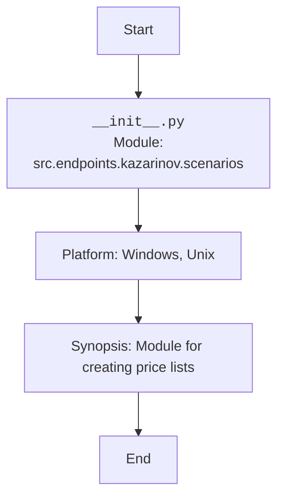

## АНАЛИЗ КОДА: `/src/endpoints/kazarinov/scenarios/__init__.py`

### <алгоритм>

1.  **Начало**: Запуск интерпретатора Python. Указывается кодировка UTF-8 для корректной обработки текста.
2.  **Описание модуля**: Документируется модуль `src.endpoints.kazarinov.scenarios`, сообщается, что он предназначен для Windows и Unix платформ и служит для создания прайслистов.
3.  **Конец**: Завершение обработки файла.

**Пример:**

```
    Начало -> Кодировка UTF-8 -> Документирование модуля -> Конец
```

### <mermaid>


### <объяснение>

**Импорты:**

*   В данном файле импорты отсутствуют.

**Классы:**

*   В данном файле классы не определены.

**Функции:**

*   В данном файле функции не определены.

**Переменные:**

*   В данном файле нет переменных, которые определены в коде.

**Объяснение:**

Файл `__init__.py` в Python является специальным файлом, который указывает, что директория должна рассматриваться как пакет Python.  В данном случае,  он расположен в `src/endpoints/kazarinov/scenarios` и, хотя он пуст, он означает, что директорию можно импортировать как пакет.

*   `# -*- coding: utf-8 -*-`: Эта строка задает кодировку UTF-8 для файла, что позволяет корректно обрабатывать символы, не входящие в ASCII.
*   `#! venv/bin/python/python3.12`:  Эта строка (shebang) указывает путь к интерпретатору Python, если файл исполняется как скрипт. Она полезна, если вы планируете использовать этот файл непосредственно.
*   `"""..."""`: Это строка с многострочным комментарием, она используется как docstring для модуля. Она описывает назначение модуля, платформы, на которых он работает, и краткое описание.

**Потенциальные ошибки или области для улучшения:**

*   На данный момент файл пуст, но это нормально для `__init__.py`.
*   Если в дальнейшем в этот пакет будут добавляться модули и функциональность, необходимо будет соответствующим образом обновить файл `__init__.py`.

**Цепочка взаимосвязей:**

*   Этот файл является частью структуры пакетов проекта `hypotez`, в частности, ветви `src.endpoints.kazarinov.scenarios`.
*   Файл `__init__.py` позволяет импортировать другие модули в директории `scenarios` как часть пакета.
*   Пакет `scenarios` предположительно содержит модули для создания прайс-листов, которые, вероятно, будут использоваться в конечных точках API, связанных с именем `kazarinov`.