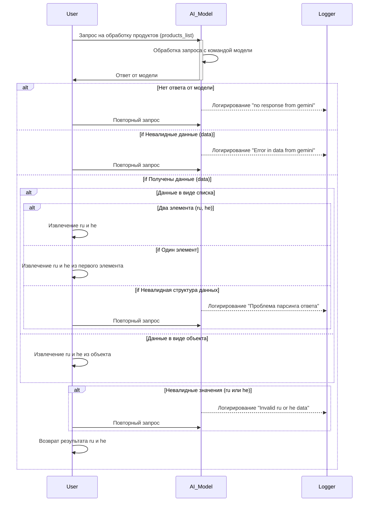

# Анализ кода сценария обработки списка продуктов

## <input code>

```sequenceDiagram
    participant User
    participant AI_Model
    participant Logger

    User->>AI_Model: Запрос на обработку продуктов (products_list)
    AI_Model->>AI_Model: Обработка запроса с командой модели
    AI_Model->>User: Ответ от модели

    alt Нет ответа от модели
        Logger->>Logger: Логирирование ошибки "no response from gemini"
        User->>AI_Model: Повторный запрос (attempts - 1)
    end

    alt Невалидные данные (data)
        Logger->>Logger: Логирирование ошибки "Error in data from gemini"
        User->>AI_Model: Повторный запрос (attempts - 1)
    end

    alt Получены данные (data)
        alt Данные в виде списка
            alt Два элемента (ru, he)
                User->>User: Извлечение ru и he
            end
            alt Один элемент
                User->>User: Извлечение ru и he из первого элемента
            end
            alt Невалидная структура данных
                Logger->>Logger: Логирирование ошибки "Проблема парсинга ответа"
                User->>AI_Model: Повторный запрос (attempts - 1)
            end
        end

        alt Данные в виде объекта
            User->>User: Извлечение ru и he из объекта
        end

        alt Невалидные значения (ru или he)
            Logger->>Logger: Логирирование ошибки "Invalid ru or he data"
            User->>AI_Model: Повторный запрос (attempts - 1)
        end

        User->>User: Возврат результата ru и he
    end
```

## <algorithm>

Алгоритм представляет собой пошаговую диаграмму последовательности действий для обработки запроса на обработку списка продуктов (products_list).

**Шаг 1:** Пользователь отправляет запрос на обработку `products_list` к модели AI.

**Шаг 2:** Модель AI обрабатывает запрос и возвращает ответ.

**Шаг 3:**  Проверяется корректность ответа:
   - **Нет ответа:**  Записывается ошибка "no response from gemini" в лог, и запрос повторяется с уменьшением попыток.
   - **Невалидные данные:**  Записывается ошибка "Error in data from gemini" в лог, и запрос повторяется.
   - **Данные получены:**
      - **Данные в виде списка:**
         - **Два элемента:** Извлекаются значения `ru` и `he`.
         - **Один элемент:** Извлекаются значения `ru` и `he` из первого элемента списка.
         - **Невалидная структура:** Записывается ошибка "Проблема парсинга ответа" в лог, и запрос повторяется.
      - **Данные в виде объекта:** Извлекаются значения `ru` и `he` из объекта.
      - **Невалидные значения:** Записывается ошибка "Invalid ru or he data" в лог, и запрос повторяется.

**Шаг 4:** Если все проверки пройдены,  пользователю возвращается результат `ru` и `he`.

**Примеры:**

- При успешной обработке, пользователь получает `ru` и `he` значения.
- При ошибке парсинга, запрос повторяется.

## <mermaid>



## <explanation>

Эта диаграмма последовательности описывает процесс взаимодействия между пользователем, моделью AI и логированием.

**Импорты:** В данном коде нет импортов, поэтому нет связи с другими пакетами.  В реальном коде здесь могли бы быть импорты для работы с моделями AI, логированием, обработкой данных.

**Классы:** Нет классов,  только участие участников (User, AI_Model, Logger).

**Функции:**  Нет функций, но есть описания действий (например, "Обработка запроса"). В реальном коде эти действия могут быть реализованы в функциях.

**Переменные:** Не явно определены переменные, но подразумеваются данные (products\_list), возвращаемые значения `ru` и `he`, а также переменные состояния (attempts) для повторных запросов.

**Возможные ошибки/улучшения:**

* **Нет детализации обработки:** Диаграмма не описывает, *как* AI-модель обрабатывает запрос. Необходимо указать, какие API или функции используются для взаимодействия с моделью AI.
* **Отсутствие информации о повторных попытках:** Не описано, как определяется `attempts`.
* **Непонятно структура данных:** Диаграмма не описывает структуру `products_list`.
* **Не описан возвращаемый тип данных:** Не указан тип возвращаемых данных `ru` и `he`.
* **Логирование:**  Необходимо указать, как именно происходит запись в лог.

**Цепочка взаимосвязей:** Данная диаграмма показывает взаимодействие между тремя участниками. В реальном коде, помимо этих трех участников, должны присутствовать компоненты для работы с API модели AI и логером.
```