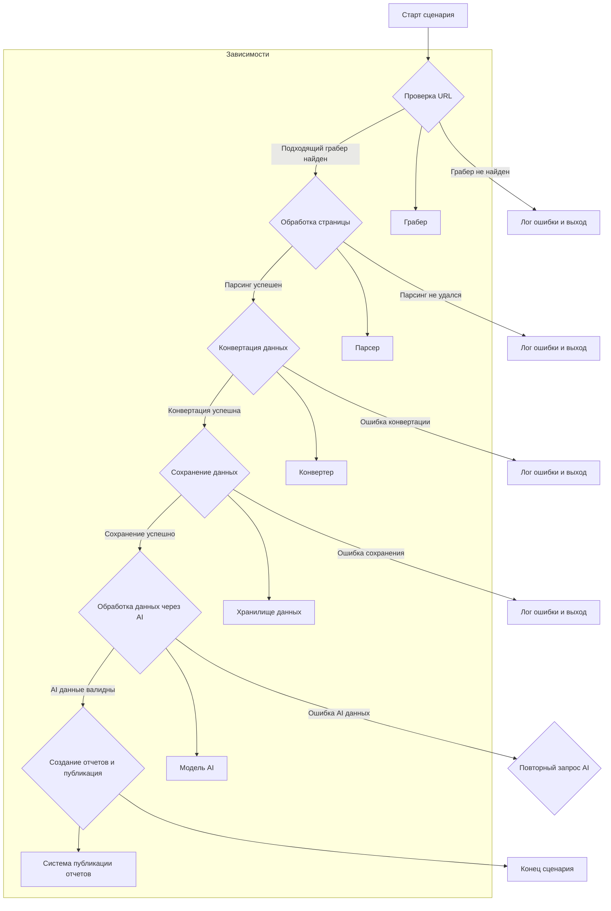

```MD
# Анализ сценария обработки прайслиста

**1. <input code>**

```graph TD
    A[Старт сценария] -->|Получение URL| B[Проверка URL]\n
    B -->|Подходящий грабер найден| C[Обработка страницы]\n
    B -->|Грабер не найден| D[Лог ошибки и выход]\n
    C -->|Парсинг успешен| E[Конвертация данных продукта]\n
    C -->|Парсинг не удался| F[Лог ошибки и выход]\n
    E -->|Конвертация успешна| G[Сохранение данных продукта]\n
    E -->|Ошибка конвертации| H[Лог ошибки и выход]\n
    G -->|Сохранение успешно| I[Обработка данных через AI]\n
    G -->|Ошибка сохранения| J[Лог ошибки и выход]\n
    I -->|AI данные валидны| K[Создание отчетов и публикация]\n
    I -->|Ошибка AI данных| L[Повторный запрос AI]\n
    K --> M[Конец сценария]
```

**2. <algorithm>**

Алгоритм сценария `scenario_pricelist.mmd` представляет собой последовательность шагов обработки данных прайслиста.

* **Шаг 1 (A):**  Старт сценария.
* **Шаг 2 (B):** Получение URL.  На этом этапе определяется URL, с которого будет собираться информация о прайслисте.
* **Шаг 3 (B):** Проверка URL.  Здесь проверяется, подходит ли URL для парсинга. Если грабер для данного URL существует, переход к шагу 4, иначе - к шагу 6.
* **Шаг 4 (C):** Обработка страницы. На данном шаге происходит загрузка и подготовка веб-страницы для парсинга.
* **Шаг 5 (E):** Парсинг успешен.  Данные с веб-страницы извлекаются и проверяются на корректность.
* **Шаг 6 (E):** Конвертация данных продукта. Извлечённые данные преобразуются в формат, удобный для дальнейшей обработки.
* **Шаг 7 (G):** Сохранение данных продукта.  Обработанные данные сохраняются в базу данных или другое хранилище.
* **Шаг 8 (I):** Обработка данных через AI.  Обработанные данные используются как входные данные для модели машинного обучения (AI).
* **Шаг 9 (K):** Создание отчетов и публикация. После успешной обработки через AI, формируются отчеты и публикуются результаты.
* **Шаг 10 (D):** Грабер не найден или ошибки на других этапах.  В случае возникновения ошибок на любом этапе, сценарий завершается с выводом соответствующего лога.

**Пример данных:**

Входные данные: URL `https://example.com/pricelist`

Выходные данные:  Форматированный JSON со списком товаров с ценами.

**3. <mermaid>**



**4. <explanation>**

* **Импорты:**  В данном коде импорты отсутствуют, так как он представлен в виде блок-схемы. Импорты в реальном коде будут зависеть от используемых библиотек (например, для работы с веб-страницами, парсинга, сохранения данных и взаимодействия с AI).
* **Классы:** Классов нет, так как это блок-схема.  В реальном коде классы могут быть использованы для организации логики парсинга, конвертации и обработки данных.
* **Функции:**  Функции представлены как блоки на блок-схеме.  Например, функция "Получение URL" получает адрес веб-страницы, "Обработка страницы" загружает и подготавливает данные страницы, а "Конвертация данных продукта" преобразует структуру данных.
* **Переменные:** В блок-схеме переменные не показаны.  В реальном коде переменные будут хранить URL, данные с веб-страницы, результаты конвертации и т.д.
* **Возможные ошибки и улучшения:**  Блок-схема не содержит информации об обработке исключений, которые могут возникнуть на каждом шаге. В реальном коде необходимо предусмотреть обработку ошибок (например, подключение к странице не удалось, парсер не нашел нужный элемент). Также, необходимо указать логику повторного запроса (L) AI, если результат неверен.


**Цепочка взаимосвязей:**  Сценарий `scenario_pricelist` зависит от работающих граберов, парсеров, конвертеров, хранилищ данных, моделей AI и систем публикации. Эти компоненты, вероятно, находятся в других модулях или пакетах проекта.