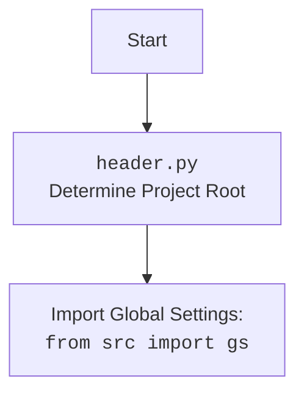

## АНАЛИЗ КОДА: `hypotez/src/endpoints/kazarinov/scenarios/header.py`

### 1. <алгоритм>
   
**Блок-схема:**
   
```mermaid
flowchart TD
    A[Start] --> B{set_project_root()};
    B --> C[Initialize `current_path` to directory of current file];
    C --> D[Initialize `__root__` to `current_path`];
    D --> E{Loop through parent directories};
    E --> F{Check if parent directory has any marker files};
    F -- Yes --> G[Set `__root__` to parent];
    G --> H[Break Loop];
    F -- No --> E;
    E -- End Loop --> I{Check if `__root__` is in `sys.path`};
    I -- No --> J[Add `__root__` to `sys.path`];
    I -- Yes --> K[Return `__root__`];
    J --> K;
    K --> L[Assign return of set_project_root() to `__root__`];    
    L --> M[Import Global Settings from `src`];
    M --> N{Try to open and load `settings.json`};
    N -- Success --> O[Store settings into dict `settings`];
    N -- Fail --> P[Set settings to `None`];
    O --> Q{Try to open and read `README.MD`};
    P --> Q;
    Q -- Success --> R[Store doc string into `doc_str`];
    Q -- Fail --> S[Set `doc_str` to `None`];
    R --> T[Extract project info from settings or defaults];
    S --> T;
    T --> U[Assign project name to `__project_name__`];
    U --> V[Assign project version to `__version__`];
    V --> W[Assign project doc string to `__doc__`];
    W --> X[Assign project details to `__details__` (Empty string by default)];
    X --> Y[Assign project author to `__author__`];
    Y --> Z[Assign project copyright to `__copyright__`];
    Z --> AA[Assign cofee link to `__cofee__`];
    AA --> BB[End]
```

**Примеры для каждого логического блока:**

*   **A (Start):** Начало выполнения скрипта.
*   **B (`set_project_root()`):**  Функция вызывается для определения корневой директории проекта.
*   **C (Initialize `current_path`):**  Если скрипт расположен в `/path/to/project/src/endpoints/kazarinov/scenarios/header.py`, то `current_path` будет `/path/to/project/src/endpoints/kazarinov/scenarios`.
*   **D (Initialize `__root__`):** `__root__` инициализируется как `/path/to/project/src/endpoints/kazarinov/scenarios`.
*   **E (Loop through parent directories):**  Проверяются директории `/path/to/project/src/endpoints/kazarinov/scenarios`, `/path/to/project/src/endpoints/kazarinov`, `/path/to/project/src/endpoints`, `/path/to/project/src`, `/path/to/project`, `/path/to`.
*   **F (Check for marker files):** Если в `/path/to/project` есть файл `__root__` или директория `.git`, условие будет `True`.
*   **G (Set `__root__`):** Если в `/path/to/project` найден маркерный файл, `__root__` обновляется как `/path/to/project`.
*   **H (Break Loop):** Цикл прерывается, когда корень проекта найден.
*   **I (Check if `__root__` is in `sys.path`):** Проверяется, добавлена ли корневая директория проекта в список путей.
*  **J (Add `__root__` to `sys.path`):** Если не добавлена, то добавляется.
*   **K (Return `__root__`):** Функция `set_project_root()` возвращает путь до корня проекта, например, `/path/to/project`.
*   **L (Assign return of `set_project_root()`):** `__root__` получает значение, возвращенное функцией `set_project_root()`, например `/path/to/project`.
*   **M (Import Global Settings from `src`):** Импортируются глобальные настройки из пакета `src`, предположительно, включая `gs.path.root`.
*   **N (Try to open and load `settings.json`):** Скрипт пытается открыть и загрузить JSON-файл `/path/to/project/src/settings.json`.
*   **O (Store settings into dict `settings`):**  В случае успеха,  загруженные настройки сохраняются в `settings`.
*   **P (Set settings to `None`):** Если файл `settings.json` не найден или имеет неверный формат JSON, `settings` устанавливается в `None`.
*   **Q (Try to open and read `README.MD`):** Скрипт пытается открыть и прочитать файл `/path/to/project/src/README.MD`.
*   **R (Store doc string into `doc_str`):** В случае успеха,  содержание `README.MD` сохраняется в `doc_str`.
*   **S (Set `doc_str` to `None`):** Если файл `README.MD` не найден,  `doc_str` устанавливается в `None`.
*   **T (Extract project info from settings or defaults):** Из `settings` извлекается информация о проекте.
*   **U (Assign project name to `__project_name__`):** Если `settings` существует и содержит ключ `project_name`, то присваивается его значение, в противном случае присваивается `'hypotez'`.
*   **V (Assign project version to `__version__`):** Аналогично, `__version__`  получает значение из `settings` или пустую строку.
*   **W (Assign project doc string to `__doc__`):**  `__doc__` получает значение из `doc_str` или пустую строку.
*   **X (Assign project details to `__details__`):** `__details__` всегда инициализируется как пустая строка.
*   **Y (Assign project author to `__author__`):** `__author__`  получает значение из `settings` или пустую строку.
*   **Z (Assign project copyright to `__copyright__`):** `__copyright__`  получает значение из `settings` или пустую строку.
*  **AA (Assign cofee link to `__cofee__`):** `__cofee__`  получает значение из `settings` или заданный по умолчанию текст со ссылкой.
*  **BB (End):** Конец работы скрипта.
    
### 2. <mermaid>
```mermaid
flowchart TD
    Start --> FindRoot[<code>set_project_root</code>: Find Project Root];
    FindRoot --> SetCurrentPath[Set Current Path<br><code>current_path = Path(__file__).resolve().parent</code>];
    SetCurrentPath --> InitializeRoot[Initialize Root Path<br><code>__root__ = current_path</code>];
    InitializeRoot --> LoopParents[Loop through Parent Directories <br><code>for parent in ...</code>];
    LoopParents --> CheckMarker[Check for Marker Files <br><code>if any((parent / marker).exists() for marker in marker_files)</code>];
    CheckMarker -- Yes --> UpdateRoot[Update Root Path <br><code>__root__ = parent</code>];
     UpdateRoot --> BreakLoop[Break Loop];
    CheckMarker -- No --> LoopParents;
     BreakLoop --> CheckSysPath[Check if Root in <code>sys.path</code>];
    LoopParents -- No More Parents --> CheckSysPath;
    CheckSysPath -- No --> AddSysPath[Add Root Path to <code>sys.path</code>];
    CheckSysPath -- Yes --> ReturnRoot[Return Root Path <br><code>return __root__</code>];
     AddSysPath --> ReturnRoot;
    ReturnRoot --> AssignRoot[Assign Root Path <br><code>__root__ = set_project_root()</code>];
    AssignRoot --> ImportSettings[Import Global Settings<br><code>from src import gs</code>];
    ImportSettings --> TryLoadSettings[Try to Load <code>settings.json</code>];
     TryLoadSettings -->|Success| LoadSettings[Load Settings to <code>settings</code>];
    TryLoadSettings --> |Fail| SetSettingsNone[Set <code>settings = None</code>];    
    LoadSettings --> TryLoadReadme[Try to Load <code>README.MD</code>];    
    SetSettingsNone --> TryLoadReadme;
    TryLoadReadme -->|Success| LoadReadme[Load Readme to <code>doc_str</code>];    
    TryLoadReadme -->|Fail| SetReadmeNone[Set <code>doc_str = None</code>];
    LoadReadme --> ExtractProjectInfo[Extract Project Information];
    SetReadmeNone --> ExtractProjectInfo;

     ExtractProjectInfo --> AssignProjectName[Assign Project Name<br><code>__project_name__</code>];
    AssignProjectName --> AssignProjectVersion[Assign Project Version <br><code>__version__</code>];
    AssignProjectVersion --> AssignProjectDoc[Assign Project Doc String <br><code>__doc__</code>];
    AssignProjectDoc --> AssignProjectDetails[Assign Project Details <br><code>__details__</code>];
    AssignProjectDetails --> AssignProjectAuthor[Assign Project Author <br><code>__author__</code>];
    AssignProjectAuthor --> AssignProjectCopyright[Assign Project Copyright <br><code>__copyright__</code>];
     AssignProjectCopyright --> AssignProjectCofee[Assign Project Cofee <br><code>__cofee__</code>];
    AssignProjectCofee --> End[End];
```

**Импортируемые зависимости:**
   
   * **`sys`**: Модуль `sys` используется для доступа к переменным и функциям, связанным с интерпретатором Python. В данном случае он используется для добавления корневой директории проекта в `sys.path`, что позволяет импортировать модули из этой директории.
    *  **`json`**: Модуль `json` используется для работы с JSON-данными. Он применяется для загрузки настроек проекта из файла `settings.json`.
   *   **`packaging.version.Version`**: Импортируется класс `Version` из модуля `packaging.version`. Он не используется напрямую в коде, но вероятно предназначен для дальнейшего сравнения версий.
    *   **`pathlib.Path`**: Класс `Path` из модуля `pathlib` используется для работы с файловыми путями. Он используется для определения путей к файлам и директориям.
   *  **`src.gs`**: Импортируется `gs` из пакета `src`, вероятно, содержащий глобальные настройки проекта, включая `gs.path.root`.
   
**Диаграмма для `header.py`**


### 3. <объяснение>

**Импорты:**

*   **`import sys`**: Модуль `sys` используется для добавления пути к корневой директории проекта (`__root__`) в `sys.path`. Это необходимо для правильной работы импорта модулей внутри проекта, так как Python ищет модули только в определенных путях. Добавление корневой директории гарантирует, что импорт `from src import gs` будет работать.

*   **`import json`**: Модуль `json` используется для чтения файла конфигурации `settings.json`, который содержит основные настройки проекта (например, название проекта, версию, информацию об авторе).

*   **`from packaging.version import Version`**: Импортирует класс `Version` для работы с версиями проекта. Хотя в данном коде он не используется напрямую, он может использоваться в других частях проекта для сравнения версий.

*   **`from pathlib import Path`**: Модуль `pathlib` используется для работы с файловыми путями как с объектами. Это делает код более читаемым и менее подверженным ошибкам при работе с путями в разных операционных системах.

*   **`from src import gs`**: Импортирует модуль `gs` из пакета `src`. `gs` вероятно содержит глобальные настройки и константы проекта. В этом коде используется `gs.path.root`, который, вероятно, является путем к корневой директории проекта, полученным из другого места. Эта зависимость указывает на необходимость настроенного пакета `src`.

**Функции:**

*   **`set_project_root(marker_files: tuple = ('__root__', '.git')) -> Path`**:
    *   **Аргументы**: `marker_files` (кортеж строк) - список файлов или директорий, наличие которых определяет корень проекта. По умолчанию ('`__root__`', '`.git`').
    *   **Возвращаемое значение**: Объект `pathlib.Path`, представляющий путь к корню проекта. Если маркерные файлы не найдены, возвращает путь к директории, где расположен скрипт.
    *   **Назначение**: Находит корневую директорию проекта, начиная с директории текущего файла и поднимаясь вверх по дереву директорий, пока не будет найдена директория с одним из маркерных файлов.
    *   **Пример**: Если скрипт находится в `/path/to/project/src/endpoints/kazarinov/scenarios/header.py` и в `/path/to/project` есть файл `__root__` или директория `.git`, то функция вернет `/path/to/project`.
   
**Переменные:**
   
*   **`__root__: Path`**: Хранит путь к корневой директории проекта, полученный через функцию `set_project_root()`. Используется для построения путей к файлам настроек и другим частям проекта.
   *   **`settings: dict`**: Словарь, содержащий загруженные настройки проекта из файла `settings.json`. Может быть `None`, если файл не найден или произошла ошибка загрузки.
    * **`doc_str: str`**: Строка, содержащая содержимое файла `README.MD`. Может быть `None`, если файл не найден.
   
   *   **`__project_name__: str`**: Название проекта, полученное из `settings` или установлено значением по умолчанию `'hypotez'`.
    *  **`__version__: str`**: Версия проекта, полученная из `settings` или пустая строка.
   *   **`__doc__: str`**: Описание проекта, полученное из `doc_str` или пустая строка.
   *   **`__details__: str`**: Дополнительные сведения о проекте, по умолчанию пустая строка.
   *   **`__author__: str`**: Автор проекта, полученный из `settings` или пустая строка.
   *  **`__copyright__: str`**: Авторские права проекта, полученные из `settings` или пустая строка.
    *  **`__cofee__: str`**: Текст с призывом поддержать разработчика (ссылка на boosty) полученный из `settings` или значение по умолчанию.
  
 **Потенциальные ошибки и области для улучшения:**
   
*   **Обработка ошибок**: Код использует блоки `try...except` для обработки `FileNotFoundError` и `json.JSONDecodeError`, но просто пропускает ошибки (`...`), это делает отладку сложнее. Можно было бы добавить логирование ошибок.
*   **Конфигурация**: Зависимость от наличия `settings.json` и `README.MD` в строго определенном месте может быть не гибкой. Возможность указывать пути к этим файлам через переменные окружения или аргументы командной строки повысит гибкость.
*   **Зависимость от `src`**:  Импорт `from src import gs` создаёт жесткую зависимость от пакета `src`. Это может затруднить переносимость кода в другие проекты, где `src` отсутствует. Можно переработать код таким образом, чтобы зависимости были более гибкими и конфигурируемыми.
*   **Отсутствие проверок на типы данных**:  В коде не предусмотрена проверка типов данных, получаемых из `settings.json`. Неверный тип данных может вызвать ошибку времени выполнения.
   
 **Взаимосвязи с другими частями проекта:**
   
*   Этот файл используется для инициализации глобальных параметров проекта и доступен через импорт.
*   Файл `header.py` определяет корневую директорию проекта и устанавливает переменные, используемые в других частях проекта, особенно через глобальные настройки `src.gs`.
*   `settings.json` и `README.MD` используются для хранения настроек и документации проекта. Эти файлы влияют на значения переменных, установленных в `header.py`.

В заключение, код `header.py` является важной частью проекта, так как он находит корневую директорию и устанавливает основные переменные проекта, обеспечивая единую точку доступа к глобальным параметрам. Тем не менее, код можно улучшить с точки зрения обработки ошибок, гибкости и переносимости.