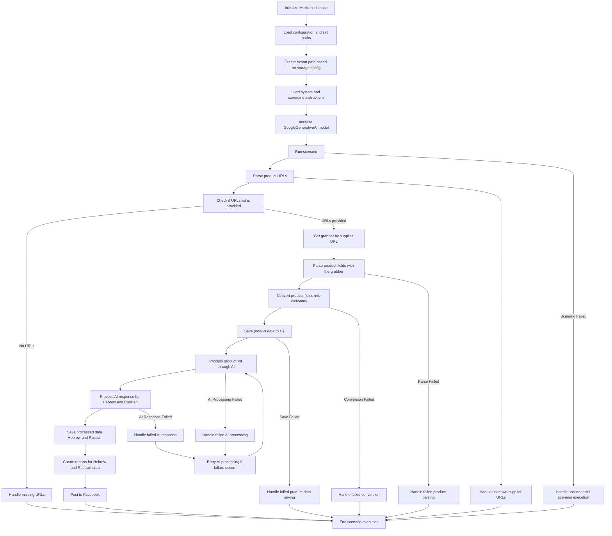

## <алгоритм>
1. **Инициализация:**
   - `InitMexiron`: Создается экземпляр `Mexiron` для управления процессом.
   - `LoadConfig`: Загружается конфигурация приложения, устанавливаются пути к файлам.
   - `CreateExportPath`: На основе настроек хранения создается путь для экспорта данных.
   - `LoadInstructions`: Загружаются инструкции для системы и команд.
   - `InitializeAI`: Инициализируется модель `GoogleGenerativeAI` для обработки текста.

2. **Запуск сценария:**
   - `RunScenario`: Запускается основной сценарий сбора и обработки данных.
   - `ParseURLs`: Разбираются URL-адреса продуктов из входных данных.
   - `CheckURLs`: Проверяется, был ли предоставлен список URL-адресов.
     - **Пример:** Если список URL-адресов пуст, переходим к `HandleMissingURLs`; иначе идем дальше.
   - `HandleMissingURLs`: Обрабатывается ситуация, когда список URL-адресов отсутствует, завершается сценарий.
   - `GetGrabber`: На основе URL поставщика определяется, какой парсер использовать для обработки.
     - **Пример:** Если URL поставщика `example.com`, то используется парсер, предназначенный для `example.com`.
   - `ParseFields`: Используется парсер для извлечения необходимых полей из данных по каждому URL.
   - `HandleUnknownSupplierURLs`: Обрабатываются URL неизвестных поставщиков, сценарий завершается.
     - **Пример:** Если URL-адрес поставщика не поддерживается парсером.
   - `ParseFields` --> `HandleParseFailure`:  В случае неудачного парсинга полей происходит переход на блок `HandleParseFailure`.
    -  **Пример:** Если парсер не смог найти на странице нужные данные.

3. **Обработка данных:**
   - `ConvertToDict`: Преобразует извлеченные поля в словарь данных.
   - `HandleConversionFailure`: Обрабатывается ошибка конвертации данных в словарь, завершается сценарий.
   - `SaveToFile`: Сохраняет словарь данных в файл.
    - **Пример:** Словарь данных о товаре `{'name': 'Product1', 'price': '100'}` сохраняется в JSON-файл.
   - `HandleSaveFailure`: Обрабатывается ошибка сохранения файла, завершается сценарий.

4. **AI обработка:**
   - `ProcessWithAI`: Данные обрабатываются с помощью модели GoogleGenerativeAI.
   - `HandleAIProcessingFailure`: Обрабатывается ошибка обработки данных с помощью AI.
       - `RetryAI`: В случае ошибки AI-обработки производится повторная попытка обработки данных через AI.
   - `HandleAIResponse`: Обрабатывается ответ от AI для языков иврит и русский.
   - `HandleAIResponseFailure`: Обрабатывается ошибка в ответе от AI.
        - `RetryAI`: В случае ошибки AI-ответа производится повторная попытка обработки данных через AI.
   - `SaveProcessedData`: Сохраняет обработанные AI данные для иврита и русского языка.

5. **Генерация отчетов и публикация:**
   - `GenerateReports`: Создаются отчеты на основе обработанных данных для иврита и русского языка.
   - `PostToFacebook`: Отчеты публикуются на Facebook.

6. **Завершение сценария:**
   - `EndScenario`: Сценарий завершается.
   - `HandleScenarioFailure`: Обрабатывается ошибка выполнения сценария, переходит в `EndScenario`.

## <mermaid>

## <объяснение>
### Импорты
В представленном коде `mermaid` отсутствует явный импорт каких-либо модулей или пакетов. Это диаграмма рабочего процесса, а не код Python. В контексте проекта `hypotez` можно предположить, что при выполнении этого сценария могут использоваться различные импорты из пакета `src.`, такие как:
- `src.config` для загрузки конфигураций.
- `src.utils` для общих утилит, таких как создание путей и другие функции.
- `src.grabbers` для реализации парсеров данных.
- `src.ai` для интеграции с Google Generative AI.

### Классы
В предоставленной `mermaid` схеме нет классов, поскольку это диаграмма потока. Однако, в реализации данного сценария в Python, можно предположить, что используются следующие классы:

- `Mexiron`: Основной класс для управления рабочим процессом.
- Классы-парсеры (напр. `ProductGrabber` или `CustomGrabber`): Для обработки данных с разных веб-сайтов.
- Класс для взаимодействия с AI (`AIProcessor`): Для обработки текста через Google Generative AI.
- Классы для сохранения данных в файл (`DataSaver`)
- Классы для формирования отчётов (`ReportGenerator`)

**Пример взаимодействий между классами:**
1.  `Mexiron` создает экземпляр `ProductGrabber` для парсинга.
2.  `Mexiron` создает экземпляр `AIProcessor` для обработки данных.
3.  `Mexiron` вызывает `DataSaver` для сохранения результатов.
4.  `Mexiron` вызывает `ReportGenerator` для создания отчетов.

### Функции
В контексте схемы, функции представлены блоками. Ниже приведены примеры функций и их назначение:

- `InitMexiron()`: Функция инициализации основного экземпляра управления процессом.
- `LoadConfig()`: Функция загрузки конфигураций и путей.
- `CreateExportPath()`: Функция создания пути для экспорта данных.
- `LoadInstructions()`: Функция загрузки инструкций для работы.
- `InitializeAI()`: Функция инициализации AI модели.
- `RunScenario()`: Функция запуска основного сценария.
- `ParseURLs()`: Функция парсинга URL-адресов.
- `CheckURLs()`: Функция проверки наличия URL-адресов.
- `HandleMissingURLs()`: Функция обработки отсутствующих URL-адресов.
- `GetGrabber()`: Функция получения парсера на основе URL-адреса поставщика.
- `ParseFields()`: Функция извлечения полей продукта.
- `ConvertToDict()`: Функция преобразования данных в словарь.
- `SaveToFile()`: Функция сохранения данных в файл.
- `ProcessWithAI()`: Функция обработки данных через AI.
- `HandleAIResponse()`: Функция обработки ответа от AI.
- `SaveProcessedData()`: Функция сохранения обработанных AI данных.
- `GenerateReports()`: Функция создания отчетов.
- `PostToFacebook()`: Функция публикации отчетов в Facebook.
- `HandleScenarioFailure()`: Функция обработки ошибок в сценарии.
- `HandleParseFailure()`: Функция обработки ошибок при парсинге.
- `HandleConversionFailure()`: Функция обработки ошибок при конвертации данных.
- `HandleSaveFailure()`: Функция обработки ошибок при сохранении данных.
- `HandleAIProcessingFailure()`: Функция обработки ошибок при использовании AI.
- `HandleAIResponseFailure()`: Функция обработки ошибок в ответе от AI.
- `RetryAI()`: Функция повторной попытки обработки через AI.
- `HandleUnknownSupplierURLs()`: Функция обработки неизвестных URL поставщиков.

**Примеры:**
- `ParseURLs(url_list)` - принимает список URL, возвращает список распарсенных URL.
- `GetGrabber(url)` - принимает URL, возвращает объект парсера для данного поставщика.
- `SaveToFile(file_path, data)` - принимает путь к файлу и данные для сохранения.
- `ProcessWithAI(data)` - принимает данные, возвращает обработанные AI данные.

### Переменные
В схеме не используются конкретные переменные, поскольку она описывает поток управления. В реализации могут использоваться переменные:

- `config`: Объект конфигурации.
- `urls`: Список URL для обработки.
- `grabber`: Объект парсера.
- `product_data`: Словарь с данными о продукте.
- `ai_response`: Ответ от AI.
- `output_path`: Путь для сохранения выходных файлов.

**Примеры:**

- `urls: list[str]`: Список строк - URL-адреса для обработки.
- `grabber: ProductGrabber`: Экземпляр класса для парсинга данных.
- `product_data: dict`: Словарь с данными о продукте.
- `ai_response: str`: Строка с ответом от AI.
- `output_path: str`: Строка с путём для сохранения файла.

### Потенциальные ошибки и области для улучшения:
- **Обработка ошибок**: В схеме предусмотрена обработка ошибок, но необходимо детально проработать стратегии обработки исключений и повторных попыток.
- **Модульность**: Необходимо убедиться, что каждый блок достаточно изолирован и легко тестируется.
- **Производительность**: Проверять производительность при обработке большого количества данных, возможно, потребуется оптимизация, например, параллелизация работы парсеров или AI обработки.
- **Расширяемость**: Код должен быть легко расширяемым для поддержки новых поставщиков и новых типов данных.
- **Безопасность**: Проверить, что сохранение данных и публикация на Facebook производится безопасно.
- **Логирование**:  Добавить детальное логирование, чтобы облегчить отладку и мониторинг процесса.

### Цепочка взаимосвязей с другими частями проекта
1.  `src/config`:  Загрузка конфигураций.
2.  `src/utils`:  Использование утилит для создания путей, обработки ошибок.
3.  `src/grabbers`: Использование парсеров для извлечения данных.
4.  `src/ai`:  Использование AI модели для обработки текста.
5.  `src/data_savers`: Сохранение данных в файлы.
6.  `src/reports`: Генерация отчетов.
7.  `src/facebook`: Публикация отчетов в Facebook.