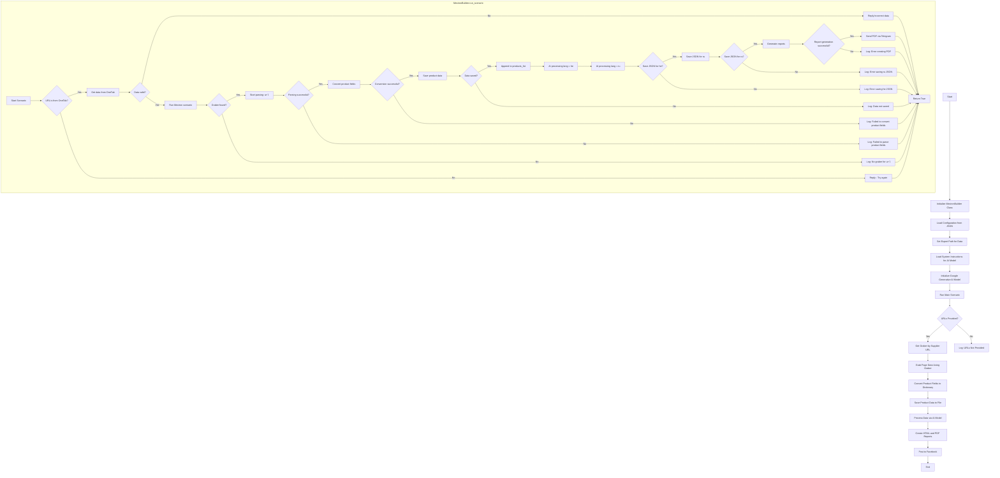

## АНАЛИЗ КОДА: `hypotez/src/endpoints/kazarinov/scenarios/scenario_pricelist.md`

### <алгоритм>
1.  **Инициализация (`Start`)**:
    *   Начало работы скрипта.
    *   Пример: Вызов скрипта из командной строки.

2.  **Создание `MexironBuilder` (`InitMexironBuilder`)**:
    *   Создается экземпляр класса `MexironBuilder`, который отвечает за весь процесс создания мехирона.
    *   Пример: `mexiron_builder = MexironBuilder(driver)`.

3.  **Загрузка конфигурации (`LoadConfig`)**:
    *   Загрузка настроек из JSON-файла.
    *   Пример: Загрузка API-ключей, путей и т.д.

4.  **Установка пути экспорта (`SetExportPath`)**:
    *   Определение места для сохранения файлов.
    *   Пример: `export_path = 'output/mexiron_data'`

5.  **Загрузка системных инструкций (`LoadSystemInstruction`)**:
    *   Получение инструкций для AI модели.
    *   Пример: Текст для запроса AI, описывающий желаемый формат и детали.

6.  **Инициализация AI модели (`InitModel`)**:
    *   Создание объекта для взаимодействия с Google Generative AI.
    *   Пример: `model = GeminiModel(api_key=...)`.

7.  **Запуск сценария (`RunScenario`)**:
    *   Основной метод класса `MexironBuilder`, управляющий процессом обработки.

8.  **Проверка наличия URL (`CheckURLs`)**:
    *   Проверка, предоставлены ли URL для парсинга.
    *   Пример: `if urls:`

9.  **Получение грабера (`GetGraber`)**:
    *   Выбор грабера, соответствующего домену URL.
    *   Пример: `graber = get_graber_by_supplier_url(url)`

10. **Получение данных со страницы (`GrabPage`)**:
     *   Извлечение данных со страницы с помощью грабера.
     *   Пример: `product_data = graber.parse_page(url)`.

11. **Преобразование полей продукта (`ConvertFields`)**:
     *   Приведение данных к стандартному словарному виду.
     *   Пример: `converted_data = convert_product_fields(product_data)`.

12. **Сохранение данных о продукте (`SaveData`)**:
      *   Сохранение полученной информации в файл.
      *   Пример: `save_product_data(converted_data)`.

13. **Обработка AI (`ProcessAI`)**:
     *   Передача данных в AI для обработки.
     *   Пример: `processed_data = model.process(converted_data)`.

14. **Создание отчёта (`CreateReport`)**:
    *   Создание HTML и PDF отчётов.
    *   Пример: `create_report(processed_data, html_file, pdf_file)`.

15. **Публикация на Facebook (`PostFacebook`)**:
    *   Публикация результатов на Facebook.
    *   Пример: `post_facebook(mexiron_data)`.

16. **Завершение (`End`)**:
    *   Конец работы скрипта.

### <mermaid>

**Объяснение `mermaid`:**

*   **`Start`**: Начало процесса.
*   **`InitMexironBuilder`**: Инициализация класса `MexironBuilder`, который управляет основным рабочим процессом.
*   **`LoadConfig`**: Загрузка настроек из JSON-файла, необходимых для работы скрипта.
*   **`SetExportPath`**: Установка пути, куда будут сохраняться результаты работы скрипта.
*   **`LoadSystemInstruction`**: Загрузка инструкций для AI, которые будут использоваться при обработке данных.
*  **`InitModel`**: Инициализация AI модели Google Gemini.
*   **`RunScenario`**: Выполнение основного сценария, описанного в методе `run_scenario` класса `MexironBuilder`.
*   **`CheckURLs`**: Проверка, предоставлены ли URL для обработки.
*   **`GetGraber`**: Получение нужного "грабера" (скрипта для парсинга) на основе URL поставщика.
*  **`GrabPage`**: Извлечение данных с веб-страницы, используя полученный грабер.
*   **`ConvertFields`**: Преобразование извлеченных данных в нужный формат словаря.
*   **`SaveData`**: Сохранение полученных данных в файл.
*   **`ProcessAI`**: Обработка данных с помощью AI модели для последующего анализа.
*   **`CreateReport`**: Создание HTML и PDF отчетов на основе обработанных данных.
*   **`PostFacebook`**: Публикация данных на Facebook.
*   **`End`**: Завершение процесса.
*   `subgraph MexironBuilder.run_scenario` - Описывает блок схему метода `run_scenario`

### <объяснение>

**Импорты:**

*   `selenium`: Используется для автоматизации браузера, для получения данных со страниц.
*   `asyncio`: Используется для асинхронных операций.
*  `pathlib`: Используется для работы с путями к файлам и директориям.
*   `types`: Используется для создания простых пространств имен (SimpleNamespace).
*   `typing`: Используется для аннотаций типов.
*   `src.ai.gemini`: Используется для взаимодействия с Google Gemini AI API.
*   `src.suppliers.*.graber`: Используется для получения данных с различных сайтов поставщиков, каждый поставщик имеет свой грабер.
*   `src.endpoints.advertisement.facebook.scenarios`: Используется для публикации данных на Facebook.

**Класс `MexironBuilder`:**

*   **Назначение**: Управляет процессом создания "мехирона", включая парсинг данных, их обработку AI, создание отчётов и публикацию на Facebook.

*   **Атрибуты**:
    *   `driver`: Экземпляр Selenium WebDriver для управления браузером.
    *   `export_path`: Путь для сохранения файлов.
    *   `mexiron_name`: Название для процесса.
    *   `price`: Цена за обработку (не совсем понятно для чего, возможно для отслеживания или как часть данных).
    *   `timestamp`: Время запуска процесса.
    *   `products_list`: Список обработанных товаров.
    *   `model`: Экземпляр AI-модели.
    *   `config`: Загруженные из файла настройки.

*   **Методы:**
    *   `__init__(self, driver: Driver, mexiron_name: Optional[str] = None)`: Инициализирует класс, получает драйвер, название мехирона и проводит базовые настройки.
    *    `run_scenario(self, system_instruction: Optional[str] = None, price: Optional[str] = None, mexiron_name: Optional[str] = None, urls: Optional[str | List[str]] = None, bot = None) -> bool`:
        *   Основной метод, который управляет всем процессом.
        *   Параметры: инструкции для AI, цена, имя мехирона, список URL.
        *   Возвращает `True` при успешном завершении, `False` в противном случае.
        *  Содержит под-сценарии: проверка источника данных(OneTab), проверка валидности данных, проверка наличия грабера, парсинг страницы, конвертация данных, сохранение данных, обработка данных AI, сохранение в JSON, создание отчёта, отправка отчёта в Telegram.
    *   `get_graber_by_supplier_url(self, url: str)`: Определяет, какой грабер нужен для указанного URL.
    *   `convert_product_fields(self, f: ProductFields) -> dict`: Преобразует данные о товаре в словарь.
    *   `save_product_data(self, product_data: dict)`: Сохраняет данные о товаре в файл.
    *   `process_ai(self, products_list: List[str], lang: str, attempts: int = 3) -> tuple | bool`: Отправляет данные в AI для обработки.
    *   `post_facebook(self, mexiron: SimpleNamespace) -> bool`: Публикует данные на Facebook.
    *   `create_report(self, data: dict, html_file: Path, pdf_file: Path)`: Создаёт HTML и PDF отчёты.

**Функции:**

*   Все основные функции являются методами класса `MexironBuilder`.

**Переменные:**

*   В основном это атрибуты класса `MexironBuilder` и локальные переменные в его методах.

**Потенциальные ошибки и улучшения:**

*   **Обработка ошибок**: Код включает логирование ошибок на каждом этапе, что хорошо. Можно добавить больше деталей в логи для облегчения отладки.
*   **Асинхронность**: Использование `asyncio` может быть реализовано для ускорения обработки данных, особенно если парсинг множества URL занимает значительное время.
*   **Расширяемость**: Архитектура позволяет легко добавлять новые граберы для новых поставщиков.
*   **Конфигурация**: Конфигурация загружается из JSON, что обеспечивает гибкость.
*   **Telegram**: Отправка PDF через Telegram это особенность конкретного кейса, можно вынести этот функционал в отдельный модуль.
*   **Цена**: Переменная price не используется, стоит убрать если не несет смысловой нагрузки.
*   **Метод run_scenario**: Метод слишком сложный, стоит разбить на несколько более мелких.
*   **Обработка OneTab**: Метод обработки OneTab не описан, нужно больше деталей.

**Взаимосвязь с другими частями проекта:**

*   **`src.ai.gemini`**: Модуль для взаимодействия с Google Gemini AI.
*   **`src.suppliers.*.graber`**: Набор модулей для парсинга данных с разных сайтов поставщиков.
*   **`src.endpoints.advertisement.facebook.scenarios`**: Модуль для публикации данных на Facebook.
*   **`src.webdriver.driver`**: Модуль для управления Selenium.

Этот скрипт является частью более крупной системы, где каждый компонент выполняет свою задачу, и `scenario_pricelist.py` связывает их вместе для достижения конечной цели - автоматизированного создания "мехирона".