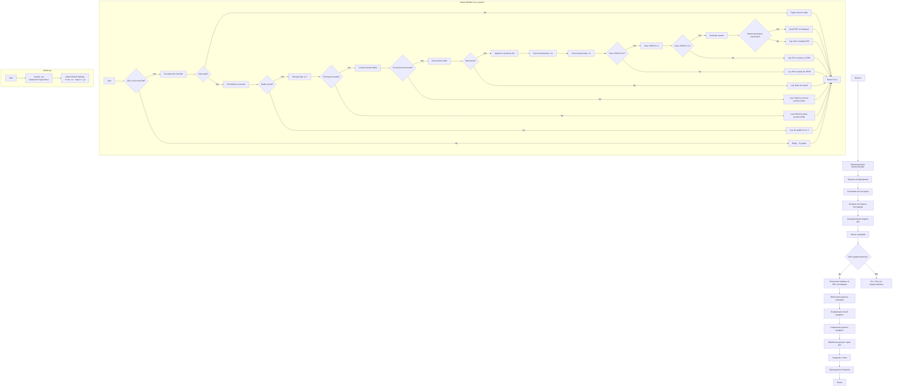

## Анализ кода `scenario_pricelist.ru.md`

### 1. <алгоритм>

**Блок-схема основного процесса `MexironBuilder.run_scenario`:**

1.  **Начало (Start)**: Сценарий начинает выполнение.
    *   _Пример_: `mexiron_builder.run_scenario(urls=urls)`

2.  **Проверка источника URL (IsOneTab)**:
    *   Если URL из OneTab, данные извлекаются из OneTab.
        *   _Пример_: Если `urls` содержит URL OneTab, выполняется извлечение данных.
    *   Если URL не из OneTab, пользователю отправляется сообщение "Try again".
        *   _Пример_: Если `urls` не содержит URL OneTab, выводится сообщение "Try again".

3.  **Проверка валидности данных (IsDataValid)**:
    *   Если данные не валидны, пользователю отправляется сообщение "Incorrect data".
        *   _Пример_: Если данные после OneTab не соответствуют формату, выводится сообщение "Incorrect data".
    *   Если данные валидны, запускается сценарий Mexiron.
        *   _Пример_: Если данные соответствуют формату, выполняется дальнейший сценарий.

4.  **Поиск грабера (IsGraberFound)**:
    *   Если грабер найден, начинается парсинг страницы.
        *   _Пример_: `get_graber_by_supplier_url(url)` возвращает грабер, если найден.
    *   Если грабер не найден, логируется сообщение о том, что грабер отсутствует для данного URL.
        *   _Пример_: `get_graber_by_supplier_url(url)` возвращает `None`, логируется сообщение.

5.  **Парсинг страницы (StartParsing)**:
    *   Если парсинг успешен, данные преобразуются в нужный формат.
        *   _Пример_: Грабер возвращает данные о продукте.
    *   Если парсинг не удался, логируется ошибка.
        *   _Пример_: Грабер не может извлечь данные, логируется ошибка.

6.  **Преобразование данных (ConvertProductFields)**:
    *   Если преобразование успешно, данные сохраняются.
        *   _Пример_: `convert_product_fields(f)` возвращает словарь с данными.
    *   Если преобразование не удалось, логируется ошибка.
        *   _Пример_: `convert_product_fields(f)` не может преобразовать данные, логируется ошибка.

7.  **Сохранение данных (SaveProductData)**:
    *   Если данные сохранены, они добавляются в список продуктов.
        *   _Пример_: `save_product_data(product_data)` успешно сохраняет данные.
    *   Если данные не сохранены, логируется ошибка.
        *   _Пример_: `save_product_data(product_data)` не может сохранить данные, логируется ошибка.

8.  **Обработка через AI (ProcessAIHe, ProcessAIRu)**:
    *   Данные обрабатываются AI для языков `he` (иврит) и `ru` (русский).
        *   _Пример_: `process_ai(products_list, lang='he')` и `process_ai(products_list, lang='ru')`.

9.  **Сохранение JSON (SaveHeJSON, SaveRuJSON)**:
    *   Результаты обработки сохраняются в формате JSON для каждого языка.
        *   _Пример_: Данные сохраняются в файл `mexiron_timestamp_he.json`.
    *   Если сохранение не удалось, логируется ошибка.
        *   _Пример_: Файл не может быть сохранен, логируется ошибка.

10. **Генерация отчетов (GenerateReports)**:
     * Создаются HTML и PDF отчеты для каждого языка.
        * _Пример_: `create_report(data, html_file, pdf_file)`.
     * Если создание отчета не удалось, логируется ошибка.
        * _Пример_: Отчет не создан, логируется ошибка.

11. **Отправка PDF через Telegram (SendPDF)**:
      * PDF-файлы отправляются через Telegram.
        * _Пример_: PDF отчет отправляется через Telegram.
      * Если отправка не удалась, логируется ошибка.
        * _Пример_: Ошибка при отправке PDF через Telegram.

12. **Завершение (ReturnTrue)**:
     * Сценарий завершается, возвращая `True`.

**Поток данных:**

1.  **URLs**: Список URL-адресов страниц товаров.
2.  **Grabber**: Извлекает данные со страницы товара.
3.  **ProductFields**: Парсированные данные с страницы товара.
4.  **dict**: Словарь с данными товара.
5.  **products_list**: Список словарей с данными товаров.
6.  **AI**: Обработанные данные.
7.  **JSON файлы**: Файлы с обработанными данными для `ru` и `he`.
8.  **HTML/PDF отчеты**: Отчеты для каждого языка.
9.  **Telegram**: Отправка PDF-отчета.

### 2. <mermaid>

**Анализ зависимостей:**

*   **`InitMexironBuilder`**: Создает экземпляр класса `MexironBuilder`, который управляет всем процессом. Зависит от `Driver`, полученного при инициализации.
*   **`LoadConfig`**: Загружает конфигурацию из JSON-файла. Эта операция может зависеть от библиотеки для работы с JSON (например, `json`).
*   **`SetExportPath`**: Устанавливает путь для сохранения данных. Зависит от `pathlib` для работы с путями.
*  **`LoadSystemInstruction`**: Загружает системные инструкции для модели ИИ.
*   **`InitModel`**: Инициализирует модель Google Generative AI. Зависит от пакета `src.ai.gemini`.
*  **`RunScenario`**: Выполняет сценарий обработки данных. Зависит от нескольких функций внутри `MexironBuilder`.
*  **`CheckURLs`**: Проверяет наличие URL для парсинга.
*   **`GetGraber`**: Получает грабер для URL поставщика. Зависит от пакетов `src.suppliers.*.graber`.
*   **`GrabPage`**: Извлекает данные со страницы. Зависит от `selenium` и грабера.
*   **`ConvertFields`**: Преобразует поля продукта в формат словаря.
*   **`SaveData`**: Сохраняет данные продукта. Зависит от `pathlib`.
*   **`ProcessAI`**: Обрабатывает данные через модель ИИ. Зависит от `src.ai.gemini`.
*   **`CreateReport`**: Создает отчеты HTML и PDF. Зависит от библиотек для работы с HTML и PDF (например, `weasyprint`).
*   **`PostFacebook`**: Публикует данные в Facebook. Зависит от `src.endpoints.advertisement.facebook.scenarios`.
* **`header.py`**: Определяет корень проекта и загружает глобальные настройки. Зависит от `os` и других модулей.

### 3. <объяснение>

**Импорты:**

*   `selenium`: Используется для автоматизации взаимодействия с веб-браузером. Это необходимо для извлечения данных с веб-страниц (граббинга).
*   `asyncio`: Используется для выполнения асинхронных операций, что может улучшить производительность при выполнении задач, связанных с вводом-выводом (например, сетевых запросов).
*   `pathlib`: Используется для работы с файловыми путями, что делает код более читаемым и переносимым.
*   `types.SimpleNamespace`: Используется для создания простых объектов с атрибутами, которые могут быть изменены (например, для передачи настроек или результатов).
*   `typing`: Используется для аннотаций типов, которые делают код более понятным и помогают обнаруживать ошибки на ранних этапах.
*   `src.ai.gemini`: Этот пакет отвечает за взаимодействие с моделью Google Generative AI, используемой для обработки данных.
*   `src.suppliers.*.graber`: Этот пакет содержит классы, которые используются для извлечения данных со страниц различных поставщиков.
*   `src.endpoints.advertisement.facebook.scenarios`: Этот пакет отвечает за публикацию данных в Facebook.
* `src.webdriver.driver`: Пакет для управления экземпляром веб-драйвера.

**Класс `MexironBuilder`:**

*   **`__init__(self, driver: Driver, mexiron_name: Optional[str] = None)`:**
    *   Инициализирует класс `MexironBuilder`.
    *   Принимает экземпляр `Driver` (Selenium WebDriver) и опциональное имя для мехирона.
    *   Устанавливает базовые атрибуты класса, такие как `driver`, `export_path`, `mexiron_name`, `timestamp` и `products_list`.
*   **`run_scenario(...)`:**
    *   Основной метод, выполняющий сценарий.
    *   Принимает системные инструкции для ИИ, цену, имя мехирона, URL и экземпляр бота (опционально).
    *   Проверяет, является ли URL из OneTab, получает данные.
    *   Итерируется по URL-ам, получает грабер, извлекает данные, конвертирует их, сохраняет, обрабатывает через ИИ и создает отчеты.
    *   Обрабатывает данные на языках `ru` и `he`.
    *   Сохраняет данные в формате JSON, генерирует HTML и PDF отчеты, отправляет PDF отчет через Telegram.
    *   Возвращает `True`, если сценарий выполнен успешно, иначе возвращает `False`.
*   **`get_graber_by_supplier_url(self, url: str)`:**
    *   Получает грабер, соответствующий переданному URL поставщика.
    *   Используется для динамического выбора грабера, который соответствует текущему URL.
*   **`convert_product_fields(self, f: ProductFields) -> dict`:**
    *   Конвертирует данные, полученные от грабера, в стандартный формат словаря.
    *   Упрощает обработку данных, делая их однородными.
*  **`save_product_data(self, product_data: dict)`:**
     *   Сохраняет данные продукта в файл.
*   **`process_ai(self, products_list: List[str], lang: str, attempts: int = 3) -> tuple | bool`:**
    *   Отправляет запрос в модель Google Generative AI.
    *   Обрабатывает список продуктов с использованием заданного языка (`ru`, `he`).
    *   Выполняет несколько попыток (до 3) в случае ошибки.
    *   Возвращает обработанные данные.
*   **`post_facebook(self, mexiron: SimpleNamespace) -> bool`:**
    *   Выполняет сценарий публикации данных в Facebook.
    *   Принимает объект `mexiron` с обработанными данными.
    *   Возвращает `True`, если публикация прошла успешно.
*   **`create_report(self, data: dict, html_file: Path, pdf_file: Path)`:**
    *   Генерирует HTML и PDF отчеты.
    *   Принимает данные, пути к HTML и PDF файлам.

**Функции (методы класса):**

*   Все функции, кроме `__init__`, `run_scenario`, являются вспомогательными методами для обработки, преобразования и сохранения данных.
*   Метод `run_scenario` организует весь процесс обработки данных.

**Переменные:**

*   `driver`: Экземпляр Selenium WebDriver.
*   `export_path`: Путь для экспорта данных (тип `Path`).
*   `mexiron_name`: Имя для мехирона.
*   `price`: Цена для обработки.
*   `timestamp`: Временная метка.
*   `products_list`: Список словарей с данными продуктов.
*   `model`: Модель Google Generative AI.
*   `config`: Конфигурация из JSON файла.
*   `urls`: Список URL для обработки.
*   `bot`: Экземпляр бота (опционально).

**Потенциальные ошибки и области для улучшения:**

*   **Обработка ошибок**:
    *   Добавить более подробное логирование ошибок.
    *   Реализовать более гибкую обработку ошибок, позволяющую восстанавливаться после сбоев (например, автоматический повторный запрос).
*   **Производительность**:
    *   Асинхронные операции не должны быть заблокированы синхронным кодом.
    *   Возможно, стоит оптимизировать процесс парсинга и обработки данных.
*   **Гибкость**:
    *   Сделать структуру более модульной, чтобы можно было легко добавлять новых поставщиков и AI-модели.
*   **Конфигурация**:
    *   Использовать более гибкие форматы конфигурации, чтобы можно было настраивать параметры без изменения кода.
*   **Отчетность**:
    *  Сделать создание отчетов более гибким (например, добавить разные шаблоны).
*   **Публикация в Facebook**:
    *  Рассмотреть асинхронную публикацию.

**Цепочка взаимосвязей с другими частями проекта:**

1.  **`src.webdriver.driver`**:
    *   Предоставляет драйвер Selenium WebDriver, который используется для веб-автоматизации.
    *   `MexironBuilder` зависит от этого драйвера для парсинга страниц.
2.  **`src.suppliers.*.graber`**:
    *   Предоставляет граберы для извлечения данных с веб-страниц различных поставщиков.
    *   `MexironBuilder` использует эти граберы для получения данных с веб-сайтов.
3.  **`src.ai.gemini`**:
    *   Обеспечивает взаимодействие с моделью Google Generative AI для обработки данных.
    *   `MexironBuilder` использует эту модель для обработки данных.
4.  **`src.endpoints.advertisement.facebook.scenarios`**:
    *   Предоставляет функциональность для публикации данных в Facebook.
    *   `MexironBuilder` использует эту функциональность для публикации обработанных данных.
5.  **`header.py`**:
    *   Используется для определения корня проекта и загрузки глобальных настроек.
    *   `MexironBuilder` может зависеть от глобальных настроек, полученных из `header.py`.

В заключение, скрипт `scenario_pricelist.ru.md` является сложным, многофункциональным инструментом для автоматизации процесса создания мехирона, охватывающего парсинг веб-страниц, обработку данных через ИИ, создание отчетов и публикацию в Facebook. Он использует несколько пакетов, что требует хорошей организации кода и понимания взаимосвязей между ними.