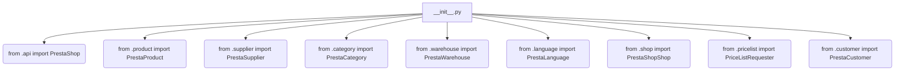
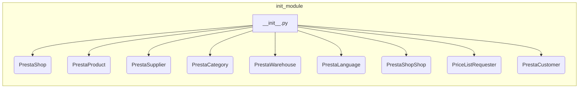

```MD
# Анализ кода hypotez/src/endpoints/prestashop/__init__.py

## <input code>

```python
## \file hypotez/src/endpoints/prestashop/__init__.py
# -*- coding: utf-8 -*-

#! venv/bin/python/python3.12

"""
.. module: src.endpoints.prestashop 
	:platform: Windows, Unix
	:synopsis:

"""


from .api import PrestaShop
from .product import PrestaProduct
from .supplier import PrestaSupplier
from .category import PrestaCategory
from .warehouse import PrestaWarehouse
from .language import PrestaLanguage
from .shop import PrestaShopShop
from .pricelist import PriceListRequester
from .customer import PrestaCustomer
```

## <algorithm>



Данный файл `__init__.py` является модулем инициализации для пакета `prestashop` внутри проекта `hypotez`. Он импортирует классы и функции из других модулей внутри той же директории `prestashop`, подготавливая их для использования в других частях проекта.  Никаких сложных вычислений или логики здесь нет, только импорты.

## <mermaid>



Диаграмма отображает прямую зависимость `__init__.py` от других модулей:  `api`, `product`, `supplier` и т.д.  Каждое из этих модулей, скорее всего, содержит классы и функции, которые будут использоваться в коде, который использует этот `__init__.py` файл.


## <explanation>

**Импорты:**

Файл `__init__.py` импортирует классы и функции из других модулей в директории `prestashop`,  находящихся в том же уровне директорий.  Например, `from .api import PrestaShop` импортирует класс `PrestaShop` из модуля `api.py` в той же папке. Это типичный способ структурирования кода в Python для группировки связанных классов и функций.  Все импорты указывают на взаимосвязь между модулями, которые находятся в подпапках текущего проекта, что указывает на структурированный подход к организации кодовой базы.

**Классы (возможно):**

Вероятно, в файлах `api.py`, `product.py` и т.д. определены классы, представляющие объекты PrestaShop, PrestaProduct и т.д.  Эти классы, скорее всего, хранят данные о магазинах, продуктах и других сущностях PrestaShop, а их методы предоставляют доступ к данным и выполняют операции над ними.

**Функции:**

Из представленного кода трудно судить о функциях. Вероятно,  существуют функции внутри импортированных классов, например, методы для получения данных,  их обработки и т.д.

**Переменные:**

`` - переменная, вероятно, задаёт режим работы (например, dev/prod) и используется для настройки поведения системы.

**Возможные ошибки или улучшения:**

* **Документация:**  Хотя есть docstring, он достаточно общий.  Дополнение подробной документации для каждого класса и функции значительно повысит читабельность и понимание кода.
* **Ошибочная обработка:** Не видно обработку ошибок, если импортируемые модули не найдены, или имеют неправильный формат.  Добавление `try...except` блоков сделает код более надежным.
* **Конвенции именования:** Поищите, используются ли соглашения об именовании, например, PEP 8.


**Взаимосвязи с другими частями проекта:**

Файл `__init__.py` служит связующим звеном между модулями, работающими с данными PrestaShop, и остальной частью приложения `hypotez`.  Другие части проекта, возможно, импортируют и используют классы и функции из этого файла для взаимодействия с API PrestaShop.  Это указывает на то, что этот модуль является частью более крупной архитектуры, где данные из PrestaShop используются в других функциональных блоках проекта.