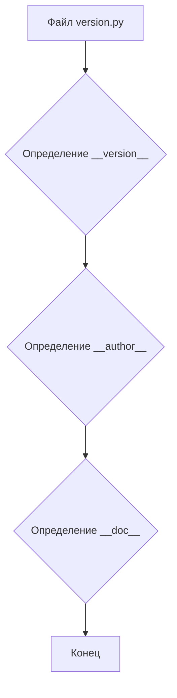
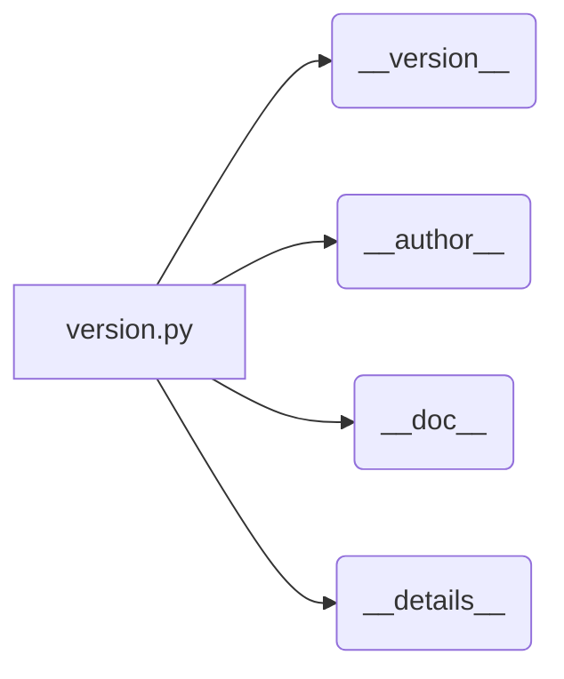

```MD
# Анализ кода файла hypotez/src/endpoints/prestashop/_examples/version.py

## <input code>

```python
## \file hypotez/src/endpoints/prestashop/_examples/version.py
# -*- coding: utf-8 -*-\n
#! venv/bin/python/python3.12
"""
.. module: src.endpoints.prestashop._examples 
	:platform: Windows, Unix
	:synopsis:

"""


"""
	:platform: Windows, Unix
	:synopsis:

"""


"""
	:platform: Windows, Unix
	:synopsis:

"""


"""
  :platform: Windows, Unix

"""
"""
  :platform: Windows, Unix
  :platform: Windows, Unix
  :synopsis:
"""
  
""" module: src.endpoints.prestashop._examples """


"""
- `__version__`: This variable holds the version of the module or package.
- `__name__`: Contains the name of the module. If the script is being run directly, the value will be `"__main__"`.
- `__doc__`: The module's documentation string.
- `__details__`: This variable likely contains additional details about the module, but the exact purpose depends on the specific module or package.
- `__annotations__`: Contains type annotations for variables and functions in the module.
- `__author__`: The name(s) of the author(s) of the module.
"""
__name__:str
__version__="3.12.0.0.0.4"
__doc__:str
__details__:str="Details about version for module or class"
__annotations__

__author__='hypotez '
```

## <algorithm>

Этот код не содержит алгоритма в традиционном смысле. Это скорее файл конфигурации или документации.  Он определяет переменные, хранящие информацию о модуле (версия, автор, описание).  Алгоритмической логики нет.

**Блок-схема:**



## <mermaid>



## <explanation>

**Импорты:** Нет импортов.  Код представляет собой описание модуля.

**Классы:** Нет классов.

**Функции:** Нет функций.

**Переменные:**
- `MODE`: Переменная со строковым значением, вероятно, используемая для выбора режима работы.
- `__version__`: Строковая переменная, содержащая версию модуля.
- `__name__`: Строковая переменная, содержащая имя текущего модуля.
- `__doc__`: Строковая переменная, содержащая документацию к модулю.
- `__details__`: Строковая переменная, содержащая дополнительные детали о версии модуля.
- `__annotations__`: Переменная, предполагающая наличие аннотаций типов (но не используется в этом примере).
- `__author__`: Строковая переменная, хранящая имя автора модуля.

**Возможные ошибки или области для улучшений:**

- Отсутствует явное указание назначения переменной `MODE`.
- Комментарии могут быть более информативными и структурированными.
- Тип данных для `__details__` неявный. Лучше было бы явно указать тип данных.

**Взаимосвязи с другими частями проекта:**

Этот файл `version.py` служит метаданными для модуля. Он не напрямую взаимодействует с другими модулями, но их взаимодействие возможно через вызов функций, которые могут ссылаться на переменные, определённые в этом файле (например, при запросе версии модуля).  Файлы в папке `_examples` предполагается использовать для примеров использования других модулей из пакета.  В общем, файл важен для понимания и работы с остальной частью проекта.