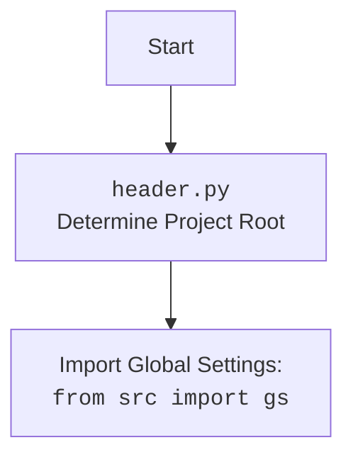

## ИНСТРУКЦИЯ:

Анализируй предоставленный код подробно и объясни его функциональность. Ответ должен включать три раздела:  

1. **<алгоритм>**: Опиши рабочий процесс в виде пошаговой блок-схемы, включая примеры для каждого логического блока, и проиллюстрируй поток данных между функциями, классами или методами.  
2. **<mermaid>**: Напиши код для диаграммы в формате `mermaid`, проанализируй и объясни все зависимости, 
    которые импортируются при создании диаграммы. 
    **ВАЖНО!** Убедитесь, что все имена переменных, используемые в диаграмме `mermaid`, 
    имеют осмысленные и описательные имена. Имена переменных вроде `A`, `B`, `C`, и т.д., не допускаются!  
    
    **Дополнительно**: Если в коде есть импорт `import header`, добавьте блок `mermaid` flowchart, объясняющий `header.py`:\
    ```mermaid
    flowchart TD
        Start --> Header[<code>header.py</code><br> Determine Project Root]
    
        Header --> import[Import Global Settings: <br><code>from src import gs</code>] 
    ```

3. **<объяснение>**: Предоставьте подробные объяснения:  
   - **Импорты**: Их назначение и взаимосвязь с другими пакетами `src.`.  
   - **Классы**: Их роль, атрибуты, методы и взаимодействие с другими компонентами проекта.  
   - **Функции**: Их аргументы, возвращаемые значения, назначение и примеры.  
   - **Переменные**: Их типы и использование.  
   - Выделите потенциальные ошибки или области для улучшения.  

Дополнительно, постройте цепочку взаимосвязей с другими частями проекта (если применимо).  

Это обеспечивает всесторонний и структурированный анализ кода.
## Формат ответа: `.md` (markdown)
**КОНЕЦ ИНСТРУКЦИИ**
## <алгоритм>

**1. Инициализация `PrestaShop`:**

   -   Создается экземпляр класса `PrestaShop` с параметрами `API_DOMAIN`, `API_KEY`, `default_lang`, `debug`, `data_format`.
     ```python
        api = PrestaShop(
            API_DOMAIN='https://your-prestashop-domain.com',
            API_KEY='your_api_key',
            default_lang=1,
            debug=True,
            data_format='JSON',
        )
     ```
   -   В методе `__init__` происходит установка базового URL API, ключа авторизации, режима отладки, языка и формата данных.
   -   Также проверяется подключение к API (метод `HEAD`) и устанавливается `ps_version`.

**2. Проверка соединения `ping()`:**

   -  Выполняется `HEAD` запрос к API.
   -  Метод `_check_response` проверяет статус ответа. Если код `200` или `201`, возвращается `True`, иначе вызывается метод `_parse_response_error` для обработки ошибок и возвращается `False`.

**3. Выполнение запросов `_exec()`:**

   -   Метод `_exec` является ядром для выполнения запросов к API PrestaShop.
   -   Определяется URL в зависимости от наличия `resource_id`.
   -   Подготавливаются параметры запроса (фильтры, лимиты и т.д.).
   -   Если формат данных `XML`, то данные конвертируются в XML.
   -   Выполняется запрос с использованием `requests.Session`.
   -   Ответ проверяется через `_check_response`.
   -   Возвращается результат в зависимости от формата данных (JSON или XML).

**4. Обработка ошибок `_check_response()` и `_parse_response_error()`:**

   -   `_check_response()` проверяет статус код ответа. Если код `200` или `201`, возвращает `True`. В противном случае вызывается `_parse_response_error()` для обработки ошибок.
   -   `_parse_response_error()` обрабатывает ошибки, полученные от API. В случае JSON, просто логирует сообщение ошибки. В случае XML, парсит XML и вытаскивает код и сообщение об ошибке, затем также логирует сообщение.

**5. Методы CRUD (Create, Read, Update, Delete):**

    - `create()` - вызывает `_exec` с методом `POST` для создания ресурса.
        ```python
          data = {
              'tax': {
                  'rate': 3.000,
                  'active': '1',
                  'name': {
                      'language': {
                          'attrs': {'id': '1'},
                          'value': '3% tax'
                      }
                  }
              }
          }
          rec = api.create('taxes', data)
        ```
    -   `read()` - вызывает `_exec` с методом `GET` для получения ресурса по `resource_id`.
        ```python
           rec = api.read('taxes', 1)
        ```
    -   `write()` - вызывает `_exec` с методом `PUT` для обновления ресурса.
        ```python
           update_data = {
               'tax': {
                   'id': str(rec['id']),
                   'rate': 3.000,
                   'active': '1',
                   'name': {
                       'language': {
                           'attrs': {'id': '1'},
                           'value': '3% tax'
                       }
                   }
               }
           }
           update_rec = api.write('taxes', update_data)
        ```
    -   `unlink()` - вызывает `_exec` с методом `DELETE` для удаления ресурса.
        ```python
            api.unlink('taxes', str(rec['id']))
        ```
**6. Поиск ресурсов `search()`:**

    -  Вызывает `_exec` с методом `GET` и параметром `search_filter` для поиска ресурсов.
        ```python
           recs = api.search('taxes', filter='[name]=%[5]%', limit='3')
        ```
**7. Загрузка бинарных данных `create_binary()`:**

    -  Открывает файл в бинарном режиме, устанавливает заголовок `Content-Type` и отправляет файл на сервер.
        ```python
           api.create_binary('images/products/22', 'img.jpeg', 'image')
        ```
**8. Загрузка изображений `upload_image_async()` и `upload_image()`:**

    - Скачивает изображение по URL, сохраняет его локально, вызывает `create_binary` и удаляет временный файл.

**9. Дополнительные методы:**

    - `get_data()` - получает данные с API и сохраняет их в файл.
    - `remove_file()` - удаляет файл.
    - `get_apis()` - получает список доступных API.
    - `get_languages_schema()` - получает схему для языков.
    - `get_product_images()` - получает изображения продукта.
    - `_parse()` - парсит данные (JSON или XML).
    - `_prepare()` - подготавливает URL для запроса.
    - `_save()` - сохраняет данные в файл.

## <mermaid>

```mermaid
flowchart TD
    subgraph PrestaShop API Interaction
        Start[Start] --> Init[Initialize PrestaShop Class]
        Init --> PingCheck{Ping?}
        PingCheck -- Yes --> ApiCall[Execute API Call (_exec)]
        PingCheck -- No --> ErrorResponse[Handle Error Response]
        ApiCall --> CheckResponse{Check Response Status}
        CheckResponse -- Success --> ParseResponse[Parse Response (_parse)]
        CheckResponse -- Fail --> ErrorResponse
        ParseResponse --> End[Return Data]
        ErrorResponse --> End
    end
    
    subgraph Data Handling
      	  StartData[Start Data Handling] --> CreateBinary[Upload Binary Data]
          CreateBinary --> SaveImageURL[Save Image from URL]
          SaveImageURL --> UploadImage[Upload Image (Async or Sync)]
          UploadImage --> RemoveFile[Remove Temporary File]
          RemoveFile --> EndData[Return Response or Error]
          StartData --> GetData[Fetch and Save Data]
          GetData --> SaveFile[Save to File (_save)]
          SaveFile --> EndData
      end
    
    subgraph Core Functions
        InitClass[Class Initialization(__init__)] --> SetCredentials[Set API Credentials]
        SetCredentials --> CheckConnection[Check API Connection]
        CheckConnection --> SetVersion[Set PS Version]
        CheckConnection -- Fail --> HandleAuthError[Handle Authentication Error]
        PingFunc[ping()] --> HeadRequest[Send HEAD Request]
        HeadRequest --> CheckPingResponse[Check Response (_check_response)]
        ExecFunc[_exec()] --> PrepareURL[Prepare URL (_prepare)]
        PrepareURL --> SendRequest[Send HTTP Request]
        SendRequest --> CheckExecResponse[Check Response (_check_response)]
        CheckExecResponse -- Fail --> HandleExecError[Handle Error (_parse_response_error)]
        ParseFunc[_parse()] --> ParseText[Parse JSON or XML]
    end
    
    subgraph CRUD Operations
        CreateOperation[create()] --> ExecCreate[_exec with POST]
        ReadOperation[read()] --> ExecRead[_exec with GET]
        WriteOperation[write()] --> ExecWrite[_exec with PUT]
        UnlinkOperation[unlink()] --> ExecDelete[_exec with DELETE]
        SearchOperation[search()] --> ExecSearch[_exec with GET and Filter]
    end
    
    subgraph  Image Upload
    	UploadImageAsync[upload_image_async()] --> SaveImageFromURLAsync[Save Image from URL]
    	UploadImageAsync --> CreateBinaryAsync[Create Binary(_create_binary)]
    	CreateBinaryAsync --> RemoveFileAsync[Remove Temporary File]
    	UploadImage[upload_image()] --> SaveImageFromURL[Save Image from URL]
    	UploadImage --> CreateBinary[Create Binary(_create_binary)]
    	CreateBinary --> RemoveFile[Remove Temporary File]
    end
    
    Init --> SetCredentials
    SetVersion --> PingCheck
    PingFunc --> HeadRequest
    ExecFunc --> PrepareURL
    CreateOperation --> ExecCreate
    ReadOperation --> ExecRead
    WriteOperation --> ExecWrite
    UnlinkOperation --> ExecDelete
    SearchOperation --> ExecSearch
	UploadImageAsync --> SaveImageFromURLAsync
    
    SaveImageURL --> UploadImage
    GetData --> SaveFile
    
    
    
    classDef header_class fill:#f9f,stroke:#333,stroke-width:2px
    class Init header_class
    class PingFunc header_class
    class ExecFunc header_class
    class ParseFunc header_class
    class CreateOperation header_class
    class ReadOperation header_class
    class WriteOperation header_class
    class UnlinkOperation header_class
    class SearchOperation header_class
    class UploadImageAsync header_class
    class UploadImage header_class
    class Start fill:#ccf,stroke:#333,stroke-width:2px
    class End fill:#ccf,stroke:#333,stroke-width:2px
    class StartData fill:#ccf,stroke:#333,stroke-width:2px
    class EndData fill:#ccf,stroke:#333,stroke-width:2px
```



**Анализ `mermaid` диаграммы:**

-   Диаграмма разделена на несколько подграфов, каждый из которых отвечает за определенную часть функциональности.
-   **`PrestaShop API Interaction`**:  Описывает основной цикл взаимодействия с API, начиная от инициализации класса до обработки и возврата данных.
-   **`Data Handling`**: Показывает, как обрабатываются данные, включая загрузку бинарных файлов и сохранение полученных данных в файл.
-   **`Core Functions`**:  Демонстрирует внутренние методы, используемые для настройки и выполнения запросов к API.
-   **`CRUD Operations`**:  Показывает, как вызываются методы для основных операций CRUD (создание, чтение, обновление, удаление)
-    **`Image Upload`**: Описывает процесс загрузки изображений.
-   Связи между подграфами показывают поток данных и вызовы методов между различными частями кода.

**Зависимости:**

-   **`requests`**: Используется для отправки HTTP-запросов к API PrestaShop.
-   **`xml.etree.ElementTree`**: Используется для работы с XML данными, когда формат данных XML.
-   **`src.logger`**: Используется для логирования ошибок и другой информации.
-   **`src.utils`**: Используются для конвертации, сохранения данных и изображений
-   **`header.py`**: Этот файл предназначен для определения корневой директории проекта и используется для импорта глобальных настроек `gs`.

## <объяснение>

**Импорты:**

-   `os`, `sys`:  Используются для работы с операционной системой и системными переменными.
-   `enum.Enum`: Используется для создания перечисления `Format`, который определяет форматы данных (JSON, XML).
-   `http.client.HTTPConnection`: Используется для низкоуровневого взаимодействия по протоколу HTTP.
-   `pathlib.Path`: Используется для работы с путями к файлам и директориям.
-   `typing`: Используется для аннотации типов.
-   `xml.etree.ElementTree`: Используется для парсинга XML ответов от API.
-   `xml.parsers.expat.ExpatError`: Используется для отлова ошибок парсинга XML.
-   `requests.Session`: Используется для управления HTTP-сессией.
-   `requests.models.PreparedRequest`: Используется для подготовки URL.
-   `header`: Модуль для определения корня проекта, используется для импорта `gs`.
-   `src.gs`: Глобальные настройки проекта.
-   `src.logger.exceptions.PrestaShopAuthenticationError`, `src.logger.exceptions.PrestaShopException`:  Пользовательские исключения для обработки ошибок API.
-   `src.logger.logger`: Используется для логирования.
-   `src.utils.convertors.base64`: Используется для преобразования base64 в временный файл.
-   `src.utils.convertors.dict`:  Используется для преобразования словаря в XML.
-   `src.utils.convertors.xml2dict`: Используется для преобразования XML в словарь.
-   `src.utils.file`: Используется для сохранения текстовых файлов.
-   `src.utils.image`: Используется для сохранения изображений из URL.
-   `src.utils.jjson`: Используется для работы с JSON.
-   `src.utils.printer`: Используется для красивого вывода.

**Классы:**

-   `Format(Enum)`: Перечисление для форматов данных, поддерживаемых API.
    -  `JSON`: Представляет формат JSON.
    -  `XML`: Представляет формат XML.
-   `PrestaShop`: Основной класс для взаимодействия с PrestaShop API.
    -   `client`: HTTP-клиент для выполнения запросов.
    -   `debug`: Флаг для режима отладки.
    -   `language`: Идентификатор языка по умолчанию.
    -   `data_format`: Формат данных (`JSON` или `XML`).
    -   `ps_version`: Версия PrestaShop.
    -   `__init__`:  Конструктор, инициализирует API-домен, ключ, язык, формат данных, настраивает клиент авторизации и определяет версию PrestaShop.
    -   `ping()`: Проверяет доступность API.
    -   `_check_response()`: Проверяет статус код ответа и вызывает обработку ошибок при необходимости.
    -   `_parse_response_error()`: Обрабатывает ошибки, полученные от API, в зависимости от формата данных.
    -   `_prepare()`: Формирует URL запроса с параметрами.
    -   `_exec()`: Основной метод для выполнения запросов к API.
    -   `_parse()`: Парсит ответы от API в зависимости от формата данных.
    -   `create()`: Создает новый ресурс.
    -   `read()`:  Читает ресурс по ID.
    -   `write()`: Обновляет ресурс.
    -   `unlink()`: Удаляет ресурс.
    -   `search()`: Ищет ресурсы.
    -   `create_binary()`: Загружает бинарные данные.
    -   `_save()`: Сохраняет данные в файл.
    -   `get_data()`: Получает и сохраняет данные.
    -   `remove_file()`: Удаляет файл.
    -   `get_apis()`: Получает список доступных API.
    -   `get_languages_schema()`: Получает схему для языков.
    -   `upload_image_async()`: Загружает изображение асинхронно.
    -    `upload_image()`: Загружает изображение.
    -   `get_product_images()`: Получает изображения продукта.

**Функции:**

-   `__init__()`: Конструктор класса `PrestaShop`, инициализирует атрибуты класса.
-   `ping()`: Проверяет доступность API, возвращает `True` если доступен, `False` если нет.
-   `_check_response()`: Проверяет статус код HTTP ответа, возвращает `True` при успехе (200, 201), `False` при ошибке.
-   `_parse_response_error()`: Обрабатывает ошибки ответа от сервера, логирует ошибки и возвращает информацию об ошибке.
-   `_prepare()`: Формирует URL запроса.
-   `_exec()`: Выполняет HTTP запрос к API PrestaShop, возвращает данные или `False` при ошибке.
-   `_parse()`: Парсит XML или JSON ответ от API, возвращает данные в виде словаря или объекта ElementTree.
-   `create()`: Создает новый ресурс в PrestaShop, возвращает ответ от API.
-   `read()`:  Получает ресурс из PrestaShop API, возвращает данные ресурса.
-   `write()`: Обновляет существующий ресурс в PrestaShop, возвращает ответ от API.
-   `unlink()`: Удаляет ресурс из PrestaShop API, возвращает `True` при успехе, `False` при неудаче.
-   `search()`: Ищет ресурсы в PrestaShop API, возвращает список найденных ресурсов.
-   `create_binary()`: Загружает бинарный файл в PrestaShop API, возвращает ответ от API.
-   `_save()`: Сохраняет данные в JSON файл.
-   `get_data()`: Получает данные из PrestaShop API и сохраняет их в файл, возвращает данные или `False` при ошибке.
-   `remove_file()`: Удаляет файл с диска.
-   `get_apis()`: Получает список доступных API из PrestaShop API.
-   `get_languages_schema()`: Получает схему для языков, возвращает схему или `None` в случае ошибки.
-   `upload_image_async()`: Загружает изображение в PrestaShop API асинхронно, возвращает ответ от API.
-    `upload_image()`: Загружает изображение в PrestaShop API, возвращает ответ от API.
-   `get_product_images()`: Получает список изображений продукта из PrestaShop API.

**Переменные:**

-   `API_DOMAIN`, `API_KEY`:  Строки, содержащие домен API и ключ авторизации.
-   `debug`: Булево значение, определяющее режим отладки.
-   `language`: Целое число, представляющее ID языка.
-   `data_format`: Строка, определяющая формат данных (JSON или XML).
-   `ps_version`: Строка, содержащая версию PrestaShop.
-   `client`: Объект сессии `requests.Session` для отправки HTTP-запросов.
-   `resource`, `resource_id`, `resource_ids`:  Строки или целые числа, представляющие ресурсы и их ID.
-   `method`: Строка, определяющая HTTP метод (`GET`, `POST`, `PUT`, `DELETE`).
-   `data`: Словарь, содержащий данные запроса.
-   `headers`: Словарь, содержащий заголовки запроса.
-   `search_filter`: Строка или словарь, содержащий фильтры поиска.
-    `display`: Строка или список, содержащие поля для отображения.
-   `schema`: Строка, содержащая схему данных.
-   `sort`: Строка, содержащая параметр сортировки.
-   `limit`: Строка, содержащая ограничение на количество результатов.
-    `io_format`: Строка, определяющая формат ввода/вывода (`JSON`, `XML`).
-   `file_path`, `file_name`: Строки, содержащие пути и имена файлов.
-   `img_url`, `img_name`: Строки, содержащие URL и имя файла изображения.

**Потенциальные ошибки и области для улучшения:**

-   Обработка ошибок: Ошибки обрабатываются в методе `_parse_response_error`, но не всегда возвращаются вызывающей стороне. Стоит сделать более унифицированную обработку и пробрасывать ошибки выше.
-   Валидация данных: Нет валидации данных, передаваемых в API. Это может привести к ошибкам при отправке некорректных данных.
-   Асинхронность: Большая часть кода выполняется синхронно, что может замедлить работу при большом количестве запросов. Следует рассмотреть возможность использования асинхронных запросов.
-   Форматирование: Присутствует небольшое несоответствие стандарту PEP8, например, использование одинарных кавычек вместо двойных для строк.
-   Логирование:  Логирование ведется только для критических и ошибок. Может потребоваться добавление больше информации для отладки.
-  Отсутствие обработки исключений при загрузке изображения.

**Взаимосвязь с другими частями проекта:**

-   Использует `src.gs` для получения настроек API PrestaShop.
-   Использует модули из `src.logger` для логирования.
-   Использует модули из `src.utils` для преобразования, сохранения данных и работы с изображениями.
-   Интегрирован с `header.py` для определения корневой директории проекта.

Этот код представляет собой достаточно полный класс для работы с PrestaShop API, но можно улучшить его надежность, эффективность и читаемость.