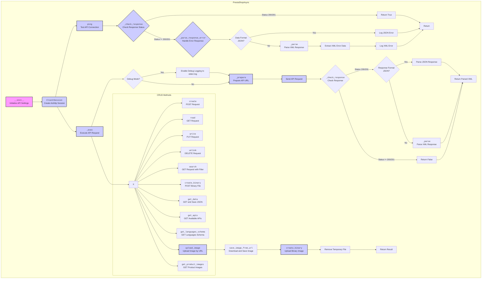
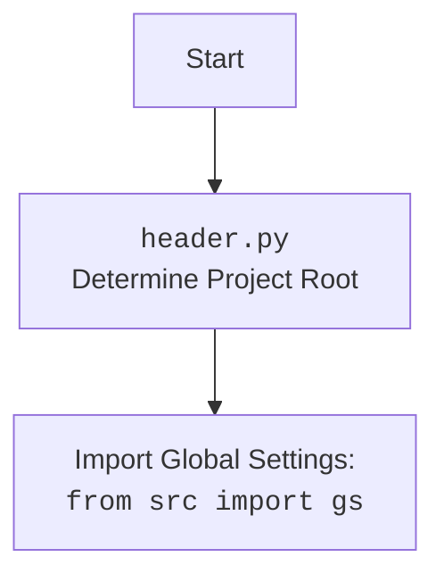

## ИНСТРУКЦИЯ:

Анализируй предоставленный код подробно и объясни его функциональность. Ответ должен включать три раздела:  

1. **<алгоритм>**: Опиши рабочий процесс в виде пошаговой блок-схемы, включая примеры для каждого логического блока, и проиллюстрируй поток данных между функциями, классами или методами.  
2. **<mermaid>**: Напиши код для диаграммы в формате `mermaid`, проанализируй и объясни все зависимости, 
    которые импортируются при создании диаграммы. 
    **ВАЖНО!** Убедитесь, что все имена переменных, используемые в диаграмме `mermaid`, 
    имеют осмысленные и описательные имена. Имена переменных вроде `A`, `B`, `C`, и т.д., не допускаются!  
    
    **Дополнительно**: Если в коде есть импорт `import header`, добавьте блок `mermaid` flowchart, объясняющий `header.py`:\
    ```mermaid
    flowchart TD
        Start --> Header[<code>header.py</code><br> Determine Project Root]
    
        Header --> import[Import Global Settings: <br><code>from src import gs</code>] 
    ```

3. **<объяснение>**: Предоставьте подробные объяснения:  
   - **Импорты**: Их назначение и взаимосвязь с другими пакетами `src.`.  
   - **Классы**: Их роль, атрибуты, методы и взаимодействие с другими компонентами проекта.  
   - **Функции**: Их аргументы, возвращаемые значения, назначение и примеры.  
   - **Переменные**: Их типы и использование.  
   - Выделите потенциальные ошибки или области для улучшения.  

Дополнительно, постройте цепочку взаимосвязей с другими частями проекта (если применимо).  

Это обеспечивает всесторонний и структурированный анализ кода.
## Формат ответа: `.md` (markdown)
**КОНЕЦ ИНСТРУКЦИИ**

## 1. <алгоритм>

```mermaid
graph LR
    A[Начало: Создание экземпляра PrestaShopAsync] --> B{Инициализация класса PrestaShopAsync};
    B -- API_DOMAIN, API_KEY, data_format, debug --> C[Создание aiohttp.ClientSession];
    C --> D[Метод ping(): HEAD запрос к API_DOMAIN];
    D -- response.status --> E{_check_response()};
    E -- status_code == 200/201 --> F[Возврат True];
    E -- status_code != 200/201 --> G[_parse_response_error()];
    G --> H{data_format == 'JSON'};
    H -- Да --> I[Логирование ошибки JSON];
    H -- Нет --> J[_parse() для XML];
    J --> K{Ошибка в XML, извлечение кода и сообщения};
    K --> L[Логирование ошибки XML];
    L --> M[Возврат кода и сообщения ошибки];
    F --> N[Конец ping(): Возврат True];
    M --> N
    I --> N
    B --> O[Метод _exec(): Выполнение запросов к API];
        O --> P{debug == True};
            P -- Да --> Q[Логирование запроса (в файл stderr.log) с помощью `sys.stderr`];
            Q --> R[_prepare(): Подготовка URL];
            P -- Нет --> R
                R --> S[Создание запроса через ClientSession];
                S --> T{_check_response()};
                    T -- status_code == 200/201 --> U{io_format == 'JSON'};
                        U -- Да --> V[Возврат response.json()];
                        U -- Нет --> W[_parse() для XML];
                    T -- status_code != 200/201 --> X[Возврат False]
                W --> Y[Конец _exec(): Возврат данных];
                 V --> Y
        X --> Y
    
    N --> Z[Методы CRUD (create, read, write, unlink, search, create_binary, get_data, get_apis, get_languages_schema, upload_image, get_product_images) вызывают _exec()];
        Z --> AA{create(): POST запрос к API};
        Z --> AB{read(): GET запрос к API};
        Z --> AC{write(): PUT запрос к API};
        Z --> AD{unlink(): DELETE запрос к API};
        Z --> AE{search(): GET запрос к API};
        Z --> AF{create_binary(): POST запрос с бинарными данными};
        Z --> AG{get_data(): GET запрос с сохранением ответа в JSON};
        Z --> AH{get_apis(): GET запрос к /apis};
        Z --> AI{get_languages_schema(): GET запрос к /languages};
        Z --> AJ{upload_image(): Загрузка изображения};
        Z --> AK{get_product_images(): GET запрос к /products/{product_id}/images};
        AJ --> AL[Сохранение изображения через save_image_from_url()];
        AL --> AM[Загрузка бинарного файла через create_binary()];
        AM --> AN[Удаление временного файла];
        AN --> AO[Возврат результата загрузки изображения];

    Y --> Z
    
    

    
    
    
    
```
### Примеры для логических блоков:
- **B (Инициализация класса PrestaShopAsync):**
  ```python
  api = PrestaShopAsync(
    API_DOMAIN='https://your-prestashop-domain.com',
    API_KEY='your_api_key',
    data_format='JSON',
    debug=True
  )
  ```
- **D (Метод ping()):**
  Выполняется HEAD-запрос для проверки доступности API.
- **E (_check_response()):**
  Проверка HTTP-статуса ответа.
  Пример: `status_code` равен 200, возвращается `True`. Если `status_code` равен 401, переходит к `G`.
- **G (_parse_response_error()):**
  Обработка ошибок API. Если формат данных JSON, логируется сообщение об ошибке. Если XML, парсится, извлекается код и сообщение об ошибке.
- **O (_exec()):**
   Выполнение запроса к API.
   Пример вызова:
   ```python
   await self._exec(resource='products', resource_id=1, method='GET')
   ```
- **R (_prepare()):**
  Формирование URL с учетом параметров.
  Пример: `_prepare('https://example.com/api/products', {'filter': '[id]=1'})`
- **U (_parse()):**
  Разбор ответа API (JSON или XML).
- **AA (create()):**
   Создание ресурса.
   ```python
     await api.create('products', data={'name': 'Test Product'})
   ```
- **AB (read()):**
    Чтение ресурса.
    ```python
      await api.read('products', 1)
   ```
- **AC (write()):**
    Обновление ресурса.
    ```python
     await api.write('products', data={'id': 1, 'name': 'Updated Test Product'})
    ```
- **AD (unlink()):**
    Удаление ресурса.
    ```python
       await api.unlink('products', 1)
    ```
- **AE (search()):**
    Поиск ресурсов.
    ```python
       await api.search('products', filter='[name]=Test')
    ```
- **AF (create_binary()):**
  Загрузка бинарного файла, например, изображения.
    ```python
       await api.create_binary('images/products/1', 'image.jpg', 'image')
    ```
- **AG (get_data()):**
   Получение данных и сохранение в файл.
   ```python
    await api.get_data('products')
   ```
- **AJ (upload_image()):**
   Загрузка изображения по URL.
  ```python
       await api.upload_image('images/products/1', 1, 'https://example.com/image.jpg', 'image')
  ```
## 2. <mermaid>


### Анализ зависимостей `mermaid`:

- **Импорты Python**:
  - `os`, `sys`: Для работы с файловой системой и stderr.
  - `enum`: Для создания перечисления `Format`.
  - `http.client`: Для работы с HTTP-соединениями (хотя используется `aiohttp`).
  - `pathlib`: Для работы с путями файловой системы.
  - `typing`: Для определения типов данных.
  - `xml.etree.ElementTree`: Для работы с XML.
  - `xml.parsers.expat`: Для разбора XML.
  - `requests`: Хотя используется `aiohttp`, `requests` используется для `PreparedRequest`
  - `header`: Внутренний модуль проекта для определения корневой директории проекта.
  - `src.gs`: Глобальные настройки проекта.
  - `src.logger.exceptions`: Кастомные исключения.
  - `src.logger.logger`: Модуль логирования.
  - `src.utils.convertors`: Утилиты для преобразования данных (base64, dict2xml, xml2dict).
  - `src.utils.file`: Утилиты для работы с файлами.
  - `src.utils.image`: Утилиты для работы с изображениями.
  - `src.utils.jjson`: Утилиты для работы с JSON (с учетом неймспейсов).
  - `src.utils.printer`: Утилита для форматированного вывода.
  - `asyncio`, `aiohttp`: Асинхронные операции.

- **`PrestaShopAsync` класс**:
    - `__init__`: Инициализация клиента aiohttp, установка параметров API.
    - `ping`: Тестирование соединения с API.
    - `_check_response`: Проверка статуса ответа HTTP.
    - `_parse_response_error`: Обработка ошибок API (XML и JSON).
    - `_prepare`: Формирование URL.
    - `_exec`: Выполнение API-запросов.
    - `_parse`: Разбор JSON или XML.
    - `create`, `read`, `write`, `unlink`, `search`: CRUD-операции.
    - `create_binary`: Загрузка бинарных файлов.
    - `_save`: Сохранение данных в файл.
    - `get_data`: Запрос и сохранение данных.
    - `remove_file`: Удаление файлов.
    - `get_apis`: Получение списка доступных API.
    - `get_languages_schema`: Получение схемы языков.
    - `upload_image_async`, `upload_image`: Загрузка изображений.
    - `get_product_images`: Получение изображений продукта.

- **Взаимодействия**:
  - Методы класса `PrestaShopAsync` используют `aiohttp.ClientSession` для асинхронных запросов.
  - `_check_response` вызывается после каждого запроса для обработки статуса.
  - `_parse` вызывается для разбора ответа API (XML или JSON).
  - Различные `src.utils` модули предоставляют функциональность для работы с файлами, изображениями, конвертирования данных и логгирования.
  - Методы CRUD используют `_exec` для выполнения запросов.
  - Методы для работы с изображениями вызывают другие методы класса.


## 3. <объяснение>

### Импорты:

-   **Стандартные библиотеки Python:**
    -   `os`, `sys`: Для работы с операционной системой (пути файлов, stderr).
    -   `enum`: Для создания перечисления `Format`.
    -   `http.client`: Используется для констант HTTP, но для запросов применяется `aiohttp`.
    -   `pathlib`: Для работы с путями файлов.
    -   `typing`: Для определения типов.
    -   `xml.etree.ElementTree`: Для разбора XML.
    -   `xml.parsers.expat`: Для разбора XML.
-   **Сторонние библиотеки:**
    -   `requests`: Используется для создания `PreparedRequest` для подготовки URL.
    -   `aiohttp`: Для асинхронных HTTP-запросов.
-   **Внутренние модули `src`:**
    -   `header`: Определяет корень проекта и используется для импорта `gs`.
    -   `src.gs`: Содержит глобальные настройки проекта, например, путь к лог-файлам.
    -   `src.logger.exceptions`: Определяет кастомные исключения, такие как `PrestaShopAuthenticationError`, `PrestaShopException`.
    -   `src.logger.logger`: Модуль для логгирования.
    -   `src.utils.convertors.base64`, `src.utils.convertors.dict`, `src.utils.convertors.xml2dict`: Модули для конвертации данных (base64, dict в xml, xml в dict).
    -   `src.utils.file`: Модуль для сохранения текста в файл.
    -   `src.utils.image`: Модуль для работы с изображениями, например, загрузки по URL.
    -   `src.utils.jjson`: Модуль для работы с JSON, с поддержкой неймспейсов.
    -   `src.utils.printer`: Модуль для форматированного вывода.
-   **Взаимосвязь с пакетом `src`:**
    -   Импорты из `src` обеспечивают доступ к общим настройкам, инструментам логирования, преобразованиям данных и утилитам для работы с файлами и изображениями. Это помогает сохранить консистентность проекта и переиспользовать код.

### Классы:

-   **`Format(Enum)`:**
    -   Представляет формат данных (JSON или XML), используемый в API.
    -   `JSON = 'JSON'` и `XML = 'XML'` — это члены перечисления, указывающие, в каком формате данные возвращаются.
    -   Используется как тип для свойства `data_format` в классе `PrestaShopAsync`.
-   **`PrestaShopAsync`:**
    -   **Роль**: Асинхронный клиент для взаимодействия с API PrestaShop. Предоставляет методы для выполнения CRUD операций, поиска, загрузки изображений и управления данными.
    -   **Атрибуты:**
        -   `client`: Экземпляр `aiohttp.ClientSession` для выполнения асинхронных запросов.
        -   `debug`: Флаг, включающий или выключающий режим отладки.
        -   `lang_index`: Индекс языка по умолчанию.
        -   `data_format`: Формат данных по умолчанию (JSON или XML).
        -   `ps_version`: Версия PrestaShop API.
        -   `API_DOMAIN`: Домен API PrestaShop.
        -   `API_KEY`: Ключ API PrestaShop.
    -   **Методы:**
        -   `__init__(api_domain, api_key, data_format, debug)`: Конструктор класса, инициализирует необходимые свойства. Создает экземпляр `aiohttp.ClientSession` с аутентификацией.
        -   `ping()`: Проверяет доступность API с помощью HEAD-запроса.
        -   `_check_response(status_code, response, method, url, headers, data)`: Проверяет статус HTTP-ответа и вызывает обработку ошибок.
        -   `_parse_response_error(response, method, url, headers, data)`: Обрабатывает ошибки ответа API, логирует ошибки.
        -   `_prepare(url, params)`: Подготавливает URL для запроса, добавляя параметры.
        -   `_exec(resource, resource_id, resource_ids, method, data, headers, search_filter, display, schema, sort, limit, language, io_format)`: Выполняет асинхронный запрос к API.
        -   `_parse(text)`: Разбирает XML или JSON ответ от API.
        -   `create(resource, data)`: Создает ресурс.
        -   `read(resource, resource_id)`: Читает ресурс.
        -   `write(resource, data)`: Обновляет ресурс.
        -   `unlink(resource, resource_id)`: Удаляет ресурс.
        -   `search(resource, filter, **kwargs)`: Поиск ресурсов.
        -   `create_binary(resource, file_path, file_name)`: Загружает бинарный файл.
        -   `_save(file_name, data)`: Сохраняет данные в файл.
        -   `get_data(resource, **kwargs)`: Получает данные и сохраняет в файл.
        -   `remove_file(file_path)`: Удаляет файл.
        -   `get_apis()`: Получает список доступных API.
        -   `get_languages_schema()`: Получает схему языков.
        -   `upload_image(resource, resource_id, img_url, img_name)`: Загружает изображение по URL.
        -    `upload_image_async`: (Дубликат `upload_image`) Загружает изображение по URL асинхронно.
        -   `get_product_images(product_id)`: Получает изображения продукта.
    -   **Взаимодействие**:
        -   Методы используют `aiohttp.ClientSession` для отправки асинхронных запросов.
        -   Использует утилиты из `src.utils` для обработки данных.
        -   Методы CRUD (create, read, write, unlink, search) используют метод `_exec` для выполнения запросов.
        -   Логирование осуществляется через `src.logger.logger`.
        -   Методы загрузки изображения вызывают другие методы класса.

### Функции:

-   `_prepare(url: str, params: dict) -> str`:
    -   **Аргументы**:
        -   `url`: Базовый URL API.
        -   `params`: Словарь параметров для добавления к URL.
    -   **Возвращаемое значение**: Подготовленный URL с параметрами.
    -   **Назначение**: Создает URL, готовый для запроса, путем объединения базового URL с параметрами.
-   `_check_response(status_code: int, response, method: Optional[str] = None, url: Optional[str] = None, headers: Optional[dict] = None, data: Optional[dict] = None) -> bool`:
    -   **Аргументы**:
        -   `status_code`: HTTP статус ответа.
        -   `response`: Объект ответа `aiohttp.ClientResponse`.
         - `method`: Метод HTTP.
        -  `url`: URL запроса.
        -  `headers`: Заголовки запроса.
        -  `data`: Тело запроса.
    -   **Возвращаемое значение**: `True` если статус `200` или `201`, иначе `False`.
    -   **Назначение**: Проверяет статус ответа API и вызывает обработку ошибки, если статус не 200 или 201.
-   `_parse_response_error(response, method: Optional[str] = None, url: Optional[str] = None, headers: Optional[dict] = None, data: Optional[dict] = None)`:
    -   **Аргументы**:
        -   `response`: Объект ответа `aiohttp.ClientResponse`.
        -   `method`: Метод HTTP.
        -  `url`: URL запроса.
        -  `headers`: Заголовки запроса.
        -  `data`: Тело запроса.
    -   **Возвращаемое значение**: Возвращает `response` (в случае `JSON`) или кортеж `code, message` (в случае `XML`).
    -   **Назначение**: Обрабатывает ошибки ответа API.
-   `_exec(resource: str, resource_id: Optional[Union[int, str]] = None, resource_ids: Optional[Union[int, Tuple[int]]] = None, method: str = 'GET', data: Optional[dict] = None, headers: Optional[dict] = None, search_filter: Optional[Union[str, dict]] = None, display: Optional[Union[str, list]] = 'full', schema: Optional[str] = None, sort: Optional[str] = None, limit: Optional[str] = None, language: Optional[int] = None, io_format: str = 'JSON') -> Optional[dict]`:
     -   **Аргументы**:
            -   `resource`: Ресурс API.
            -   `resource_id`: ID ресурса.
            -   `resource_ids`: ID ресурсов для массовых операций.
            -   `method`: HTTP метод.
            -   `data`: Данные для отправки.
            -   `headers`: Заголовки запроса.
            -   `search_filter`: Фильтр.
            -   `display`: Поля для отображения.
            -   `schema`: Схема данных.
            -   `sort`: Параметры сортировки.
            -   `limit`: Ограничение количества результатов.
            -   `language`: ID языка.
            -   `io_format`: Формат ввода/вывода (JSON/XML).
        -   **Возвращаемое значение**: Ответ API в виде словаря или `False`.
        -  **Назначение**: Выполняет запрос к API. Подготавливает URL, данные для запроса и отправляет запрос с помощью aiohttp.
-   `_parse(text: str) -> Union[dict, ElementTree.Element, bool]`:
    -   **Аргументы**:
        -   `text`: Текст ответа API (JSON или XML).
    -   **Возвращаемое значение**: Словарь (JSON), объект ElementTree (XML) или `False` в случае ошибки.
    -   **Назначение**: Разбирает XML или JSON ответ API.
-   `_save(file_name: str, data: dict)`:
    -   **Аргументы**:
        -   `file_name`: Имя файла для сохранения.
        -   `data`: Данные для сохранения.
    -   **Возвращаемое значение**: Нет.
    -   **Назначение**: Сохраняет данные в файл JSON.
-   `remove_file(file_path: str)`:
    -   **Аргументы**:
        -   `file_path`: Путь к файлу для удаления.
    -   **Возвращаемое значение**: Нет.
    -   **Назначение**: Удаляет файл из файловой системы.

### Переменные:

-   `client`: Экземпляр `aiohttp.ClientSession` для выполнения асинхронных запросов.
-   `debug`: Флаг для включения режима отладки.
-   `lang_index`: Индекс языка.
-   `data_format`: Формат данных (JSON или XML).
-   `ps_version`: Версия PrestaShop API.
-   `API_DOMAIN`: Домен API.
-   `API_KEY`: Ключ API.
-   `method`: HTTP-метод.
-   `resource`: API resource.
-    `resource_id`: ID ресурса.
-   `data`: Данные для отправки.
-   `headers`: Заголовки запроса.
-   `search_filter`: Фильтр для поиска.
-   `display`: Поля для отображения в запросе.
-   `schema`: Схема данных.
-   `sort`: Параметры сортировки.
-   `limit`: Ограничение количества результатов.
-   `language`: ID языка.
-   `io_format`: Формат ввода/вывода.
-   `file_path`: Путь к файлу.
-   `file_name`: Имя файла.
-   `text`: Текст для парсинга.
-    `img_url`: URL изображения.
-    `img_name`: Имя файла изображения.

### Потенциальные ошибки и области для улучшения:

-   **Дублирование кода:**
    -   Методы `upload_image` и `upload_image_async` идентичны, стоит удалить один из них.
-   **Обработка ошибок:**
    -   Некоторые методы не обрабатывают исключения, возникающие при выполнении запросов. Необходимо добавить более детальную обработку ошибок, включая специфические для `aiohttp`.
    -   В методе `_parse` не обрабатывается исключение `json.JSONDecodeError` при разборе JSON.
-  **Неконсистентность именования**:
    - Переменные в методах имеют разный стиль именования ( snake_case, camelCase).
-   **Логирование:**
    -   Логгирование в файле `stderr.log` может не всегда быть удобным.
    -   Использование `sys.stderr` для логирования отладочной информации, может смешивать обычные сообщения об ошибках с отладочными сообщениями, что может затруднить анализ проблем.
-   **Подготовка URL:**
    -   Формирование URL можно сделать более гибким, вынеся часть логики в отдельную функцию.
-   **Объект `response`:**
    - В случае ошибки возвращается объект `response`, в то время, как ожидается `False`.
-   **Обработка `XML`**:
    - Возвращает `code, message` вместо ожидаемого `dict`.

### Цепочка взаимосвязей с другими частями проекта:

-   `header.py` → `src.gs`: Определение корневой директории проекта и загрузка глобальных настроек.
-   `src.logger.logger` → `PrestaShopAsync`: Логирование ошибок и других событий.
-   `src.utils.convertors.*` → `PrestaShopAsync`: Конвертация данных из JSON в XML и обратно.
-   `src.utils.file` → `PrestaShopAsync`: Сохранение данных в файл.
-   `src.utils.image` → `PrestaShopAsync`: Загрузка и сохранение изображений.
-   `src.utils.jjson` → `PrestaShopAsync`: Работа с JSON, включая неймспейсы.
-   `src.logger.exceptions` → `PrestaShopAsync`: Обработка ошибок API.

Этот анализ предоставляет полное понимание функциональности кода, его взаимосвязей, потенциальных проблем и возможных улучшений.