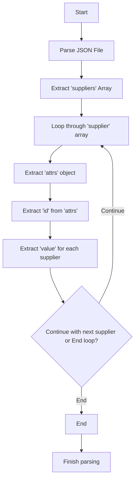

## АНАЛИЗ JSON СХЕМЫ ДЛЯ ПОСТАВЩИКОВ (suppliers)

### 1. <алгоритм>

**Описание:**

Данный JSON представляет собой структуру данных, описывающую поставщиков (suppliers) для системы, вероятно, для e-commerce платформы PrestaShop. Структура позволяет получить список поставщиков по их ID.
 
**Пошаговая блок-схема:**

1.  **Начало**: JSON-объект `suppliers` является корневым элементом.
    *   Пример:
        ```json
        {
          "suppliers": {
             ...
           }
        }
        ```
    
2.  **Доступ к списку поставщиков**: Внутри `suppliers` находится массив `supplier`.
    *   Пример:
        ```json
           "suppliers": {
             "supplier": [
               ...
             ]
           }
        ```
3.  **Итерация по каждому поставщику**: Каждый элемент массива `supplier` представляет отдельного поставщика.
    *   Пример:
        ```json
           "supplier": [
                {
                  "attrs": {
                     "id": "1"
                  },
                  "value": ""
                },
                ...
            ]
        ```
4.  **Извлечение ID поставщика**: У каждого поставщика есть объект `attrs`, содержащий атрибуты, включая `id`.
    *   Пример:
         ```json
             "attrs": {
                 "id": "1"
              }
         ```
5.  **Значение поставщика**: Каждый поставщик имеет поле `value`. В данном случае оно пустое (`""`), что предполагает, что основная информация о поставщике хранится в другом месте и запрашивается по ID.
    *   Пример:
         ```json
                "value": ""
         ```
6.  **Конец итерации**: Переход к следующему поставщику в массиве `supplier` или завершение обработки.
 
**Пример Потока Данных:**
 
1.  JSON-файл парсится (например, при помощи библиотеки `json`).
2.  Извлекается корневой объект `suppliers`.
3.  Перебирается массив `supplier`.
4.  Для каждого элемента из `supplier` извлекается `id` из объекта `attrs` для идентификации поставщика.
5.  Извлекается `value`, которое в этом случае пустое и вероятно используется для других целей.

### 2. <mermaid>


**Описание Mermaid диаграммы:**
 
Диаграмма отображает поток данных и этапы обработки JSON файла с поставщиками.
 
*   `Start`: Начало процесса.
*   `ParseJSON`: Этап парсинга JSON файла.
*   `ExtractSuppliers`: Извлечение массива поставщиков `suppliers` из JSON.
*   `LoopThroughSuppliers`: Цикл для перебора каждого элемента поставщика в массиве `supplier`.
*   `ExtractSupplierAttributes`: Извлечение объекта `attrs`, содержащего атрибуты поставщика.
*   `ExtractSupplierID`: Извлечение идентификатора (`id`) поставщика из объекта `attrs`.
*   `ExtractSupplierValue`: Извлечение значения `value` (в данном случае, пустого) для каждого поставщика.
*   `ContinueLoopOrEnd`: Условный блок, который проверяет, нужно ли продолжить итерацию по поставщикам или закончить.
*   `End`: Конец цикла обработки поставщиков.
*   `Finish`: Завершение процесса парсинга и обработки данных.

**Зависимости:**

Диаграмма не зависит от других модулей или файлов. Она описывает логический поток обработки JSON-данных, который может быть реализован в любом языке программирования.

### 3. <объяснение>

**Импорты:**
В данном коде нет импортов. Это JSON файл, и он не требует импортов как в Python или других языках программирования. Однако, при его использовании в коде (например, на Python), необходимо будет импортировать модуль `json` для его обработки.
 
**Классы:**
Данный код не определяет классы. Это JSON структура данных. Классы могут быть созданы в программах, использующих эти данные, но их описание в файле отсутствует.

**Функции:**
В данном файле нет функций. Однако, при использовании этих данных в программном коде, возможно, понадобятся следующие функции:
*   **`load_json(file_path)`**: Функция для загрузки данных из JSON-файла. Она примет путь к JSON файлу и вернет загруженные данные в виде словаря или объекта.
*   **`get_suppliers(data)`**: Функция, извлекающая список поставщиков из загруженных данных. Она может принимать данные и возвращать массив объектов-поставщиков.
*   **`get_supplier_by_id(data, supplier_id)`**: Функция для получения информации о конкретном поставщике по его ID. Эта функция принимает загруженные данные и ID поставщика и возвращает объект-поставщика.
 
**Примеры функций (на Python):**

```python
import json

def load_json(file_path):
    with open(file_path, 'r') as file:
        data = json.load(file)
    return data

def get_suppliers(data):
  return data.get("suppliers", {}).get("supplier", [])

def get_supplier_by_id(data, supplier_id):
    suppliers = get_suppliers(data)
    for supplier in suppliers:
        if supplier["attrs"]["id"] == str(supplier_id):
            return supplier
    return None

# Пример использования
file_path = "hypotez/src/endpoints/prestashop/api_schemas/api_suppliers_schema.json"
json_data = load_json(file_path)
all_suppliers = get_suppliers(json_data)
print(f"Все поставщики: {all_suppliers}")
supplier1 = get_supplier_by_id(json_data, 1)
print(f"Информация о поставщике с ID 1: {supplier1}")
```
 
**Переменные:**
*   `suppliers`: Объект верхнего уровня, содержащий массив поставщиков.
*   `supplier`: Массив объектов, представляющих поставщиков.
*   `attrs`: Объект, содержащий атрибуты поставщика (в данном случае, только id).
*   `id`: Строка, представляющая идентификатор поставщика.
*   `value`: Строка, представляющая значение поставщика. В данном случае пустая.

**Потенциальные ошибки и области для улучшения:**
*   **Отсутствие информации о поставщике**:  `value` в данном случае является пустой строкой. Вероятно, что информация о поставщике хранится в другом месте и получается по ID. Необходимо убедиться, что система может извлекать дополнительные данные по ID поставщика.
*   **Обработка ошибок**: В коде, использующем эту структуру, необходима обработка ошибок, например, если поставщик с указанным ID не найден или данные имеют неверный формат.
*  **Валидация данных**: Нужно предусмотреть валидацию данных, например, чтобы `id` был уникальным, а `value` соответствовало ожидаемому формату.

**Взаимосвязи с другими частями проекта:**
Данный JSON файл используется для описания структуры данных, используемых для работы с поставщиками в e-commerce платформе PrestaShop. Он может быть связан с:
*   **API**:  Этот файл может использоваться как схема данных для API, предоставляющего информацию о поставщиках.
*   **База данных**:  ID поставщиков, полученные из этого файла, могут использоваться для запросов к базе данных для получения дополнительной информации о поставщиках.
*   **Интерфейс пользователя**: Данные могут использоваться для отображения списка поставщиков в административном интерфейсе или для выбора поставщиков при управлении заказами или товарами.

Этот анализ предоставляет полное понимание структуры и использования JSON файла, описывающего поставщиков, с указанием его роли, возможных ошибок и взаимосвязей с другими компонентами проекта.