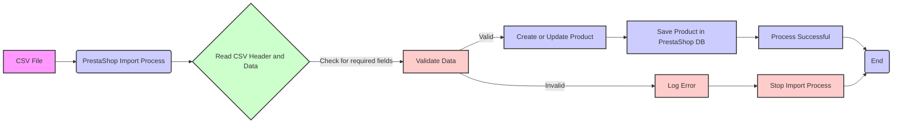

## <алгоритм>

1.  **Начало:** Представлен JSON-объект, описывающий схему CSV-файла для импорта продуктов в PrestaShop.
2.  **Структура:** JSON-объект представляет собой словарь, где ключи - это названия столбцов в CSV-файле, а значения - это ожидаемые типы данных или примеры значений для этих столбцов.
3.  **Анализ полей:**
    *   **Идентификационные поля:** `"ID"`, `"reference #"`, `"Supplier reference #"`, `"EAN13"`, `"UPC"`, `"MPN"` - поля для идентификации продукта. Пример: `"ID": null`, `"reference #": "REF123"`.
    *   **Основные поля:** `"Name*"`, `"Categories (x,y,z...)"`, `"Price tax excluded"`, `"Price tax included"`, `"Tax rule ID"`, `"Cost price"`, `"Supplier"`, `"Brand"` - основные характеристики товара. Пример: `"Name*": "Product Name"`, `"Categories (x,y,z...)": "2,3,4,"`, `"Price tax excluded": 100.00`.
    *   **Скидки и акции:** `"On sale (0/1)"`, `"Discount amount"`, `"Discount percent"`, `"Discount from (yyyy-mm-dd)"`, `"Discount to (yyyy-mm-dd)"` - информация о скидках. Пример: `"On sale (0/1)": 1`, `"Discount amount": 10.00`.
    *   **Размеры и вес:** `"Width"`, `"Height"`, `"Depth"`, `"Weight"` - физические параметры товара. Пример: `"Width": 10.00`, `"Weight": 0.5`.
    *   **Доставка:** `"Delivery time of in-stock products:"`, `"Delivery time of out-of-stock products with allowed orders:"` - информация о времени доставки.
    *   **Запасы:** `"Quantity"`, `"Minimal quantity"`, `"Low stock level"`, `"Send me an email when the quantity is under this level"` - информация о запасах. Пример: `"Quantity": 100`, `"Low stock level": 10`.
    *   **Видимость и цены:** `"Visibility"`, `"Additional shipping cost"`, `"Unit for base price"`, `"Base price"`, `"Show price (0 = No, 1 = Yes)"` - параметры отображения товара и цены.
    *   **Описание:** `"Summary"`, `"Description"`, `"Tags (x,y,z...)"`, `"Meta title"`, `"Meta keywords"`, `"Meta description"`, `"Rewritten URL"` - поля для описания и SEO оптимизации.
    *   **Наличие:** `"Label when in stock"`, `"Label when backorder allowed"`, `"Available for order (0 = No, 1 = Yes)"`, `"Product availability date"`, `"Product creation date"` - информация о наличии и датах.
    *    **Изображения:** `"additional_images_urls"`, `"additional_images_alts"`, `"Delete existing images (0 = No, 1 = Yes)"` -  параметры для дополнительных изображений
    *    **Особенности:** `"Feature (Name:Value:Position:Customized)"` - параметры для особенностей товара
    *   **Другие:** `"Available online only (0 = No, 1 = Yes)"`, `"Condition"`, `"Customizable (0 = No, 1 = Yes)"`, `"Uploadable files (0 = No, 1 = Yes)"`, `"Text fields (0 = No, 1 = Yes)"`, `"Action when out of stock"`, `"Virtual product (0 = No, 1 = Yes)"`, `"File URL"`, `"Number of allowed downloads"`, `"Expiration date (yyyy-mm-dd)"`, `"Number of days"`, `"ID / Name of shop"`, `"Advanced Stock Management"`, `"Depends on stock"`, `"Warehouse"`, `"Accessories (x,y,z...)"`, `"affiliate short link"`, `"affiliate text"`, `"affiliate summary"`, `"affiliate summary 2"`, `"Open AI Product Description"`, `"Byer protection"`, `"Specification"`, `"Refirbished product description"`, `"Additional shipping details"`, `"Product features"`, `"Additional product info"` - дополнительные параметры товара.
4.  **Завершение:** JSON-объект определяет структуру CSV файла для импорта продуктов в PrestaShop. Он описывает поля, которые могут быть заполнены при импорте, а также примеры значений для некоторых полей.

## <mermaid>

**Объяснение зависимостей `mermaid`:**

В данной диаграмме `mermaid`  представлен поток данных при импорте CSV файла в PrestaShop. 

*   **`CSV File` (A)**: Начальная точка - CSV файл, который содержит данные о продуктах.
*   **`PrestaShop Import Process` (B)**: Общий процесс импорта, который обрабатывает CSV файл.
*   **`Read CSV Header and Data` (C)**: Этап, на котором происходит чтение заголовков и данных из CSV файла.
*   **`Validate Data` (D)**: Проверка данных на соответствие заданным правилам и требованиям PrestaShop.
*   **`Create or Update Product` (E)**: Создание нового продукта или обновление существующего в базе данных.
*  **`Log Error` (F)**: Запись информации об ошибках, если данные не прошли валидацию.
*   **`Save Product in PrestaShop DB` (G)**: Сохранение продукта в базе данных PrestaShop.
*  **`Stop Import Process` (H)**: Завершение процесса импорта в случае ошибок.
*   **`Process Successful` (I)**: Уведомление об успешном завершении импорта.
*   **`End` (J)**: Конечная точка процесса.

Диаграмма показывает, как CSV файл с данными о продуктах обрабатывается, валидируется и сохраняется в системе PrestaShop, а также описывает поток управления в случае ошибок.

## <объяснение>

**Общее описание:**

Представленный JSON-объект - это схема CSV-файла, используемая для импорта данных о продуктах в PrestaShop. Он описывает поля, которые могут быть включены в CSV-файл, и предоставляет примеры или типы данных для этих полей.

**Импорты:**

В данном коде нет импортов. Это JSON-схема, а не исполняемый код. Она используется как структура данных для определения полей в CSV файле.

**Классы:**

В данном фрагменте кода классы не используются. Это JSON-схема, а не код на Python или другом языке программирования, который бы определял классы.

**Функции:**

В данном фрагменте кода функции не используются. Это JSON-схема, а не код на Python или другом языке программирования, который бы определял функции.

**Переменные:**

*   **`ID`**: Уникальный идентификатор продукта. Может быть числом или строкой, но при импорте обычно присваивается автоматически.
*   **`Active (0/1)`**: Флаг активности продукта (0 - неактивен, 1 - активен).
*   **`Name*`**: Название продукта. Это обязательное поле.
*   **`Categories (x,y,z...)`**: Категории, к которым относится продукт. Представлены идентификаторами категорий через запятую.
*   **`Price tax excluded`**: Цена продукта без учета налога.
*   **`Price tax included`**: Цена продукта с учетом налога.
*   **`Tax rule ID`**: Идентификатор налоговой ставки.
*   **`Cost price`**: Себестоимость продукта.
*   **`On sale (0/1)`**: Флаг того, что продукт продается со скидкой (0 - нет, 1 - да).
*   **`Discount amount`**: Сумма скидки.
*   **`Discount percent`**: Процент скидки.
*   **`Discount from (yyyy-mm-dd)`**: Дата начала действия скидки.
*   **`Discount to (yyyy-mm-dd)`**: Дата окончания действия скидки.
*   **`reference #`**: Артикул продукта.
*   **`Supplier reference #`**: Артикул поставщика.
*   **`Supplier`**: Название поставщика.
*   **`Brand`**: Название бренда.
*   **`EAN13`**: EAN13 штрихкод.
*   **`UPC`**: UPC штрихкод.
*    **`MPN`**: MPN код производителя.
*   **`Ecotax`**: Эко-налог.
*   **`Width`**: Ширина товара.
*   **`Height`**: Высота товара.
*   **`Depth`**: Глубина товара.
*   **`Weight`**: Вес товара.
*   **`Delivery time of in-stock products:`**: Время доставки для товаров в наличии.
*   **`Delivery time of out-of-stock products with allowed orders:`**: Время доставки для товаров под заказ.
*   **`Quantity`**: Количество товара на складе.
*   **`Minimal quantity`**: Минимальное количество для заказа.
*   **`Low stock level`**: Критический уровень остатка товара.
*   **`Send me an email when the quantity is under this level`**: Флаг отправки уведомления о низком остатке.
*   **`Visibility`**: Видимость товара.
*   **`Additional shipping cost`**: Дополнительная стоимость доставки.
*   **`Unit for base price`**: Единица измерения для базовой цены.
*   **`Base price`**: Базовая цена товара.
*    **`Summary`**: Краткое описание.
*    **`Description`**: Полное описание.
*   **`Tags (x,y,z...)`**: Теги продукта через запятую.
*   **`Meta title`**: Мета-заголовок.
*   **`Meta keywords`**: Мета-ключевые слова.
*   **`Meta description`**: Мета-описание.
*   **`Rewritten URL`**: Переписанный URL.
*   **`Label when in stock`**: Текст метки для товара в наличии.
*   **`Label when backorder allowed`**: Текст метки, когда товар можно заказать.
*   **`Available for order (0 = No, 1 = Yes)`**: Флаг доступности для заказа.
*   **`Product availability date`**: Дата доступности товара.
*   **`Product creation date`**: Дата создания товара.
*   **`Show price (0 = No, 1 = Yes)`**: Флаг показа цены.
*    **`additional_images_urls`**: Дополнительные URL изображений
*   **`additional_images_alts`**: Альтернативный текст для дополнительных изображений
*    **`Delete existing images (0 = No, 1 = Yes)`**: Флаг удаления текущих изображений
*   **`Feature (Name:Value:Position:Customized)`**: Характеристика товара
*   **`Available online only (0 = No, 1 = Yes)`**: Флаг доступности только онлайн.
*   **`Condition`**: Состояние товара.
*   **`Customizable (0 = No, 1 = Yes)`**: Флаг возможности кастомизации.
*   **`Uploadable files (0 = No, 1 = Yes)`**: Флаг наличия загружаемых файлов.
*   **`Text fields (0 = No, 1 = Yes)`**: Флаг наличия текстовых полей.
*   **`Action when out of stock`**: Действие при отсутствии товара на складе.
*   **`Virtual product (0 = No, 1 = Yes)`**: Флаг виртуального товара.
*   **`File URL`**: URL файла для виртуального товара.
*   **`Number of allowed downloads`**: Количество разрешенных загрузок.
*   **`Expiration date (yyyy-mm-dd)`**: Дата истечения срока действия.
*   **`Number of days`**: Количество дней.
*   **`ID / Name of shop`**: Идентификатор или название магазина.
*   **`Advanced Stock Management`**: Флаг продвинутого управления запасами.
*   **`Depends on stock`**: Зависит от наличия на складе.
*   **`Warehouse`**: Склад.
*   **`Accessories (x,y,z...)`**: Аксессуары для продукта через запятую.
*   **`affiliate short link`**: Короткая партнерская ссылка.
*    **`affiliate text`**: Партнерский текст
*   **`affiliate summary`**: Партнерское краткое описание
*   **`affiliate summary 2`**: Партнерское краткое описание 2
*   **`Open AI Product Description`**: Описание продукта с помощью Open AI
*   **`Byer protection`**: Защита покупателя
*   **`Specification`**: Спецификация
*   **`Refirbished product description`**: Описание товара после реставрации
*    **`Additional shipping details`**: Дополнительные детали о доставке
*    **`Product features`**: Характеристики продукта
*    **`Additional product info`**: Дополнительная информация о продукте

**Потенциальные ошибки и области для улучшения:**

*   **Отсутствие валидации типов данных**: Схема не определяет конкретные типы данных для каждого поля (например, integer, float, string), что может привести к ошибкам при импорте.
*   **Отсутствие обязательных полей**: В схеме не указаны обязательные поля. Хотя `Name*` помечено звездочкой, в общем случае в схеме лучше формально определять обязательные поля.
*   **Нечеткие значения `null`**:  `null` подразумевает отсутствие значения, но в некоторых случаях требуется передавать определенное значение по умолчанию.
*   **Сложные поля**: Поля, такие как `Categories (x,y,z...)`, `"Feature (Name:Value:Position:Customized)"`, `Accessories (x,y,z...)` могут быть сложными для разбора и должны быть более явно определены в схеме (например, используя массивы/списки объектов).

**Цепочка взаимосвязей с другими частями проекта:**

Этот файл является частью системы импорта продуктов в PrestaShop. Он используется для определения структуры данных, которые могут быть импортированы из CSV-файла. Он связан с модулями или скриптами, которые обрабатывают CSV-файлы, валидируют данные и создают/обновляют продукты в PrestaShop. Связь идет через чтение и использование этой JSON схемы в процессе импорта. В файле `/hypotez/src/endpoints/prestashop/import_products.py` происходит импорт этой схемы для использования при импорте CSV файла.