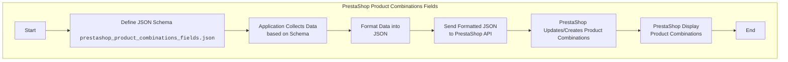

## АНАЛИЗ КОДА

### 1. <алгоритм>

Представленный код — это JSON-объект, который описывает структуру данных для комбинаций товаров в PrestaShop. Этот объект не представляет собой алгоритм в классическом понимании (т.е. последовательности действий), а скорее является *шаблоном данных*. Однако мы можем представить рабочий процесс (алгоритм), где эти данные могут использоваться:

1.  **Определение структуры данных**:
    *   JSON-объект служит для определения полей, необходимых для описания каждой комбинации товара.
    *   Пример: `"Product ID"` обозначает уникальный идентификатор товара.
    
2.  **Импорт данных**: 
    *   Приложение (например, скрипт импорта или пользовательский интерфейс) считывает этот JSON-файл.
    *   Пример: Приложение читает структуру и формирует форму ввода для пользователя.
    
3.  **Сбор данных**: 
    *   Приложение использует структуру данных для сбора информации о каждой комбинации товара.
    *   Пример: Пользователь вводит `Product ID`, атрибуты, цены, количество для каждой комбинации товара, используя форму созданную по шаблону из JSON.
    
4.  **Форматирование данных**: 
    *   Приложение форматирует собранные данные в соответствии со структурой, описанной в JSON-файле.
    *   Пример: Приложение преобразует введенную пользователем информацию в формат JSON, соответствующий схеме `prestashop_product_combinations_fields.json`.
    
5.  **Сохранение данных**: 
    *   Приложение использует отформатированные данные для обновления или создания комбинаций товаров в PrestaShop.
    *   Пример: Приложение отправляет JSON данные на сервер PrestaShop, чтобы создать комбинацию товара.
    
6.  **Использование данных**:
    *   PrestaShop использует сохраненные данные для отображения информации о товарах и их комбинациях на витрине магазина.
    *   Пример: Покупатель видит на витрине варианты товара, которые были добавлены используя схему данных.

**Поток данных**:

JSON-схема -> Приложение -> Сбор данных -> Форматирование данных -> PrestaShop

### 2. <mermaid>

**Анализ зависимостей:**

1.  `DefineSchema`: Определяет JSON-схему `prestashop_product_combinations_fields.json`. Это не импорт, а скорее определение структуры данных.
2.  `CollectData`: Представляет приложение, которое считывает JSON-схему и собирает данные для каждой комбинации. В этом блоке нет никаких импортов, а используется структура JSON.
3.  `FormatData`: Отвечает за форматирование собранных данных в соответствии с определенной JSON-схемой. Здесь нет импорта, а используется ранее прочитанная структура JSON.
4.  `SendToPrestashop`: Отправляет отформатированные данные в PrestaShop API. Данный блок может использовать HTTP-запросы, но не имеет зависимостей от каких-либо модулей.
5.  `UpdateProductCombinations`: Представляет процесс обновления или создания комбинаций продуктов в базе данных PrestaShop. Блок использует API PrestaShop.
6. `DisplayProductCombinations`: Отображение на витрине PrestaShop.

### 3. <объяснение>

**Общая структура:**
Представленный JSON-файл `prestashop_product_combinations_fields.json` определяет структуру данных для описания полей комбинаций товаров в PrestaShop. Это, по сути, схема, которую можно использовать для валидации и обработки данных комбинаций товаров. Он не содержит исполняемого кода, а является метаданными, используемыми приложениями для сбора, форматирования и хранения информации.

**Разбор полей:**

*   **`"Product ID"`**:
    *   **Тип**: Строка (ожидается идентификатор товара).
    *   **Назначение**: Уникальный идентификатор товара, к которому относится комбинация.
    *   **Пример**: `"123"`
*   **`"Attribute (Name:Type:Position)"`**:
    *   **Тип**: Строка.
    *   **Назначение**: Описание атрибута комбинации (например, цвет, размер). Формат подразумевает, что имя, тип и позиция атрибута могут быть указаны.
    *   **Пример**: `"Color:select:1"`
*   **`"Value (Value:Position)"`**:
    *   **Тип**: Строка.
    *   **Назначение**: Значение атрибута комбинации. Также может содержать позицию значения.
    *   **Пример**: `"Red:1"`
*   **`"Supplier reference"`**:
    *   **Тип**: Строка.
    *   **Назначение**: Артикул поставщика для данной комбинации.
    *   **Пример**: `"REF-SUP-123"`
*   **`"reference"`**:
    *   **Тип**: Строка.
    *   **Назначение**: Артикул товара для данной комбинации.
    *   **Пример**: `"REF-COMBO-456"`
*   **`"EAN13"`**:
    *   **Тип**: Строка.
    *   **Назначение**: Штрихкод EAN13 для данной комбинации.
    *   **Пример**: `"3456789012345"`
*   **`"UPC"`**:
    *   **Тип**: Строка.
    *   **Назначение**: Штрихкод UPC для данной комбинации.
    *   **Пример**: `"012345678901"`
*   **`"Wholesale price"`**:
    *   **Тип**: Строка.
    *   **Назначение**: Оптовая цена для данной комбинации.
    *   **Пример**: `"10.50"`
*   **`"Impact on price"`**:
    *   **Тип**: Строка.
    *   **Назначение**: Влияние на розничную цену товара при выборе данной комбинации.
    *   **Пример**: `"+2.00"`, `"-1.00"`
*   **`"Ecotax"`**:
    *   **Тип**: Строка.
    *   **Назначение**: Налог на экологию (экосбор) для данной комбинации.
    *   **Пример**: `"0.10"`
*   **`"Quantity"`**:
    *   **Тип**: Строка.
    *   **Назначение**: Количество единиц товара в наличии для данной комбинации.
    *   **Пример**: `"100"`
*   **`"Minimal quantity"`**:
    *   **Тип**: Строка.
    *   **Назначение**: Минимальное количество товара для заказа.
    *   **Пример**: `"2"`
*   **`"Low stock level"`**:
    *   **Тип**: Строка.
    *   **Назначение**: Порог низкого уровня запасов.
    *   **Пример**: `"10"`
*  **`"Impact on weight"`**:
    *    **Тип**: Строка
    *    **Назначение**: Влияние на вес товара при выборе данной комбинации.
    *    **Пример**: `"0.2"`, `"-0.1"`
*   **`"Default (0/1)"`**:
    *   **Тип**: Строка.
    *   **Назначение**: Указывает, является ли данная комбинация по умолчанию (0 - нет, 1 - да).
    *   **Пример**: `"1"`, `"0"`
*   **`"Combination available date"`**:
    *   **Тип**: Строка.
    *   **Назначение**: Дата, когда комбинация становится доступной для покупки.
    *   **Пример**: `"2024-01-20"`
*  **`"Image position"`**:
    *   **Тип**: Строка
    *    **Назначение**: Позиция изображения для комбинации.
    *   **Пример**: `"1"`
*  **`"Image URLs(x,y,z)"`**:
     *    **Тип**: Строка
     *    **Назначение**: URL-ы изображений для комбинации, разделенные запятыми.
     *    **Пример**: `"url1,url2,url3"`
*  **`"Image Alt Text(x,y,z)"`**:
    *    **Тип**: Строка
    *    **Назначение**: Альтернативный текст для изображений, разделенный запятыми.
    *    **Пример**: `"alt1,alt2,alt3"`
*   **`"shop"`**:
    *   **Тип**: Строка.
    *   **Назначение**: Список ID магазинов, к которым относится комбинация (разделены запятыми).
    *   **Пример**: `"1,2,3"`
*   **`"Advanced Stock Mangment"`**:
     *    **Тип**: Число.
     *    **Назначение**: Указывает на использование расширенного управления запасами (0 - нет, 1 - да).
     *    **Пример**: `0`
*   **`"Depends On Stock"`**:
     *    **Тип**: Число.
     *    **Назначение**: Указывает на зависимость от запасов (0 - нет, 1 - да).
     *    **Пример**: `0`
*   **`"Warehouse"`**:
     *    **Тип**: Число.
     *    **Назначение**: Идентификатор склада для комбинации.
     *    **Пример**: `0`

**Взаимосвязи с другими частями проекта:**

*   Этот файл используется модулями импорта/экспорта или модулями управления товарами PrestaShop для работы с данными.
*   Данные, структурированные согласно этому JSON, могут использоваться для обмена данными через API PrestaShop.
*   Формы пользовательского интерфейса для ввода данных о комбинациях могут быть динамически сгенерированы на основе этой схемы.

**Потенциальные ошибки и области для улучшения:**

*   **Типы данных**: Все значения представлены как строки, что может потребовать преобразований при обработке. Было бы полезно описать типы данных для каждого поля, чтобы избежать проблем.
*   **Формат `Attribute` и `Value`**: Структура этих полей (`Name:Type:Position` и `Value:Position`) является неявной и может вызывать сложности при парсинге. Целесообразно было бы представить их в виде JSON-объектов для более строгой и понятной структуры.
*   **Отсутствие валидации**: Сама схема не накладывает никаких ограничений на данные, что может привести к некорректным данным. Хорошо было бы добавить валидации в приложении, использующем эту схему.

**Заключение:**
Файл `prestashop_product_combinations_fields.json` является важной частью проекта PrestaShop, так как определяет структуру данных для комбинаций товаров. Он служит основой для сбора, форматирования и обработки информации о товарах и их различных вариантах. Улучшение структуры и добавление валидации могло бы сделать этот файл более надежным и простым в использовании.