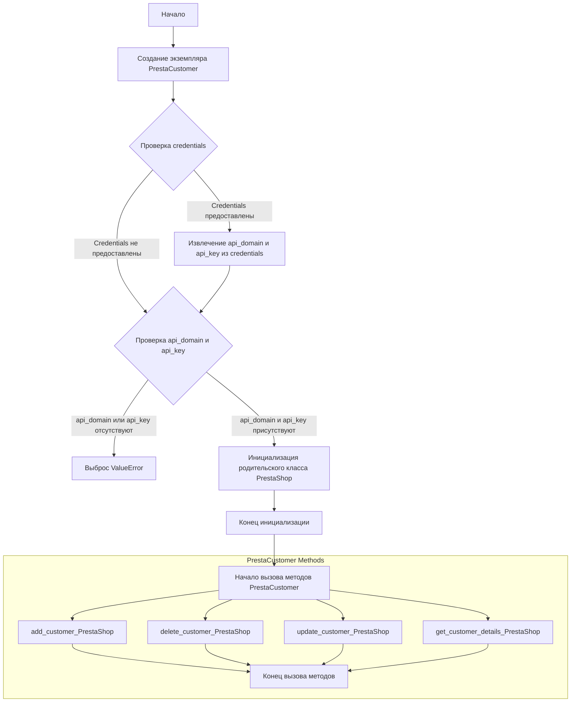
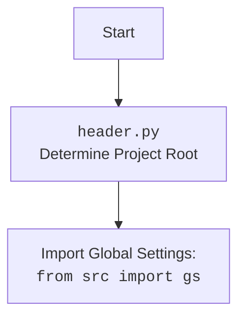

## ИНСТРУКЦИЯ:

Анализируй предоставленный код подробно и объясни его функциональность. Ответ должен включать три раздела:

1.  **<алгоритм>**: Опиши рабочий процесс в виде пошаговой блок-схемы, включая примеры для каждого логического блока, и проиллюстрируй поток данных между функциями, классами или методами.
2.  **<mermaid>**: Напиши код для диаграммы в формате `mermaid`, проанализируй и объясни все зависимости,
    которые импортируются при создании диаграммы.
    **ВАЖНО!** Убедитесь, что все имена переменных, используемые в диаграмме `mermaid`,
    имеют осмысленные и описательные имена. Имена переменных вроде `A`, `B`, `C`, и т.д., не допускаются!

    **Дополнительно**: Если в коде есть импорт `import header`, добавьте блок `mermaid` flowchart, объясняющий `header.py`:
    ```mermaid
    flowchart TD
        Start --> Header[<code>header.py</code><br> Determine Project Root]

        Header --> import[Import Global Settings: <br><code>from src import gs</code>]
    ```

3.  **<объяснение>**: Предоставьте подробные объяснения:
    -   **Импорты**: Их назначение и взаимосвязь с другими пакетами `src.`.
    -   **Классы**: Их роль, атрибуты, методы и взаимодействие с другими компонентами проекта.
    -   **Функции**: Их аргументы, возвращаемые значения, назначение и примеры.
    -   **Переменные**: Их типы и использование.
    -   Выделите потенциальные ошибки или области для улучшения.

Дополнительно, постройте цепочку взаимосвязей с другими частями проекта (если применимо).

Это обеспечивает всесторонний и структурированный анализ кода.
## Формат ответа: `.md` (markdown)
**КОНЕЦ ИНСТРУКЦИИ**

## <алгоритм>

**1. Инициализация `PrestaCustomer`:**

   - **Начало:** Создается экземпляр класса `PrestaCustomer`.
   - **Пример:** `prestacustomer = PrestaCustomer(api_domain='example.com', api_key='your_api_key')`
   - **Аргументы:**
     -   `credentials`: (опционально) Словарь или SimpleNamespace, содержащий `api_domain` и `api_key`.
         -   **Пример:** `credentials = {'api_domain': 'example.com', 'api_key': 'your_api_key'}` или `credentials = SimpleNamespace(api_domain='example.com', api_key='your_api_key')`.
     -   `api_domain`: (опционально) Домен API PrestaShop.
         -   **Пример:** `'example.com'`
     -   `api_key`: (опционально) Ключ API PrestaShop.
        -  **Пример:** `'your_api_key'`
   - **Проверка:**
     -   Если `credentials` предоставлены, `api_domain` и `api_key` берутся из него, иначе используются переданные аргументы.
     -   Если `api_domain` или `api_key` не предоставлены или пусты, вызывается `ValueError`.
   - **Инициализация родительского класса:** Вызывается конструктор родительского класса `PrestaShop` с `api_domain` и `api_key`.

**2. Функциональность `PrestaCustomer`:**

   - **Методы (из документации класса, не реализованы в предоставленном коде):**
       -   `add_customer_PrestaShop`: Добавляет нового клиента.
           - **Пример:** `prestacustomer.add_customer_PrestaShop('John Doe', 'johndoe@example.com')`
       -   `delete_customer_PrestaShop`: Удаляет клиента по ID.
           - **Пример:** `prestacustomer.delete_customer_PrestaShop(3)`
       -   `update_customer_PrestaShop`: Обновляет данные клиента по ID.
           - **Пример:** `prestacustomer.update_customer_PrestaShop(4, 'Updated Customer Name')`
       -   `get_customer_details_PrestaShop`: Получает детали клиента по ID.
           - **Пример:** `print(prestacustomer.get_customer_details_PrestaShop(5))`

**Поток данных:**



## <mermaid>

```mermaid
flowchart TD
    Start[<code>customer.py</code><br> Start]
    Start --> ImportModules[Импорт модулей];
    ImportModules --> PrestaCustomerClass[Определение класса <code>PrestaCustomer</code>];
    PrestaCustomerClass --> Constructor[<code>__init__</code> метод];
     Constructor --> CheckCredentials{Проверка credentials};
    CheckCredentials -- Credentials предоставлены --> ExtractCredentials[Извлечение <code>api_domain</code> и <code>api_key</code> из credentials];
    CheckCredentials -- Credentials не предоставлены --> CheckArgs{Проверка <code>api_domain</code> и <code>api_key</code>};
    ExtractCredentials -->  CheckArgs
    CheckArgs --  <code>api_domain</code> или <code>api_key</code> отсутствуют  --> ValueError[Выброс <code>ValueError</code>];
    CheckArgs -- <code>api_domain</code> и <code>api_key</code> присутствуют --> InitPrestaShop[Инициализация родительского класса <code>PrestaShop</code>];
     InitPrestaShop --> End[Конец <code>__init__</code>]


    subgraph Imports
    ImportModules --> sys[<code>import sys</code>]
    ImportModules --> os[<code>import os</code>]
    ImportModules --> attr[<code>from attr import attr, attrs</code>]
    ImportModules --> pathlib[<code>from pathlib import Path</code>]
    ImportModules --> typing_module[<code>from typing import Union</code>]
    ImportModules --> SimpleNamespace_module[<code>from types import SimpleNamespace</code>]
    ImportModules --> header_module[<code>import header</code>]
    ImportModules --> gs_module[<code>from src import gs</code>]
    ImportModules --> logger_module[<code>from src.logger.logger import logger</code>]
    ImportModules --> jjson_module[<code>from src.utils.jjson import j_loads as j_loads</code>]
    ImportModules --> api_module[<code>from .api import PrestaShop</code>]
      ImportModules --> logger_module2[<code>from src.logger.logger import logger</code>]
       ImportModules --> exception_module[<code>from src.logger.exceptions import PrestaShopException</code>]
        ImportModules --> optional_module[<code>from typing import Optional</code>]
    end

    classDef classFill fill:#f9f,stroke:#333,stroke-width:2px
    PrestaCustomerClass,PrestaShop,
     Constructor,InitPrestaShop class classFill
```



**Объяснение `mermaid`:**

*   **`flowchart TD`**:  Указывает, что это блок-схема, и направление расположения элементов сверху вниз (Top-Down).
*   **`Start[<code>customer.py</code><br> Start]`**: Начальная точка схемы, представляющая начало выполнения кода в `customer.py`.
*   **`ImportModules[Импорт модулей]`**:  Блок, который показывает импорт всех необходимых модулей.
*   **`PrestaCustomerClass[Определение класса PrestaCustomer]`**:  Блок, обозначающий определение класса `PrestaCustomer`.
*   **`Constructor[__init__ метод]`**:  Блок, обозначающий конструктор класса `PrestaCustomer`.
*   **`CheckCredentials{Проверка credentials}`**:  Блок, условная проверка наличия `credentials`.
*   **`ExtractCredentials[Извлечение api_domain и api_key из credentials]`**: Блок, извлекающий данные API из  `credentials`.
*   **`CheckArgs{Проверка api_domain и api_key}`**: Блок проверки наличия `api_domain` и `api_key`.
*   **`ValueError[Выброс ValueError]`**: Блок обозначающий, что ошибка была выброшена.
*    **`InitPrestaShop[Инициализация родительского класса PrestaShop]`**: Блок, инициализирующий родительский класс.
*    **`End[Конец __init__]`**:  Блок, обозначающий конец инициализации класса.
*   **`subgraph Imports`**:  Определяет подграф, содержащий импортированные модули.
*   **`sys`, `os`, `attr`, `pathlib`, `typing_module`, `SimpleNamespace_module`, `header_module`, `gs_module`, `logger_module`, `jjson_module`, `api_module`, `logger_module2`, `exception_module`, `optional_module`**:  Представляют собой импортированные модули, каждый в отдельном блоке.
*    **`classDef classFill`**: Задает стиль для классов `PrestaCustomer`, `PrestaShop`, `Constructor` и `InitPrestaShop`.

## <объяснение>

**Импорты:**

*   `import sys`: Модуль для доступа к некоторым переменным и функциям, используемым интерпретатором Python.
*   `import os`: Модуль для взаимодействия с операционной системой, например, для работы с файловой системой.
*   `from attr import attr, attrs`: Модуль `attr` для создания классов с автоматически сгенерированными методами, такими как `__init__`, `__repr__` и т.д., что помогает уменьшить количество boilerplate кода.
*   `from pathlib import Path`: Модуль `pathlib` для работы с путями в файловой системе в объектно-ориентированном стиле.
*   `from typing import Union`: Модуль `typing` для аннотации типов, позволяющий указывать, что переменная может быть одного из нескольких типов.
*   `from types import SimpleNamespace`: Модуль `types` для создания простых объектов с произвольными атрибутами, что удобно для хранения конфигурационных данных.
*   `import header`:  Импортирует пользовательский модуль `header` из проекта, который, вероятно, используется для настройки среды и путей проекта (см. блок `mermaid` для `header.py`).
*   `from src import gs`: Импортирует глобальные настройки `gs` из пакета `src`.
*   `from src.logger.logger import logger`: Импортирует объект `logger` из модуля `src.logger.logger` для логирования событий.
*   `from src.utils.jjson import j_loads as j_loads`: Импортирует функцию `j_loads` из модуля `src.utils.jjson` для загрузки JSON данных (с возможной обработкой).
*   `from .api import PrestaShop`: Импортирует класс `PrestaShop` из модуля `api`, который находится в том же пакете (относительный импорт).
*   `from src.logger.exceptions import PrestaShopException`: Импортирует пользовательское исключение `PrestaShopException` для специфичных ошибок, связанных с работой PrestaShop API.
*   `from typing import Optional`: Импортирует `Optional` для обозначения аргументов функций, которые могут быть `None`.

**Классы:**

*   `class PrestaCustomer(PrestaShop)`:
    *   **Роль:** Класс `PrestaCustomer` предназначен для работы с клиентами в PrestaShop. Он наследуется от класса `PrestaShop`, который вероятно содержит общую логику взаимодействия с API PrestaShop.
    *   **Атрибуты:** Не определены явно в предоставленном коде, но наследует от `PrestaShop` атрибуты, такие как `api_domain` и `api_key`.
    *   **Методы:**
        *   `__init__(self, credentials: Optional[dict | SimpleNamespace] = None, api_domain: Optional[str] = None, api_key: Optional[str] = None, *args, **kwards)`:
            *   **Назначение:** Конструктор класса, инициализирует экземпляр класса `PrestaCustomer`.
            *   **Аргументы:**
                *   `credentials` (опционально): Словарь или `SimpleNamespace` с `api_domain` и `api_key`.
                *   `api_domain` (опционально): Домен API PrestaShop.
                *   `api_key` (опционально): Ключ API PrestaShop.
                *   `*args`, `**kwargs`: Для передачи дополнительных параметров в родительский класс `PrestaShop`.
            *   **Логика:**
                *   Пытается извлечь `api_domain` и `api_key` из переданного `credentials` если он не `None`.
                *   Если  `api_domain` и `api_key` отсутствуют, выбрасывает `ValueError`
                *   Инициализирует родительский класс `PrestaShop` с `api_domain` и `api_key`.
        *   Другие методы (`add_customer_PrestaShop`, `delete_customer_PrestaShop`, `update_customer_PrestaShop`, `get_customer_details_PrestaShop`):  не реализованы в предоставленном коде, но описаны в документации класса. Эти методы, вероятно, будут использоваться для выполнения соответствующих операций с API PrestaShop для работы с клиентами.
    *   **Взаимодействие:** Класс `PrestaCustomer` взаимодействует с `PrestaShop`, наследуя от него общую функциональность API. Он также использует модуль `src.logger.logger` для логирования и возможно `src.utils.jjson` для обработки JSON данных от API PrestaShop.

**Функции:**
*   `__init__`:
    *   **Аргументы:** описаны выше.
    *   **Возвращаемое значение**: `None`
    *   **Назначение:** Инициализирует атрибуты класса на основе переданных параметров.
    *   **Примеры:**
         *   `PrestaCustomer(api_domain='test.com', api_key='123')`
         *   `PrestaCustomer(credentials={'api_domain':'test.com', 'api_key':'123'})`

**Переменные:**

*   `credentials`: Словарь или `SimpleNamespace`, содержащий учетные данные API (домен и ключ).
*   `api_domain`: Строка, представляющая домен API PrestaShop.
*   `api_key`: Строка, представляющая ключ API PrestaShop.

**Потенциальные ошибки и области для улучшения:**

*   **Отсутствие реализации методов**: Класс `PrestaCustomer` заявлен как класс для работы с клиентами, но фактически не реализует никаких методов для этого, кроме конструктора. Это должно быть дополнено.
*   **Обработка ошибок**: Код выбрасывает `ValueError` если `api_domain` или `api_key` не были переданы, но не обрабатывает другие возможные ошибки, связанные с запросами к API PrestaShop. Необходима более надежная обработка ошибок, особенно в методах взаимодействия с API.
*   **Документация методов**: Документация методов класса есть, но сами методы не реализованы.
*   **Использование `*args`, `**kwargs`**:  Используются для передачи дополнительных параметров в родительский класс, но не описано, какие параметры могут быть переданы. Это делает код менее явным.

**Взаимосвязи с другими частями проекта:**

*   **`src.gs`:** Используется для получения глобальных настроек проекта, что позволяет коду быть более гибким и легко настраиваемым.
*   **`src.logger.logger`:** Используется для логирования, что помогает отслеживать работу кода и выявлять проблемы.
*   **`src.utils.jjson`:** Используется для работы с JSON данными, что позволяет легко обрабатывать данные, возвращаемые API PrestaShop.
*   **`header.py`**:  Используется для определения корневой директории проекта и загрузки глобальных настроек, обеспечивая консистентность среды выполнения.
*  **`src.logger.exceptions`:** Используется для обработки специфических ошибок, связанных с PrestaShop API.

Этот код представляет собой базовую структуру для работы с клиентами в PrestaShop API, но требует дальнейшей разработки и добавления методов для взаимодействия с API.