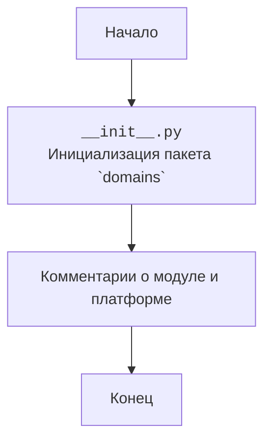

## АНАЛИЗ КОДА: `hypotez/src/endpoints/prestashop/domains/__init__.py`

### <алгоритм>

1.  **Начало:** Файл `__init__.py` является файлом инициализации пакета `src.endpoints.prestashop.domains`. Его основная цель - сделать каталог `domains` пакетом Python, позволяя импортировать модули, находящиеся внутри него.
2.  **Исполнение:** При импорте пакета `src.endpoints.prestashop.domains`, Python интерпретатор выполняет код, находящийся в файле `__init__.py`.
3.  **Действия:** В данном случае, файл `__init__.py` практически пуст, содержит только комментарии и не выполняет никаких действий, кроме как делает директорию `domains` пакетом.
4.  **Завершение:** Файл `__init__.py` завершает свое выполнение.
   
   **Пример:**
    - Когда мы импортируем пакет `src.endpoints.prestashop.domains` (например, `import src.endpoints.prestashop.domains as domains`), Python автоматически выполняет код в файле `__init__.py` (если он есть).

### <mermaid>

**Описание диаграммы:**

-   `Start`: Начало процесса выполнения кода.
-   `InitFile`: Обозначает файл `__init__.py`, который делает директорию `domains` пакетом Python.
-   `CommentBlock`: Блок, представляющий комментарии, которые описывают предназначение модуля и его платформу.
-   `End`: Конец процесса выполнения кода.

**Зависимости:**

В данном коде нет явных импортов, поэтому нет зависимостей от других модулей. Файл `__init__.py` работает как маркер пакета и не требует дополнительных зависимостей.
 

### <объяснение>

**Импорты:**

-   В данном файле нет импортов. Его основная функция - превратить каталог `domains` в пакет.

**Классы:**

-   В данном файле нет классов.

**Функции:**

-   В данном файле нет функций.

**Переменные:**

-   В данном файле нет переменных.

**Объяснение:**

-   Файл `__init__.py` в Python используется для обозначения того, что директория должна рассматриваться как пакет. Это позволяет организовывать модули в иерархическую структуру.
-   В данном случае файл `__init__.py`  в пакете `src.endpoints.prestashop.domains` содержит только комментарии и не содержит исполняемого кода.
-   Он создан, чтобы указать, что директория `domains` является пакетом и может содержать другие подмодули или подпакеты.
-   Это позволяет импортировать модули, находящиеся внутри этой директории, например, `from src.endpoints.prestashop.domains import some_module`.
-   Отсутствие кода в этом файле означает, что при импорте пакета `src.endpoints.prestashop.domains` никаких дополнительных действий не производится.

**Потенциальные ошибки и области для улучшения:**

-   **Отсутствие функционала:** На данный момент файл не выполняет никакой реальной работы кроме того, что делает директорию `domains` пакетом. В будущем, если необходимо выполнять какую-либо инициализацию при импорте пакета, код можно добавить сюда.
-   **Избыточные комментарии:** Большое количество комментариев-заполнителей ("""\n  :platform: Windows, Unix\n  :synopsis:\n""") могут быть убраны для большей читаемости кода, если они не несут смысловой нагрузки.

**Цепочка взаимосвязей:**

-   Файл `__init__.py` является частью структуры пакета `src.endpoints.prestashop.domains`.
-   Он используется при импорте модулей из этого пакета.
-   Файл `__init__.py` позволяет другим частям проекта, например, `src.endpoints.prestashop` импортировать модули из `src.endpoints.prestashop.domains`.