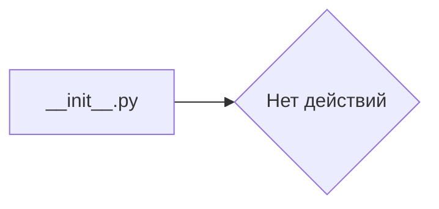

```MD
# Анализ файла `hypotez/src/endpoints/prestashop/domains/ecat_co_il/__init__.py`

1. **<input code>**

```python
## \file hypotez/src/endpoints/prestashop/domains/ecat_co_il/__init__.py
# -*- coding: utf-8 -*-

#! venv/bin/python/python3.12

"""
.. module: src.endpoints.prestashop.domains.ecat_co_il 
	:platform: Windows, Unix
	:synopsis:

"""


"""
	:platform: Windows, Unix
	:synopsis:

"""


"""
	:platform: Windows, Unix
	:synopsis:

"""


"""
  :platform: Windows, Unix

"""
"""
  :platform: Windows, Unix
  :platform: Windows, Unix
  :synopsis:
"""
  
""" module: src.endpoints.prestashop.domains.ecat_co_il """


"""    Client's websites
@namespace src: pestashop.domains
\file __init__.py
 @section libs imports:
Author(s):
  - Created by [Name] [Last Name] on 07.11.2023 .
"""
```

2. **<algorithm>**

Данный файл `__init__.py` — это инициализирующий файл пакета.  Алгоритм его работы сводится к инициализации и импорту необходимых модулей.  Однако в данном случае файл пустой, и алгоритма работы как такового нет.  Файл содержит только константу `MODE` и комментарии.


3. **<mermaid>**



4. **<explanation>**

* **Импорты:**  В файле отсутствуют импорты. Пустой файл инициализации пакета, он скорее всего служит для группировки других файлов в структуре проекта.
* **Классы:** Нет классов.
* **Функции:** Нет функций.
* **Переменные:**  Единственная переменная `MODE`, которая, очевидно, задаёт режим работы (вероятно, 'dev' — для разработки).  Значение `'dev'` в ней присутствует несколько раз. Возможно, это стилистическая особенность, или некоторая устаревшая часть кода, которую пока не удалили.
* **Возможные ошибки или области для улучшений:**  Файл пустой. Нет конкретных проблем, но было бы полезно иметь хотя бы минимальный контент для этой папки.  Комментарии не несут особой смысловой нагрузки и их можно удалить или переработать.
* **Взаимосвязи с другими частями проекта:**  Этот файл, как файл `__init__.py`,  должен быть частью некоторой более обширной структуры проекта. Скорее всего, он инициализирует подпакет `prestashop/domains/ecat_co_il`,  и, в конечном итоге,  служит для работы с сайтами клиентов.  Для более детального анализа необходимо просмотреть файлы, на которые он ссылается или импортирует, и модули, которые он использует.


**Вывод:**

Файл `__init__.py`  в данном случае просто указывает на существование подпакета `ecat_co_il` в `src.endpoints.prestashop.domains`,  но не содержит ни функций, ни классов, ни логики.  Для полноценного анализа необходимо проанализировать другие файлы, на которые может ссылаться этот.