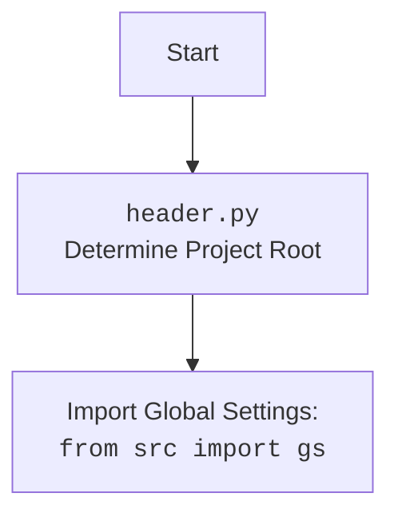

## ИНСТРУКЦИЯ:

Анализируй предоставленный код подробно и объясни его функциональность. Ответ должен включать три раздела:  

1. **<алгоритм>**: Опиши рабочий процесс в виде пошаговой блок-схемы, включая примеры для каждого логического блока, и проиллюстрируй поток данных между функциями, классами или методами.  
2. **<mermaid>**: Напиши код для диаграммы в формате `mermaid`, проанализируй и объясни все зависимости, 
    которые импортируются при создании диаграммы. 
    **ВАЖНО!** Убедитесь, что все имена переменных, используемые в диаграмме `mermaid`, 
    имеют осмысленные и описательные имена. Имена переменных вроде `A`, `B`, `C`, и т.д., не допускаются!  
    
    **Дополнительно**: Если в коде есть импорт `import header`, добавьте блок `mermaid` flowchart, объясняющий `header.py`:
    ```mermaid
    flowchart TD
        Start --> Header[<code>header.py</code><br> Determine Project Root]
    
        Header --> import[Import Global Settings: <br><code>from src import gs</code>] 
    ```

3. **<объяснение>**: Предоставьте подробные объяснения:  
   - **Импорты**: Их назначение и взаимосвязь с другими пакетами `src.`.  
   - **Классы**: Их роль, атрибуты, методы и взаимодействие с другими компонентами проекта.  
   - **Функции**: Их аргументы, возвращаемые значения, назначение и примеры.  
   - **Переменные**: Их типы и использование.  
   - Выделите потенциальные ошибки или области для улучшения.  

Дополнительно, постройте цепочку взаимосвязей с другими частями проекта (если применимо).  

Это обеспечивает всесторонний и структурированный анализ кода.
## Формат ответа: `.md` (markdown)
**КОНЕЦ ИНСТРУКЦИИ**
## <алгоритм>

1.  **`set_project_root(marker_files)`**:
    *   **Начало**: Функция вызывается с набором `marker_files` (по умолчанию `('__root__', '.git')`).
    *   **Инициализация**:
        *   Определяется `current_path` как абсолютный путь к директории, в которой находится файл `header.py`. Например, если `header.py` расположен в `/home/user/project/src/logger`, то `current_path` будет `/home/user/project/src/logger`.
        *   `__root__` инициализируется значением `current_path`.
    *   **Поиск родительских директорий**:
        *   Цикл проходит по текущей директории (`current_path`) и всем её родительским директориям, начиная с текущей.
        *   **Пример 1**: Если `current_path` равен `/home/user/project/src/logger`, то перебираются: `/home/user/project/src/logger`, `/home/user/project/src`, `/home/user/project`, `/home/user`, `/home` и `/`.
        *   Для каждой родительской директории проверяется наличие любого из `marker_files`.
            *   **Пример 2**: Проверяется, существует ли файл или директория `__root__` или `.git` в текущей родительской директории.
        *   Если маркерный файл найден, `__root__` обновляется до этой родительской директории, цикл завершается.
    *   **Добавление в `sys.path`**:
        *   Если `__root__` отсутствует в `sys.path`, оно добавляется в начало списка путей поиска модулей.
    *   **Возврат**: Возвращается `__root__` (тип `Path`).
2.  **Глобальная переменная `__root__`**:
    *   Вызывается `set_project_root()` для определения корневой директории проекта и сохраняется в переменной `__root__`.
3.  **Импорт `from src import gs`**:
    *   Импортируется модуль `gs` (global settings) из пакета `src`, который, предположительно, предоставляет доступ к глобальным настройкам проекта.
4.  **Загрузка `settings.json`**:
    *   Инициализируется переменная `settings` как `None`.
    *   Пытается открыть файл `settings.json`, расположенный в директории `src` относительно корневой директории.
    *   **Пример 3**: Если `__root__` равен `/home/user/project/`, то путь к файлу будет `/home/user/project/src/settings.json`.
    *   Загружает содержимое файла `settings.json` в переменную `settings`, если файл найден и является валидным JSON. Если возникает `FileNotFoundError` или `json.JSONDecodeError`, обработка ошибок пропускается (оставляется `settings = None`).
5.  **Загрузка `README.MD`**:
    *   Инициализируется переменная `doc_str` как `None`.
    *   Пытается открыть файл `README.MD`, расположенный в директории `src` относительно корневой директории.
    *   Загружает содержимое файла `README.MD` в переменную `doc_str`, если файл найден и является текстовым файлом. Если возникает `FileNotFoundError` или `json.JSONDecodeError`, обработка ошибок пропускается (оставляется `doc_str = None`).
6.  **Инициализация глобальных переменных**:
    *   Инициализируются глобальные переменные `__project_name__`, `__version__`, `__doc__`, `__details__`, `__author__`, `__copyright__`, и `__cofee__`.
    *   Если `settings` успешно загружен, то значения переменных берутся из `settings.json`, иначе устанавливаются значения по умолчанию.
        *   **Пример 4**: Если в `settings.json` есть ключ `"project_name"`, то `__project_name__` будет равно его значению, иначе `__project_name__` будет равно `"hypotez"`.
        *  **Пример 5**:  Если `doc_str` успешно загружен из `README.MD`, то `__doc__` будет равно его содержимому, иначе `__doc__` будет равно пустой строке.

## <mermaid>

```mermaid
flowchart TD
    Start[Start] --> FindRoot[<code>set_project_root()</code><br> Find project root]
    FindRoot --> CheckMarkers{Check marker files<br>(<code>__root__</code>, <code>.git</code>)}
    CheckMarkers -- Found --> SetRoot[Set project root <code>__root__</code>]
    CheckMarkers -- Not found --> NextParent[Go to next parent directory]
    NextParent -- Exist --> CheckMarkers
    NextParent -- Not Exist --> SetRoot
    SetRoot --> AddToSysPath{Add <code>__root__</code> to <code>sys.path</code> if not exists}
    AddToSysPath --> ImportGS[Import Global Settings: <br><code>from src import gs</code>]
    ImportGS --> LoadSettings[Try to load <code>settings.json</code>]
    LoadSettings -- Success --> LoadReadme[Try to load <code>README.MD</code>]
    LoadSettings -- Fail --> LoadReadme
    LoadReadme -- Success --> SetVariables[Set global variables from settings <br>and <code>README.MD</code>]
    LoadReadme -- Fail --> SetVariables
    SetVariables --> End[End]
     
    style Start fill:#f9f,stroke:#333,stroke-width:2px
    style End fill:#ccf,stroke:#333,stroke-width:2px

```



## <объяснение>

**Импорты:**

*   `sys`: Используется для работы с системными параметрами, в частности, для модификации `sys.path`, чтобы добавить корневую директорию проекта в пути поиска модулей.
*   `json`: Используется для загрузки настроек из файла `settings.json`.
*   `packaging.version.Version`: Этот импорт не используется в предоставленном коде, и является излишним. Возможно, он был добавлен для дальнейшего использования в проекте.
*   `pathlib.Path`: Используется для работы с путями в файловой системе, обеспечивая кроссплатформенную работу.

**Функции:**

*   `set_project_root(marker_files: tuple = ('__root__', '.git')) -> Path`:
    *   **Аргументы**:
        *   `marker_files` (tuple, optional): Кортеж имен файлов или директорий, которые используются для определения корневой директории. По умолчанию ('`__root__`', '`.git`').
    *   **Возвращаемое значение**:
        *   `Path`: Объект `Path`, представляющий абсолютный путь к корневой директории проекта. Если не найдена корневая директория, возвращает путь к директории, где расположен файл `header.py`.
    *   **Назначение**: Функция определяет корневую директорию проекта путем поиска вверх по дереву директорий, пока не найдется одна из `marker_files`. Это обеспечивает возможность запуска скриптов из любой поддиректории проекта.

**Переменные:**

*   `__root__` (Path): Глобальная переменная, хранящая путь к корневой директории проекта, полученный от `set_project_root()`.
*   `settings` (dict, optional): Словарь, содержащий настройки проекта, загруженные из `settings.json`. Может быть `None`, если файл не найден или не может быть декодирован.
*  `doc_str` (str, optional): Строка, содержащая текст из `README.MD`. Может быть `None`, если файл не найден.
*   `__project_name__` (str): Имя проекта, по умолчанию `'hypotez'`, загружается из `settings.json` если возможно.
*   `__version__` (str): Версия проекта, по умолчанию `''`, загружается из `settings.json` если возможно.
*   `__doc__` (str): Описание проекта, по умолчанию `''`, загружается из `README.MD` если возможно.
*   `__details__` (str):  Детальная информация о проекте, по умолчанию `''` (намеренно остается пустой).
*   `__author__` (str): Автор проекта, по умолчанию `''`, загружается из `settings.json` если возможно.
*   `__copyright__` (str): Информация о копирайте, по умолчанию `''`, загружается из `settings.json` если возможно.
*    `__cofee__` (str):  Сообщение для поощрения разработчика, по умолчанию  "Treat the developer to a cup of coffee for boosting enthusiasm in development: https://boosty.to/hypo69", загружается из `settings.json` если возможно.

**Потенциальные ошибки и улучшения:**

*   **Обработка ошибок:** Обработка ошибок при загрузке `settings.json` и `README.MD` минимальна. Было бы полезно логировать ошибки для отладки.
*    **Избыточный импорт**: Импорт `packaging.version.Version` присутствует, но не используется. Его следует удалить, чтобы снизить зависимость.
*   **Отсутствие явной обработки ошибок `JSONDecodeError`**: Неявно обрабатывается `JSONDecodeError`, однако, было бы полезно вывести сообщение в лог об ошибке.
*   **Сообщение об ошибке**: В случае, если не был найден ни один из marker_files, можно добавить предупреждение или ошибку. Сейчас в таком случае, будет возвращен путь директории файла `header.py`.
*   **Зависимость от `src`**: Код предполагает, что директория `src` находится непосредственно в корне проекта.

**Цепочка взаимосвязей:**

*   **`header.py`** определяет корневую директорию проекта и обеспечивает доступ к глобальным настройкам и метаданным проекта, необходимым для работы всех остальных модулей.
*   `src.gs` (глобальные настройки) предоставляют доступ к путям к файлам, которые используются в `header.py`.
*   `settings.json` содержит настройки, которые используются для инициализации глобальных переменных в `header.py`.
*   `README.MD` содержит информацию о проекте, которая используется для заполнения переменной `__doc__` в `header.py`.

Этот модуль является ключевым для всего проекта, поскольку определяет корневую директорию и глобальные переменные, которые используются повсеместно.