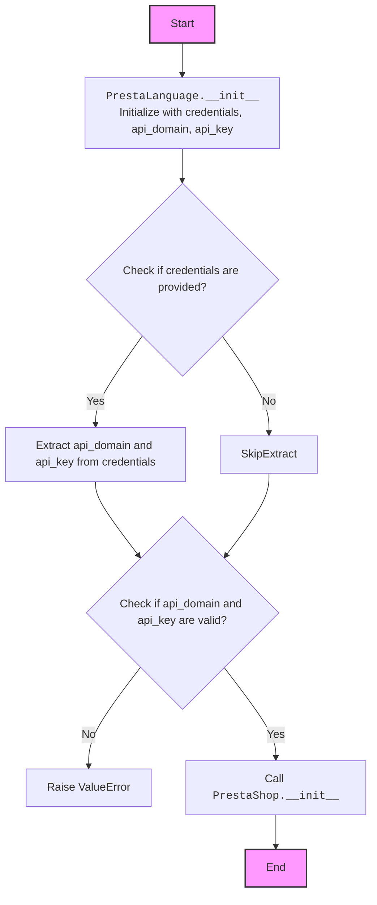
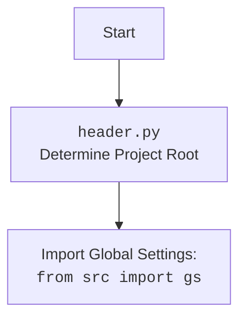

## ИНСТРУКЦИЯ:

Анализируй предоставленный код подробно и объясни его функциональность. Ответ должен включать три раздела:

1.  **<алгоритм>**: Опиши рабочий процесс в виде пошаговой блок-схемы, включая примеры для каждого логического блока, и проиллюстрируй поток данных между функциями, классами или методами.
2.  **<mermaid>**: Напиши код для диаграммы в формате `mermaid`, проанализируй и объясни все зависимости,
    которые импортируются при создании диаграммы.
    **ВАЖНО!** Убедитесь, что все имена переменных, используемые в диаграмме `mermaid`,
    имеют осмысленные и описательные имена. Имена переменных вроде `A`, `B`, `C`, и т.д., не допускаются!

    **Дополнительно**: Если в коде есть импорт `import header`, добавьте блок `mermaid` flowchart, объясняющий `header.py`:
    ```mermaid
    flowchart TD
        Start --> Header[<code>header.py</code><br> Determine Project Root]

        Header --> import[Import Global Settings: <br><code>from src import gs</code>]
    ```

3.  **<объяснение>**: Предоставьте подробные объяснения:
    *   **Импорты**: Их назначение и взаимосвязь с другими пакетами `src.`.
    *   **Классы**: Их роль, атрибуты, методы и взаимодействие с другими компонентами проекта.
    *   **Функции**: Их аргументы, возвращаемые значения, назначение и примеры.
    *   **Переменные**: Их типы и использование.
    *   Выделите потенциальные ошибки или области для улучшения.

Дополнительно, постройте цепочку взаимосвязей с другими частями проекта (если применимо).

Это обеспечивает всесторонний и структурированный анализ кода.
## Формат ответа: `.md` (markdown)
**КОНЕЦ ИНСТРУКЦИИ**
```markdown
## Анализ кода `src/endpoints/prestashop/language.py`

### 1. <алгоритм>

**Блок-схема:**

1.  **Инициализация (`__init__`)**:
    *   На входе получает `credentials` (словарь или `SimpleNamespace`), `api_domain`, `api_key`, `*args` и `**kwards`.
    *   Проверяет, переданы ли `credentials`. Если да, пытается извлечь `api_domain` и `api_key` из `credentials`, если они не заданы напрямую.
    *   Проверяет наличие `api_domain` и `api_key`. Если хотя бы один из них отсутствует, выбрасывает исключение `ValueError`.
        *   **Пример**: `PrestaLanguage(credentials={'api_domain': 'test.com', 'api_key': '123'}, api_domain='override.com')`. В этом случае `api_domain` будет `override.com`.
        *   **Пример**: `PrestaLanguage(api_domain='test.com')` вызовет `ValueError`, так как не задан `api_key`.
    *   Вызывает конструктор родительского класса `PrestaShop` с переданными `api_domain`, `api_key`, `*args` и `**kwards`.
        *   **Пример**: `PrestaLanguage(api_domain='test.com', api_key='123', timeout=60)` передаст `timeout` в конструктор родителя.

2.  **Методы для работы с языками (пока не реализованы, но описаны в docstring):**
    *   `add_language_PrestaShop(language_name, language_iso_code)`: добавляет новый язык.
    *   `delete_language_PrestaShop(language_id)`: удаляет язык по `id`.
    *   `update_language_PrestaShop(language_id, new_language_name)`: обновляет название языка по `id`.
    *   `get_language_details_PrestaShop(language_id)`: получает информацию о языке по `id`.

**Поток данных:**
`PrestaLanguage` -> `__init__` -> проверка аргументов -> вызов `super().__init__` (конструктор `PrestaShop`) -> методы (не реализованы) для работы с языками.

### 2. <mermaid>





**Анализ зависимостей:**

*   **`types`**: Импортируется `SimpleNamespace` для создания объектов с атрибутами, которые можно использовать для передачи параметров.
*   **`.api`**: Импортируется `PrestaShop` - базовый класс для работы с API PrestaShop.  `PrestaLanguage` наследует от него.
*   **`src`**: Импортируется `gs` - глобальные настройки проекта. Используется для доступа к общим настройкам.
*   **`src.utils.printer`**: Импортируется `pprint` - используется для красивого вывода информации.
*   **`header`**: Используется для определения корневой директории проекта и загрузки глобальных настроек.
*   **`src.logger.logger`**: Импортируется `logger` - используется для логирования событий.
*   **`src.logger.exceptions`**: Импортируется `PrestaShopException` - класс исключений для PrestaShop.
*   **`typing`**: Импортируется `Optional` для указания, что аргументы могут быть None.

### 3. <объяснение>

**Импорты:**

*   `from types import SimpleNamespace`: `SimpleNamespace` используется для создания объектов, атрибуты которых можно устанавливать динамически. В данном случае, используется для представления набора параметров (`api_domain`, `api_key`), которые могут быть переданы в `__init__`. Это удобнее, чем использовать словарь.
*   `from .api import PrestaShop`: Импортирует базовый класс `PrestaShop` из модуля `api`, расположенного в том же пакете (`src.endpoints.prestashop`). `PrestaLanguage` является его наследником, что обеспечивает доступ к методам для работы с API PrestaShop.
*   `from src import gs`: Импортирует глобальные настройки приложения из пакета `src`. Это позволяет классу `PrestaLanguage` использовать настройки приложения, такие как, возможно, базовый URL API.
*   `from src.utils.printer import pprint`: Импортирует функцию `pprint` для красивого вывода данных на экран. Используется для отладки.
*   `from .api import PrestaShop`: Повторный импорт `PrestaShop` -  вероятно, это опечатка и импорт можно удалить.
*    `import header`: Импортирует модуль `header` для определения корневой директории проекта.
*    `from src.logger.logger import logger`: Импортирует объект `logger` для логирования информации о работе программы. Это помогает отслеживать ошибки и события.
*   `from src.logger.exceptions import PrestaShopException`: Импортирует класс исключений `PrestaShopException` из модуля `exceptions` для обработки ошибок.
*  `from typing import Optional`: Импортирует `Optional` для явного указания, что некоторые параметры могут быть `None`.

**Классы:**

*   `class PrestaLanguage(PrestaShop)`: Класс для работы с языками магазина PrestaShop. Наследуется от `PrestaShop`, что дает доступ к методам для API PrestaShop.
    *   **Атрибуты:** Не имеет собственных атрибутов, но наследует атрибуты от `PrestaShop`.
    *   **Методы:**
        *   `__init__(self, credentials=None, api_domain=None, api_key=None, *args, **kwards)`: Конструктор класса. Принимает параметры для аутентификации в API PrestaShop (`api_domain`, `api_key`), а также параметры для родительского класса `PrestaShop`(`*args`, `**kwards`).
        *   `add_language_PrestaShop(language_name, language_iso_code)`: (пока не реализован) Метод для добавления языка.
        *   `delete_language_PrestaShop(language_id)`: (пока не реализован) Метод для удаления языка.
        *   `update_language_PrestaShop(language_id, new_language_name)`: (пока не реализован) Метод для обновления имени языка.
        *   `get_language_details_PrestaShop(language_id)`: (пока не реализован) Метод для получения деталей языка.

**Функции:**

*   `__init__`:
    *   **Аргументы:**
        *   `credentials (Optional[dict | SimpleNamespace])`: Словарь или `SimpleNamespace` с параметрами `api_domain` и `api_key`.
        *   `api_domain (Optional[str])`: Домен API.
        *   `api_key (Optional[str])`: Ключ API.
        *   `*args`: Неименованные аргументы.
        *   `**kwards`: Именованные аргументы.
    *   **Возвращаемое значение**: Нет.
    *   **Назначение**: Инициализирует объект `PrestaLanguage`, проверяет наличие параметров `api_domain` и `api_key`, извлекает их из `credentials`, если это необходимо, и вызывает конструктор родительского класса `PrestaShop`.
    *   **Пример:** `PrestaLanguage(api_domain="example.com", api_key="testkey")` или `PrestaLanguage(credentials={'api_domain': "example.com", 'api_key': "testkey"})`
*   Методы `add_language_PrestaShop`, `delete_language_PrestaShop`, `update_language_PrestaShop`, и `get_language_details_PrestaShop` пока не реализованы, но их назначение описано в docstring класса.

**Переменные:**

*   `credentials` : Словарь или `SimpleNamespace`, содержащий учетные данные API.
*   `api_domain`: Домен API PrestaShop.
*   `api_key`: Ключ API PrestaShop.

**Потенциальные ошибки и улучшения:**

*   **Повторный импорт:**  Есть повторный импорт `from .api import PrestaShop`, его нужно удалить.
*   **Не реализованы методы:** Методы для работы с языками не реализованы. Необходимо добавить их реализацию для полноценной функциональности класса.
*  **Обработка ошибок:** Текущая реализация обрабатывает только ошибку отсутствия `api_domain` и `api_key`. Следует рассмотреть добавление более подробной обработки ошибок API и network ошибок.
*  **Валидация:** Стоит добавить валидацию для параметров `api_domain` и `api_key`, чтобы убедиться, что они соответствуют ожидаемому формату.
*   **Логирование:** Необходимо добавить логирование для отслеживания действий класса и потенциальных ошибок.
*   **Документация**: Было бы полезно добавить документацию для методов `add_language_PrestaShop`, `delete_language_PrestaShop`, `update_language_PrestaShop`, и `get_language_details_PrestaShop` как только они будут реализованы.
*   **Передача аргументов в родительский класс:** Убедиться что все необходимые аргументы из `*args` и `**kwards` корректно передаются в родительский класс `PrestaShop`.

**Взаимосвязи с другими частями проекта:**

*   Класс `PrestaLanguage` зависит от класса `PrestaShop`, который, в свою очередь, отвечает за взаимодействие с API PrestaShop.
*   Использует `gs` для получения глобальных настроек, таких как URL API.
*   Использует `printer` для вывода отладочной информации.
*   Использует `header` для определения корневой папки проекта.
*   Использует `logger` для логирования действий и ошибок.
*   Использует `PrestaShopException` для обработки исключений.
*   Этот класс, вероятно, используется другими частями проекта, которые требуют управления языками PrestaShop.
```