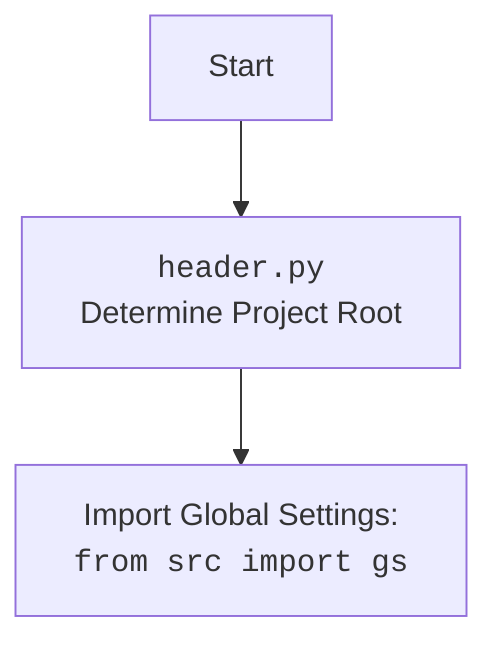

## ИНСТРУКЦИЯ:

Анализируй предоставленный код подробно и объясни его функциональность. Ответ должен включать три раздела:  

1. **<алгоритм>**: Опиши рабочий процесс в виде пошаговой блок-схемы, включая примеры для каждого логического блока, и проиллюстрируй поток данных между функциями, классами или методами.  
2. **<mermaid>**: Напиши код для диаграммы в формате `mermaid`, проанализируй и объясни все зависимости, 
    которые импортируются при создании диаграммы. 
    **ВАЖНО!** Убедитесь, что все имена переменных, используемые в диаграмме `mermaid`, 
    имеют осмысленные и описательные имена. Имена переменных вроде `A`, `B`, `C`, и т.д., не допускаются!  
    
    **Дополнительно**: Если в коде есть импорт `import header`, добавьте блок `mermaid` flowchart, объясняющий `header.py`:\
    ```mermaid
    flowchart TD
        Start --> Header[<code>header.py</code><br> Determine Project Root]
    
        Header --> import[Import Global Settings: <br><code>from src import gs</code>] 
    ```

3. **<объяснение>**: Предоставьте подробные объяснения:  
   - **Импорты**: Их назначение и взаимосвязь с другими пакетами `src.`.  
   - **Классы**: Их роль, атрибуты, методы и взаимодействие с другими компонентами проекта.  
   - **Функции**: Их аргументы, возвращаемые значения, назначение и примеры.  
   - **Переменные**: Их типы и использование.  
   - Выделите потенциальные ошибки или области для улучшения.  

Дополнительно, постройте цепочку взаимосвязей с другими частями проекта (если применимо).  

Это обеспечивает всесторонний и структурированный анализ кода.
## Формат ответа: `.md` (markdown)
**КОНЕЦ ИНСТРУКЦИИ**
```
## <алгоритм>

1.  **Инициализация `PrestaProductAsync`:**
    *   Создается экземпляр класса `PrestaProductAsync`, который наследуется от `PrestaShopAsync`.
    *   При инициализации вызывается конструктор `PrestaShopAsync`, который может выполнять настройку соединения с API PrestaShop.

2.  **Получение родительских категорий (`get_parent_categories`):**
    *   Вызывается метод `get_parent_categories` с `id_category` (например, `3`) и необязательным `dept` (глубина).
    *   Проверяется, является ли `id_category` целым числом. Если нет, выбрасывается `TypeError`.
    *   Вызывается статический метод `Category.get_parents`, передавая `id_category` и `dept` для получения списка родительских категорий.
    *   Возвращается список родительских категорий.

    *Пример:*
    ```python
    parent_categories = await Product.get_parent_categories(id_category=3)
    # Результат: parent_categories = [{'id_category': 2, 'level_depth': 1}, {'id_category': 1, 'level_depth': 0}]
    ```

3.  **Добавление нового продукта (`add_new_product`):**
    *   Вызывается метод `add_new_product` с объектом `ProductFields`, содержащим данные о продукте.
    *   Объект `ProductFields` преобразуется в словарь `f_dict`.
    *   Вызывается асинхронный метод `self.create('products', f_dict)` (метод `create` класса `PrestaShopAsync`) для добавления продукта через API PrestaShop.
    *   Если ответ от API получен:
        *   Извлекается `id` добавленного продукта из ответа.
        *   `id` присваивается атрибуту `id_product` объекта `ProductFields`.
        *   Логируется успешное добавление продукта.
        *   Возвращается объект `ProductFields` с установленным `id_product`.
    *   Если произошла ошибка при разборе ответа от сервера или при добавлении товара:
        *   Логируется ошибка.
        *   Возвращается `None`.

    *Пример:*
    ```python
    product_fields = ProductFields(lang_index = 1, name='Test Product Async', price=19.99, description='This is an asynchronous test product.')
    new_product = await product.add_new_product(product_fields)
    # Если продукт добавлен: new_product.id_product = 123
    # Если ошибка: new_product = None
    ```

4.  **Главная функция `main`:**
    *   Создается экземпляр `Product`.
    *   Создается объект `ProductFields` с данными продукта.
    *   Вызывается метод `get_parent_categories` для получения родительских категорий. Результат выводится в консоль.
    *   Вызывается метод `add_new_product` для добавления продукта.
    *   Если продукт успешно добавлен, выводится `id_product`.
    *   В случае ошибки выводится сообщение об ошибке.
    *   Вызывается метод `fetch_data_async()`

5. **Запуск асинхронного кода:**
     * Вызов `asyncio.run(main())` запускает асинхронную функцию main, выполняя описанные шаги асинхронно.

## <mermaid>

```mermaid
flowchart TD
    Start(Start) --> ProductInit[Create <code>PrestaProductAsync</code> Instance]
    ProductInit --> GetParentCategoriesCall[Call <code>get_parent_categories</code> with id_category]
    GetParentCategoriesCall --> CheckCategoryType{Check if id_category is int?}
    CheckCategoryType -- Yes --> CategoryGetParentsCall[Call <code>Category.get_parents</code>]
    CategoryGetParentsCall --> ReturnParentCategories[Return parent categories list]
    CheckCategoryType -- No --> TypeErrorThrow[Throw TypeError]
    ReturnParentCategories --> AddNewProductCall[Call <code>add_new_product</code> with ProductFields]
    AddNewProductCall --> ConvertProductFields[Convert ProductFields to dict]
     ConvertProductFields --> PrestaShopCreateCall[Call <code>self.create('products', f_dict)</code>]

   PrestaShopCreateCall --> CheckResponse{Response from API received?}
    CheckResponse -- Yes --> ExtractProductId[Extract product id from response]
    ExtractProductId --> SetProductId[Set product id in ProductFields]
     SetProductId --> LogSuccess[Log successfull product add]
    LogSuccess --> ReturnProductFields[Return ProductFields with id]
        CheckResponse -- No --> LogErrorAdd[Log error during product add]
    LogErrorAdd --> ReturnNone[Return None]

   ReturnProductFields --> MainFunction
    ReturnNone --> MainFunction
      ReturnParentCategories --> MainFunction
    TypeErrorThrow --> MainFunction

     MainFunction[Main Execution] --> ExampleUsage[Example usage in main()]
   ExampleUsage --> GetParentCategoriesCall2[Call <code>get_parent_categories</code>]
    GetParentCategoriesCall2 --> LogParentCategories[Log parent categories]
     LogParentCategories --> AddNewProductCall2[Call <code>add_new_product</code>]
    AddNewProductCall2 --> CheckProductAdd{Check if Product Add successful?}
    CheckProductAdd -- Yes --> LogProductId[Log New Product ID]
      CheckProductAdd -- No --> LogProductAddError[Log error add new product]

    LogProductId --> FetchDataAsyncCall[Call <code>fetch_data_async()</code>]
      LogProductAddError --> FetchDataAsyncCall
    FetchDataAsyncCall --> End(End)

  
```


## <объяснение>

**Импорты:**

*   `asyncio`: Используется для асинхронного программирования, позволяя выполнять несколько задач параллельно.
*   `dataclasses`: Используется для создания классов данных (`ProductFields`), которые автоматически генерируют методы, такие как `__init__`, `__repr__`, и т. д.
    *   `dataclass`: Декоратор для автоматического создания классов данных.
    *   `field`: Используется для настройки полей класса данных.
*   `typing`: Используется для статической типизации, что помогает сделать код более понятным и предотвращает ошибки.
    *   `List`, `Dict`, `Any`, `Optional`: Используются для аннотации типов.
*   `header`: Импортирует модуль для определения корневой директории проекта.
*   `src.gs`: Импортирует глобальные настройки проекта.
*   `src.endpoints.prestashop.PrestaShopAsync`: Импортирует базовый класс для работы с API PrestaShop, предоставляющий функциональность для асинхронных запросов.
*   `src.category.Category`: Импортирует класс для работы с категориями.
*    `src.endpoints.prestashop.product_fields.ProductFields`: Импортирует класс данных для хранения информации о продукте.
*   `src.utils.convertors.any.any2dict`: Импортирует функцию для преобразования объекта любого типа в словарь.
*   `src.utils.printer.pprint`:  Импортирует функцию для форматированного вывода данных.
*   `src.logger.logger`: Импортирует модуль для логирования.

**Классы:**

*   `PrestaProductAsync(PrestaShopAsync)`:
    *   **Роль:** Управляет взаимодействием с PrestaShop API для продуктов.
    *   **Атрибуты:** Нет уникальных атрибутов, но он наследует атрибуты от `PrestaShopAsync`, которые могут включать URL API, токен аутентификации и т.д.
    *   **Методы:**
        *   `__init__(self, *args, **kwargs)`: Конструктор, инициализирует родительский класс `PrestaShopAsync`.
        *   `async get_parent_categories(self, id_category: int, dept: int = 0) -> list`: Асинхронный метод для получения списка родительских категорий.
        *   `async add_new_product(self, f: ProductFields) -> ProductFields | None`: Асинхронный метод для добавления нового продукта в PrestaShop.

**Функции:**

*   `async def main()`:
    *   **Аргументы:** Нет.
    *   **Возвращаемое значение:** Нет.
    *   **Назначение:** Основная асинхронная функция для тестирования функциональности класса `PrestaProductAsync`.
    *   **Пример:** Создает экземпляры классов `PrestaProductAsync` и `ProductFields`, вызывает методы для получения родительских категорий и добавления продукта, выводит результаты в консоль.
*   `get_parent_categories(self, id_category: int, dept: int = 0) -> list`
     *   **Аргументы:**
        *   `id_category`: (int) Идентификатор категории.
        *   `dept`: (int, optional) Глубина поиска, по умолчанию 0.
     *    **Возвращаемое значение:** `list` - список родительских категорий.
     *    **Назначение:** Получает список родительских категорий.
    *   **Пример:**
        ```python
        parent_categories = await Product.get_parent_categories(id_category=3)
        ```
*  `add_new_product(self, f: ProductFields) -> ProductFields | None`
     *   **Аргументы:**
        *   `f`: (`ProductFields`) Объект, содержащий информацию о продукте.
     *    **Возвращаемое значение:** `ProductFields | None` - Возвращает `ProductFields` с `id_product` или `None`, если произошла ошибка.
     *    **Назначение:** Добавляет новый продукт в PrestaShop.
    *   **Пример:**
        ```python
        new_product = await product.add_new_product(product_fields)
        ```

**Переменные:**

*   `f_dict`: (dict) Словарь, созданный из объекта `ProductFields`.
*   `response`: (dict) Ответ от API PrestaShop.
*   `product`: (PrestaProductAsync) Экземпляр класса `PrestaProductAsync`.
*   `product_fields`: (ProductFields) Экземпляр класса `ProductFields`, содержащий данные о продукте.
*   `parent_categories`: (list) Список родительских категорий, возвращенный из `get_parent_categories`.
*   `new_product`: (ProductFields | None) Результат вызова `add_new_product`, либо экземпляр `ProductFields` с `id_product`, либо `None` в случае ошибки.

**Потенциальные ошибки и области для улучшения:**

*   **Обработка ошибок:** Код обрабатывает ошибки при разборе ответа от сервера и добавлении товара, но можно добавить более детальную обработку ошибок, например, проверку статуса ответа API.
*   **Валидация данных:** Не хватает валидации входящих данных в методе `add_new_product` для обеспечения корректности полей перед отправкой запроса к API.
*   **Использование `any2dict`:** Преобразование `ProductFields` в словарь с помощью `any2dict` выглядит избыточным. Можно рассмотреть возможность добавления метода `to_dict()` непосредственно в `ProductFields`.
*   **Логирование:** Уровень логирования и сообщения могут быть улучшены для более информативной отладки.
*   **Управление исключениями:** В блоке `try` в функции `add_new_product`, перехватываются `KeyError` и `TypeError`, но можно добавить общую обработку `Exception` для более надежной обработки непредвиденных ошибок.
*   **Отсутствует `fetch_data_async()`**: Метод `fetch_data_async()` не определён в данном классе, но вызывается в `main`. Необходимо либо его реализовать, либо удалить вызов.

**Взаимосвязи с другими частями проекта:**

*   **`src.endpoints.prestashop.PrestaShopAsync`:** `PrestaProductAsync` наследуется от `PrestaShopAsync`, получая методы для работы с API PrestaShop.
*   **`src.category.Category`:** `PrestaProductAsync` использует статический метод `get_parents` из `Category` для получения родительских категорий.
*   **`src.endpoints.prestashop.product_fields.ProductFields`:** `PrestaProductAsync` использует `ProductFields` для хранения и передачи информации о продукте.
*   **`src.utils.convertors.any.any2dict`:** `PrestaProductAsync` использует `any2dict` для преобразования объекта `ProductFields` в словарь перед отправкой данных в API.
*   **`src.logger.logger`:** `PrestaProductAsync` использует для логирования операций добавления и ошибок.
*   **`src.gs`:**  `PrestaProductAsync` может использовать глобальные настройки через `src.gs`, например, для URL PrestaShop API.
*   **`header`:** Используется для определения корневой директории проекта, что может быть важно для загрузки конфигураций и т.д.

В целом, код предоставляет базовую функциональность для работы с продуктами в PrestaShop через API. Он включает в себя асинхронные операции для неблокирующей работы.