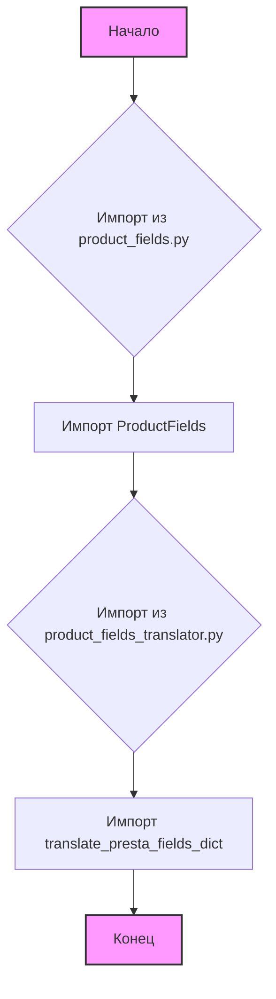
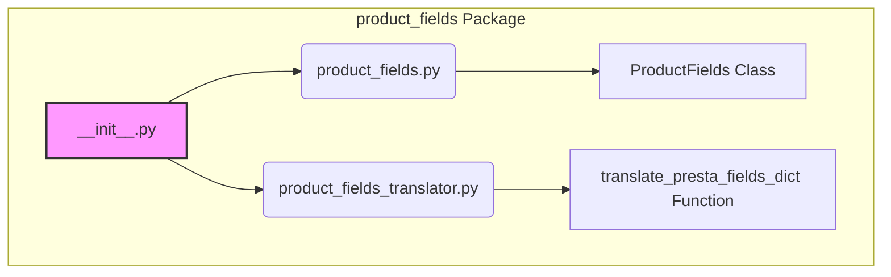

## АНАЛИЗ КОДА: `hypotez/src/endpoints/prestashop/product_fields/__init__.py`

### 1. <алгоритм>

**Описание:**
Модуль `__init__.py` в директории `src/endpoints/prestashop/product_fields` служит для инициализации пакета `product_fields`.  Он импортирует два модуля: `product_fields.py` и `product_fields_translator.py`, делая их содержимое доступным через текущий пакет.

**Блок-схема:**


**Примеры:**

*   **Импорт `ProductFields`:**
    Из файла `product_fields.py` импортируется класс `ProductFields`, который, вероятно, отвечает за управление полями товара. Это может включать в себя методы для получения, изменения или валидации полей товара.
    
    ```python
    from .product_fields import ProductFields 
    # Теперь можно создавать экземпляры класса ProductFields:
    # product_fields_instance = ProductFields()
    ```

*   **Импорт `translate_presta_fields_dict`:**
    Из файла `product_fields_translator.py` импортируется функция `translate_presta_fields_dict`. Скорее всего, эта функция занимается преобразованием словарей полей PrestaShop. Например, она может преобразовывать имена полей или их структуру.

    ```python
    from .product_fields_translator import translate_presta_fields_dict
    # Теперь можно вызывать функцию translate_presta_fields_dict:
    # translated_dict = translate_presta_fields_dict(some_dict)
    ```

### 2. <mermaid>



**Объяснение диаграммы:**

*   `product_fields Package`: Обозначает пакет, в котором находится модуль `__init__.py`.
*   `__init__.py`: Представляет текущий файл, который инициализирует пакет `product_fields`.
*   `product_fields.py`:  Файл, содержащий класс `ProductFields`.
*   `product_fields_translator.py`: Файл, содержащий функцию `translate_presta_fields_dict`.
*   `ProductFields Class`: Класс, который, вероятно, отвечает за управление полями товара.
*   `translate_presta_fields_dict Function`: Функция, которая, вероятно, занимается преобразованием словарей полей PrestaShop.

**Зависимости:**

*   `__init__.py` импортирует `product_fields.py` и `product_fields_translator.py`, делая их содержимое доступным внутри пакета.
*   Класс `ProductFields` и функция `translate_presta_fields_dict` доступны для использования в других модулях, импортирующих пакет `product_fields`.

### 3. <объяснение>

**Импорты:**

*   `from .product_fields import ProductFields`: Импортирует класс `ProductFields` из модуля `product_fields.py`. Точка (`.`) означает, что импорт осуществляется из текущей директории (пакета). Этот класс, скорее всего, предназначен для обработки полей товара, например, для получения списка полей, добавления новых или проверки их корректности.
*   `from .product_fields_translator import translate_presta_fields_dict`: Импортирует функцию `translate_presta_fields_dict` из модуля `product_fields_translator.py`. Эта функция, вероятно, используется для преобразования словарей полей, которые соответствуют формату PrestaShop, в другой формат, более удобный для использования в приложении.

**Взаимосвязь с другими пакетами `src`:**

Этот пакет, вероятно, является частью более крупной системы, работающей с PrestaShop. Он входит в состав `src/endpoints/prestashop`, что говорит о его связи с API PrestaShop. Логично предположить, что `ProductFields` и `translate_presta_fields_dict` будут использоваться в других частях проекта, которые взаимодействуют с PrestaShop для обработки данных о товарах.

**Классы:**

*   `ProductFields`:  Этот класс (хотя и не описан в предоставленном коде) скорее всего имеет методы для работы с полями товаров PrestaShop. Атрибуты могли бы включать словарь со всеми полями товара или конфигурации для их валидации. Методы могли бы предоставлять интерфейсы для получения, добавления или обновления полей товара.

**Функции:**

*   `translate_presta_fields_dict`: Эта функция, вероятно, принимает на вход словарь в формате PrestaShop и преобразует его в другой формат. Возвращает преобразованный словарь.

**Переменные:**
В данном коде нет явных переменных, только импорты, которые делают доступными классы и функции.

**Потенциальные ошибки и области для улучшения:**

*   Отсутствует документация: Для `ProductFields` и `translate_presta_fields_dict` желательно иметь docstring, которые поясняют их использование и назначение.
*   Обработка ошибок: В коде импортов нет обработки исключений. Если файл `product_fields.py` или `product_fields_translator.py` отсутствует, возникнет ошибка `ImportError`.
*   Более подробное описание: Необходимо описание структуры классов и функций, а не только импорты.
*   Тестирование: Не представлены тесты, которые бы гарантировали корректную работу `ProductFields` и `translate_presta_fields_dict`.

**Цепочка взаимосвязей:**

Этот модуль является частью более широкой системы, возможно, системы синхронизации данных между PrestaShop и другим приложением. Вот как это может выглядеть:

1.  **`src/endpoints/prestashop/products.py`**:
     Модуль может запрашивать данные о товарах из PrestaShop API.

2.  **`src/endpoints/prestashop/product_fields/__init__.py`**:
     Этот модуль предоставляет `ProductFields` и `translate_presta_fields_dict` для обработки полей товара.

3.  **`src/product/product_fields/product_fields.py`**:
     `ProductFields` класс управляет списком полей и предоставляет методы для их валидации и манипуляций.

4. **`src/product/product_fields/product_fields_translator.py`**:
   `translate_presta_fields_dict` преобразует словари полей PrestaShop в другой формат.

5. **Другие модули `src`**:
    Другие модули могут использовать преобразованные словари для отображения данных в интерфейсе пользователя, сохранения в базу данных или других манипуляций.

В целом, `__init__.py` является важным файлом для организации кода в пакете `product_fields`. Он обеспечивает удобный доступ к основным компонентам пакета из других модулей проекта.