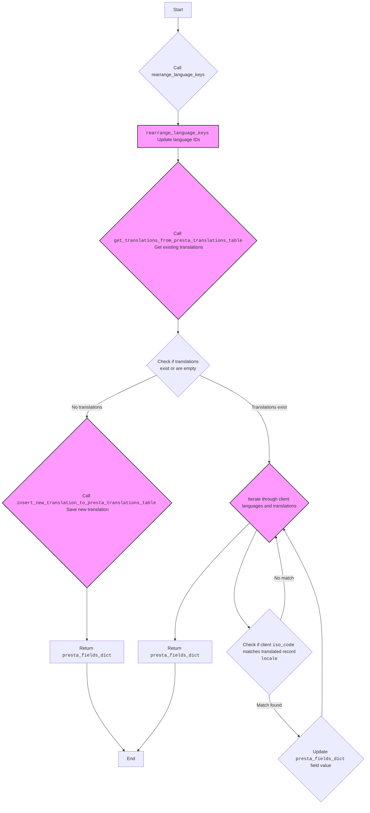

## <алгоритм>

1.  **`rearrange_language_keys(presta_fields_dict, client_langs_schema, page_lang)`:**
    *   **Вход:**
        *   `presta_fields_dict`: Словарь, представляющий поля продукта, включая мультиязычные поля.
        *   `client_langs_schema`: Список или словарь, содержащий информацию о языках клиента, включая `id`, `locale`, `iso_code` и `language_code`.
        *   `page_lang`: Язык текущей страницы (например, 'en-US', 'ru-RU').
    *   **Логика:**
        1.  Итерируется по `client_langs_schema` для поиска записи языка, соответствующего `page_lang` (сравнение по `locale`, `iso_code` или `language_code`).
        2.  Если соответствие найдено, извлекается `client_lang_id`.
        3.  Итерируется по значениям `presta_fields_dict`. Если значение является словарем и содержит ключ `language`, то итерируемся по списку `language` и обновляем `id` в `attrs` каждого элемента.
    *   **Выход:** Обновленный `presta_fields_dict` с измененными ID языка.
    *   **Пример:**
        ```python
        presta_fields_dict = {
            "name": {"language": [{"attrs": {"id": "1"}, "value": "Product Name"}]}
        }
        client_langs_schema = [
            {"id": 1, "locale": "en-US", "iso_code": "en", "language_code": "en-us"},
            {"id": 2, "locale": "ru-RU", "iso_code": "ru", "language_code": "ru-ru"}
        ]
        page_lang = "ru-RU"
        # После вызова функции presta_fields_dict будет
        # {"name": {"language": [{"attrs": {"id": "2"}, "value": "Product Name"}]}}
        ```

2.  **`translate_presta_fields_dict(presta_fields_dict, client_langs_schema, page_lang)`:**
    *   **Вход:**
        *   `presta_fields_dict`: Словарь полей товара.
        *   `client_langs_schema`: Схема языков клиента.
        *   `page_lang`: Язык страницы (необязательный параметр).
    *   **Логика:**
        1.  Вызывает `rearrange_language_keys` для изменения идентификаторов языков.
        2.  Получает существующие переводы из таблицы `presta_translations_table` по `reference` из `presta_fields_dict`.
        3.  Если переводов нет, сохраняет текущие значения `presta_fields_dict` как новый перевод в таблицу `presta_translations_table`.
        4.  Если переводы есть, итерируется по языкам клиента (`client_langs_schema`) и существующим переводам.
        5.  Если `iso_code` языка клиента совпадает с `locale` перевода, обновляет значения полей в `presta_fields_dict` на основе данных перевода.
    *   **Выход:** `presta_fields_dict` с переведенными полями.
    *   **Пример:**
        ```python
        presta_fields_dict = {
            "reference": "product123",
            "name": {"language": [{"attrs": {"id": "1"}, "value": "Product Name"}]}
        }
        client_langs_schema = [
             {"id": 1, "locale": "en-US", "iso_code": "en", "language_code": "en-us"},
             {"id": 2, "locale": "ru-RU", "iso_code": "ru", "language_code": "ru-ru"}
        ]
        page_lang = "en-US"

        # Зависит от данных в таблице переводов
        # Если для продукта 'product123' есть перевод на русский, то
        # "name": {"language": [{"attrs": {"id": "2"}, "value": "Название Продукта"}]}
        ```

## <mermaid>



**Объяснение зависимостей `mermaid`:**

*   **`Start`**: Начало выполнения функции `translate_presta_fields_dict`.
*   **`rearrange_lang_keys_call`**:  Вызов функции `rearrange_language_keys`
*   **`rearrange_lang_keys`**: Функция `rearrange_language_keys` обновляет идентификаторы языков в `presta_fields_dict`.
*   **`get_translations`**: Вызывает функцию `get_translations_from_presta_translations_table`, для получения существующих переводов из базы данных.
*   **`check_translations`**: Проверяет, существуют ли переводы или они пустые.
*   **`save_new_translation`**: Если переводов нет, вызывается `insert_new_translation_to_presta_translations_table` для сохранения текущего состояния `presta_fields_dict` в качестве нового перевода.
*    **`return_dict_no_translations`**: Возвращает `presta_fields_dict` если в таблице нет переводов.
*   **`translate_fields`**: Если переводы есть, начинается итерация по языкам клиента и существующим переводам.
*   **`check_iso_code`**: Проверяет, соответствует ли `iso_code` языка клиента `locale` переведенной записи.
*   **`update_field`**: Если соответствие найдено, обновляет значение поля в `presta_fields_dict`.
*   **`return_dict`**: Возвращает измененный словарь `presta_fields_dict` после обработки всех переводов.
*   **`End`**: Конец выполнения функции `translate_presta_fields_dict`.

## <объяснение>

**Импорты:**

*   `from pathlib import Path`:  Используется для работы с путями к файлам и директориям в кросс-платформенном формате.
*   `from typing import List`: Используется для аннотации типов, в данном случае для обозначения списков.
*   `from src import gs`: Импортирует глобальные настройки из модуля `src.gs`. Позволяет получить доступ к общим параметрам конфигурации.
*   `from src.utils.printer import pprint`: Импортирует функцию `pprint` из `src.utils.printer`, которая предназначена для красивого вывода данных (например, словарей) для отладки.
*   `from src.logger.logger import logger`: Импортирует объект `logger` из `src.logger.logger`, используется для записи логов.
*   `from src.logger.exceptions import ProductFieldException`:  Импортирует пользовательское исключение `ProductFieldException` из модуля `src.logger.exceptions` которое выбрасывается в случае ошибки при работе с полями продукта.

**Классы:**

В данном коде явно не используются классы. Однако, закомментированные импорты `ProductTranslationsManager` подразумевают использование классов для работы с базой данных.

**Функции:**

*   **`rearrange_language_keys(presta_fields_dict, client_langs_schema, page_lang)`:**
    *   **Аргументы:**
        *   `presta_fields_dict` (dict): Словарь с полями продукта, где ключи могут содержать мультиязычные значения.
        *   `client_langs_schema` (list | dict):  Схема языков клиента, содержит информацию о соответствии языков ID в базе данных.
        *   `page_lang` (str): Язык текущей страницы.
    *   **Возвращает:** `presta_fields_dict` (dict): Обновленный словарь с измененными id языков.
    *   **Назначение:** Обновляет идентификаторы языков в словаре `presta_fields_dict` на основе схемы языков клиента. Позволяет привести идентификаторы к формату, необходимому для базы данных клиента.
    *   **Пример**: Если `page_lang` = 'ru-RU', то функция поменяет значения всех `id` словарях `language` для соответствия `id` русского языка в `client_langs_schema`.

*   **`translate_presta_fields_dict(presta_fields_dict, client_langs_schema, page_lang=None)`:**
    *   **Аргументы:**
        *   `presta_fields_dict` (dict): Словарь полей продукта, который нужно перевести.
        *   `client_langs_schema` (list | dict):  Схема языков клиента.
        *   `page_lang` (str, optional): Язык страницы. Если не указан, функция попытается определить его автоматически (логика не показана в предоставленном коде).
    *   **Возвращает:** `presta_fields_dict` (dict):  Словарь `presta_fields_dict` с переведенными полями.
    *   **Назначение:** Выполняет перевод мультиязычных полей продукта. Она находит соответствующие переводы из таблицы переводов в базе данных и обновляет поля `presta_fields_dict`. Если переводов нет, она сохраняет текущие значения как новый перевод.
    *    **Пример**: Функция принимает словарь полей продукта `presta_fields_dict` и схему языков клиента `client_langs_schema`. В результате возвращает этот же словарь, но с уже переведенными на язык клиента данными.

**Переменные:**

*   `client_lang_id` (int | None): Идентификатор языка клиента, полученный из `client_langs_schema`. Может быть `None`, если язык не найден.
*   `enabled_product_translations` (list): Список переводов, полученных из таблицы переводов.
*   `record` (function):  Глобальная переменная, представляющая функцию для формирования объекта для записи в базу данных (её код не предоставлен).
*   `rec` (object): Экземпляр объекта, созданный с помощью функции `record`.

**Потенциальные ошибки и области для улучшения:**

*   **Обработка ошибок**: Присутствует блок `try...except` для обработки ошибок при переводе, но логика обработки может быть улучшена.
*   **Зависимость от глобальной переменной `record`:** Использование глобальной переменной `record` не является хорошей практикой. Лучше передавать ее в виде параметра или использовать класс.
*   **Неоптимальный поиск языка**: Поиск языка в `rearrange_language_keys` перебором `client_langs_schema` может быть неэффективным, если схема очень большая. Можно использовать словарь для более быстрого поиска.
*   **Необработанный `page_lang`**: Если `page_lang` не задан, функция `translate_presta_fields_dict` попытается его определить автоматически, но данная логика не приведена в коде.
*   **Жесткая привязка к строковому типу `id`**:  В коде есть комментарий, что `id` всегда должны быть строками. Это может быть негибко и стоит пересмотреть этот момент.
*   **Неэффективный поиск переводов**: Поиск переводов выполняется путем перебора, что не является оптимальным при большом количестве записей.
*   **Слабая логика определения совпадения языка**:`if lang['locale'] == page_lang or lang['iso_code'] == page_lang or lang['language_code'] == page_lang:`- очень плохая логика определения соответствия языка. Для правильного определения необходимо использовать библиотеки, поддерживающие языковые стандарты.
*    **Недостаточная обработка исключений:**  В блоке `try...except` в функции `translate_presta_fields_dict` ошибка просто логгируется, но дальнейшая обработка не предусмотрена, что может привести к неправильному результату.
*   **Закомментированный код**: Наличие закомментированного кода усложняет чтение и понимание. Закомментированный код нужно убрать, если он не используется.

**Взаимосвязь с другими частями проекта:**

*   **`src.gs`**: Используются глобальные настройки проекта.
*   **`src.utils.printer`**: Используется для логирования и красивого вывода данных.
*   **`src.logger.logger`**: Используется для логирования ошибок и событий.
*   **`src.db.ProductTranslationsManager`**: (Закомментирован) Предполагается, что этот класс отвечает за работу с базой данных переводов.
*   **`src.translator.get_translations_from_presta_translations_table`**: (Закомментирован) Функция, которая получает переводы из таблицы переводов.
*   **`src.translator.insert_new_translation_to_presta_translations_table`**: (Закомментирован) Функция, которая добавляет новый перевод в таблицу переводов.

В целом, код выполняет функцию перевода полей товара, но имеет области для улучшения, особенно в части обработки ошибок, оптимизации и организации кода.