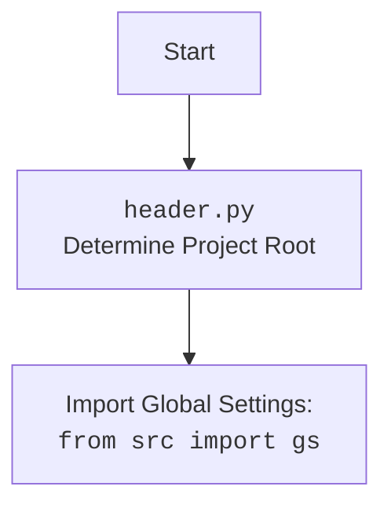

## <алгоритм>

1.  **Инициализация класса `PrestaShopShop`**:
    *   При создании экземпляра класса `PrestaShopShop` вызывается метод `__init__`.
    *   На вход принимаются параметры: `credentials` (опциональный словарь или SimpleNamespace), `api_domain` (опциональная строка), `api_key` (опциональная строка) и произвольные `*args`, `**kwards`.
    *   **Пример**:
        ```python
        shop = PrestaShopShop(credentials={'api_domain': 'example.com', 'api_key': 'test_key'})
        ```
2.  **Обработка `credentials`**:
    *   Если параметр `credentials` не `None`, из него извлекаются значения `api_domain` и `api_key` с помощью метода `get`. Приоритет отдается значениям из `credentials`, если они существуют.
    *   **Пример**:
        ```python
        credentials_data = SimpleNamespace(api_domain='example.com', api_key='test_key')
        shop = PrestaShopShop(credentials=credentials_data)
        # api_domain: 'example.com', api_key: 'test_key'
        ```
3.  **Проверка наличия `api_domain` и `api_key`**:
    *   Проверяется, что оба параметра `api_domain` и `api_key` не пустые (не `None` и не пустая строка).
    *   Если хотя бы один из параметров отсутствует или пустой, поднимается исключение `ValueError` с сообщением "Необходимы оба параметра: api_domain и api_key.".
    *   **Пример (ошибка)**:
        ```python
        try:
            shop = PrestaShopShop(api_domain='example.com')
        except ValueError as e:
            print(e)  # Вывод: Необходимы оба параметра: api_domain и api_key.
        ```
4.  **Инициализация родительского класса `PrestaShop`**:
    *   Если все проверки прошли успешно, вызывается метод `__init__` родительского класса `PrestaShop` с переданными параметрами `api_domain`, `api_key` и произвольными `*args`, `**kwards`.
    *   **Пример**:
        ```python
        shop = PrestaShopShop(api_domain='example.com', api_key='test_key')
        # Вызовется метод __init__ класса PrestaShop
        ```

## <mermaid>

```mermaid
flowchart TD
    Start[Начало] --> InitShop[<code>PrestaShopShop.__init__</code><br>Инициализация магазина PrestaShop];
    InitShop -- "credentials не None" --> ExtractCredentials[Извлечь api_domain и api_key из credentials];
    InitShop -- "credentials is None" --> CheckParams[Проверка api_domain и api_key на None или пустые строки];
    ExtractCredentials --> CheckParams
    CheckParams -- "api_domain или api_key отсутствуют" --> RaiseError[ValueError: Необходимы оба параметра];
    CheckParams -- "api_domain и api_key присутствуют" --> InitPrestaShop[<code>PrestaShop.__init__</code><br>Инициализация PrestaShop API];
    RaiseError --> End[Конец (с ошибкой)]
    InitPrestaShop --> End[Конец (успех)];
    
    
    style Start fill:#f9f,stroke:#333,stroke-width:2px
    style End fill:#ccf,stroke:#333,stroke-width:2px
    
```


## <объяснение>

### Импорты:
*   `from types import SimpleNamespace`:
    *   Используется для создания простых объектов с атрибутами, к которым можно обращаться как к полям. Удобно для представления данных, например, конфигурационных.
*   `from typing import Optional`:
    *   Используется для объявления, что аргументы функции или метода могут быть `None` или иметь определенный тип. Это делает код более читаемым и помогает в статическом анализе.
*   `import header`:
    *   Импортирует модуль `header`, который, вероятно, содержит логику для определения корневой директории проекта, и, возможно, глобальные настройки.
    *   Взаимосвязь с пакетом `src`: Этот модуль, вероятно, расположен в пакете `src` или является частью его логики, так как из него также импортируется `gs` (см. ниже).
*   `from src import gs`:
    *   Импортирует модуль `gs` из пакета `src`. `gs` скорее всего означает "global settings" и содержит глобальные настройки проекта.
    *   Взаимосвязь с пакетом `src`: `gs` - это часть пакета `src` и используется для доступа к общим настройкам проекта.
*   `from src.logger.logger import logger`:
    *   Импортирует объект `logger` из модуля `logger.py`, который находится в пакете `src.logger`. `logger` используется для записи логов.
    *   Взаимосвязь с пакетом `src`: `logger` является частью системы логирования, расположенной в `src.logger`.
*   `from src.utils.jjson import j_loads`:
    *   Импортирует функцию `j_loads` из модуля `jjson.py`, который находится в пакете `src.utils`. `j_loads`, вероятно, используется для загрузки JSON данных.
    *   Взаимосвязь с пакетом `src`: `j_loads` - это утилита для работы с JSON, расположенная в `src.utils`.
*   `from .api import PrestaShop`:
    *   Импортирует класс `PrestaShop` из модуля `api.py` в текущем пакете ( `src.endpoints.prestashop`).
    *   Взаимосвязь с пакетом `src`: Класс `PrestaShop` предоставляет базовый функционал для работы с API PrestaShop.
*   `from src.logger.exceptions import PrestaShopException`:
    *   Импортирует класс `PrestaShopException` из модуля `exceptions.py`, который находится в пакете `src.logger`. `PrestaShopException` используется для создания пользовательских исключений для этого проекта.
    *   Взаимосвязь с пакетом `src`: `PrestaShopException` - часть системы логирования и обработки ошибок.
*   `from pathlib import Path`:
    *   Импортирует класс `Path` из модуля `pathlib`, который предоставляет инструменты для работы с путями к файлам и директориям.
*   `from attr import attr, attrs`:
    *   Импортирует функции `attr` и `attrs` из библиотеки `attr`, которая используется для создания классов с автоматическими методами (например, `__init__`, `__repr__`).
*   `import sys`:
    *   Импортирует модуль `sys`, который предоставляет доступ к некоторым переменным и функциям, используемым интерпретатором.
*    `import os`:
    *   Импортирует модуль `os`, который предоставляет функции для взаимодействия с операционной системой.

### Классы:

*   **`PrestaShopShop(PrestaShop)`**:
    *   **Роль**: Этот класс является наследником класса `PrestaShop` и специализируется на работе с конкретным магазином PrestaShop.
    *   **Атрибуты**:
        *   Не имеет собственных атрибутов, но наследует атрибуты от родительского класса `PrestaShop`.
    *   **Методы**:
        *   `__init__`:
            *   **Аргументы**:
                *   `credentials` (`Optional[dict | SimpleNamespace]`): Словарь или объект SimpleNamespace, содержащий `api_domain` и `api_key` для доступа к API PrestaShop.
                *   `api_domain` (`Optional[str]`): Домен API PrestaShop.
                *   `api_key` (`Optional[str]`): Ключ API PrestaShop.
                *   `*args`, `**kwards`: Произвольные позиционные и именованные аргументы, которые передаются в конструктор родительского класса.
            *   **Возвращаемое значение**: None.
            *   **Назначение**: Инициализирует экземпляр класса `PrestaShopShop`, обрабатывает входные параметры и вызывает конструктор родительского класса `PrestaShop`.
            *   **Примеры**:
                ```python
                # Инициализация с помощью словаря
                shop1 = PrestaShopShop(credentials={'api_domain': 'example.com', 'api_key': 'test_key'})
                # Инициализация с помощью SimpleNamespace
                creds = SimpleNamespace(api_domain='example.com', api_key='test_key')
                shop2 = PrestaShopShop(credentials=creds)
                # Инициализация с явным указанием api_domain и api_key
                shop3 = PrestaShopShop(api_domain='example.com', api_key='test_key')
                ```
    *   **Взаимодействие с другими компонентами**:
        *   Наследует от класса `PrestaShop`, используя его функциональность для взаимодействия с API PrestaShop.

### Функции:

*   Метод `__init__` класса `PrestaShopShop` является функцией инициализации.

### Переменные:

*   `credentials`: Может быть словарем (dict) или объектом SimpleNamespace, содержащим `api_domain` и `api_key`.
*   `api_domain`: Строка, представляющая домен API PrestaShop.
*   `api_key`: Строка, представляющая ключ API PrestaShop.

### Потенциальные ошибки и области для улучшения:

*   **Обработка ошибок**: В текущей реализации обрабатывается только ошибка `ValueError` при отсутствии `api_domain` или `api_key`. Стоит добавить обработку других возможных исключений, которые могут возникнуть при работе с API PrestaShop.
*   **Валидация входных данных**: Необходимо добавить более строгую валидацию входных данных (например, проверка формата `api_domain` и `api_key`).
*   **Логирование**: Добавить логирование в конструктор `__init__` для отслеживания процесса инициализации и возможных проблем.
*   **Использование `attrs`**: Рассмотреть возможность использования декоратора `@attrs` для класса `PrestaShopShop` для автоматического создания метода `__init__`, что может сделать код более лаконичным и читаемым.

### Цепочка взаимосвязей с другими частями проекта:
1.  `src.endpoints.prestashop.shop.py` -> `src.endpoints.prestashop.api.py` (использует класс `PrestaShop` из `api.py`).
2.  `src.endpoints.prestashop.shop.py` -> `src.logger.logger.py` (использует `logger` для логирования).
3.  `src.endpoints.prestashop.shop.py` -> `src.utils.jjson.py` (использует `j_loads` для работы с JSON).
4.  `src.endpoints.prestashop.shop.py` -> `src.logger.exceptions.py` (использует `PrestaShopException`).
5.  `src.endpoints.prestashop.shop.py` -> `src.gs` (использует глобальные настройки).
6. `src.endpoints.prestashop.shop.py` -> `header.py` (может использовать `header.py` для получения настроек и корня проекта).