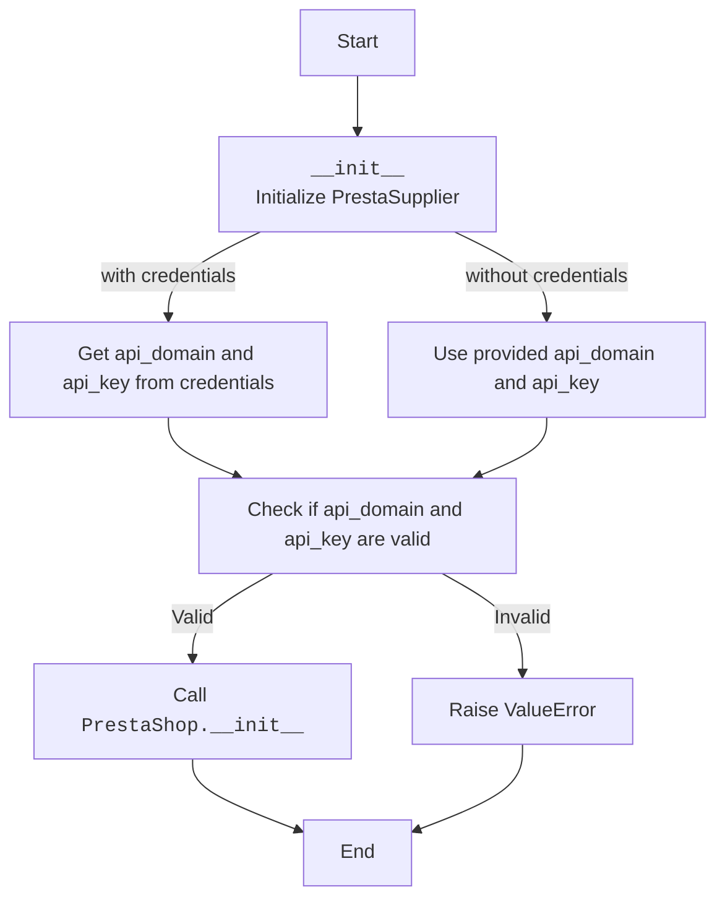
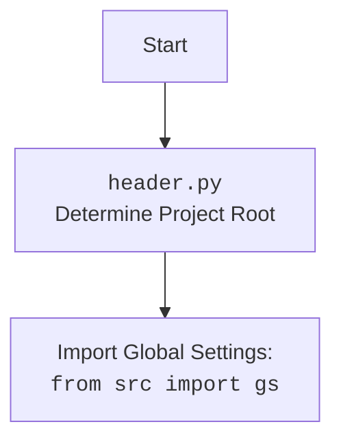

# Анализ кода `src/endpoints/prestashop/supplier.py`

## 1. <алгоритм>

**Описание работы класса `PrestaSupplier`:**

1.  **Инициализация (`__init__`)**:
    *   Принимает на вход `credentials` (словарь или `SimpleNamespace`), `api_domain` (строка) и `api_key` (строка) в качестве параметров, представляющих учетные данные для доступа к API PrestaShop.
    *   Если `credentials` переданы, он пытается получить `api_domain` и `api_key` из него.
    *   Проверяет, что `api_domain` и `api_key` не являются пустыми. Если одно из них пустое, то поднимается исключение `ValueError`.
    *   Вызывает конструктор родительского класса `PrestaShop`, передавая `api_domain` и `api_key`, для инициализации соединения с API PrestaShop.

    **Примеры:**

    *   **С `credentials`:**
        ```python
        credentials = {'api_domain': 'https://example.com/api', 'api_key': 'some_api_key'}
        supplier = PrestaSupplier(credentials=credentials)
        # `api_domain` будет 'https://example.com/api'
        # `api_key` будет 'some_api_key'
        ```
    *   **Без `credentials`, с отдельными параметрами:**
        ```python
        supplier = PrestaSupplier(api_domain='https://example.com/api', api_key='some_api_key')
        # `api_domain` будет 'https://example.com/api'
        # `api_key` будет 'some_api_key'
        ```

    *   **Ошибка `ValueError`:**
        ```python
        try:
            supplier = PrestaSupplier(api_domain=None, api_key='some_api_key')
        except ValueError as e:
            print(e)
            # Вывод: Необходимы оба параметра: api_domain и api_key.
        ```
2.  **Наследование**:
    *   Класс `PrestaSupplier` наследует от класса `PrestaShop`, что предполагает, что `PrestaSupplier` будет использовать API PrestaShop.

## 2. <mermaid>





## 3. <объяснение>

### Импорты:
*   `from types import SimpleNamespace`: Импортирует `SimpleNamespace` для создания объектов с атрибутами, доступными через точку. Используется для передачи параметров конфигурации в виде объекта, а не словаря.
*   `from typing import Optional`: Импортирует `Optional` для обозначения параметров, которые могут принимать значения `None`.
*   `import header`: Импортирует модуль `header`, который, как подразумевается, используется для определения корневой директории проекта и, возможно, для загрузки настроек.
*    `from src import gs`: Импортирует глобальные настройки из модуля `gs` в пакете `src`, вероятно, для доступа к общим параметрам приложения.
*   `from src.logger.logger import logger`: Импортирует объект `logger` из модуля `logger` для логирования.
*   `from src.utils.jjson import j_loads_ns`: Импортирует функцию `j_loads_ns` из модуля `jjson` для преобразования JSON-данных в `SimpleNamespace` объекты.
*   `from .api import PrestaShop`: Импортирует класс `PrestaShop` из модуля `api` в текущем пакете `src.endpoints.prestashop`.

### Классы:

*   **`PrestaSupplier`**:
    *   **Роль**: Класс для работы с поставщиками в PrestaShop. Наследуется от `PrestaShop`, что означает, что он использует общую логику для взаимодействия с API PrestaShop.
    *   **Атрибуты**: Не имеет собственных атрибутов, полагаясь на атрибуты базового класса.
    *   **Методы**:
        *   `__init__(self, credentials, api_domain, api_key, *args, **kwards)`: Конструктор класса. Инициализирует экземпляр `PrestaSupplier`, принимая параметры для соединения с API PrestaShop. Проверяет наличие необходимых `api_domain` и `api_key` и вызывает конструктор базового класса.
    *   **Взаимодействие**: Взаимодействует с классом `PrestaShop`, наследуя его методы для работы с API PrestaShop.

### Функции:
*   `__init__` - Конструктор класса `PrestaSupplier`

### Переменные:
*   `credentials` (Optional[dict | SimpleNamespace]): Словарь или объект `SimpleNamespace`, содержащий учетные данные. Может быть `None`.
*   `api_domain` (Optional[str]): Домен API PrestaShop. Может быть `None`.
*   `api_key` (Optional[str]): Ключ API PrestaShop. Может быть `None`.
*   `logger`: Объект `logger` для логирования.
*   `args`, `kwards`: Переменные, которые передаются в конструктор родительского класса `PrestaShop`.

### Потенциальные ошибки или области для улучшения:
*   **Отсутствие обработки ошибок при получении `api_domain` и `api_key` из `credentials`:**
    -   Сейчас используется `.get()`, который возвращает `None`, если ключа нет. Может потребоваться более строгая проверка.
*   **Нет логики для обработки ошибок от API PrestaShop:**
    -   Может потребоваться расширить функционал для обработки API ошибок.
*   **Отсутствует явное описание обработки исключения `ValueError`:**
    -   Хорошо было бы добавить логирование ошибки.

### Цепочка взаимосвязей с другими частями проекта:

*   **`header.py`**:  `header.py` используется для определения корневой директории проекта.
*  **`src.gs`**: Модуль `gs` содержит глобальные настройки проекта. `PrestaSupplier` зависит от настроек, полученных через `header` и `gs`.
*   **`src.logger.logger`**: `PrestaSupplier` использует `logger` для записи информации о работе.
*   **`src.utils.jjson`**: `j_loads_ns` используется для работы с JSON-данными, что может быть полезно при получении данных от PrestaShop API.
*   **`src.endpoints.prestashop.api.PrestaShop`**: `PrestaSupplier` напрямую зависит от класса `PrestaShop` для работы с API PrestaShop. Это означает, что все запросы к API PrestaShop, скорее всего, будут проходить через методы класса `PrestaShop`.

Этот анализ обеспечивает подробное понимание структуры и работы кода, а также его зависимостей и потенциальных проблем.