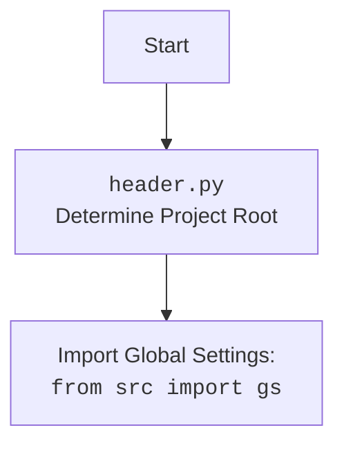

## <алгоритм>

1.  **Запуск Flask-приложения:**
    *   При запуске скрипта `if __name__ == '__main__':`, Flask-приложение инициализируется и запускается в режиме отладки `app.run(debug=True)`.

2.  **Инициализация GoogleGenerativeAI:**
    *   Создаётся экземпляр класса `GoogleGenerativeAI` и присваивается переменной `ai_model`. Это подготавливает модель ИИ к использованию.
    
3.  **Обработка POST-запроса `/ask`:**
    *   Когда Flask-приложение получает POST-запрос на эндпоинт `/ask`, вызывается функция `ask()`.
        *   **Пример:** `POST /ask HTTP/1.1` с `Content-Type: application/json` и телом `{"prompt": "Tell me a joke"}`.
  
4.  **Извлечение и проверка промпта:**
    *   Функция `ask()` получает JSON из тела запроса через `request.get_json()`.
        *  **Пример:**  `data` становится словарем `{"prompt": "Tell me a joke"}`.
    *   Извлекается значение ключа `prompt` из словаря `data`.
       *  **Пример:** `prompt` становится строкой `"Tell me a joke"`.
    *   Проверяется, что промпт не пустой.
        *   **Пример:** Если `prompt` пустой или отсутствует, возвращается JSON с ошибкой `{"error": "No prompt provided"}` и HTTP-статус 400.

5.  **Отправка промпта в ИИ-модель и получение ответа:**
    *   Если промпт предоставлен, функция `ai_model.ask(prompt)` вызывается для отправки промпта в модель ИИ.
        *   **Пример:** `ai_model.ask("Tell me a joke")` вызывает метод `ask` класса `GoogleGenerativeAI`.
    *   Полученный ответ от ИИ-модели сохраняется в переменной `reply`.
        *   **Пример:**  `reply` может стать строкой `"Why don't scientists trust atoms? Because they make up everything!"`.

6.  **Формирование JSON-ответа:**
    *   Формируется JSON-ответ со структурой `{"reply": reply}` и отправляется клиенту с HTTP-статусом 200.
        *   **Пример:** Клиенту возвращается JSON `{"reply": "Why don't scientists trust atoms? Because they make up everything!"}`.

7.  **Обработка ошибок:**
    *   Если во время обработки запроса (например, во время вызова `ai_model.ask()`) возникает исключение, то оно перехватывается блоком `except`.
        *   **Пример:** Если `ai_model.ask()` вызывает исключение, то ошибка записывается в переменную `e` и возвращается JSON `{"error": "Описание ошибки"}` с HTTP-статусом 500.

## <mermaid>

```mermaid
flowchart TD
    Start[Start Flask App] --> InitializeAIModel[Initialize GoogleGenerativeAI Model]
    InitializeAIModel --> HandleAskRequest[Handle POST /ask Request]
    HandleAskRequest --> ExtractPrompt[Extract Prompt from JSON Request]
    ExtractPrompt --> CheckPrompt[Check if Prompt is Empty]
    CheckPrompt -- Yes --> ErrorResponse400[Return Error 400: "No prompt provided"]
    CheckPrompt -- No --> SendPromptToAIModel[Send Prompt to AI Model]
    SendPromptToAIModel --> GetAIModelReply[Receive AI Model Reply]
    GetAIModelReply --> CreateJsonResponse[Create JSON Response with Reply]
    CreateJsonResponse --> ReturnJsonResponse[Return JSON Response]
    SendPromptToAIModel -- Exception --> HandleException[Handle Exception during AI Request]
    HandleException --> ErrorResponse500[Return Error 500: "Internal Server Error"]
    
    
    
    
    

    
    subgraph GoogleGenerativeAI
    GetAIModelReply  --  reply  -->  ai_model_ask_return
    SendPromptToAIModel --  prompt  --> ai_model_ask
        ai_model_ask[ai_model.ask(prompt)]
            ai_model_ask --> ai_model_ask_return[AI Model Response]
    end
        
     subgraph Flask
     HandleAskRequest -- POST_Request --> Request_Get_Json[request.get_json()]
            Request_Get_Json -->  ExtractPrompt
      end
```



## <объяснение>

### Импорты:
*   `import header`:
    *   Импортирует модуль `header.py`, который, судя по структуре проекта, вероятно, отвечает за определение корневой директории проекта и загрузку общих настроек.
    *   `header.py` устанавливает путь проекта и импортирует глобальные настройки из `src.gs` чтобы другие модули могли правильно работать с путями и конфигурациями.
    
*   `from flask import Flask, request, jsonify`:
    *   Импортирует необходимые компоненты из фреймворка Flask для создания REST API:
        *   `Flask`: Класс для создания экземпляра веб-приложения.
        *   `request`: Объект для доступа к данным входящего HTTP-запроса.
        *   `jsonify`: Функция для преобразования данных Python в JSON-ответ.
*   `from src.ai.google_generativeai.generative_ai import GoogleGenerativeAI`:
    *   Импортирует класс `GoogleGenerativeAI` из модуля `src.ai.google_generativeai.generative_ai`. Этот класс, вероятно, предоставляет интерфейс для взаимодействия с языковой моделью Google Gemini.
    *   Обеспечивает функциональность для обращения к модели AI.

### Классы:
*   `Flask`:
    *   Используется для создания экземпляра веб-приложения Flask.
    *   Атрибуты: `__name__`, который указывает на имя текущего модуля.
    *   Методы: `route()`, который используется как декоратор для определения URL-маршрутов и их функций-обработчиков; `run()`, который запускает веб-сервер.
*   `GoogleGenerativeAI`:
    *   Класс, обёртывающий вызовы к API Google Generative AI.
    *   Методы: `ask(prompt)`, который отправляет промпт в модель и возвращает ответ.
    *   Взаимодействует с API Google Generative AI для обработки текстовых запросов.

### Функции:
*   `ask()`:
    *   `@app.route('/ask', methods=['POST'])`: Декоратор, который связывает функцию `ask` с маршрутом `/ask`, принимающим только POST-запросы.
    *   Аргументы: нет явных аргументов, но неявно использует `request` из Flask для доступа к данным запроса.
    *   Возвращаемые значения:
        *   В случае успеха: JSON-ответ со структурой `{"reply": reply}` и HTTP-статус 200.
        *   В случае ошибки: JSON-ответ со структурой `{"error": "сообщение об ошибке"}` и соответствующий код ошибки (например, 400, 500).
    *   Назначение: обрабатывает POST-запросы к эндпоинту `/ask`. Извлекает промпт из запроса, отправляет его в AI-модель через `ai_model.ask()`, и возвращает JSON-ответ с результатом.
    *   Пример:
        *   Запрос: `POST /ask HTTP/1.1` с `Content-Type: application/json` и телом `{"prompt": "How are you?"}`.
        *   Ответ: `{"reply": "I am doing well, thank you for asking."}`
        *   Пример ошибки: Запрос: `POST /ask HTTP/1.1` с `Content-Type: application/json` и телом `{"some_field": "hello"}`.
        *   Ответ: `{"error": "No prompt provided"}` с HTTP-статусом 400

### Переменные:
*   `app`:
    *   Тип: `Flask`.
    *   Использование: Экземпляр Flask, который управляет веб-приложением.
*   `ai_model`:
    *   Тип: `GoogleGenerativeAI`.
    *   Использование: Экземпляр класса `GoogleGenerativeAI`, который используется для взаимодействия с моделью ИИ.
*   `data`:
    *   Тип: `dict`.
    *   Использование: Содержит JSON, полученный из тела запроса.
*   `prompt`:
    *   Тип: `str`.
    *   Использование: Текстовый промпт, который передается в AI-модель.
*   `reply`:
    *   Тип: `str`.
    *   Использование: Ответ, полученный от AI-модели.

### Потенциальные ошибки и области для улучшения:
*   Обработка исключений может быть более специфичной, чтобы выдавать более точные сообщения об ошибках.
*   Нет валидации данных, кроме проверки на пустоту `prompt`. Можно добавить валидацию JSON-схемы.
*   Нет авторизации или аутентификации, что делает API открытым.
*   Не предусмотрена обработка различных типов контента, кроме JSON.
*   Нет логирования ошибок и событий.

### Цепочка взаимосвязей с другими частями проекта:
*   `header.py` устанавливает путь проекта и импортирует глобальные настройки из `src.gs`.
*   `src.ai.google_generativeai.generative_ai` : Этот модуль отвечает за взаимодействие с API Google Generative AI. Внутри него может быть класс, который делает фактические вызовы к API Google.
*   `app` (экземпляр `Flask`) взаимодействует с экземпляром `GoogleGenerativeAI`, вызывая его методы для обработки запросов.
*   Все это вместе является частью `fast_api` в структуре проекта, которая отвечает за обработку API запросов.