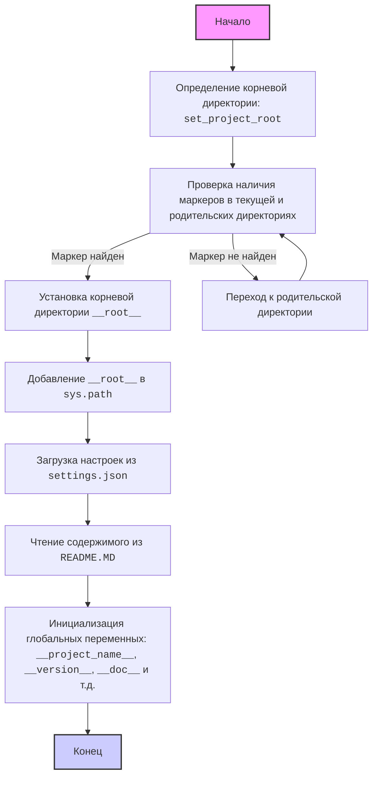

## Анализ кода `hypotez/src/fast_api/header.py`

### 1. <алгоритм>

**Пошаговая блок-схема:**

1.  **Начало:**
    *   `__file__`: Получение абсолютного пути к текущему файлу (`header.py`).
    *   `current_path`: Получение родительской директории текущего файла.
    *   `__root__`: Инициализация переменной `__root__` текущим путем.

    *Пример:*
    Если `__file__` это `/home/user/project/src/fast_api/header.py`, то `current_path` будет `/home/user/project/src/fast_api`, `__root__` инициализируется значением `/home/user/project/src/fast_api`

2.  **Поиск корневой директории:**

    *   Цикл перебирает все родительские директории, начиная с `current_path` до корневого пути файловой системы.
    *   Для каждой родительской директории проверяется наличие любого файла или директории из `marker_files` (по умолчанию `__root__`, `.git`).
    *   Если маркер найден, то эта родительская директория становится корневой (`__root__`). Цикл завершается.

    *Пример:*
    Если в `/home/user/project/` существует директория `.git`, то при проходе по родительским директориям когда цикл дойдёт до `/home/user/project/`, сработает условие поиска маркера `(.git)`, `__root__` будет установлено в `/home/user/project/` и цикл прервётся.

3.  **Добавление `__root__` в `sys.path`:**

    *   Если `__root__` еще нет в `sys.path`, то путь к корневой директории добавляется в начало списка `sys.path`.

    *Пример:*
    Если sys.path был `['/usr/lib/python38', '/home/user/project/src/fast_api']` и `__root__`  это `/home/user/project`, то sys.path станет `['/home/user/project', '/usr/lib/python38', '/home/user/project/src/fast_api']`

4.  **Чтение настроек из `settings.json`:**

    *   Пытается открыть файл `settings.json`, расположенный по пути `__root__/src/settings.json`.
    *   Если файл существует, то его содержимое загружается в словарь `settings`.
    *   Если файл не найден или не является корректным JSON, то перехватываются исключения и переменная settings остаётся `None`.

    *Пример:*
     Если `__root__`  это `/home/user/project` и settings.json есть и содержит `{"project_name": "my_app", "version": "1.0.0"}` то settings станет `{'project_name': 'my_app', 'version': '1.0.0'}`.

5.  **Чтение README.MD:**

    *   Пытается открыть файл `README.MD`, расположенный по пути `__root__/src/README.MD`.
    *   Если файл существует, то его содержимое сохраняется в переменную `doc_str`.
    *   Если файл не найден, то переменная `doc_str` остаётся `None`.

    *Пример:*
    Если `__root__`  это `/home/user/project` и README.MD есть и содержит "Описание проекта", то `doc_str` станет "Описание проекта".

6.  **Инициализация глобальных переменных:**

    *   Переменные `__project_name__`, `__version__`, `__doc__`, `__details__`, `__author__`, `__copyright__`, `__cofee__` инициализируются значениями из словаря `settings` (если он загружен) или значениями по умолчанию.

    *Пример:*
    Если settings это `{'project_name': 'my_app', 'version': '1.0.0', "author": "John Doe", "copyrihgnt": "2024" }`, то `__project_name__` станет `my_app`, `__version__` станет `1.0.0`, `__author__` станет `John Doe`, `__copyright__` станет `2024`. А `__doc__` станет, значение `doc_str` или `''`, если `doc_str` равно `None`.

7.  **Конец:**
    *   `header.py` завершает работу.

### 2. <mermaid>



**Описание `mermaid` диаграммы:**

*   **`Start`**: Начало работы скрипта.
*   **`FindRoot`**: Функция `set_project_root` определяет корневую директорию.
*   **`CheckMarker`**: Проверяет наличие маркеров (файлов или директорий) для определения корневой директории.
*   **`SetRoot`**: Устанавливает найденную корневую директорию.
*   **`NextParent`**: Переход к следующей родительской директории при отсутствии маркера.
*   **`AddToSysPath`**: Добавляет корневую директорию в `sys.path`.
*   **`LoadSettings`**: Загружает настройки из `settings.json` файла.
*    **`ReadDocStr`**: Читает документацию из `README.MD` файла.
*   **`InitVariables`**: Инициализирует глобальные переменные, используя загруженные настройки и документацию.
*   **`End`**: Конец работы скрипта.

### 3. <объяснение>

**Импорты:**

*   `sys`: Предоставляет доступ к некоторым переменным и функциям, которые взаимодействуют с интерпретатором Python. Используется для добавления пути к корневой директории в `sys.path`.
*   `json`: Используется для работы с JSON-данными: загрузки настроек из `settings.json`.
*   `packaging.version.Version`: Импортируется класс Version из пакета packaging, но не используется в этом коде. Вероятно, это остаток от прежнего функционала.
*  `pathlib.Path`: Обеспечивает объектно-ориентированный способ работы с путями файловой системы. Используется для определения корневой директории и путей к файлам.
*   `src`:  Локальный пакет, который, как ожидается, содержит модуль `gs`. Используется для доступа к глобальным настройкам через `gs.path.root`.

**Функции:**

*   `set_project_root(marker_files=('__root__', '.git')) -> Path`:
    *   **Аргументы**: `marker_files` - кортеж строк, представляющих имена файлов или директорий, которые используются для определения корневой директории проекта. По умолчанию `('__root__', '.git')`.
    *   **Возвращаемое значение**: Объект типа `pathlib.Path`, представляющий корневую директорию проекта, либо директорию, где находится скрипт, если корневая не найдена.
    *   **Назначение**: Функция ищет корневую директорию проекта, начиная с директории, где находится текущий файл. Она проверяет наличие `marker_files` в текущей директории и её родительских директориях. Если один из маркеров найден, то эта родительская директория считается корневой. После нахождения корневой директории, её путь добавляется в `sys.path`, чтобы Python мог импортировать модули из этого проекта.

    *Пример:*
    ```python
    from pathlib import Path
    # файл header.py расположен в /home/user/project/src/fast_api/header.py
    # в /home/user/project/ есть файл .git
    root_path = set_project_root()
    print(root_path) # -> /home/user/project
    print(sys.path) # -> ["/home/user/project", ...]
    ```

**Переменные:**

*   `__root__`: `pathlib.Path` - Путь к корневой директории проекта.
*   `settings`: `dict` или `None` - Словарь с настройками проекта, загруженными из `settings.json` файла. Может быть `None`, если файл не найден или содержит некорректные JSON данные.
*   `doc_str`: `str` или `None` - Строка, содержащая текст из файла `README.MD`. Может быть `None`, если файл не найден.
*   `__project_name__`: `str` - Имя проекта, извлеченное из `settings` или `"hypotez"`.
*    `__version__`: `str` - Версия проекта, извлеченная из `settings` или пустая строка `''`.
*   `__doc__`: `str` - Описание проекта из `README.MD` или пустая строка `''`.
*   `__details__`: `str` - Пустая строка, не используется в коде.
*   `__author__`: `str` - Автор проекта, извлечен из `settings` или пустая строка `''`.
*   `__copyright__`: `str` - Копирайт проекта, извлечен из `settings` или пустая строка `''`.
*   `__cofee__`: `str` - Строка с ссылкой на поддержку автора.

**Взаимосвязь с другими частями проекта:**

*   **`src.gs`**: Модуль `gs` из пакета `src`, вероятно, предоставляет доступ к глобальным путям и переменным, необходимым для работы проекта.  В данном случае используется для получения пути к корневой директории проекта через `gs.path.root`.
*   **`settings.json`**: Файл, который содержит настройки проекта, такие как имя, версия, автор, копирайт и т.д.
*   **`README.MD`**: Файл, содержащий документацию по проекту.

**Потенциальные ошибки и области для улучшения:**

*   **Обработка ошибок**: В коде используется `try...except` для обработки `FileNotFoundError` и `json.JSONDecodeError`, что является хорошей практикой. Однако, не предоставляется дополнительной обработки ошибок или логирования. Было бы хорошо добавить запись в лог о том что файл не найден или имеет некорректный формат, а не просто пропустить.
*   **`packaging.version`**: импорт `Version` не используется, его следует удалить.
*   **Глобальные переменные**: Использование большого количества глобальных переменных может усложнить поддержку кода. Возможно, следует использовать классы или контейнеры для более структурированного хранения данных.
*   **`__details__`**: Переменная объявлена и не используется, стоит удалить.

В целом, этот код выполняет важную роль в определении корневой директории проекта, загрузке настроек и инициализации глобальных переменных. Он является основой для других частей проекта и обеспечивает возможность получения базовой информации о проекте.