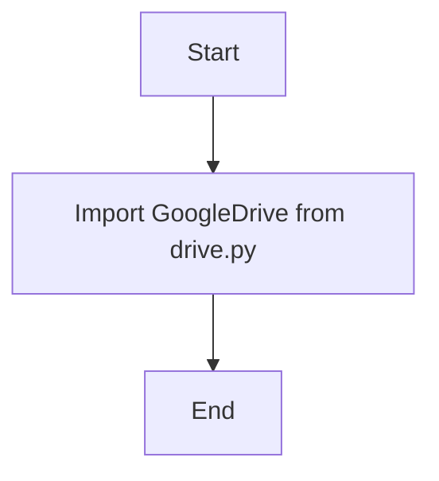

## Анализ кода `src/goog/drive/__init__.py`

### <алгоритм>

1. **Импорт модуля:**
   - Импортируется модуль `GoogleDrive` из файла `drive.py`, находящегося в текущей директории.
   -  `from .drive import GoogleDrive` - импортирует класс `GoogleDrive` из файла `drive.py`.

### <mermaid>

### <объяснение>

**Импорты:**

- `from .drive import GoogleDrive`:
    - Этот импорт извлекает класс `GoogleDrive` из модуля `drive.py`, расположенного в том же каталоге, что и `__init__.py`.
    - Это позволяет использовать класс `GoogleDrive` в других частях пакета `src.goog.drive` или в других модулях, импортирующих этот пакет.
    - Использование относительного импорта (`.drive`) указывает на то, что `drive.py` находится в том же каталоге.

**Общая структура пакета:**

- `__init__.py`: Этот файл делает каталог `drive` пакетом Python, позволяя импортировать модули из него.
- `drive.py`:  Предположительно, этот файл содержит класс `GoogleDrive` (как видно из импорта), который, скорее всего, реализует функциональность для взаимодействия с Google Drive.

**Предположения и возможные улучшения:**

- Код предполагает наличие файла `drive.py` в том же каталоге. Ошибка возникнет, если `drive.py` отсутствует.
- Модуль `drive.py` предположительно содержит всю логику для работы с Google Drive (аутентификация, загрузка, выгрузка, удаление и т.д.).
- Код может быть расширен путем добавления других классов или функций в `__init__.py`, для предоставления дополнительных возможностей.
- Отсутствуют комментарии, объясняющие предназначение самого пакета `src.goog.drive`.
- Отсутствуют обработки исключений в коде.

**Цепочка взаимосвязей:**

- Пакет `src.goog.drive` предназначен для предоставления абстракции для работы с Google Drive. 
- Класс `GoogleDrive` из `drive.py` является центральным компонентом.
- Этот пакет может быть использован другими частями проекта, которые требуют доступа к Google Drive, например, для резервного копирования, загрузки отчетов или других файлов.