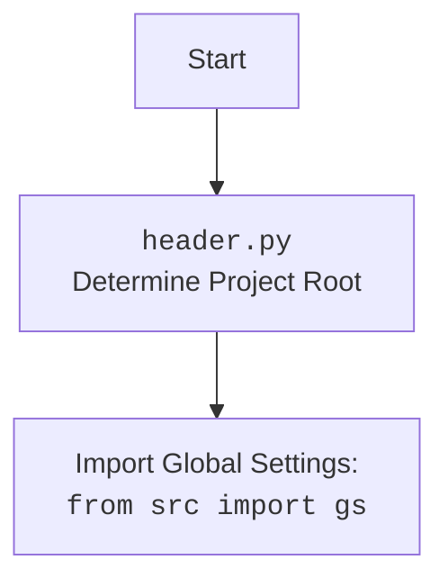

## <алгоритм>

1. **Инициализация `GoogleDriveHandler`:**
   - Пользователь создает экземпляр класса `GoogleDriveHandler`, передавая имя папки (`folder_name`) в Google Drive.
   - В конструкторе вызывается метод `_create_credentials()` для получения учетных данных.
   - **Пример:** `google_drive_handler = GoogleDriveHandler(folder_name="My Drive Folder")`

2.  **`_create_credentials()`:**
    - Определяет путь к файлу с учетными данными (`creds_file`) на основе `gs.path.secrets` (из `src.gs`) и имени файла `'hypo69-c32c8736ca62.json'`.
    - Определяет область доступа (`SCOPES`) к Google Drive API.
    - Пытается загрузить учетные данные из файла `token.pickle`.
        - Если файл существует, загружает учетные данные с помощью `pickle.load()`.
        - **Пример:** `creds = pickle.load(token)`
    - Если учетные данные не существуют или недействительны:
        - Проверяет, истек ли срок действия учетных данных и есть ли токен обновления.
            - Если срок действия истек, обновляет токен с помощью `creds.refresh(Request())`.
            - **Пример:** `creds.refresh(Request())`
        - Если нет, создает поток авторизации с использованием `InstalledAppFlow.from_client_secrets_file()` и выполняет локальный сервер авторизации (`flow.run_local_server(port=0)`), чтобы получить новые учетные данные.
            - **Пример:** `flow = InstalledAppFlow.from_client_secrets_file(self.creds_file, self.SCOPES)`
        - Сохраняет новые или обновленные учетные данные в `token.pickle` с помощью `pickle.dump()`.
        - **Пример:** `pickle.dump(creds, token)`
    - Возвращает полученные (или обновленные) учетные данные (`creds`).

3.  **`upload_file()`:**
     - Функция предназначена для загрузки файла по указанному пути в Google Drive.
     - **Пример:** `google_drive_handler.upload_file(file_path)`
     - Загрузка файла не реализована в предоставленном коде.
        -  Требуется использовать `service` объект `build` созданный в `main` для реализации upload.

4.  **`main()`:**
    - Создает экземпляр класса `GoogleDriveHandler` и получает его учетные данные.
       - **Пример:** `creds = GoogleDriveHandler()._create_credentials()`
    - Создает объект сервиса Google Drive API с помощью `build('drive', 'v3', credentials=creds)`.
        - **Пример:** `service = build('drive', 'v3', credentials=creds)`
    - Выполняет запрос к API для получения списка файлов.
        - **Пример:** `results = service.files().list(pageSize=10, fields="nextPageToken, files(id, name)").execute()`
    - Извлекает список файлов из ответа.
        - **Пример:** `items = results.get('files', [])`
    - Выводит список файлов с их именами и ID в консоль.
        - **Пример:** `print('{0} ({1})'.format(item['name'], item['id']))`
        -  Если нет файлов, выводится сообщение "No files found.".

5. **Запуск:**
    - Проверяется, является ли скрипт основным, после чего вызывается функция `main()`.

## <mermaid>

```mermaid
flowchart TD
    subgraph GoogleDriveHandler Class
        A[Start: __init__] --> B{Create Credentials};
        B --> C[_create_credentials()];
        C --> D{Check token.pickle}
        D -- Exists --> E[Load Credentials]
        E --> F{Check Valid Credentials}
        D -- Not Exists --> G[Create New Credentials]
        F -- Invalid --> G
        F -- Valid --> H[Return Credentials]
        G --> I[InstalledAppFlow: get creds]
        I --> J[Save Credentials to token.pickle]
        J --> H
        H --> K[Set Credentials]
        K --> L[Upload File]
        L --> M[End:upload_file]
        B --> K
    end
    subgraph main()
        N[Start: main()] --> O[Create GoogleDriveHandler]
        O --> P[Get Credentials]
        P --> Q[Build Drive Service]
        Q --> R[List Files]
        R --> S{Files Found?}
        S -- Yes --> T[Print Files]
        S -- No --> U[Print No Files]
        T --> V[End: main()]
        U --> V
    end
    style GoogleDriveHandler Class fill:#f9f,stroke:#333,stroke-width:2px
        style main() fill:#ccf,stroke:#333,stroke-width:2px
        
    
    
    
    
    

   
```



## <объяснение>

**Импорты:**

*   `pickle`: Используется для сериализации и десериализации объектов Python (в данном случае, для сохранения и загрузки токенов доступа Google Drive).
*   `os`: Предоставляет функции для взаимодействия с операционной системой, например, для проверки существования файла.
*   `pathlib.Path`: Обеспечивает более удобный способ работы с путями к файлам и каталогам.
*   `googleapiclient.discovery.build`: Используется для создания объекта сервиса Google API (в данном случае, Google Drive API).
*   `google_auth_httplib2.AuthorizedHttpTransport`: Обеспечивает авторизованный транспорт для HTTP запросов.
*   `google.auth.transport.requests.Request`: Используется для создания запроса, необходимого для обновления токена.
*   `google.oauth2.credentials.Credentials`: Класс для хранения учетных данных.
*   `google_auth_oauthlib.flow.InstalledAppFlow`: Используется для авторизации с помощью OAuth 2.0.
*   `header`:  Используется для определения корневой директории проекта и импорта глобальных настроек. 
*   `src.gs`: Пакет `src.gs` используется для получения глобальных настроек проекта, в том числе, пути к секретным файлам.
    *   Взаимосвязь с `header`: `header.py` определяет корневой каталог проекта и настраивает импорт `src.gs`. 
*   `src.utils.printer.pprint`: Используется для форматированного вывода в консоль.
*  `src.logger.logger`: Используется для логирования событий приложения.

**Классы:**

*   `GoogleDriveHandler`:
    *   **Роль:** Класс отвечает за взаимодействие с Google Drive API, включая авторизацию, загрузку и другие операции.
    *   **Атрибуты:**
        *   `folder_name` (str): Имя папки в Google Drive, в которую будут загружаться файлы.
        *   `creds` (google.oauth2.credentials.Credentials): Объект с учетными данными для доступа к Google Drive API.
    *   **Методы:**
        *   `__init__(self, folder_name: str)`: Конструктор класса, инициализирует атрибуты `folder_name` и `creds`.
        *   `_create_credentials(self)`: Получает или создает действительные учетные данные пользователя для доступа к Google Drive API. Сохраняет токен доступа в файле `token.pickle` .
        *   `upload_file(self, file_path: Path)`: Загружает файл по указанному пути в Google Drive.

**Функции:**

*   `main()`:
    *   **Аргументы:** Нет.
    *   **Возвращаемое значение:** Нет.
    *   **Назначение:** Демонстрирует базовое использование Google Drive API, включая получение списка файлов.
    *   **Пример:** Выводит список файлов на Google Drive пользователя.

**Переменные:**

*   `creds_file` (pathlib.Path): Путь к файлу с секретными ключами для авторизации.
*   `SCOPES` (list): Список областей доступа, необходимых для работы с Google Drive API.
*   `creds` (google.oauth2.credentials.Credentials): Объект с учетными данными для доступа к Google Drive API.
*   `file_path` (pathlib.Path): Путь к файлу, который нужно загрузить (в примере использования).
*   `folder_name` (str): Имя папки в Google Drive (в примере использования).
*  `token` (file object): файловый объект для работы с `token.pickle`

**Потенциальные ошибки и улучшения:**

*   **Отсутствие реализации `upload_file`:** Метод `upload_file` объявлен, но не реализован. Необходимо добавить логику загрузки файлов в Google Drive.
*   **Обработка ошибок:** В коде отсутствует обработка ошибок, таких как ошибки сети, ошибки авторизации, отсутствие файла, и т.д.
*   **Константы**: SCOPES можно вынести в константу и вынести в `gs`.
*   **Использование `gs`:** `creds_file` формируется с помощью `gs.path.secrets`. Необходимо убедиться, что `gs` правильно настроен и возвращает корректный путь к секретным файлам.
*   **Безопасность:** Хранение токена доступа в `token.pickle` может быть небезопасным. Рассмотреть альтернативные варианты хранения.

**Взаимосвязь с другими частями проекта:**

*   `header.py` определяет корневую директорию проекта и настраивает импорт `src.gs`.
*   `src.gs` хранит глобальные настройки, включая пути к секретным файлам, которые используются для авторизации в Google Drive API.
*   `src.utils.printer` используется для форматированного вывода в консоль.
*   `src.logger.logger` используется для логирования событий приложения.
*   `src.goog.drive` отвечает за взаимодействие с Google Drive API.