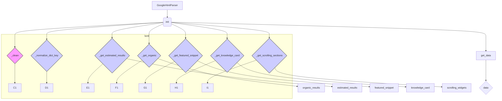

# <input code>

```python
## \file hypotez/src/goog/google_search.py
# -*- coding: utf-8 -*-

#! venv/bin/python/python3.12

"""
.. module: src.goog 
	:platform: Windows, Unix
	:synopsis:

"""


from lxml import html


class GoogleHtmlParser:
    """Класс для парсинга HTML с Google Search.

    Парсит HTML страницы поисковой выдачи Google и преобразует её в словарь.
    Работает как с мобильной, так и с десктопной версией HTML.

    Атрибуты:
        tree (html.Element): Дерево документа, полученное через html.fromstring().
        user_agent (str): User agent, использованный для получения HTML Google Search.
    """

    def __init__(self, html_str: str, user_agent: str = 'desktop') -> None:
        """Инициализация парсера.

        Создает дерево документа из строки HTML.

        Args:
            html_str (str): HTML Google Search в виде строки.
            user_agent (str): User agent для получения HTML. Может быть 'mobile' или 'desktop'.

        Returns:
            None
        """
        self.tree = html.fromstring(html_str)
        if user_agent in ['mobile', 'desktop']:
            self.user_agent = user_agent
        else:
            self.user_agent = 'desktop'

    # ... (остальные методы)
```

# <algorithm>

**Пошаговая блок-схема:**

1. **Инициализация (init):**
   - Принимает строку HTML (`html_str`) и необязательный `user_agent`.
   - Создает дерево HTML (`self.tree`) из входной строки с помощью `html.fromstring()`.
   - Устанавливает `self.user_agent` в `'desktop'` или заданное значение, если оно корректно.
   - **Пример:**  `html_str = "<html><body>...</body></html>"` -> `self.tree` — представление html-документа.

2. **Очистка строки (clean):**
   - Удаляет лишние пробелы и символы из входной строки.
   - **Пример:** `"   Hello world   "` -> `"Hello world"`.

3. **Нормализация ключа (normalize_dict_key):**
   - Преобразует строку в корректный ключ словаря (заменяет пробелы на подчеркивания, удаляет двоеточия, приводит к нижнему регистру).
   - **Пример:** `"Title :  Value"` -> `"title_value"`.

4. **Получение количества результатов (get_estimated_results):**
   - Ищет элемент с количеством результатов (`result-stats`).
   - Извлекает число результатов из текста элемента.
   - **Пример:** "<span>12345 results</span>" -> `12345`.

5. **Получение органических результатов (get_organic):**
   - Ищет все результаты поиска (`div.g`).
   - Для каждого результата извлекает URL, заголовок, сниппет и богатый сниппет.
   - **Пример:** Извлекает данные о результатах из `<div class="g">`.

6. **Получение Featured Snippet (get_featured_snippet):**
   - Ищет элемент с Featured Snippet (`div.kp-blk`).
   - Извлекает заголовок и URL, если найден.
   - **Пример:**  Находит featured snippet и возвращает словарь с его заголовком и ссылкой.

7. **Получение Knowledge Card (get_knowledge_card):**
   - Ищет Knowledge Card (`div.kp-wholepage`).
   - Извлекает заголовок, подзаголовок, описание и дополнительную информацию.
   - **Пример:** Возвращает словарь с данными карточки знаний.

8. **Получение данных из скроллируемых разделов (get_scrolling_sections):**
   - Ищет scrollable widgets (`g-section-with-header`).
   - Для каждого виджета получает заголовок и данные из подвиджетов.
   - **Пример:** Возвращает список словарей с данными из виджетов.

9. **Получение итоговых данных (get_data):**
   - Вызывает все вспомогательные функции для получения данных.
   - Возвращает словарь с объединенными данными (`estimated_results`, `featured_snippet`, ...).


# <mermaid>



**Разъяснение диаграммы:**

Диаграмма показывает классовую структуру. `GoogleHtmlParser` является основным классом, который содержит методы для получения данных. `lxml` — зависимость, используемая для парсинга HTML.  Функции `_clean`, `_normalize_dict_key` и т.д. являются вспомогательными методами внутри класса `GoogleHtmlParser`.

# <explanation>

**Импорты:**

- `from lxml import html`: Импортирует необходимые классы и функции из библиотеки `lxml`, предназначенной для работы с XML и HTML.  `lxml` – это мощная библиотека для обработки HTML, которая предоставляет инструменты для эффективного и надежного парсинга веб-страниц.  Связь с `src` —  это часть архитектуры проекта, которая указывает, что код находится в подпапке `goog` внутри пакета `src`.


**Классы:**

- `GoogleHtmlParser`:  Представляет класс для парсинга HTML-страниц Google Search. Атрибуты `self.tree` и `self.user_agent` хранят дерево HTML и пользовательский агент соответственно, что необходимо для анализа страницы. Методы класса (`__init__`, `_clean`, `_normalize_dict_key`, `_get_estimated_results`, `_get_organic`, `_get_featured_snippet`, `_get_knowledge_card`, `_get_scrolling_sections`, `get_data`) выполняют различные операции для извлечения информации из HTML.

**Функции:**

- `__init__`: Инициализирует класс `GoogleHtmlParser`, создавая дерево HTML и устанавливая пользовательский агент.
- `_clean`: Очищает строку, удаляя лишние пробелы и символы.
- `_normalize_dict_key`: Преобразует строку в формат ключа словаря.
- `_get_estimated_results`: Возвращает количество результатов поиска.
- `_get_organic`: Возвращает список органических результатов поиска.
- `_get_featured_snippet`: Возвращает данные Featured Snippet.
- `_get_knowledge_card`: Возвращает данные Knowledge Card.
- `_get_scrolling_sections`:  Возвращает данные из скроллируемых сегментов.
- `get_data`: Возвращает итоговый словарь с данными из различных источников.

**Переменные:**

- `MODE`:  Поле для конфигурации (например, для переключения между режимами разработки и релиз).
- `user_agent`: Указывает тип пользовательского агента (например, мобильный или десктопный).
- `estimated_results`:  Переменная, хранящая количество найденных результатов поиска.


**Возможные ошибки и улучшения:**

- **Обработка исключений:** Необходимо добавить обработку исключений (например, если `xpath` не находит нужных элементов).
- **Улучшение очистки:**  В методе `_clean` можно указать более конкретные правила для очистки строки.
- **Документация:** Дополнить документацию, описав каждый метод более подробно и предоставив примеры использования.
- **Тестирование:** Необходимо добавить тесты для проверки корректности работы методов.
- **Универсальность:**  Возможно, стоит сделать парсинг более гибким, чтобы он обрабатывал различные форматы HTML.

**Взаимосвязи с другими частями проекта:**

Код использует `lxml` для парсинга HTML.  Дальнейшее использование данных, полученных классом `GoogleHtmlParser`, должно быть описано в других частях проекта (например, в файлах, обрабатывающих результаты поиска).