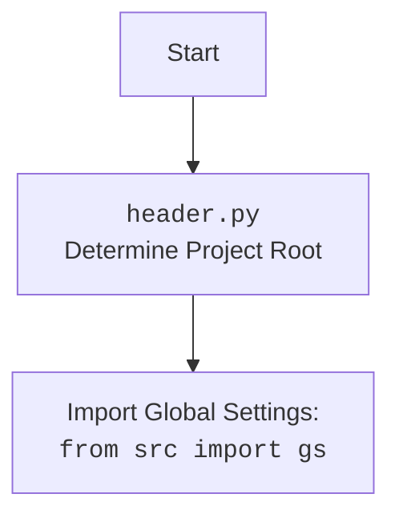

## ИНСТРУКЦИЯ:

Анализируй предоставленный код подробно и объясни его функциональность. Ответ должен включать три раздела:  

1.  **<алгоритм>**: Опиши рабочий процесс в виде пошаговой блок-схемы, включая примеры для каждого логического блока, и проиллюстрируй поток данных между функциями, классами или методами.  
2.  **<mermaid>**: Напиши код для диаграммы в формате `mermaid`, проанализируй и объясни все зависимости, 
    которые импортируются при создании диаграммы. 
    **ВАЖНО!** Убедитесь, что все имена переменных, используемые в диаграмме `mermaid`, 
    имеют осмысленные и описательные имена. Имена переменных вроде `A`, `B`, `C`, и т.д., не допускаются!  
    
    **Дополнительно**: Если в коде есть импорт `import header`, добавьте блок `mermaid` flowchart, объясняющий `header.py`:
    ```mermaid
    flowchart TD
        Start --> Header[<code>header.py</code><br> Determine Project Root]
    
        Header --> import[Import Global Settings: <br><code>from src import gs</code>] 
    ```

3.  **<объяснение>**: Предоставьте подробные объяснения:  
    - **Импорты**: Их назначение и взаимосвязь с другими пакетами `src.`.  
    - **Классы**: Их роль, атрибуты, методы и взаимодействие с другими компонентами проекта.  
    - **Функции**: Их аргументы, возвращаемые значения, назначение и примеры.  
    - **Переменные**: Их типы и использование.  
    - Выделите потенциальные ошибки или области для улучшения.  

Дополнительно, постройте цепочку взаимосвязей с другими частями проекта (если применимо).  

Это обеспечивает всесторонний и структурированный анализ кода.
## Формат ответа: `.md` (markdown)
**КОНЕЦ ИНСТРУКЦИИ**

## <алгоритм>

1.  **Начало**:
    -   Импортируются модули `sys`, `json`, `Version` из `packaging.version` и `Path` из `pathlib`.
2.  **Определение `set_project_root`**:
    -   Функция `set_project_root` принимает необязательный аргумент `marker_files` (кортеж имен файлов/директорий, по умолчанию `('__root__', '.git')`).
    -   Определяет текущий путь к файлу и его родительский каталог.
    -   Инициализирует переменную `__root__` текущим родительским каталогом.
    -   Итерируется по текущему пути и его родительским каталогам.
        -   Проверяет, существует ли в текущем каталоге какой-либо из файлов/директорий, указанных в `marker_files`.
        -   Если существует, то текущий каталог назначается корневым (`__root__`) и цикл прерывается.
    -   Если корневой каталог (`__root__`) отсутствует в `sys.path`, то добавляет его в начало `sys.path`.
    -   Возвращает путь к корневому каталогу (`__root__`).
    -   *Пример*:
        -   Если файл скрипта находится в `/home/user/project/src/goog/gtranslater/header.py`, а маркерный файл `.git` расположен в `/home/user/project`, то `set_project_root` вернет `/home/user/project`.
3.  **Определение `__root__`**:
    -   Вызывается функция `set_project_root()`, результат сохраняется в переменную `__root__` (путь к корню проекта).
4.  **Импорт глобальных настроек**:
    -   Импортируется модуль `gs` из пакета `src`.
5.  **Чтение `settings.json`**:
    -   Пытается открыть файл `settings.json` в поддиректории `src` от корневой директории проекта.
    -   Если файл успешно открыт, загружает данные JSON в переменную `settings`.
    -   Если происходит ошибка `FileNotFoundError` или `json.JSONDecodeError`, то пропускает блок `try`.
    -   *Пример*:
        -   Если `__root__` равен `/home/user/project`, то будет предпринята попытка открыть файл `/home/user/project/src/settings.json`.
6.  **Чтение `README.MD`**:
    -   Пытается открыть файл `README.MD` в поддиректории `src` от корневой директории проекта.
    -   Если файл успешно открыт, читает содержимое файла в переменную `doc_str`.
    -   Если происходит ошибка `FileNotFoundError` или `json.JSONDecodeError`, то пропускает блок `try`.
    -   *Пример*:
        -   Если `__root__` равен `/home/user/project`, то будет предпринята попытка открыть файл `/home/user/project/src/README.MD`.
7.  **Определение глобальных переменных**:
    -   Переменная `__project_name__` получает значение из `settings['project_name']` или `hypotez`, если настройки не загружены.
    -   Переменная `__version__` получает значение из `settings['version']` или пустую строку, если настройки не загружены.
    -   Переменная `__doc__` получает значение из `doc_str` или пустую строку, если не удалось прочитать `README.MD`.
    -   Переменная `__details__` получает пустую строку.
    -   Переменная `__author__` получает значение из `settings['author']` или пустую строку, если настройки не загружены.
    -  Переменная `__copyright__` получает значение из `settings['copyrihgnt']` или пустую строку, если настройки не загружены.
    -   Переменная `__cofee__` получает значение из `settings['cofee']` или стандартное сообщение, если настройки не загружены.
8.  **Конец**.

## <mermaid>

```mermaid
flowchart TD
    Start(Начало) --> FindRoot[Определение корня проекта: <br> set_project_root()];
    FindRoot --> ImportGS[Импорт глобальных настроек: <br> from src import gs];
    ImportGS --> ReadSettingsJson[Чтение settings.json];
    ReadSettingsJson -- Success --> ReadReadmeMd[Чтение README.MD];
    ReadSettingsJson -- Failure --> ReadReadmeMd;
    ReadReadmeMd -- Success --> SetGlobalVars[Установка глобальных переменных];
    ReadReadmeMd -- Failure --> SetGlobalVars;
    SetGlobalVars --> End(Конец);

    classDef default fill:#f9f,stroke:#333,stroke-width:2px
    class Start,End default
```



**Описание диаграммы:**

1.  **`Start`**:  Начальная точка процесса.
2.  **`FindRoot`**: Вызывает функцию `set_project_root` для определения корневой директории проекта.  Эта функция ищет маркерные файлы в родительских директориях, чтобы определить корень проекта.
3. **`ImportGS`**: Импортирует глобальные настройки из `src.gs`.
4.  **`ReadSettingsJson`**: Пытается прочитать файл `settings.json`, содержащий конфигурацию проекта. Управление переходит к `ReadReadmeMd` независимо от успеха или неудачи операции.
5.  **`ReadReadmeMd`**: Пытается прочитать файл `README.MD` для получения общей документации проекта. Управление переходит к `SetGlobalVars` независимо от успеха или неудачи операции.
6.  **`SetGlobalVars`**: Устанавливает глобальные переменные проекта, такие как имя проекта, версия, описание, автор и т.д., из загруженных настроек или значения по умолчанию, если настройки не загружены.
7.  **`End`**: Конечная точка процесса.

**Зависимости:**

*   **`sys`**: Модуль `sys` используется для добавления корневой директории проекта в `sys.path`.
*   **`json`**: Модуль `json` используется для десериализации данных из файла `settings.json`.
*   **`packaging.version`**: Модуль `packaging.version` используется для работы с версиями (не используется в текущем коде, но импортирован).
*   **`pathlib.Path`**: Класс `Path` из модуля `pathlib` используется для работы с путями к файлам и директориям.
*   **`src.gs`**: Модуль `gs` из пакета `src` используется для доступа к глобальным настройкам.

## <объяснение>

**Импорты:**

*   `import sys`: Модуль `sys` предоставляет доступ к некоторым переменным и функциям, взаимодействующим с интерпретатором Python. В данном случае, он используется для модификации `sys.path`, чтобы Python мог находить модули в корневом каталоге проекта.
*   `import json`: Модуль `json` используется для работы с данными в формате JSON. В коде он применяется для чтения конфигурационных данных из файла `settings.json`.
*    `from packaging.version import Version`: Этот импорт предоставляет инструменты для работы с версиями пакетов. Хотя в данном коде он не используется явно, он может быть задействован в других частях проекта.
*   `from pathlib import Path`: Класс `Path` из модуля `pathlib` предоставляет объектно-ориентированный способ работы с путями к файлам и каталогам. Он используется для определения и манипуляции путями в коде.
*   `from src import gs`: Импортирует модуль `gs` из пакета `src`. Этот модуль, скорее всего, содержит глобальные переменные, пути и настройки, необходимые для работы всего проекта.
    
**Функции:**

*   `set_project_root(marker_files: tuple = ('__root__', '.git')) -> Path`:
    *   **Аргументы**:
        *   `marker_files`: Кортеж строк, представляющих имена файлов или каталогов, которые используются для идентификации корневой директории проекта (по умолчанию `('__root__', '.git')`).
    *   **Возвращаемое значение**: Объект `Path`, представляющий путь к корневой директории проекта.
    *   **Назначение**: Функция `set_project_root` находит корень проекта, идя вверх по иерархии директорий до тех пор, пока не найдет один из маркерных файлов. Она используется для определения базового пути, относительно которого будут строиться другие пути внутри проекта.
    *   **Пример**: Если `marker_files` = (`'my_marker'`) и `my_marker` находится в `/home/user/project`, а скрипт в `/home/user/project/src/goog/gtranslater/header.py`, то функция вернет `/home/user/project`.

**Переменные:**

*   `__root__`: (Path) Путь к корневой директории проекта, полученный через `set_project_root()`.
*   `settings`: (dict) Словарь, содержащий настройки проекта, прочитанные из `settings.json`. Может быть `None`, если файл не найден или неверный формат JSON.
*   `doc_str`: (str) Строка, содержащая содержимое файла `README.MD`. Может быть `None`, если файл не найден.
*   `__project_name__`: (str) Имя проекта, считанное из настроек или `hypotez` по умолчанию.
*   `__version__`: (str) Версия проекта, считанная из настроек или пустая строка по умолчанию.
*   `__doc__`: (str) Описание проекта, считанное из `README.MD` или пустая строка по умолчанию.
*   `__details__`: (str) Детали проекта (пустая строка по умолчанию).
*   `__author__`: (str) Автор проекта, считанный из настроек или пустая строка по умолчанию.
*   `__copyright__`: (str) Авторское право проекта, считанное из настроек или пустая строка по умолчанию.
*   `__cofee__`: (str) Сообщение о спонсировании, считанное из настроек или сообщение по умолчанию.

**Объяснение и взаимодействие:**

1.  **Определение корня проекта:** Функция `set_project_root` является ключевой для определения правильного пути к проекту, что позволяет программе правильно загружать настройки и другие ресурсы.
2.  **Загрузка настроек:** Код пытается загрузить настройки проекта из файла `settings.json` и документацию из файла `README.MD`.  В случае ошибки (например, если файл не найден или имеет некорректный формат) используется конструкция `try...except`, что позволяет программе продолжать работу, используя значения по умолчанию.
3.  **Установка глобальных переменных:** Глобальные переменные, такие как имя проекта, версия и автор, устанавливаются на основе загруженных настроек или значений по умолчанию. Это обеспечивает доступность этих данных в различных частях проекта.
4.  **Взаимосвязь с другими частями проекта:** Файл `header.py` является важной частью проекта, так как он устанавливает корневой путь и загружает основные настройки, которые затем используются другими частями проекта, например, через `from src import gs`.

**Потенциальные ошибки и улучшения:**

1.  **Обработка ошибок:** Хотя используется `try...except`, более детальная обработка ошибок (например, логирование ошибок) могла бы улучшить диагностику проблем.
2.  **Неявные зависимости:** Некоторые переменные могут зависеть от наличия `settings.json` и `README.MD`. Можно рассмотреть вариант более явного управления зависимостями, например, установка значений по умолчанию не в коде, а в отдельных файлах, которые можно загружать.
3.  **Расширение функциональности:** Функция `set_project_root` может быть расширена для поиска различных типов маркерных файлов или использовать более сложные правила поиска корня проекта.
4.  **Отсутствует валидация:** Не проводится валидация данных из `settings.json`. Добавление валидации помогло бы избежать проблем из-за некорректных данных в настройках.

**Цепочка взаимосвязей:**

*   `header.py` -> `src/gs` -> `settings.json`, `README.MD`.
*   `header.py` -> другие модули проекта (через добавление корня в `sys.path`).
*   Другие модули проекта -> `header.py` (через импорт `header` или использование `__root__`).