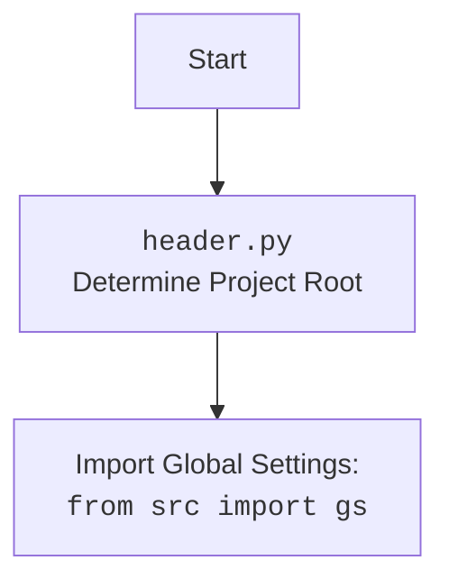

## ИНСТРУКЦИЯ:

Анализируй предоставленный код подробно и объясни его функциональность. Ответ должен включать три раздела:  

1. **<алгоритм>**: Опиши рабочий процесс в виде пошаговой блок-схемы, включая примеры для каждого логического блока, и проиллюстрируй поток данных между функциями, классами или методами.  
2. **<mermaid>**: Напиши код для диаграммы в формате `mermaid`, проанализируй и объясни все зависимости, 
    которые импортируются при создании диаграммы. 
    **ВАЖНО!** Убедитесь, что все имена переменных, используемые в диаграмме `mermaid`, 
    имеют осмысленные и описательные имена. Имена переменных вроде `A`, `B`, `C`, и т.д., не допускаются!  
    
    **Дополнительно**: Если в коде есть импорт `import header`, добавьте блок `mermaid` flowchart, объясняющий `header.py`:\
    ```mermaid
    flowchart TD
        Start --> Header[<code>header.py</code><br> Determine Project Root]
    
        Header --> import[Import Global Settings: <br><code>from src import gs</code>] 
    ```

3. **<объяснение>**: Предоставьте подробные объяснения:  
   - **Импорты**: Их назначение и взаимосвязь с другими пакетами `src.`.  
   - **Классы**: Их роль, атрибуты, методы и взаимодействие с другими компонентами проекта.  
   - **Функции**: Их аргументы, возвращаемые значения, назначение и примеры.  
   - **Переменные**: Их типы и использование.  
   - Выделите потенциальные ошибки или области для улучшения.  

Дополнительно, постройте цепочку взаимосвязей с другими частями проекта (если применимо).  

Это обеспечивает всесторонний и структурированный анализ кода.
## Формат ответа: `.md` (markdown)
**КОНЕЦ ИНСТРУКЦИИ**

### <алгоритм>
1.  **Определение Корневой Директории Проекта (`set_project_root`):**
    *   Начало: Получение абсолютного пути к текущему файлу и его родительской директории.
    *   Итерация по родительским директориям:
        *   Проверка наличия любого из "маркерных файлов" (`__root__`, `.git`) в текущей директории.
            *   Пример: `Path('/path/to/project/src').exists()` проверяет наличие файла или директории `src` в `/path/to/project`.
        *   Если маркерный файл найден:
            *   Установка текущей директории в качестве корневой директории проекта.
            *   Завершение итерации.
        *   Если маркерный файл не найден:
            *   Переход к родительской директории.
    *   Добавление корневой директории в `sys.path` (если её там нет).
    *   Возврат корневой директории.
2.  **Инициализация Глобальных Переменных:**
    *   Определение корневой директории проекта.
    *   Импорт глобальных настроек из `src.gs`.
    *   Загрузка настроек из `settings.json` (если файл существует и корректный JSON).
    *   Загрузка документации из `README.MD` (если файл существует).
    *   Инициализация глобальных переменных (`__project_name__`, `__version__`, `__doc__`, `__details__`, `__author__`, `__copyright__`, `__cofee__`)  значениями из загруженных настроек или значениями по умолчанию.

### <mermaid>
```mermaid
flowchart TD
    Start --> set_project_root_func[<code>set_project_root()</code><br>Determine Project Root]
    set_project_root_func --> find_parent_dirs[Iterate through parent directories]
    find_parent_dirs -- Marker file found --> set_root[Set project root path]
    find_parent_dirs -- Marker file not found --> continue_iteration[Continue iteration]
    continue_iteration --> find_parent_dirs
    set_root --> add_root_to_sys_path[Add root to <code>sys.path</code>]
    add_root_to_sys_path --> return_root_path[Return root path]
    
    return_root_path --> Init_root[Initialize  <code>__root__</code>]
    Init_root --> import_gs[Import Global Settings: <br><code>from src import gs</code>]
    import_gs --> load_settings[Load settings from <code>settings.json</code>]
    load_settings --> load_doc[Load documentation from <code>README.MD</code>]
    load_doc --> init_global_vars[Initialize Global Variables]
    init_global_vars --> End
    
    classDef current fill:#f9f,stroke:#333,stroke-width:2px
    class set_project_root_func,find_parent_dirs,set_root,add_root_to_sys_path,return_root_path current
    
     
    subgraph Loading Settings
     load_settings
     load_doc
    end
    
     
```



**Объяснение зависимостей:**

*   `set_project_root_func`:  Функция `set_project_root` определяет корневую директорию проекта путем поиска "маркерных" файлов.
*   `find_parent_dirs`:  Этот блок представляет цикл, в котором происходит итерация по родительским директориям, начиная с директории, где находится файл `header.py`.
*    `set_root`:  Устанавливает найденную директорию в качестве корневой директории проекта.
*   `add_root_to_sys_path`:  Добавляет корневую директорию в список путей поиска модулей `sys.path`, если ее там нет.
*   `return_root_path`: Функция возвращает корневую директорию.
*   `Init_root`:  Инициализирует глобальную переменную `__root__` путем присваивания ей значения возвращенной корневой директории.
*   `import_gs`:  Импортирует глобальные настройки из модуля `src.gs`, которые используются для доступа к другим частям проекта.
*   `load_settings`:  Загружает настройки проекта из файла `settings.json`.
*   `load_doc`: Загружает описание проекта из файла `README.MD`.
*   `init_global_vars`:  Инициализирует глобальные переменные, такие как `__project_name__`, `__version__`, `__doc__`, и т.д., либо значениями из настроек, либо значениями по умолчанию.

### <объяснение>
**Импорты:**

*   `sys`: Модуль `sys` используется для доступа к системным переменным и функциям, в частности, для добавления пути к корневой директории проекта в `sys.path`.
*   `json`: Модуль `json` используется для работы с данными в формате JSON, в данном случае для загрузки настроек из файла `settings.json`.
*   `packaging.version.Version`: Модуль `Version` используется для сравнения версий проекта.
*   `pathlib.Path`: Модуль `Path` используется для работы с путями к файлам и директориям в объектно-ориентированном стиле.
*   `from src import gs`: Импортирует модуль `gs` из пакета `src`. Модуль `gs` вероятно содержит глобальные настройки и константы проекта, включая пути к директориям проекта (`gs.path.root`).

**Функции:**

*   `set_project_root(marker_files: tuple = ('__root__', '.git')) -> Path`:
    *   **Аргументы**:
        *   `marker_files`: Кортеж строк, представляющих имена файлов или директорий, которые используются для определения корневой директории проекта. По умолчанию это (`'__root__'`, `'.git'`).
    *   **Возвращаемое значение**:
        *   Объект `Path`, представляющий путь к корневой директории проекта. Если маркерные файлы не найдены, возвращается путь к директории, где находится скрипт.
    *   **Назначение**:
        *   Функция определяет корневую директорию проекта, начиная с директории, в которой находится файл, и поднимаясь вверх по иерархии директорий. Поиск останавливается, когда в одной из директорий найден один из "маркерных" файлов (`__root__`, `.git`).
    *   **Примеры**:
        *   Если текущий файл находится в `/path/to/project/src/goog/header.py`, а маркерный файл `__root__` находится в `/path/to/project`, функция вернет `Path('/path/to/project')`.
        *   Если ни один из маркерных файлов не найден, функция вернет `Path('/path/to/project/src/goog')`.
    *   **Поток данных:**
          1.  Получает путь к текущему файлу.
          2.  Находит родительские директории.
          3.  Проверяет наличие маркерных файлов в каждой директории.
          4.  Устанавливает корневую директорию и добавляет ее в `sys.path`.

**Переменные:**

*   `__root__`:  Глобальная переменная типа `Path`, представляющая корневую директорию проекта.
*   `settings`: Глобальная переменная типа `dict`, которая содержит настройки проекта загруженные из файла `settings.json`
*    `doc_str`: Глобальная переменная типа `str`, которая содержит документацию проекта загруженную из файла `README.MD`
*   `__project_name__`: Глобальная переменная типа `str`, представляющая имя проекта. Значение берется из файла `settings.json` или установлено по умолчанию `hypotez`.
*   `__version__`: Глобальная переменная типа `str`, представляющая версию проекта. Значение берется из файла `settings.json` или установлено по умолчанию `''`.
*   `__doc__`: Глобальная переменная типа `str`, представляющая описание проекта. Значение берется из файла `README.MD` или установлено по умолчанию `''`.
*    `__details__`: Глобальная переменная типа `str`, представляющая дополнительные сведения о проекте.
*   `__author__`: Глобальная переменная типа `str`, представляющая автора проекта. Значение берется из файла `settings.json` или установлено по умолчанию `''`.
*   `__copyright__`: Глобальная переменная типа `str`, представляющая информацию об авторских правах проекта. Значение берется из файла `settings.json` или установлено по умолчанию `''`.
*   `__cofee__`: Глобальная переменная типа `str`, представляющая призыв поддержать разработчика. Значение берется из файла `settings.json` или установлено значение по умолчанию.

**Потенциальные ошибки и области для улучшения:**

*   **Обработка исключений**: Исключения `FileNotFoundError` и `json.JSONDecodeError` обрабатываются с помощью `...`, что не является информативным. Лучше добавить логирование ошибок или использовать значение по умолчанию.
*   **Зависимость от `settings.json`**:  Если файл `settings.json` отсутствует или не содержит необходимые ключи, программа использует значения по умолчанию. Было бы полезно предусмотреть механизм для создания файла с настройками по умолчанию или сообщить пользователю о проблеме.
*   **Поиск маркерных файлов**: При поиске корневой директории используется лишь пара маркерных файлов (`__root__`, `.git`). Возможно, стоит сделать список маркерных файлов настраиваемым параметром.
*   **Не используется `packaging.version.Version`**: Импорт `from packaging.version import Version` есть, но класс `Version` нигде не используется. Его можно было бы использовать для валидации и сравнения версий.
*   **Отсутствует проверка типа переменных**: Не выполняется проверка соответствия типов переменных данным, считанным из `settings.json`. Было бы полезно добавить проверки типов перед присвоением.

**Цепочка взаимосвязей:**

1.  `header.py` импортирует `src.gs`, предоставляя доступ к глобальным настройкам и путям.
2.  `header.py` определяет корневую директорию проекта и добавляет её в `sys.path`, позволяя импортировать модули из корневой директории.
3.  `header.py` загружает настройки из `settings.json`, влияя на значения глобальных переменных, используемых в других частях проекта.
4.  Глобальные переменные, инициализированные в `header.py`,  используются в других частях проекта для определения имени проекта, версии, документации и других параметров.

Таким образом, `header.py` выступает как центральная точка конфигурации и инициализации для всего проекта.