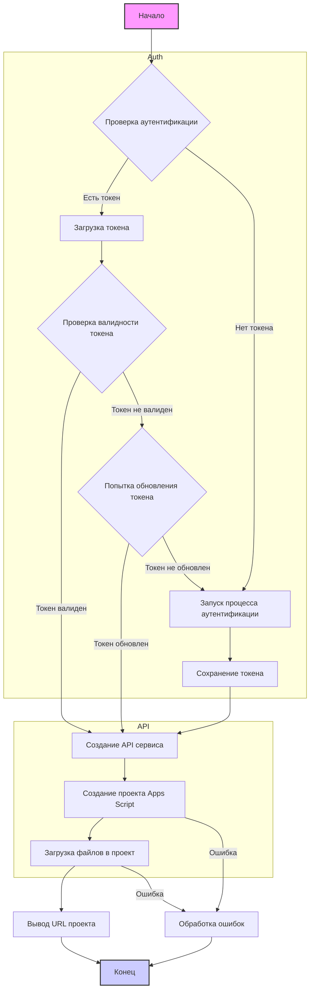

## ИНСТРУКЦИЯ:

Анализируй предоставленный код подробно и объясни его функциональность. Ответ должен включать три раздела:

1.  **<алгоритм>**: Опиши рабочий процесс в виде пошаговой блок-схемы, включая примеры для каждого логического блока, и проиллюстрируй поток данных между функциями, классами или методами.
2.  **<mermaid>**: Напиши код для диаграммы в формате `mermaid`, проанализируй и объясни все зависимости,
    которые импортируются при создании диаграммы.
    **ВАЖНО!** Убедитесь, что все имена переменных, используемые в диаграмме `mermaid`,
    имеют осмысленные и описательные имена. Имена переменных вроде `A`, `B`, `C`, и т.д., не допускаются!

    **Дополнительно**: Если в коде есть импорт `import header`, добавьте блок `mermaid` flowchart, объясняющий `header.py`:\
    ```mermaid
    flowchart TD
        Start --> Header[<code>header.py</code><br> Determine Project Root]

        Header --> import[Import Global Settings: <br><code>from src import gs</code>]
    ```

3.  **<объяснение>**: Предоставьте подробные объяснения:
    -   **Импорты**: Их назначение и взаимосвязь с другими пакетами `src.`.
    -   **Классы**: Их роль, атрибуты, методы и взаимодействие с другими компонентами проекта.
    -   **Функции**: Их аргументы, возвращаемые значения, назначение и примеры.
    -   **Переменные**: Их типы и использование.
    -   Выделите потенциальные ошибки или области для улучшения.

Дополнительно, постройте цепочку взаимосвязей с другими частями проекта (если применимо).

Это обеспечивает всесторонний и структурированный анализ кода.
## Формат ответа: `.md` (markdown)
**КОНЕЦ ИНСТРУКЦИИ**

## <алгоритм>



**Примеры:**

*   **AuthCheck**: Проверяет наличие файла `token.json` в каталоге `tmp`.
*   **LoadCreds**: Загружает учетные данные из файла `e-cat-346312-137284f4419e.json`.
*   **CredsValid**: Проверяет, является ли загруженный токен действительным.
*   **RefreshToken**: Пытается обновить токен, если он истек.
*   **AuthFlow**: Запускает процесс аутентификации через браузер, если токен отсутствует или недействителен.
*   **SaveCreds**: Сохраняет полученный токен в файл `token.json`.
*   **CreateService**: Создает объект сервиса Apps Script API для выполнения запросов.
*   **CreateProject**: Создает новый проект Apps Script с названием 'My Script'.
*   **UploadFiles**: Загружает файлы `hello` (с кодом JavaScript) и `appsscript` (с манифестом) в проект.
*   **PrintURL**: Выводит URL-адрес для редактирования проекта Apps Script.
*   **ErrorHandler**: Выводит содержимое ошибки, если что-то пошло не так при запросах к API.

## <mermaid>

```mermaid
flowchart TD
    Start --> ImportModules[Импорт модулей: <br><code>pathlib, google.auth, googleapiclient, header, src.gs</code>];
    ImportModules --> DefineScopes[Определение области доступа: <br><code>SCOPES</code>];
    DefineScopes --> DefineSampleCode[Определение примера кода: <br><code>SAMPLE_CODE</code>];
     DefineSampleCode --> DefineSampleManifest[Определение примера манифеста: <br><code>SAMPLE_MANIFEST</code>];
    DefineSampleManifest --> mainFunc[Функция <code>main()</code>];
    
    subgraph mainFunc
    mainFunc --> InitCreds[Инициализация <code>creds = None</code>]
    InitCreds --> CheckTokenFile[Проверка наличия файла токена];
    CheckTokenFile -- Файл найден --> LoadCreds[Загрузка токена];
    CheckTokenFile -- Файл не найден --> AuthFlow[Запуск аутентификации];
    LoadCreds --> ValidateCreds[Проверка валидности токена];
     ValidateCreds -- Токен валиден --> CreateService[Создание сервиса Script API];
    ValidateCreds -- Токен не валиден --> RefreshToken[Обновление токена]
    RefreshToken -- Токен обновлен --> CreateService
    RefreshToken -- Токен не обновлен --> AuthFlow
    AuthFlow --> SaveCreds[Сохранение токена]
     SaveCreds --> CreateService
    CreateService --> CreateProject[Создание проекта Apps Script];
    CreateProject --> UploadFiles[Загрузка файлов];
     UploadFiles --> PrintProjectURL[Вывод URL проекта];
     CreateProject -- Ошибка --> PrintError[Вывод ошибки]
     UploadFiles -- Ошибка --> PrintError
     
        end
    
     
      PrintError --> End[Конец]
    PrintProjectURL --> End
    
    
        
    subgraph header.py
    StartHeader --> Header[<code>header.py</code><br> Determine Project Root]
    
        Header --> ImportGS[Import Global Settings: <br><code>from src import gs</code>]
        ImportGS --> EndHeader
    end
    
    style Start fill:#f9f,stroke:#333,stroke-width:2px
    style End fill:#ccf,stroke:#333,stroke-width:2px
```

**Зависимости:**

*   `pathlib`: Используется для работы с файловыми путями (например, `token_path`).
*   `google.auth.transport.requests`: Используется для запросов авторизации Google API.
*   `google.oauth2.credentials`: Используется для управления учетными данными пользователя (токены доступа).
*   `google_auth_oauthlib.flow`: Используется для процесса аутентификации OAuth 2.0.
*   `googleapiclient.errors`: Используется для обработки ошибок, возвращаемых Google API.
*   `googleapiclient.discovery`: Используется для создания сервиса Google API.
*   `header`: Кастомный модуль проекта, который определяет корень проекта.
*   `src.gs`: Глобальные настройки проекта, получаемые через модуль `header.py`.

## <объяснение>

### Импорты

*   `pathlib`: Модуль для работы с файлами и директориями, используется для создания пути к файлу токена (`token_path = gs.path.tmp / 'e-cat-346312-137284f4419e.json'`).
*   `google.auth.transport.requests`: Модуль для создания HTTP запросов, используется при обновлении токена (`creds.refresh(Request())`).
*   `google.oauth2.credentials`: Модуль для работы с учетными данными, используется для загрузки токена (`Credentials.from_authorized_user_file(token_path, SCOPES)`) и сохранения (`token.write(creds.to_json())`).
*   `google_auth_oauthlib.flow`: Модуль для работы с OAuth2 авторизацией, используется для получения учетных данных пользователя (`InstalledAppFlow.from_client_secrets_file('credentials.json', SCOPES)`).
*   `googleapiclient.errors`: Модуль для обработки ошибок API (`except errors.HttpError as error:`).
*   `googleapiclient.discovery`: Модуль для создания экземпляра сервиса API (`service = build('script', 'v1', credentials=creds)`).
*   `header`: Пользовательский модуль для определения корня проекта.  `header.py` определяет корень проекта и выполняет импорт глобальных настроек из `src.gs`.
*   `src.gs`: Глобальные настройки проекта, в частности, используется `gs.path` для получения пути к временной директории.

### Переменные

*   `SCOPES`: Список областей доступа к Google API, необходимых для работы скрипта.
*   `SAMPLE_CODE`: Пример кода Apps Script, который будет загружен в проект.
*   `SAMPLE_MANIFEST`: Пример манифеста Apps Script, определяющий настройки проекта.
*   `creds`: Экземпляр класса `Credentials` для хранения учетных данных пользователя.
*   `token_path`: Путь к файлу, в котором сохраняются токены доступа.
*   `service`: Экземпляр сервиса Apps Script API.
*    `request`: Словарь, содержащий данные запроса к API, например, название проекта, файлы для загрузки.
*   `response`: Словарь, содержащий ответ от API, например, идентификатор проекта, результат загрузки файлов.

### Функции

*   `main()`: Основная функция скрипта.
    *   **Алгоритм:**
        1.  Инициализирует переменную `creds` в `None`.
        2.  Проверяет наличие файла `token.json`.
        3.  Если файл существует, пытается загрузить учетные данные из него.
        4.  Если файл не существует или токен недействителен, запускается процесс авторизации OAuth 2.0.
        5.  После успешной авторизации или загрузки токена создается сервис Apps Script API.
        6.  Создается новый проект Apps Script.
        7.  В проект загружаются два файла: код скрипта и манифест.
        8.  Выводится URL проекта.
        9.  Обрабатываются возможные ошибки.
    *   **Возвращаемое значение:** `None`.
    *   **Пример**:
        ```python
        main()
        ```

### Классы

В данном коде используются классы из сторонних библиотек:

*   `Credentials`: Класс для хранения учетных данных пользователя, полученных от Google OAuth 2.0.
*   `InstalledAppFlow`: Класс для автоматизации процесса авторизации через браузер.

### Потенциальные ошибки и области для улучшения

*   Обработка ошибок: в коде имеется только общая обработка `errors.HttpError`.  Необходимо добавить более конкретную обработку для разных типов ошибок API (например, ошибки авторизации, ошибки квот, ошибки валидации входных данных).
*   Хранение токенов: использование файла `token.json` для хранения токенов в одном каталоге не является лучшей практикой.  Было бы лучше использовать более защищенное хранилище, особенно если скрипт используется в продакшене. Можно использовать `keyring`.
*   Управление ресурсами: код не обрабатывает закрытие ресурсов. Можно было бы использовать контекстный менеджер для `service = build('script', 'v1', credentials=creds)`

### Связь с другими частями проекта

*   `header.py`: Этот модуль определяет корень проекта и импортирует глобальные настройки, которые хранятся в `src.gs`.
*   `src.gs`: Глобальные настройки проекта, такие как пути, переменные окружения и т.д. `gs.path.tmp` используется для получения пути к временному файлу.
*   `credentials.json`: Файл с учетными данными OAuth 2.0 для авторизации, используется для запроса доступа к API.
*   `token.json`: Файл для сохранения токена доступа после первой авторизации.

В целом код выполняет свою задачу по созданию и загрузке проекта в Apps Script, но его можно улучшить в плане обработки ошибок, управления ресурсами и безопасности.