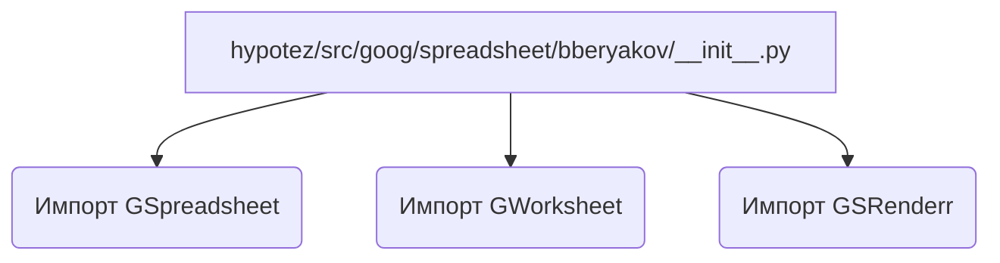
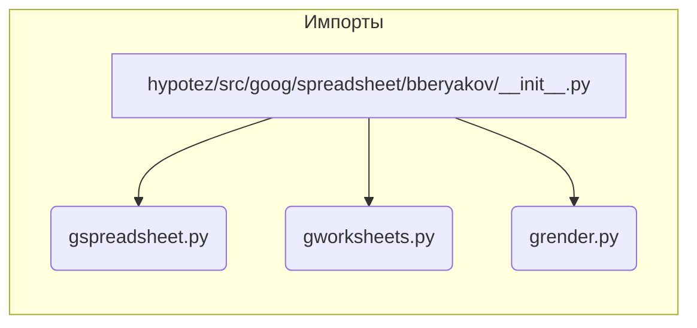

# Анализ файла `hypotez/src/goog/spreadsheet/bberyakov/__init__.py`

**1. <input code>**

```python
## \file hypotez/src/goog/spreadsheet/bberyakov/__init__.py
# -*- coding: utf-8 -*-\

#! venv/bin/python/python3.12

"""
.. module: src.goog.spreadsheet.bberyakov 
	:platform: Windows, Unix
	:synopsis:

"""


from .gspreadsheet import GSpreadsheet
from .gworksheets import GWorksheet
from .grender import GSRenderr
```

**2. <algorithm>**

Этот файл является инициализирующим модулем для пакета `bberyakov` внутри подпакета `spreadsheet` в `goog`.  Он не содержит алгоритма в традиционном смысле, а скорее импортирует необходимые классы и функции из других модулей.  Никакой обработки данных или логики нет, только импорт.

**Пример:**  Если в другом модуле используется `GSpreadsheet`, то он будет импортирован из `gspreadsheet.py`.

**Блок-схема:**

(В данном случае блок-схема проста и представляет собой импорт. Никакой обработки данных и ветвлений нет.)




**3. <mermaid>**



**4. <explanation>**

* **Импорты:**
    * `from .gspreadsheet import GSpreadsheet`: Импортирует класс `GSpreadsheet` из модуля `gspreadsheet.py` внутри текущего пакета.  Вероятнее всего, `gspreadsheet.py` содержит реализацию работы с Google Spreadsheets API.
    * `from .gworksheets import GWorksheet`: Импортирует класс `GWorksheet` из модуля `gworksheets.py`. Вероятно, этот класс отвечает за работу с отдельными листами (worksheets) внутри Google Spreadsheets.
    * `from .grender import GSRenderr`: Импортирует класс `GSRenderr` из модуля `grender.py`. Это, вероятно, класс для рендеринга данных, полученных из Google Sheets (например, для вывода на экран, в отчеты и т.д.).

    Все импорты относительные (`from . ...`), что означает, что они ищутся внутри текущего пакета `bberyakov`.

* **Классы:**
    * `GSpreadsheet`, `GWorksheet`, `GSRenderr`:  Эти классы, вероятно, представляют собой абстракции для взаимодействия с различными компонентами Google Spreadsheets API.

* **Функции:**
    Нет функций.  Этот файл — инициализирующий модуль, который импортирует необходимые элементы, но не выполняет никакой логики.

* **Переменные:**
    * ``: Эта переменная, скорее всего, конфигурационная, определяющая режим работы (например, "dev" для разработки, "prod" для производства). Ее значение может влиять на поведение других частей приложения, например, определяя, какие данные загружать или куда писать логгирование.

* **Возможные ошибки или области для улучшений:**
    * Нет явных ошибок, но отсутствие документации (документированных строк, `docstring`-ов) внутри этого файла и связанных с ним модулей может затруднить понимание их назначения и использования для других разработчиков.

* **Взаимосвязи с другими частями проекта:**
    * Файл `hypotez/src/goog/spreadsheet/bberyakov/__init__.py` является точкой входа для использования библиотек работы с Google Spreadsheets.  Он зависит от модулей `gspreadsheet.py`, `gworksheets.py` и `grender.py` из того же пакета `bberyakov`.  Эти модули, скорее всего, используют библиотеки для взаимодействия с Google API.