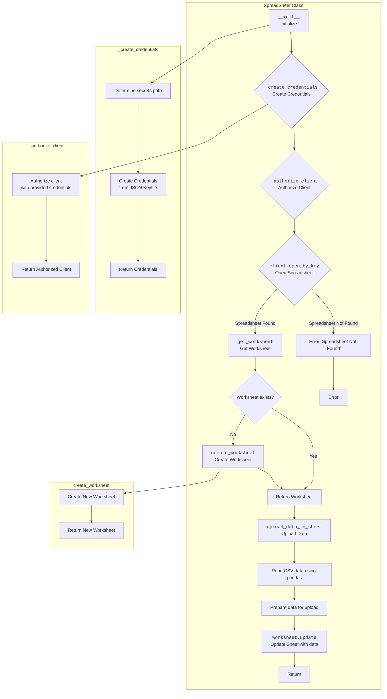

## АНАЛИЗ КОДА: `src/goog/spreadsheet/spreadsheet.py`

### 1. <алгоритм>

**Блок-схема работы с Google Sheets:**

1. **Инициализация `SpreadSheet`:**
   - Пример: `google_sheet_handler = SpreadSheet(spreadsheet_id='some_id', sheet_name='Sheet1')`
   - Создается объект `SpreadSheet` с указанным `spreadsheet_id` (или `None` для создания нового) и `sheet_name`.
   - Вызывается метод `_create_credentials()` для получения учетных данных из JSON-файла.
   - Вызывается метод `_authorize_client()` для авторизации клиента Google Sheets API.
   - Если `spreadsheet_id` указан, происходит попытка открыть существующую таблицу через `client.open_by_key(self.spreadsheet_id)`. Если таблица не найдена, возбуждается исключение.

2. **`_create_credentials()`:**
   - Определяется путь к файлу учетных данных (`creds_file`) через `gs.path.secrets`. 
   - Указываются `SCOPES` (области доступа) для Google Sheets и Google Drive API.
   - Создаются учетные данные `ServiceAccountCredentials` из JSON-файла с помощью `from_json_keyfile_name`.
   - Возвращаются учетные данные.

3. **`_authorize_client()`:**
   - Создается и авторизуется клиент Google Sheets API с помощью `gspread.authorize(self.credentials)`.
   - Возвращается авторизованный клиент.

4. **`get_worksheet()`:**
    - Пример: `worksheet = google_sheet_handler.get_worksheet('Sheet1')`
    - Пытается получить лист из таблицы по имени `worksheet_name` через `self.spreadsheet.worksheet(worksheet_name)`.
    - Если лист не найден, вызывается `create_worksheet(worksheet_name)` для его создания.
    - Возвращает объект листа.

5. **`create_worksheet()`:**
   - Пример: `worksheet = google_sheet_handler.create_worksheet('New Sheet', {'rows': 50, 'cols': 5})`
   - Создаёт новый лист в Google Sheets с именем `title` и размерами, указанными в `dim`.
   - Возвращает созданный объект листа.
   
6.  **`copy_worksheet()`:**
    - Пример: `worksheet = google_sheet_handler.copy_worksheet('Sheet1','Sheet2')`
    - Получает объект листа `from_worksheet` из таблицы.
    - Дублирует лист с новым именем `to_worksheet`.
    - Возвращает объект дублированного листа.
 
7. **`upload_data_to_sheet()`:**
   - Проверяется, установлен ли путь к файлу данных (`self.data_file`) и существует ли файл. Если нет, возбуждается исключение `ValueError`.
   - Читаются данные из CSV-файла в pandas DataFrame.
   - Преобразуются данные DataFrame в список списков, включая заголовки столбцов.
   - Вызывается метод `update` объекта листа для загрузки данных, начиная с ячейки 'A1'.
   
8.  **Пример использования:**
    - Из `__main__` создается объект `SpreadSheet`, указывая `spreadsheet_id=None` для создания новой таблицы.
    - Вызывается `upload_data_to_sheet()` для загрузки данных.

### 2. <mermaid>

**Объяснение зависимостей в `mermaid`:**

- **`SpreadSheet Class`**: Основной класс, инкапсулирующий логику работы с Google Sheets.
  - `__init__`: Метод инициализации класса, который вызывает методы для создания учетных данных, авторизации клиента и открытия таблицы.
  - `_create_credentials`: Создает учетные данные для доступа к Google Sheets API.
  - `_authorize_client`: Авторизует клиент Google Sheets API.
  - `client.open_by_key`: Открывает существующую Google Sheet по ее ID или выводит ошибку `SpreadsheetNotFound`.
  - `get_worksheet`: Получает или создает лист в таблице.
  - `create_worksheet`: Создает новый лист, если он не существует.
  - `upload_data_to_sheet`: Загружает данные из CSV-файла в Google Sheet.
  
- **`_create_credentials`**:
  - `Determine secrets path` : Определяет путь к файлу секретов `gs.path.secrets`.
  - `Create Credentials from JSON Keyfile` : Создает учетные данные на основе `json` файла и `SCOPES`.
  - `Return Credentials` : Возвращает созданные учетные данные для авторизации клиента.
  
- **`_authorize_client`**:
  - `Authorize client with provided credentials` : Авторизует клиент с помощью созданных учетных данных.
  - `Return Authorized Client` : Возвращает авторизованный клиент.
  
- **`create_worksheet`**:
  - `Create New Worksheet` : Создаёт новый лист на основе запроса.
  - `Return New Worksheet` : Возвращает новый лист.

### 3. <объяснение>

**Импорты:**

-   `from pathlib import Path`: Используется для работы с путями к файлам в виде объектов, упрощает создание и управление путями.
-   `import gspread`: Основная библиотека для работы с Google Sheets API.
-   `from gspread import Spreadsheet, Worksheet`: Импортирует классы `Spreadsheet` и `Worksheet` из `gspread`, используемые для работы с таблицами и листами.
-   `from oauth2client.service_account import ServiceAccountCredentials`: Импортирует класс `ServiceAccountCredentials` для аутентификации через JSON-файл учетных данных.
-   `import pandas as pd`: Библиотека для работы с табличными данными, используется для чтения CSV-файлов и преобразования их в DataFrame.
-   `from src.logger.logger import logger`: Импортирует логгер из пакета `src.logger`, используемого для записи сообщений о событиях и ошибках.
-   `from src import gs`: Импортирует глобальные настройки проекта.
-  `from src.utils.printer import pprint`: Импортирует функцию `pprint` для более наглядного вывода данных, используется для отладки.

**Класс `SpreadSheet`:**

-   **Назначение**: Предоставляет интерфейс для работы с Google Sheets API, включая создание таблиц, управление листами и загрузку данных.
-   **Атрибуты**:
    -   `spreadsheet_id`: (str | None) ID существующей таблицы Google Sheets. Если `None`, создается новая таблица.
    -   `spreadsheet_name`: (str | None) Название новой таблицы Google Sheets, если `spreadsheet_id` не указан.
    -   `spreadsheet`: (Spreadsheet) Объект таблицы Google Sheets.
    -   `data_file`: (Path) Путь к CSV-файлу с данными.
    -   `sheet_name`: (str) Имя листа в Google Sheets.
    -   `credentials`: (ServiceAccountCredentials) Учетные данные для доступа к Google Sheets API.
    -   `client`: (gspread.Client) Авторизованный клиент Google Sheets API.
    -   `worksheet`: (Worksheet) Объект листа Google Sheets.
    -   `create_sheet`: (bool) Флаг для создания листа, если он не существует.
-   **Методы**:
    -   `__init__(spreadsheet_id: str, *args, **kwards)`: Конструктор класса, который принимает `spreadsheet_id`, создает учетные данные, авторизует клиента и открывает таблицу.
    -   `_create_credentials()`: Создает учетные данные на основе JSON-файла, используя путь к файлу секретов, определенный в глобальных настройках.
    -   `_authorize_client()`: Авторизует клиент Google Sheets API с помощью полученных учетных данных.
    -  `get_worksheet(worksheet_name: str | Worksheet) -> Worksheet | None`: Получает лист из таблицы по имени или создаёт новый.
    -   `create_worksheet(title:str, dim:dict = {'rows':100,'cols':10}) -> Worksheet | None`: Создаёт новый лист с именем title и размерностью dim.
    -  `copy_worksheet(from_worksheet: str, to_worksheet: str)`: Создает копию существующего листа.
    -  `upload_data_to_sheet()`: Загружает данные из CSV-файла в Google Sheet.
    

**Функции:**

-   В данном коде есть только методы класса `SpreadSheet`.
-  Функция `main` расположена в разделе  `if __name__ == "__main__":`, данный код демонстрирует создание объекта `SpreadSheet` и вызов метода `upload_data_to_sheet()` для загрузки данных.

**Переменные:**

-   Глобальные переменные:
    -  `SCOPES`: Список областей доступа к Google API, необходимых для работы с таблицами и диском.
-   Переменные класса:
    - `spreadsheet_id`, `spreadsheet_name`, `spreadsheet`, `data_file`, `sheet_name`, `credentials`, `client`, `worksheet`, `create_sheet` - атрибуты экземпляра класса `SpreadSheet`.
    
**Потенциальные ошибки и улучшения:**

-   **Обработка ошибок:**
    -   В блоках `try-except` не всегда обрабатываются конкретные типы исключений, что затрудняет отладку. Рекомендуется уточнить типы исключений, например `gspread.exceptions.APIError`, для более точной обработки.
    -   Исключение `gspread.exceptions.SpreadsheetNotFound` уже обрабатывается, но можно добавить логику, например, создание новой таблицы, если это необходимо.
-   **Безопасность:**
    -   Хранение пути к файлу учетных данных в коде является потенциальной угрозой безопасности. Рекомендуется использовать переменные окружения или другие методы для безопасного хранения конфиденциальной информации.
    -  `creds_file`  должен создаваться программно, например в `tmp` директории и не быть частью проекта.
-   **Общие улучшения:**
    -   Добавить возможность работы с различными форматами данных, например, Excel.
    -   Улучшить валидацию входных данных, например, проверять, является ли `spreadsheet_id` допустимым.
    -   Расширить функциональность класса, например, добавить возможность загрузки данных из DataFrame, а не только из CSV.
    -    Реализовать асинхронные операции с Google Sheets, чтобы не блокировать выполнение программы при длительных операциях.

**Взаимосвязь с другими частями проекта:**

-   `src.logger.logger`: используется для логирования событий и ошибок, что важно для отладки и мониторинга.
-   `src`: Пакет, содержащий настройки и глобальные переменные.
- `src.utils.printer`: Выводит данные на экран.
-   `gs.path.secrets`: используется для хранения пути к секретному файлу, что обеспечивает более структурированное управление конфигурацией.
-   `oauth2client`: Обеспечивает авторизацию в Google API через сервисный аккаунт.
-   `gspread`: Обеспечивает связь с Google Sheets.

В целом, этот код предоставляет базовую функциональность для работы с Google Sheets. Его можно усовершенствовать, добавив обработку ошибок, повысив безопасность и расширив функциональные возможности.