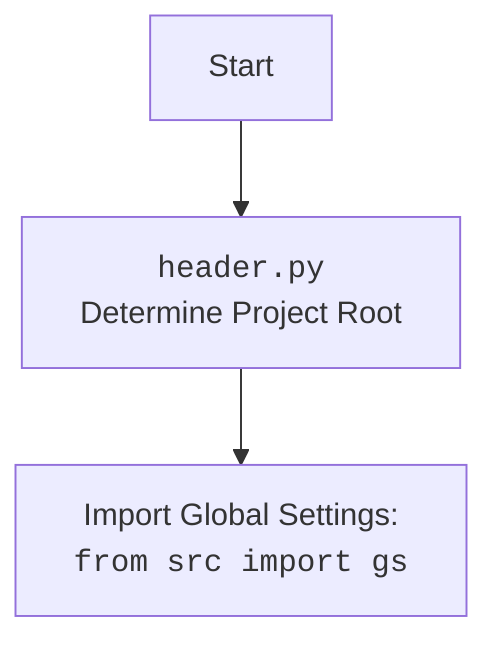

## АНАЛИЗ КОДА: `hypotez/src/goog/text_to_speech/header.py`

### <алгоритм>

1.  **Начало:**
    *   Импортируются необходимые модули: `sys`, `json`, `packaging.version.Version`, `pathlib.Path`.
    *   Определяется функция `set_project_root`, которая ищет корневую директорию проекта.
    
2.  **`set_project_root` Function:**
    *   Начало: Функция принимает `marker_files` (по умолчанию `('__root__', '.git')`) для определения корневой директории.
    *   Определение текущего пути: Получает абсолютный путь к директории, где находится файл `header.py`.
    *   Перебор родительских директорий: Проходит вверх по иерархии директорий от текущей.
        *   Проверка маркеров: На каждой итерации проверяет, есть ли в директории любой из файлов или директорий, указанных в `marker_files`.
        *   Если маркер найден: Устанавливает корневую директорию (`__root__`) и завершает цикл.
    *   Добавление в `sys.path`: Если корневая директория не в `sys.path`, добавляет её в начало списка для корректного импорта модулей.
    *   Возврат: Возвращает путь к корневой директории (`__root__`).
        
     *   Пример:
         *   Пусть файл `header.py` находится в `/home/user/project/src/goog/text_to_speech/header.py`.
         *   `marker_files` = `('__root__', '.git')`.
         *   Функция начнет проверку с `/home/user/project/src/goog/text_to_speech`, затем `/home/user/project/src/goog`, `/home/user/project/src` и т.д.
         *   Если в `/home/user/project` есть файл `__root__`, то она станет корневой. 
         *   Если нет, то поиск продолжится.
         *   Если ни одного маркера не найдено, то корневой будет считаться директория `header.py`.
         
3.  **Определение `__root__`:**
    *   Вызывает функцию `set_project_root` для определения корневой директории проекта и сохраняет результат в глобальной переменной `__root__`.
    
4.  **Импорт `gs`:**
    *   Импортирует модуль `gs` из пакета `src`, используя путь, добавленный в `sys.path`.
    
5. **Загрузка `settings.json`:**
   *   Пытается открыть и прочитать файл `settings.json` из каталога `src` относительно корневой директории.
   *   Если файл найден, загружает его содержимое в переменную settings.
   *   Если возникает ошибка `FileNotFoundError` или `json.JSONDecodeError`, выполняется `pass` (ничего не делает).
   
6. **Загрузка `README.MD`:**
   *  Пытается открыть и прочитать файл `README.MD` из каталога `src` относительно корневой директории.
   *   Если файл найден, загружает его содержимое в переменную `doc_str`.
   *   Если возникает ошибка `FileNotFoundError` или `json.JSONDecodeError`, выполняется `pass` (ничего не делает).
   
7.  **Инициализация глобальных переменных:**
    *   Инициализирует глобальные переменные `__project_name__`, `__version__`, `__doc__`, `__details__`, `__author__`, `__copyright__` и `__cofee__` на основе данных из `settings.json` или устанавливает значения по умолчанию.
    
8.  **Конец:**

### <mermaid>
```mermaid
flowchart TD
    Start[Start] --> FindRoot[<code>set_project_root()</code><br>Determine Project Root];
    FindRoot --> CheckMarkers[Check for Marker Files <br>(<code>__root__</code>, <code>.git</code>) in parent directories]
    CheckMarkers -- Marker Found --> SetRoot[Set Project Root]
    CheckMarkers -- No Marker --> UseCurrent[Use current directory]
    SetRoot --> AddToSysPath[Add Root to <code>sys.path</code>]
    UseCurrent --> AddToSysPath
    AddToSysPath --> ImportGS[Import Global Settings: <br><code>from src import gs</code>]
    ImportGS --> LoadSettings[Load <code>settings.json</code>]
    LoadSettings --> LoadReadme[Load <code>README.MD</code>]
    LoadReadme --> SetGlobalVars[Set Global Variables <br>(<code>__project_name__</code>, <code>__version__</code>, etc.)]
    SetGlobalVars --> End[End]
```



### <объяснение>

**Импорты:**

*   `sys`: Используется для работы с системными параметрами, такими как `sys.path`, что позволяет добавлять путь к корневой директории проекта для правильного импорта модулей.
*   `json`: Используется для загрузки данных из файла `settings.json`.
*   `packaging.version.Version`: Не используется в данном коде, но импортирован, возможно для будущей работы с версиями проекта.
*   `pathlib.Path`: Используется для представления путей к файлам и директориям в виде объектов, что упрощает работу с файловой системой.
*   `from src import gs`: Импортирует модуль `gs` из пакета `src`. Этот модуль, вероятно, содержит общие настройки и пути, необходимые для работы проекта. Он используется для получения пути к файлам `settings.json` и `README.MD`.

**Классы:**

*   В данном коде нет пользовательских классов, используется только класс `Path` из `pathlib`.

**Функции:**

*   `set_project_root(marker_files=('__root__', '.git')) -> Path`:
    *   **Аргументы:**
        *   `marker_files` (tuple):  Кортеж с именами файлов или директорий, которые указывают на корневую директорию проекта (по умолчанию `('__root__', '.git')`).
    *   **Возвращаемое значение:**
        *   `Path`: Объект `pathlib.Path`, представляющий путь к корневой директории проекта.
    *   **Назначение:**
        *   Эта функция определяет корневую директорию проекта путем поиска специальных файлов или директорий (маркеров) в родительских директориях от текущего файла. Это необходимо для того, чтобы код мог корректно находить другие модули и ресурсы проекта, независимо от того, где запускается скрипт.
    *   **Примеры:**
        *   Если файл `header.py` находится в `/home/user/project/src/goog/text_to_speech/header.py`, и в `/home/user/project` есть файл `__root__`, то функция вернет `/home/user/project`.
        *   Если ни один маркер не найден, функция вернёт директорию файла `header.py`:  `/home/user/project/src/goog/text_to_speech`

**Переменные:**

*   `__root__` (Path): Глобальная переменная, представляющая путь к корневой директории проекта. Используется для определения пути к другим ресурсам проекта.
*   `settings` (dict): Словарь, содержащий настройки проекта, загруженные из `settings.json`.
*   `doc_str` (str): Строка, содержащая текст из файла `README.MD`.
*   `__project_name__` (str): Название проекта, загруженное из `settings.json`, или "hypotez", если настройка не найдена.
*    `__version__` (str): Версия проекта, загруженная из `settings.json`, или пустая строка, если настройка не найдена.
*   `__doc__` (str): Текст из `README.MD` или пустая строка, если не удалось загрузить.
*   `__details__` (str): Пустая строка по умолчанию. Возможно, предназначена для хранения дополнительной информации о проекте.
*   `__author__` (str): Автор проекта, загруженный из `settings.json`, или пустая строка, если настройка не найдена.
*   `__copyright__` (str): Авторское право проекта, загруженное из `settings.json`, или пустая строка, если настройка не найдена.
*   `__cofee__` (str): Сообщение о поддержке разработчика, загруженное из `settings.json`, или сообщение по умолчанию.

**Потенциальные ошибки и области для улучшения:**

*   **Обработка ошибок:** При загрузке `settings.json` и `README.MD` используется `try-except` с `pass` для обработки ошибок `FileNotFoundError` и `json.JSONDecodeError`. Это означает, что если файлы не найдены или имеют неправильный формат, то ошибки будут просто проигнорированы, и переменные `settings` и `doc_str` останутся `None`. Возможно, лучше было бы логировать ошибки или выводить предупреждения, чтобы упростить отладку.
*   **Использование `...` в `except`:**  Использование `...` в блоке `except` может быть не очевидно для других разработчиков. Лучше использовать `pass` или добавить комментарий для пояснения.
*   **Зависимость от `settings.json` и `README.MD`:** Если эти файлы отсутствуют, проект может работать с настройками по умолчанию, но нет никакого оповещения об этом. Возможно, стоит добавить проверку на существование этих файлов перед попыткой их открытия.
*   **Неиспользуемый импорт `packaging.version.Version`**: Если не планируется использовать этот импорт в дальнейшем, то его лучше удалить.

**Цепочка взаимосвязей с другими частями проекта:**

1.  **`set_project_root`:** Эта функция устанавливает корневую директорию, от которой зависят все остальные модули и файлы проекта.
2.  **`from src import gs`:**  Импорт `gs` позволяет получить доступ к общим настройкам и путям, что важно для загрузки конфигурации.
3.  **`settings.json`:** Файл настроек, который содержит общую информацию о проекте (название, версия, автор и т.д.) и используется для инициализации глобальных переменных.
4.  **`README.MD`:** Файл документации, текст из которого используется для инициализации переменной `__doc__`.

Таким образом, данный файл `header.py` играет ключевую роль в инициализации проекта, определении корневой директории и загрузке основных параметров из конфигурационных файлов.