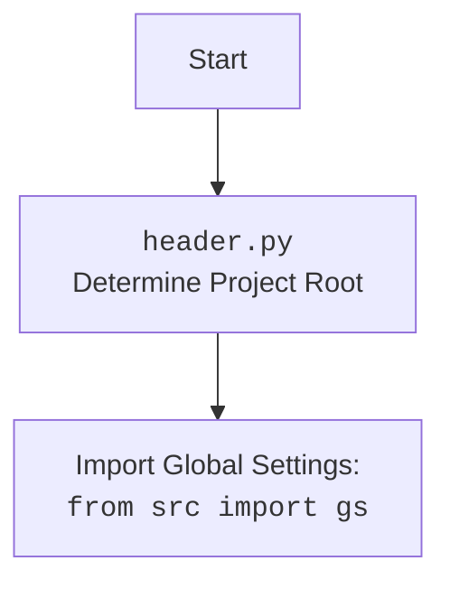

## АНАЛИЗ КОДА

### <алгоритм>
1. **Загрузка настроек проекта:**
    - Открыть файл `settings.json` в режиме чтения.
    - Загрузить JSON-данные из файла в переменную `settings`.
    - Извлечь имя проекта из `settings`, используя ключ `project_name`. Если ключ отсутствует, по умолчанию использовать `hypotez`.
    - *Пример:*  Если `settings.json` содержит `{"project_name": "my_project"}`, то `project_name` станет "my_project".
2. **Определение корневой директории проекта:**
   -  Получить текущую рабочую директорию с помощью `Path.cwd()`.
   -  Преобразовать ее в абсолютный путь с помощью `resolve()`.
   -  Найти индекс имени проекта в частях пути текущей директории (разделенных слешами).
        - *Пример:* Если `cwd()` возвращает  `'/home/user/my_project/src/gui/context_menu'`, а `project_name` это `'my_project'`, то `parts.index(project_name)` вернет 3.
   -  Получить родительскую директорию, индекс которой найден на предыдущем шаге, с помощью `parents[index]`.
        - *Пример:*  Для `/home/user/my_project/src/gui/context_menu`,  `parents[3]` вернет `/home/user/my_project`. Это корень проекта.
   -  Корневая директория сохраняется в переменной `__root__`.
   -  Добавить корневую директорию в `sys.path`, чтобы модули проекта можно было импортировать.
3.  **Определение путей к бинарным файлам:**
    -  Определить пути к каталогам с исполняемыми файлами GTK, FFmpeg и Graphviz, используя переменную `__root__`.
        - *Пример:*  `gtk_bin_path` станет  `'/home/user/my_project/bin/gtk/gtk-nsis-pack/bin'`.
4.  **Добавление путей в `sys.path`:**
    -  Создать список `paths_to_add` из путей к бинарным файлам (GTK, FFmpeg, Graphviz).
    -  Получить текущие пути из `sys.path` в виде множества объектов `Path`.
    -  Проитерировать `paths_to_add` и проверить, есть ли каждый бинарный путь в `current_paths`.
        - Если пути нет, то добавить его в начало `sys.path`.
5. **Настройка переменной окружения для WeasyPrint:**
    - Определить имя переменной `sys_path_env_var` - `WEASYPRINT_DLL_DIRECTORIES`.
    - Проверить, есть ли путь к бинарникам `gtk_bin_path`  в `sys.path`.
    - Если нет, то добавить его в начало `sys.path`.
6. **Отключение предупреждений GTK:**
   - Импортировать модуль `warnings`.
   - Использовать `warnings.filterwarnings` для отключения предупреждений категории `UserWarning`.

### <mermaid>
```mermaid
flowchart TD
    Start --> LoadSettings[Load settings.json]
    LoadSettings --> ExtractProjectName{Extract "project_name" from settings, default "hypotez"}
    ExtractProjectName -- Name Found --> GetCurrentWorkingDirectory[Get current working directory]
    ExtractProjectName -- Name Not Found --> GetCurrentWorkingDirectory
    GetCurrentWorkingDirectory --> ConvertToAbsolutePath[Convert to absolute path]
    ConvertToAbsolutePath --> FindProjectRootIndex{Find index of project name in path parts}
    FindProjectRootIndex --> GetProjectRoot[Get project root directory]
    GetProjectRoot --> AddRootToSysPath[Add project root to sys.path]
    AddRootToSysPath --> DefineBinaryPaths[Define paths to GTK, FFmpeg, Graphviz binaries]
    DefineBinaryPaths --> GetCurrentSysPath[Get current sys.path]
    GetCurrentSysPath --> CheckAndAddBinaryPaths{Check if binary paths are in sys.path and add if missing}
    CheckAndAddBinaryPaths --> SetWeasyPrintEnvVar{Set WEASYPRINT_DLL_DIRECTORIES}
    SetWeasyPrintEnvVar --> SuppressGtkWarnings[Suppress GTK log output to the console]
    SuppressGtkWarnings --> End
```


### <объяснение>

**Импорты:**
*   `import json`: Используется для работы с JSON-файлами, в данном случае для чтения файла `settings.json`.
*   `import sys`:  Предоставляет доступ к некоторым переменным и функциям, взаимодействующим с интерпретатором Python. В частности, используется для изменения путей поиска модулей (`sys.path`).
*   `from pathlib import Path`:  Предоставляет объектно-ориентированный способ работы с путями в файловой системе, что упрощает работу с путями в кроссплатформенных средах.

**Переменные:**
*   `settings`:  Словарь, полученный из файла `settings.json`, хранит настройки проекта.
*   `project_name`:  Строка, хранящая имя проекта, полученное из настроек или значение по умолчанию.
*    `__root__`: Объект `Path`, представляющий абсолютный путь к корневой директории проекта.
*   `gtk_bin_path`, `ffmpeg_bin_path`, `graphviz_bin_path`:  Объекты `Path`, представляющие пути к каталогам с бинарными файлами GTK, FFmpeg и Graphviz, соответственно.
*   `paths_to_add`: Список объектов `Path` с путями к бинарным каталогам, которые необходимо добавить в `sys.path`.
*   `current_paths`: Множество объектов `Path`, представляющих текущие пути в `sys.path`.
*   `sys_path_env_var`: Строка, содержащая имя переменной окружения для WeasyPrint (`WEASYPRINT_DLL_DIRECTORIES`).

**Функции:**
*   В данном коде нет явных пользовательских функций, но используются функции из встроенных модулей, такие как:
    * `json.load(file)`: Загружает данные из JSON-файла в Python объект (словарь).
    * `Path.cwd()`: Возвращает объект `Path` представляющий текущую рабочую директорию.
    * `Path.resolve()`: Возвращает абсолютный путь.
    * `Path.parents[index]`: Возвращает родительский каталог на указанном индексе.
    * `sys.path.append(path)`: Добавляет указанный путь в список путей поиска модулей.
    * `sys.path.insert(index, path)`: Вставляет путь в список `sys.path` на указанную позицию.
    * `warnings.filterwarnings("ignore", category=UserWarning)`: Фильтрует и игнорирует предупреждения определенной категории.

**Объяснение:**

Данный скрипт предназначен для определения корневого каталога проекта и настройки переменных окружения для корректной работы программы. Он загружает имя проекта из `settings.json`, вычисляет абсолютный путь к корню проекта, добавляет этот путь в `sys.path`, чтобы можно было импортировать другие модули проекта, а также добавляет пути к бинарным файлам GTK, FFmpeg и Graphviz в `sys.path`, если они еще не добавлены. Также устанавливает переменную окружения для WeasyPrint и подавляет вывод предупреждений GTK.

**Взаимосвязи с другими частями проекта:**

Этот скрипт является базовым и используется для настройки окружения перед запуском других частей проекта. Пути, добавленные в `sys.path`, позволяют другим модулям импортировать модули из проекта и использовать бинарные файлы GTK, FFmpeg, Graphviz.

**Потенциальные ошибки и улучшения:**

*   **Обработка ошибок `settings.json`:** В коде не предусмотрена обработка ошибок, которые могут возникнуть при открытии или чтении файла `settings.json` (например, если файла нет, или он поврежден). Рекомендуется добавить блок `try-except`, чтобы отловить возможные исключения.
*   **Проверка существования бинарных файлов:** Код предполагает, что каталоги с бинарными файлами GTK, FFmpeg и Graphviz всегда существуют. Можно добавить проверки, чтобы убедиться в их существовании.
*   **Зависимость от структуры каталогов:** Код жестко привязан к структуре каталогов, где проект, бинарные файлы и файл `settings.json` должны располагаться определенным образом. Любые изменения в структуре могут привести к сбоям.
*   **Универсальность:** Код может быть более универсальным, если будет использовать переменные окружения или аргументы командной строки для определения местоположения бинарных файлов и файла настроек.
*  **Использование `os.pathsep`:** Вместо простого добавления путей можно использовать  `os.pathsep` для разделения путей при добавлении в `sys.path`, что делает код более кроссплатформенным.
* **Дублирование GTK path**  `gtk_bin_path` добавляется в `sys.path` дважды (в цикле и отдельно для weasyprint). Следует убедиться что  путь добавляется только один раз.