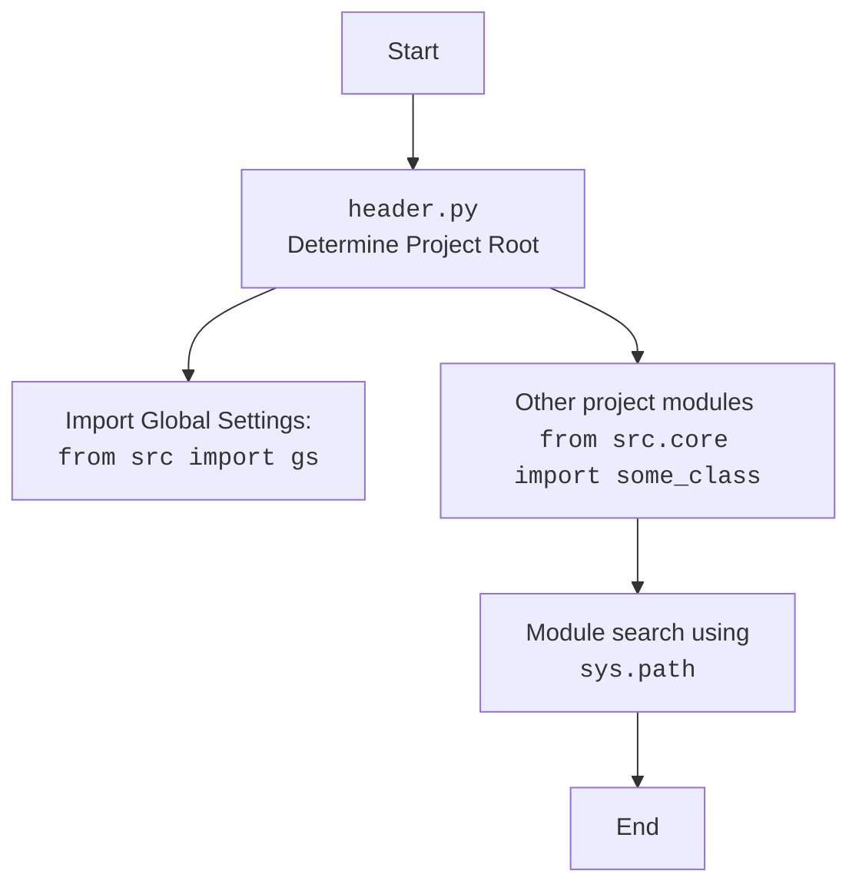
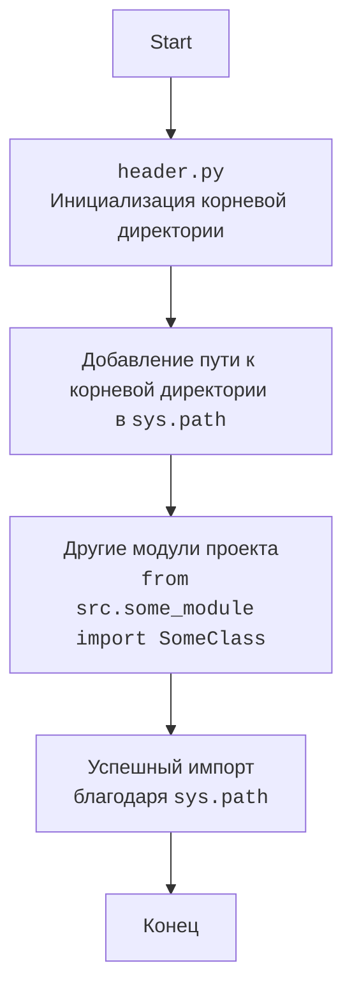

## АНАЛИЗ КОДА: `hypotez/src/gui/context_menu/qt6/header.py`

### 1. <алгоритм>

**Описание работы кода:**

1.  **Импорт модулей:**  Импортируются модули `sys` и `os` для работы с системными путями и операционной системой, а также `Path` из `pathlib` для удобной работы с путями файлов.
   
    *   **Пример:**
        `import sys`: импортирует модуль sys
        `import os`: импортирует модуль os
        `from pathlib import Path`: импортирует класс Path из модуля pathlib
        
2.  **Определение корневой директории проекта:** Определяется переменная `__root__`, которая представляет собой абсолютный путь к корневой директории проекта `hypotez`. Используется `os.getcwd()` для получения текущей рабочей директории, а затем обрезается строка до вхождения `hypotez` включительно.

    *   **Пример:**
        `os.getcwd()`: Если текущая директория `/home/user/projects/hypotez/src/gui/context_menu/qt6`, то вернет строку `/home/user/projects/hypotez/src/gui/context_menu/qt6`.
        `os.getcwd().rfind(r'hypotez')`: Вернет индекс 21 (начало вхождения `hypotez`).
        `os.getcwd()[:os.getcwd().rfind(r'hypotez')+7]`: Вернет `/home/user/projects/hypotez`.
        
3.  **Добавление корневой директории в `sys.path`:** Корневая директория проекта добавляется в список путей поиска модулей `sys.path`. Это позволяет импортировать модули из любой части проекта, используя абсолютные пути относительно корневой директории.

    *   **Пример:**
        `sys.path` до добавления: `['/home/user/projects/hypotez/src/gui/context_menu/qt6', '/usr/lib/python3.12', ...]`.
        `sys.path` после добавления: `['/home/user/projects/hypotez/src/gui/context_menu/qt6', '/usr/lib/python3.12', ..., '/home/user/projects/hypotez']`.

### 2. <mermaid>

```mermaid
flowchart TD
    Start --> ImportModules[Импорт модулей: `import sys, os` `from pathlib import Path`]
    ImportModules --> GetCurrentDir[Получить текущую рабочую директорию: `os.getcwd()`]
    GetCurrentDir --> FindHypotez[Найти индекс `hypotez` в пути: `os.getcwd().rfind(r'hypotez')`]
    FindHypotez --> DefineRoot[Определить корневую директорию проекта: `__root__ = os.getcwd()[:os.getcwd().rfind(r'hypotez')+7]`]
    DefineRoot --> AddRootToPath[Добавить корневую директорию в `sys.path`: `sys.path.append(__root__)`]
    AddRootToPath --> End
```

**Анализ диаграммы:**
*   **`ImportModules`:** Начинает процесс импортом необходимых модулей, таких как `sys`, `os` и `Path`.
*   **`GetCurrentDir`:** Получает текущую рабочую директорию с помощью `os.getcwd()`.
*   **`FindHypotez`:** Использует `os.getcwd().rfind(r'hypotez')` для определения индекса вхождения слова "hypotez" в пути.
*  **`DefineRoot`:** Вычисляет и устанавливает переменную `__root__` как путь к корневой директории проекта, обрезая строку, возвращенную `os.getcwd()`.
*   **`AddRootToPath`:** Добавляет определенную корневую директорию `__root__` в `sys.path`.
*   **`End`:** Конец процесса.

### 3. <объяснение>

**Импорты:**
*   **`sys`:** Модуль `sys` предоставляет доступ к некоторым переменным и функциям, которые взаимодействуют с интерпретатором Python. В данном случае используется `sys.path` для добавления корневой директории проекта, чтобы можно было импортировать модули из разных частей проекта.
*   **`os`:** Модуль `os` предоставляет функции для взаимодействия с операционной системой. Здесь используется `os.getcwd()` для получения текущей рабочей директории, и `os.path` (неявно используется для `Path`) для работы с путями.
*   **`pathlib.Path`:** Модуль `pathlib` предлагает более современный способ работы с путями в виде объектов. `Path` используется для представления и манипуляции путями к файлам и директориям.

**Переменные:**
*   `__root__`: переменная типа `pathlib.Path`, хранящая путь к корневой директории проекта `hypotez`. Этот путь используется для добавления в `sys.path`, что позволяет корректно импортировать модули из разных частей проекта.

**Функции:**
*   `os.getcwd()`: Функция из модуля `os`, которая возвращает строку, представляющую абсолютный путь текущей рабочей директории.
*   `os.getcwd().rfind(r'hypotez')`: Метод `rfind` используется для поиска индекса последнего вхождения подстроки `'hypotez'` в строку, полученную из `os.getcwd()`.
*   `sys.path.append(__root__)`: Метод списка `sys.path` используется для добавления нового пути, представленного переменной `__root__`, в список путей поиска модулей.

**Объяснения:**

Этот код предназначен для определения корневой директории проекта и добавления ее в `sys.path`. Это позволяет импортировать модули из других частей проекта без использования относительных путей, что упрощает разработку и поддержку проекта.  Определение `__root__` динамически позволяет запускать скрипт из любой директории в рамках проекта.

**Потенциальные улучшения:**
*   **Обработка ошибки:** Если подстрока `hypotez` не найдена в пути, то код выбросит исключение. Было бы полезно добавить проверку и обработку этого случая.
*   **Стандартизация:** Вместо поиска подстроки `'hypotez'` можно использовать более надежный метод определения корневой директории, например, поиск `.git` директории или файла конфигурации проекта.
*   **Комментарии:** Было бы полезно добавить более подробные комментарии к коду для улучшения читаемости и понимания.
*   **Избегать `__root__`:** В Python соглашение использовать `__file__`, а затем на его основе определять корневую директорию.
*   **Возможность запуска без `hypotez`:** Код не будет работать, если проект не в папке с названием `hypotez`. Нужно предусмотреть возможность запуска из других папок.

**Взаимосвязь с другими частями проекта:**

Данный файл `header.py` является центральным для всего проекта, поскольку он определяет корневую директорию, которая влияет на возможность импорта других модулей из разных директорий. Это означает, что любой другой файл в проекте, который зависит от импорта модулей из разных частей проекта, косвенно зависит от этого файла.

Пример:

Если в другом файле `src/gui/some_module.py` есть `from src.core import some_class`, то `header.py` обеспечивает корректный импорт, добавляя `src` в `sys.path`, что делает возможным импорт.



**Взаимосвязь с другими частями проекта (mermaid):**



**Анализ диаграммы `mermaid`:**

*   `HeaderPy`: Обозначает файл `header.py`, который отвечает за инициализацию корневой директории проекта.
*   `sys_path_update`: Представляет процесс добавления пути к корневой директории в `sys.path`, что позволяет Python искать модули в указанной директории.
*   `OtherModules`: Обозначает другие модули проекта, которые используют импорт из других частей проекта.
*   `ImportSuccess`: Подтверждает, что импорт из других модулей успешен благодаря изменениям, сделанным в `sys.path` файлом `header.py`.
*   `End`: Конец цепочки зависимостей.

Этот анализ показывает, как файл `header.py` является критически важным для корректного функционирования всего проекта, обеспечивая правильный импорт модулей.