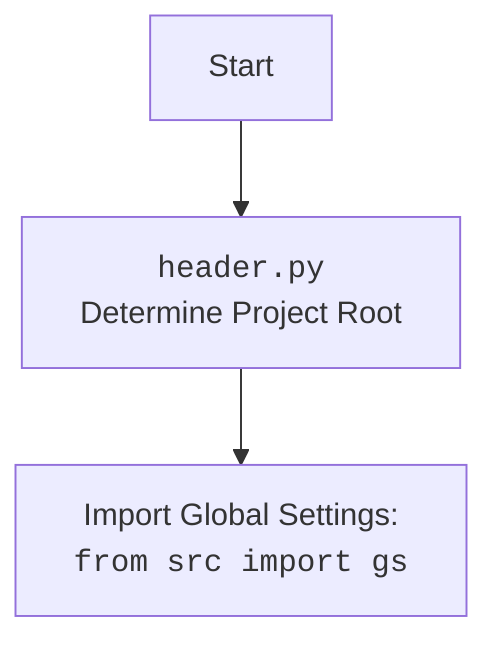

## <алгоритм>

**1. `add_context_menu_item()`:**
   - **Начало:** Функция вызывается для добавления пункта контекстного меню.
   - **Создание ключа реестра:**
      - Создается ключ реестра `HKEY_CLASSES_ROOT\\Directory\\Background\\shell\\hypo_AI_assistant`
      - **Пример:** Выполняется `reg.CreateKey(reg.HKEY_CLASSES_ROOT, key_path)`.
   - **Установка значения ключа:**
      - Устанавливается значение ключа `hypo AI assistant` (отображаемое имя пункта меню).
      - **Пример:** Выполняется `reg.SetValue(key, "", reg.REG_SZ, "hypo AI assistant")`.
   - **Создание ключа команды:**
       - Создается ключ реестра `HKEY_CLASSES_ROOT\\Directory\\Background\\shell\\hypo_AI_assistant\\command`.
       - **Пример:** Выполняется `reg.CreateKey(reg.HKEY_CLASSES_ROOT, command_key)`.
   - **Проверка пути к скрипту:**
        - Проверяется существование скрипта `src/gui/context_menu/main.py`
        - **Пример:**  Проверяется `os.path.exists(command_path)`.
        - **Если скрипт не существует**: Выводится ошибка `messagebox.showerror` и функция завершается.
   - **Установка значения ключа команды:**
      - Устанавливается команда для запуска скрипта Python при выборе пункта меню.
      - **Пример:** Выполняется  `reg.SetValue(command, "", reg.REG_SZ, f"python \\"{command_path}\\" \\"%1\\"")`
   - **Сообщение об успехе:**
      - Выводится сообщение `messagebox.showinfo` об успешном добавлении пункта меню.
   - **Обработка ошибок:**
      - Если происходит ошибка, выводится сообщение `messagebox.showerror` с деталями ошибки.
   - **Конец:** Функция завершается.

**2. `remove_context_menu_item()`:**
    - **Начало:** Функция вызывается для удаления пункта контекстного меню.
    - **Удаление ключа реестра:**
        - Пытается удалить ключ `HKEY_CLASSES_ROOT\\Directory\\Background\\shell\\hypo_AI_assistant`
        - **Пример:** Выполняется `reg.DeleteKey(reg.HKEY_CLASSES_ROOT, key_path)`.
    - **Сообщение об успехе:**
        - Если удаление успешно, выводится сообщение `messagebox.showinfo` об успешном удалении.
    - **Обработка `FileNotFoundError`:**
        - Если ключ не найден, выводится предупреждение `messagebox.showwarning`.
    - **Обработка других ошибок:**
        - Если происходит другая ошибка, выводится сообщение `messagebox.showerror` с деталями ошибки.
    - **Конец:** Функция завершается.

**3. `create_gui()`:**
   - **Начало:** Функция вызывается для создания GUI.
   - **Создание главного окна:**
      - Создается основное окно приложения `tk.Tk()`.
   - **Установка заголовка окна:**
       - Задается заголовок окна `Управление контекстным меню`.
   - **Создание кнопки "Добавить":**
        - Создается кнопка, вызывающая `add_context_menu_item` при нажатии.
        - **Пример:** `tk.Button(root, text="Добавить пункт меню", command=add_context_menu_item)`.
   - **Создание кнопки "Удалить":**
        - Создается кнопка, вызывающая `remove_context_menu_item` при нажатии.
        - **Пример:** `tk.Button(root, text="Удалить пункт меню", command=remove_context_menu_item)`.
   - **Создание кнопки "Выход":**
        - Создается кнопка, вызывающая `root.quit` (завершение программы).
   - **Запуск главного цикла событий:**
        - Запускается основной цикл обработки событий GUI.
   - **Конец:** Функция завершается.

**4. `if __name__ == "__main__":`:**
    - **Начало:**  Проверка, является ли скрипт основным запускаемым.
    - **Вызов `create_gui()`:**
        - Если скрипт является основным, вызывается функция для создания GUI.
    - **Конец:** Функция завершается.

## <mermaid>

```mermaid
flowchart TD
    subgraph add_context_menu_item
        A[Начало: Вызов add_context_menu_item()] --> B{Создать ключ реестра HKEY_CLASSES_ROOT\\Directory\\Background\\shell\\hypo_AI_assistant}
        B --> C{Установить значение ключа: "hypo AI assistant"}
        C --> D{Создать ключ реестра command}
        D --> E{Проверить путь к скрипту}
         E -- Скрипт не существует --> F[Показать ошибку: Файл не найден]
         E -- Скрипт существует --> G{Установить значение ключа command: python "command_path" "%1"}
        G --> H[Сообщение об успехе: Пункт меню успешно добавлен]
        H --> K[Завершение add_context_menu_item()]
        F --> K
        K --> Z[Завершение add_context_menu_item]
        B -- Ошибка --> I[Отобразить ошибку: {Ошибка}]
        I --> K
         D -- Ошибка --> J[Отобразить ошибку: {Ошибка}]
        J --> K
    end
    subgraph remove_context_menu_item
        L[Начало: Вызов remove_context_menu_item()] --> M{Удалить ключ реестра HKEY_CLASSES_ROOT\\Directory\\Background\\shell\\hypo_AI_assistant}
         M -- Успешно --> N[Сообщение об успехе: Пункт меню успешно удален]
        M -- Ключ не найден --> O[Показать предупреждение: Пункт меню не найден]
        M -- Ошибка --> P[Отобразить ошибку: {Ошибка}]
        N --> Q[Завершение remove_context_menu_item()]
         O --> Q
        P --> Q
        Q --> Z
    end
    subgraph create_gui
        R[Начало: Вызов create_gui()] --> S[Создать главное окно Tk()]
        S --> T[Установить заголовок окна]
        T --> U[Создать кнопку "Добавить", вызывающую add_context_menu_item]
        U --> V[Создать кнопку "Удалить", вызывающую remove_context_menu_item]
        V --> W[Создать кнопку "Выход", вызывающую root.quit]
        W --> X[Запустить главный цикл событий GUI]
        X --> Y[Завершение create_gui()]
        Y --> Z
    end
    
   subgraph main_block
        Z1[if __name__ == "__main__":] --> Z2{Вызов create_gui}
        Z2 --> Z
    end
   
   Z --> End[Конец программы]
```


**Импортированные зависимости (mermaid):**

- `winreg` (as `reg`): Модуль для работы с реестром Windows.
- `os`: Модуль для работы с операционной системой (пути, файлы).
- `tkinter` (as `tk`): Модуль для создания графического интерфейса пользователя.
- `messagebox` (from `tkinter`): Модуль для отображения диалоговых окон (сообщения, ошибки).
- `header`: Кастомный модуль, предположительно для инициализации настроек или констант (представлен отдельной диаграммой).
- `src.gs`: Кастомный модуль, вероятно, для управления путями или структурой проекта (представлен отдельной диаграммой в header).

## <объяснение>

### Импорты:
- `winreg as reg`: Этот модуль используется для работы с реестром Windows, что позволяет добавлять или удалять пункты контекстного меню. В данном коде он используется для создания, изменения и удаления записей, связанных с пунктом меню "hypo AI assistant".
- `os`: Этот модуль предоставляет функции для взаимодействия с операционной системой. Здесь он используется для проверки существования файла скрипта, путь к которому задан через `gs.path`.
- `tkinter as tk`: Модуль Tkinter используется для создания простого графического интерфейса. В данном коде он используется для создания основного окна приложения и кнопок для управления пунктом контекстного меню.
- `tkinter.messagebox`: Этот модуль используется для отображения диалоговых окон, таких как сообщения об успехе, предупреждения и сообщения об ошибках. Он предоставляет пользователю обратную связь о результате операций.
- `header`: Предположительно, этот модуль содержит логику для определения корня проекта и настройки среды. `header` импортируется как пользовательский модуль.
- `from src import gs`: Этот импорт предполагает наличие пакета `src` и модуля `gs` внутри него. `gs` вероятнее всего содержит глобальные настройки проекта, включая путь к файлам, что видно при обращении `gs.path`.

### Классы:

- В данном коде нет явно определенных классов. Используются лишь функции и модули.

### Функции:

- **`add_context_menu_item()`:**
    - **Аргументы:** Отсутствуют.
    - **Возвращаемое значение:** Отсутствует (возвращает `None` неявно).
    - **Назначение:** Добавляет пункт контекстного меню "hypo AI assistant" в фон папок и рабочего стола через реестр Windows. Сначала создается ключ, затем в него помещается отображаемое имя, потом создаётся ключ команды и устанавливается команда для выполнения Python скрипта. В случае успеха или ошибки выводится сообщение.
    - **Пример:** Вызывается при нажатии кнопки "Добавить пункт меню" в GUI.
- **`remove_context_menu_item()`:**
    - **Аргументы:** Отсутствуют.
    - **Возвращаемое значение:** Отсутствует (возвращает `None` неявно).
    - **Назначение:** Удаляет пункт контекстного меню "hypo AI assistant" из реестра Windows. Сначала удаляется ключ, в случае успеха или ошибки выводится сообщение.
    - **Пример:** Вызывается при нажатии кнопки "Удалить пункт меню" в GUI.
- **`create_gui()`:**
    - **Аргументы:** Отсутствуют.
    - **Возвращаемое значение:** Отсутствует (возвращает `None` неявно).
    - **Назначение:** Создает графический интерфейс (GUI) с кнопками для добавления, удаления и выхода.
    - **Пример:** Вызывается при запуске скрипта через условие `if __name__ == "__main__":`.

### Переменные:

- `key_path`: Строка, содержащая путь к ключу реестра, где будет располагаться пункт меню.
- `command_key`: Строка, содержащая путь к ключу реестра для команды.
- `command_path`: Строка, содержащая путь к файлу Python скрипта, который будет выполняться.
- `root`: Объект Tk(), представляющий главное окно GUI.
- `add_button`, `remove_button`, `exit_button`: Объекты tk.Button, представляющие кнопки в GUI.

### Цепочка взаимосвязей:

1. **`create_gui()`** создает GUI с кнопками.
2. При нажатии кнопки "Добавить пункт меню" вызывается **`add_context_menu_item()`**, которая модифицирует реестр и добавляет пункт меню.
3. При нажатии кнопки "Удалить пункт меню" вызывается **`remove_context_menu_item()`**, которая модифицирует реестр и удаляет пункт меню.
4. Путь к скрипту формируется на основе `gs.path`.

### Потенциальные ошибки и области для улучшения:
- **Ошибка в путях**: Использование прямых слешей в пути `command_path`  может вызывать проблемы на разных платформах.
- **Обработка ошибок**: В `add_context_menu_item` ошибки ловятся как `Exception as ex`, что может быть слишком общим. Лучше ловить более конкретные исключения.
- **Проверка наличия пункта меню**: В `remove_context_menu_item` есть обработка `FileNotFoundError`, но лучше перед удалением проверить наличие ключа, чтобы исключить лишние попытки удаления.
- **Вызов скрипта**: При вызове скрипта через реестр, передается аргумент "%1", но не указано, как этот аргумент обрабатывается. Этот момент нуждается в пояснении, если есть использование.
- **Зависимость от `header` и `src`**:  Необходимо больше информации о том, как работают `header.py` и `src/gs` и какие конкретно данные они возвращают.
- **Кроссплатформенность**: Код работает только на Windows. Нужно использовать другие методы для других операционных систем.

Этот код предоставляет функционал для добавления и удаления контекстного меню в Windows, используя реестр, но требует доработок для повышения надежности, гибкости и кроссплатформенности.