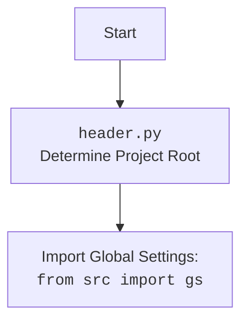

## ИНСТРУКЦИЯ:

Анализируй предоставленный код подробно и объясни его функциональность. Ответ должен включать три раздела:

1.  **<алгоритм>**: Опиши рабочий процесс в виде пошаговой блок-схемы, включая примеры для каждого логического блока, и проиллюстрируй поток данных между функциями, классами или методами.
2.  **<mermaid>**: Напиши код для диаграммы в формате `mermaid`, проанализируй и объясни все зависимости,
    которые импортируются при создании диаграммы.
    **ВАЖНО!** Убедитесь, что все имена переменных, используемые в диаграмме `mermaid`,
    имеют осмысленные и описательные имена. Имена переменных вроде `A`, `B`, `C`, и т.д., не допускаются!

    **Дополнительно**: Если в коде есть импорт `import header`, добавьте блок `mermaid` flowchart, объясняющий `header.py`:
    ```mermaid
    flowchart TD
        Start --> Header[<code>header.py</code><br> Determine Project Root]

        Header --> import[Import Global Settings: <br><code>from src import gs</code>]
    ```

3.  **<объяснение>**: Предоставьте подробные объяснения:
    - **Импорты**: Их назначение и взаимосвязь с другими пакетами `src.`.
    - **Классы**: Их роль, атрибуты, методы и взаимодействие с другими компонентами проекта.
    - **Функции**: Их аргументы, возвращаемые значения, назначение и примеры.
    - **Переменные**: Их типы и использование.
    - Выделите потенциальные ошибки или области для улучшения.

Дополнительно, постройте цепочку взаимосвязей с другими частями проекта (если применимо).

Это обеспечивает всесторонний и структурированный анализ кода.
## Формат ответа: `.md` (markdown)
**КОНЕЦ ИНСТРУКЦИИ**

### <алгоритм>

1.  **Начало**:
    *   Запускается скрипт `header.py`.
2.  **Определение Корневой Директории Проекта**:
    *   Вызывается функция `set_project_root`.
    *   Начальный путь: путь к директории, где находится файл `header.py`.
    *   Поиск "маркерных" файлов или директорий (по умолчанию `__root__` и `.git`) вверх по дереву директорий.
        *   **Пример 1**: Если `header.py` находится в `/project/src/gui/` и `.git` в `/project/`, то `/project/` будет определена как корневая.
        *   **Пример 2**: Если `header.py` находится в `/project/src/gui/` и ни одного маркерного файла не найдено, то корневой будет `/project/src/gui/`
    *   Если корень не в `sys.path`, добавляем его.
    *   Возвращается путь к корневой директории.
3.  **Сохранение Корневого Пути**:
    *   Результат `set_project_root` сохраняется в глобальной переменной `__root__` (тип `Path`).
4.  **Импорт Глобальных Настроек**:
    *   Импортируется модуль `gs` из `src` с использованием найденного корневого пути.
5.  **Загрузка Настроек из JSON**:
    *   Читается файл `settings.json` из `src` (относительно `__root__`).
        *   **Пример**: Если `__root__` = `/project/`, то файл ищется по пути `/project/src/settings.json`.
    *   Загружает JSON в словарь `settings`. Если файл не найден или JSON не валиден, `settings` остается `None`.
6. **Загрузка Документации из README.MD**:
    *   Читается файл `README.MD` из `src` (относительно `__root__`).
        * **Пример**: Если `__root__` = `/project/`, то файл ищется по пути `/project/src/README.MD`.
    *   Содержимое файла сохраняется в `doc_str`, при неудаче `doc_str` остается `None`
7.  **Инициализация Глобальных Переменных**:
    *   `__project_name__` получает значение из `settings` или `"hypotez"`, если `settings`  пустой.
    *   `__version__` получает значение из `settings` или `""`, если `settings`  пустой.
     *   `__doc__` получает значение из `doc_str` или `''` если `doc_str` пустой.
    *   `__details__` присваивается  пустая строка.
    *   `__author__` получает значение из `settings` или `""`, если `settings`  пустой.
    *   `__copyright__` получает значение из `settings` или `""`, если `settings`  пустой.
    *   `__cofee__` получает значение из `settings` или текст с ссылкой на boosty, если `settings`  пустой.
8.  **Конец**:
    *   Все глобальные переменные инициализированы и доступны для использования в других модулях.

### <mermaid>

```mermaid
flowchart TD
    Start --> FindProjectRoot[<code>set_project_root()</code><br> Find Project Root Directory]
    FindProjectRoot --> CheckMarkerFiles[Check for marker files<br>(e.g., __root__, .git) in parent dirs]
    CheckMarkerFiles -- Found marker file --> SetProjectRoot[Set found parent directory as Project Root]
    CheckMarkerFiles -- No marker files found --> SetScriptDirAsRoot[Set current script directory as Project Root]
     SetProjectRoot --> AddToSysPath[Add Project Root to <code>sys.path</code> if not present]
     SetScriptDirAsRoot --> AddToSysPath
    AddToSysPath --> ImportGlobalSettings[Import Global Settings: <br><code>from src import gs</code>]
    ImportGlobalSettings --> LoadSettings[Load <code>settings.json</code> using <code>gs.path.root</code>]
     LoadSettings --> LoadReadme[Load <code>README.MD</code> using <code>gs.path.root</code>]
     LoadReadme --> InitGlobalVariables[Initialize global variables: <br> __project_name__, __version__, __doc__, __details__,<br> __author__, __copyright__, __cofee__]
    InitGlobalVariables --> End
     
    classDef highlighted fill:#f9f,stroke:#333,stroke-width:2px
    class FindProjectRoot,LoadSettings, LoadReadme highlighted

```



**Объяснение `mermaid` диаграммы:**

*   **`flowchart TD`**: Определяет тип диаграммы как блок-схему (flowchart) с направлением сверху вниз (Top to Down).
*   **`Start`**: Начало выполнения скрипта.
*  **`FindProjectRoot`**: Вызов функции `set_project_root`, которая отвечает за поиск корневой директории проекта.
    *  Выделено с помощью `classDef highlighted fill:#f9f,stroke:#333,stroke-width:2px` и `class FindProjectRoot highlighted`
*   **`CheckMarkerFiles`**: Логический блок, проверяющий наличие маркерных файлов в родительских директориях.
*  **`SetProjectRoot`**:  Устанавливает найденную родительскую директорию как корневую.
*   **`SetScriptDirAsRoot`**: Устанавливает директорию скрипта как корневую, если маркерные файлы не найдены.
*   **`AddToSysPath`**: Добавляет корневую директорию в `sys.path`, если её там нет.
*   **`ImportGlobalSettings`**: Импортирует модуль `gs` для доступа к глобальным настройкам.
*    **`LoadSettings`**: Загружает `settings.json` файл из корневой директории, используя `gs.path.root`.
     * Выделено с помощью `classDef highlighted fill:#f9f,stroke:#333,stroke-width:2px` и `class LoadSettings highlighted`
*    **`LoadReadme`**: Загружает `README.MD` файл из корневой директории, используя `gs.path.root`.
      * Выделено с помощью `classDef highlighted fill:#f9f,stroke:#333,stroke-width:2px` и `class LoadReadme highlighted`
*    **`InitGlobalVariables`**: Инициализирует глобальные переменные проекта, такие как имя проекта, версия, документация и т.д.
*   **`End`**: Конец выполнения скрипта.

Диаграмма `header.py` показывает, что файл начинается с определения корневой директории проекта. После определения корневой директории, происходит импорт глобальных настроек из `src` (из модуля `gs`).

### <объяснение>

**Импорты:**

*   `sys`: Используется для доступа к переменным и функциям, связанным с интерпретатором Python. В данном случае используется для добавления пути к корневой директории проекта в `sys.path`. Это позволяет импортировать другие модули проекта, не зависимо от текущего рабочего каталога.
*   `json`: Используется для работы с JSON файлами. Здесь используется для загрузки настроек из файла `settings.json`.
*   `packaging.version`: Используется для работы с версиями программного обеспечения.
*   `pathlib.Path`: Используется для работы с путями в файловой системе. Обеспечивает кроссплатформенность.
*   `from src import gs`: Импортирует глобальные настройки проекта. Это означает, что в проекте есть папка `src`, в которой есть файл `gs.py` или папка, которая представляет пакет. `gs` предположительно содержит настройки проекта.

**Функции:**

*   `set_project_root(marker_files=('__root__','.git')) -> Path`:
    *   Аргументы: `marker_files` (tuple) -  файлы/директории маркеры.
    *   Возвращает: `Path` - путь к корневой директории.
    *   Назначение: Определяет корневую директорию проекта путем поиска маркерных файлов.
        *   Функция начинается с определения пути к текущему файлу, а затем ищет маркерные файлы вверх по дереву каталогов. Если маркерный файл найден, родительская директория считается корневой.
        *   Если маркерные файлы не найдены, корневой директорией считается директория, в которой находится скрипт.
        *   После нахождения корневого каталога, он добавляется в `sys.path` если он там не присутствует. Это позволяет импортировать другие модули проекта, используя относительные пути.
        *  **Пример**:
          ```python
            #Предположим файл header.py лежит в /home/user/project/src/gui/header.py
            #И маркерный файл `.git` лежит в /home/user/project/.git
            #Вызов set_project_root() вернет Path("/home/user/project")
          ```
    *   **Потенциальные улучшения**: Возможность задавать маркерные файлы через переменные окружения или другой конфигурационный файл.

**Переменные:**

*   `__root__` (Path): Глобальная переменная, хранящая путь к корневой директории проекта. Определяется функцией `set_project_root`.
*   `settings` (dict or None): Глобальная переменная, хранящая настройки проекта, загруженные из `settings.json`. Может быть `None`, если файл не найден или не может быть прочитан.
*   `doc_str` (str or None): Глобальная переменная, хранящая строку с документацией проекта, загруженную из `README.MD`. Может быть `None`, если файл не найден или не может быть прочитан.
*   `__project_name__` (str): Глобальная переменная, хранящая имя проекта. Значение берется из `settings` или "hypotez", если `settings` не содержит данных.
*  `__version__` (str): Глобальная переменная, хранящая версию проекта. Значение берется из `settings` или "" (пустая строка), если `settings` не содержит данных.
*  `__doc__` (str): Глобальная переменная, хранящая описание проекта. Значение берется из `doc_str` или "" (пустая строка), если `doc_str` не содержит данных.
*  `__details__` (str): Глобальная переменная, хранящая детали проекта. Значение - пустая строка.
*  `__author__` (str): Глобальная переменная, хранящая имя автора проекта. Значение берется из `settings` или "" (пустая строка), если `settings` не содержит данных.
*  `__copyright__` (str): Глобальная переменная, хранящая информацию об авторских правах. Значение берется из `settings` или "" (пустая строка), если `settings` не содержит данных.
*  `__cofee__` (str): Глобальная переменная, хранящая  призыв к поддержке разработчика. Значение берется из `settings` или строка с ссылкой на boosty, если `settings` не содержит данных.

**Цепочка взаимосвязей с другими частями проекта:**

1.  `header.py` определяет корневую директорию проекта и добавляет её в `sys.path`. Это необходимо для того, чтобы другие модули проекта могли правильно импортировать друг друга.
2.  `header.py` загружает настройки из `settings.json` и использует их для инициализации глобальных переменных. Эти переменные, в свою очередь, могут использоваться в других модулях проекта.
3.  Импорт `gs` позволяет использовать глобальные настройки, специфичные для проекта.
4.  Глобальные переменные, определенные в `header.py` используются для хранения метаданных о проекте (например `__project_name__`, `__version__`, `__doc__`  и тд.)
5. `doc_str` загружается из README.MD и используется как метаданные проекта.
6. **Потенциальные ошибки**:
   *   Обработка ошибок при загрузке `settings.json` и `README.MD` может быть более подробной (например, логирование ошибок).
   *   Жестко заданные пути к `settings.json` и `README.MD` могут быть изменены при помощи конфигурационного файла.
   *   Отсутствует обработка случая, когда ни один маркерный файл не найден и корень устанавливается в текущую директорию. Возможно необходимо выводить предупреждение или исключение.

В целом, файл `header.py` играет важную роль в структуре проекта. Он определяет корневую директорию, загружает настройки и устанавливает глобальные переменные, которые используются другими модулями.