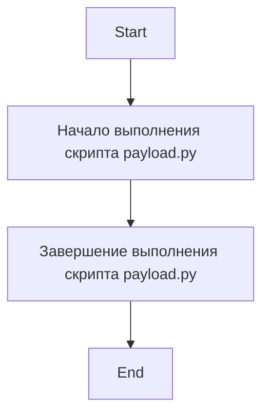

## Анализ кода `payload.py`

### <алгоритм>

Поскольку предоставленный код `payload.py` практически пуст, алгоритм будет очень простым:

1.  **Начало**:  Скрипт запускается.
2.  **Завершение**:  Скрипт завершает работу.

Поскольку код не содержит исполняемого кода (только комментарии и docstring), нет никаких логических блоков для прохождения, потока данных или операций.

### <mermaid>

### <объяснение>

**Импорты**:

*   В предоставленном коде нет импортов.
    Это значит, что `payload.py` не зависит от других модулей в этой точке.

**Классы**:

*   В коде не определены классы.

**Функции**:

*   В коде не определены функции.

**Переменные**:

*   В коде не определены переменные.

**Объяснение и Потенциальные проблемы:**

*   **Пустой файл:** Файл `payload.py` в предоставленном виде не выполняет никаких действий, так как содержит только комментарии и docstring.
*   **Неопределенность назначения:** Из-за отсутствия кода сложно определить назначение этого файла в проекте. Вероятно, это заготовка или часть модуля, которая еще не реализована.
*   **Отсутствие функциональности:** Так как нет кода, нет и потенциальных ошибок, но очевидно, что файл в таком виде не полезен.
*   **Области для улучшения:** Необходимо добавить код для реализации нужной функциональности в рамках `openai_trainer` модуля.

**Взаимосвязь с другими частями проекта:**

*   Так как код пустой, невозможно определить его связь с другими частями проекта. `payload.py` предназначен для модуля `src.gui.openai_trainer`, предполагается, что это часть GUI (графический интерфейс) для обучения моделей OpenAI. Однако для дальнейшего анализа необходима реализация.

**Заключение:**

`payload.py` в представленном виде - это пустой шаблон файла.  Он не содержит логики, классов, функций или переменных.  Для выполнения каких-либо функций, файл требует реализации.  Потенциальных ошибок нет, но отсутствие кода — это основная проблема. Для понимания полной картины его назначения в проекте, необходимо добавить функциональный код.