## Анализ кода `hypotez/src/gui/openai_trаigner/version.py`

### 1. `<алгоритм>`:

Код `version.py` представляет собой простой файл, предназначенный для хранения метаданных о версии и авторстве пакета `src.gui.openai_trаigner`. 

**Блок-схема:**

```mermaid
graph LR
    A[Start] --> B(Initialize version variable);
    B --> C(Initialize docstring variable);
    C --> D(Initialize details variable);
    D --> E(Initialize author variable);
    E --> F(Initialize copyright variable);
    F --> G(Initialize cofee variable);
    G --> H[End];
    
    classDef variable fill:#f9f,stroke:#333,stroke-width:2px
    class B,C,D,E,F,G variable
```



**Примеры:**

1.  **`__version__: str = 'v1.1'`**: Инициализация переменной версии.  Значение - строка `'v1.1'`.
2.  **`__doc__: str = ''`**: Инициализация переменной документации.  Значение - пустая строка.
3.  **`__details__: str = ''`**: Инициализация переменной деталей. Значение - пустая строка.
4.  **`__author__: str = 'hypo69'`**: Инициализация переменной автора. Значение - строка `'hypo69'`.
5.  **`__copyright__: str = """\n## License\n\nCopyright (c) 2024 hypo69\n\nThis project is licensed under the MIT License. See the [MIT License](https://opensource.org/licenses/MIT) for details.\n\nCommercial use of the code is prohibited without prior permission from the authors.\n"""**: Инициализация переменной с информацией об авторских правах и лицензии. Значение - многострочная строка.
6.   **`__cofee__: str = "Treat the developer to a cup of coffee for boosting enthusiasm in development: https://boosty.to/hypo69"`**: Инициализация переменной с сообщением о возможности поддержки разработчика. Значение - строка со ссылкой.

### 2. `<mermaid>`:

```mermaid
flowchart TD
    Start --> VersionVariable[__version__: str = 'v1.1']
    VersionVariable --> DocstringVariable[__doc__: str = '']
    DocstringVariable --> DetailsVariable[__details__: str = '']
    DetailsVariable --> AuthorVariable[__author__: str = 'hypo69']
    AuthorVariable --> CopyrightVariable[__copyright__: str = """..."""]
    CopyrightVariable --> CoffeeVariable[__cofee__: str = "Treat the developer ..."]
    CoffeeVariable --> End
   
    classDef variable fill:#f9f,stroke:#333,stroke-width:2px
    class VersionVariable,DocstringVariable,DetailsVariable,AuthorVariable,CopyrightVariable,CoffeeVariable variable
```

**Объяснение зависимостей `mermaid`:**

Диаграмма в формате `mermaid` представляет собой простой `flowchart`, который показывает последовательность инициализации переменных, которые используются для хранения метаданных о версии, документации, авторе и лицензии пакета `src.gui.openai_trаigner`. Стрелки указывают на поток инициализации переменных.

### 3. `<объяснение>`:

#### Импорты:
- В данном коде нет импортов. Файл `version.py` предназначен для хранения метаданных, а не для выполнения какого-либо кода, поэтому импорт сторонних модулей не требуется.

#### Классы:

-   В коде нет классов.

#### Функции:
-   В коде нет функций.

#### Переменные:

-   `__version__`:
    -   **Тип:** `str` (строка).
    -   **Назначение:** Хранит текущую версию программного обеспечения.
    -   **Использование:** Используется для идентификации версии пакета `src.gui.openai_trаigner`.
    -   **Пример:** `'v1.1'` - указывает на первую версию.
-   `__doc__`:
    -   **Тип:** `str` (строка).
    -   **Назначение:** Предназначена для хранения документации к модулю.
    -   **Использование:** В данном случае она пустая, но может быть заполнена описанием модуля.
    -   **Пример:** `''` (пустая строка).
-   `__details__`:
    -   **Тип:** `str` (строка).
    -   **Назначение:** Предназначена для хранения дополнительных деталей о модуле.
    -   **Использование:** В данном случае она пустая, но может быть заполнена дополнительной информацией о модуле.
    -   **Пример:** `''` (пустая строка).
-   `__author__`:
    -   **Тип:** `str` (строка).
    -   **Назначение:** Хранит имя автора или авторов пакета.
    -   **Использование:** Используется для указания авторства кода.
    -   **Пример:** `'hypo69'`.
-   `__copyright__`:
    -   **Тип:** `str` (строка).
    -   **Назначение:** Хранит информацию об авторских правах и лицензии.
    -   **Использование:** Используется для указания лицензионных условий использования кода.
    -   **Пример:** Многострочная строка, содержащая текст лицензии MIT и информацию о запрете коммерческого использования без разрешения.
-   `__cofee__`:
    -   **Тип:** `str` (строка).
    -   **Назначение:** Хранит сообщение о возможности поддержки разработчика путем угощения кофе.
    -   **Использование:** Используется для предоставления ссылки на страницу поддержки.
    -   **Пример:** ` "Treat the developer to a cup of coffee for boosting enthusiasm in development: https://boosty.to/hypo69"`

#### Потенциальные ошибки или области для улучшения:

1.  **Отсутствие описания:** Переменные `__doc__` и `__details__` в данный момент пустые. Рекомендуется добавить описание пакета и его деталей.
2.  **Жёстко закодированная версия:** Версия `__version__` жёстко закодирована. Для больших проектов это может стать проблемой при выпуске новых версий, поскольку каждый раз придётся менять это значение вручную. Рассмотрите возможность автоматической генерации версии из, например, git-тегов.

#### Взаимосвязь с другими частями проекта:

Файл `version.py` используется как часть пакета `src.gui.openai_trаigner`. Его переменные, особенно `__version__`, могут быть импортированы в другие модули проекта, чтобы отображать версию, информацию об авторе и лицензии в различных местах приложения, например, в меню "О программе", для ведения логов, или при запуске команд. Эти данные могут быть доступны через глобальные переменные, что позволяет их использовать в разных частях проекта.