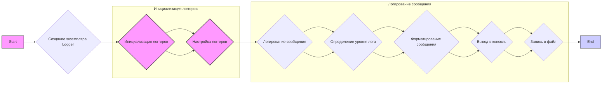
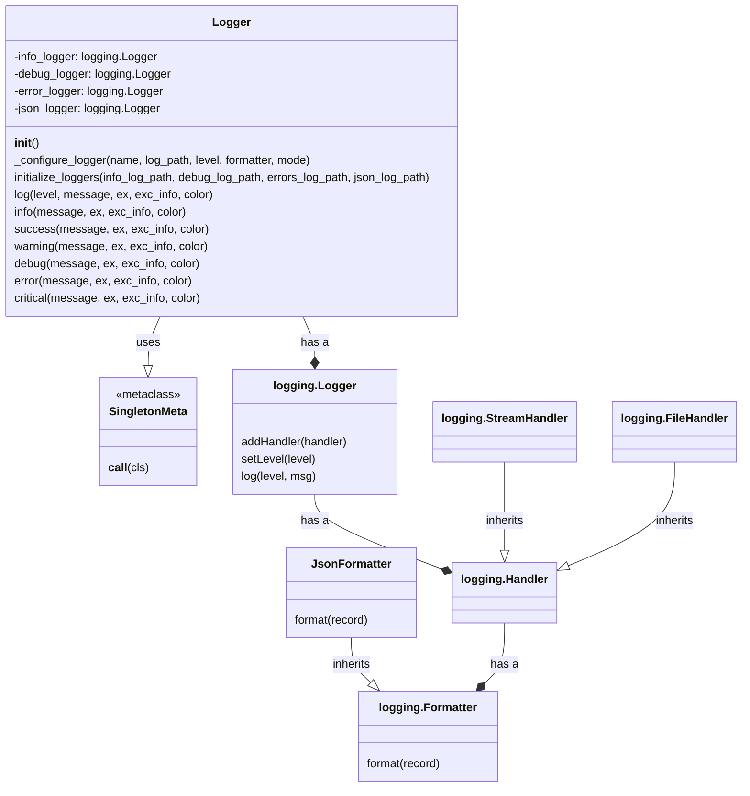

## Анализ кода модуля `src.logger`

### 1. <алгоритм>
Модуль `src.logger` предоставляет гибкую систему логирования, поддерживающую логирование в консоль, файлы и в формате JSON. Он использует шаблон проектирования Singleton, чтобы обеспечить использование единственного экземпляра логгера во всем приложении.

**Блок-схема работы модуля `src.logger`:**



**Примеры:**

1.  **Создание экземпляра Logger (B):**
    ```python
    logger = Logger()
    ```
    
    Создается объект `logger`, который является единственным экземпляром класса `Logger` благодаря метаклассу `SingletonMeta`.

2.  **Инициализация логгеров (C):**
    ```python
    config = {
        'info_log_path': 'logs/info.log',
        'debug_log_path': 'logs/debug.log',
        'errors_log_path': 'logs/errors.log',
        'json_log_path': 'logs/log.json'
    }
    logger.initialize_loggers(**config)
    ```
    
    Инициализируются логгеры для различных типов логов: info, debug, errors, json. Для каждого типа создается отдельный логгер и настраиваются хендлеры (handlers) для записи в соответствующие файлы или для вывода в консоль.

3.  **Настройка логгеров (D):**
    
    Функция `_configure_logger` настраивает каждый логгер, добавляя необходимые хендлеры и форматтеры. Например, для файла журнала устанавливается `FileHandler`, а для консоли – `StreamHandler`. Также настраивается формат сообщений и уровень логирования.

4. **Логирование сообщения (E):**
    ```python
    logger.info('Это информационное сообщение')
    logger.error('Это сообщение об ошибке', ex=ValueError('Неверное значение'))
    ```
   
    Вызывается метод `log` с указанием уровня логирования и сообщения. Также можно передать исключение `ex` и указать нужно ли выводить трассировку исключения `exc_info`.

5. **Определение уровня лога (F):**

   На основе вызываемого метода (`info`, `error`, `debug` и т.д.) или параметра `level` определяется уровень логирования.

6. **Форматирование сообщения (G):**
    
    Форматируется сообщение с помощью `Formatter`, установленного для конкретного хендлера. Если указан кастомный форматтер `JsonFormatter`, сообщение форматируется в JSON.

7. **Вывод в консоль (H):**

   Сообщение выводится в консоль с использованием `StreamHandler`. Если заданы цвета, сообщение выводится с указанными цветами.

8. **Запись в файл (I):**

    Сообщение записывается в файл, соответствующий уровню логирования, с помощью `FileHandler`.

### 2. <mermaid>


**Анализ зависимостей `mermaid`:**
-   **`SingletonMeta`**: Метакласс, который обеспечивает создание только одного экземпляра класса `Logger` (реализует паттерн Singleton). Используется `Logger` через наследование.
-   **`JsonFormatter`**: Кастомный класс для форматирования логов в JSON. Наследуется от `logging.Formatter`, переопределяя метод `format`.
-   **`Logger`**: Основной класс, предоставляющий методы для логирования сообщений. Содержит ссылки на логгеры (`info_logger`, `debug_logger`, `error_logger`, `json_logger`), настроенные с помощью `logging.Logger`. Использует `SingletonMeta`.
-   **`logging.Logger`**: Класс из стандартной библиотеки Python, представляющий логгер. Имеет методы для добавления обработчиков и установки уровня логирования.
-   **`logging.Handler`**: Абстрактный базовый класс для всех обработчиков логов.
-   **`logging.StreamHandler`**: Обработчик для вывода логов в консоль. Наследуется от `logging.Handler`.
-   **`logging.FileHandler`**: Обработчик для записи логов в файл. Наследуется от `logging.Handler`.
-   **`logging.Formatter`**: Класс для форматирования лог-записей. Используется в обработчиках.
-   **`Logger`** *has a* **`logging.Logger`** - это означает, что класс `Logger` содержит экземпляры класса `logging.Logger`.
-   **`logging.Logger`** *has a* **`logging.Handler`** - это означает, что класс `logging.Logger` содержит экземпляры класса `logging.Handler`.
-   **`logging.Handler`** *has a* **`logging.Formatter`** - это означает, что класс `logging.Handler` содержит экземпляры класса `logging.Formatter`.

### 3. <объяснение>
#### Импорты:
-   `import logging`: стандартная библиотека Python для логирования. Предоставляет основные классы и функции для работы с логами.
-  `from typing import Optional`:  используется для обозначения типов переменных как необязательных.

#### Классы:
-   **`SingletonMeta`**: Метакласс, реализующий шаблон проектирования Singleton.
    -   **`__call__(cls)`**: Метод, переопределяющий вызов класса. Гарантирует, что при создании экземпляра класса `Logger` всегда возвращается один и тот же экземпляр.
-   **`JsonFormatter`**: Класс для форматирования логов в JSON.
    -   **`format(record)`**: Метод, который форматирует лог-запись в JSON-формат. Преобразует атрибуты лог-записи (`record`) в словарь и возвращает JSON-строку.
-   **`Logger`**: Основной класс логгера.
    -   **`__init__`**: Инициализирует пустые плейсхолдеры для различных логгеров.
    -   **`_configure_logger(name, log_path, level, formatter, mode)`**: Настраивает логгер, создавая экземпляр `logging.Logger`, добавляя обработчики (handlers) для вывода в консоль или в файл, и устанавливая форматтер и уровень логирования.
        -   `name`: Имя логгера.
        -   `log_path`: Путь к файлу лога.
        -   `level`: Уровень логирования (например, `logging.DEBUG`).
        -   `formatter`: Кастомный форматтер (например, `JsonFormatter`).
        -   `mode`: Режим открытия файла (`'a'` для добавления или `'w'` для перезаписи).
    -   **`initialize_loggers(info_log_path, debug_log_path, errors_log_path, json_log_path)`**: Инициализирует логгеры для разных типов логов (info, debug, errors, json), вызывая метод `_configure_logger` для каждого типа лога.
        -   `info_log_path`: Путь к файлу для info-логов.
        -   `debug_log_path`: Путь к файлу для debug-логов.
        -   `errors_log_path`: Путь к файлу для error-логов.
        -   `json_log_path`: Путь к файлу для json-логов.
    -   **`log(level, message, ex, exc_info, color)`**: Логирует сообщение на указанном уровне. Если задан цвет, выводит сообщение в консоль с соответствующим цветом.
        -   `level`: Уровень логирования.
        -   `message`: Сообщение для логирования.
        -   `ex`: Исключение, которое нужно залогировать.
        -   `exc_info`: Флаг для включения информации об исключении.
        -   `color`: Кортеж с цветами текста и фона.
    -   **`info(message, ex, exc_info, color)`**: Логирует информационное сообщение.
    -   **`success(message, ex, exc_info, color)`**: Логирует сообщение об успешной операции.
    -   **`warning(message, ex, exc_info, color)`**: Логирует предупреждение.
    -   **`debug(message, ex, exc_info, color)`**: Логирует сообщение для отладки.
    -   **`error(message, ex, exc_info, color)`**: Логирует сообщение об ошибке.
    -   **`critical(message, ex, exc_info, color)`**: Логирует критическое сообщение.

#### Функции:
-  Все функции принадлежат классу `Logger`. Их функционал описан в разделе "Классы".

#### Переменные:
-   `logger`: Экземпляр класса `Logger`, используется для логирования сообщений.

#### Потенциальные ошибки и области для улучшения:
-   **Отсутствие обработки ошибок при создании файлов:** Могут возникать ошибки при создании файлов логов (например, если нет прав на запись в указанную директорию).
-   **Жесткая привязка к `colorama`:** Использование `colorama` для цветов делает модуль зависимым от этой библиотеки. Можно сделать цвета опциональными или предусмотреть другую систему для настройки цветов.
-   **Отсутствие валидации путей:** Не проверяется корректность путей к файлам логов.
-   **Отсутствие ротации файлов:** Нет механизма для ротации файлов логов, что может привести к их неограниченному росту.

#### Взаимосвязь с другими частями проекта:
-   Модуль `src.logger` может использоваться в любом месте проекта для логирования событий.
-   Он не зависит от других модулей, что делает его универсальным и легким для интеграции.
-   Предполагается, что данный модуль будет использоваться как зависимость для других модулей.

**Дополнительно**: 
В коде нет импорта `import header`, поэтому дополнительный блок `mermaid` flowchart, объясняющий `header.py` не нужен.