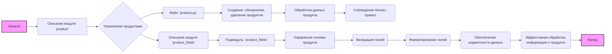

# Анализ кода `hypotez/src/product/README.MD`

## 1. <алгоритм>

Файл `README.MD` не содержит исполняемого кода, поэтому алгоритм как таковой отсутствует. Он представляет собой текстовое описание модуля `product` и его подмодуля `product_fields`. Описание можно представить в виде следующей блок-схемы, отображающей структуру и взаимодействие модулей:



**Примеры для блоков:**

*   **Управление продуктами (C):**  Создание нового продукта, обновление цены товара, удаление устаревшего продукта.
*   **Файл `product.py` (D):**  Функции `create_product()`, `update_product_price()`, `delete_product()`.
*   **Обработка данных продукта (F):**  Проверка типа данных, преобразование валюты, вычисление скидки.
*   **Соблюдение бизнес-правил (G):**  Запрет на создание продукта без названия, проверка уникальности артикула.
*   **Подмодуль `product_fields` (I):**  Содержит классы для описания отдельных полей продукта (например, `TextField`, `IntegerField`).
*   **Валидация полей (K):**  Проверка, что поле "цена" - число, а поле "название" не пустое.
*   **Форматирование полей (L):**  Преобразование даты в нужный формат, преобразование строки к нижнему регистру.
*   **Обеспечение корректности данных (M):**  Гарантирует соответствие всех значений продукта установленным правилам.
*   **Эффективная обработка информации о продукте (N):**  Позволяет системе работать с данными о продуктах быстро и без ошибок.

## 2. <mermaid>

```mermaid
graph LR
    subgraph product_module [Product Module]
      product_py[product.py]
    end
    subgraph product_fields_module [Product Fields Module]
      product_fields[product_fields]
    end
    product_py --> product_fields: Uses
    style product_py fill:#ccf,stroke:#333,stroke-width:2px
    style product_fields fill:#ccf,stroke:#333,stroke-width:2px
```

**Анализ диаграммы `mermaid`:**

*   Диаграмма описывает структуру модуля `product` и его подмодуля `product_fields`.
*   `product_py` (представляющий файл `product.py`) содержит основную логику для работы с продуктами.
*   `product_fields` (подмодуль `product_fields`) отвечает за управление полями продукта.
*   Стрелка между `product_py` и `product_fields` с подписью "Uses" показывает, что модуль `product_py` использует функциональность, предоставляемую подмодулем `product_fields`.

## 3. <объяснение>

**Импорты:**

В данном документе не описаны импорты, так как это `README.MD` файл. Однако, исходя из описания модуля `product`, можно предположить, что в `product.py` и `product_fields` будут использоваться импорты:

*   В `product.py` могут использоваться:
    *   Внутренние модули проекта `src.*` для работы с базой данных, моделями данных.
    *   Модули для валидации (например, `jsonschema`, `pydantic`).
    *   Модули для логирования.
*   В `product_fields` могут использоваться:
    *   Внутренние модули проекта `src.*`.
    *   Модули для валидации данных.

**Классы:**

Файл `README.MD` описывает общую структуру модуля и его подмодуля, но не приводит конкретных классов. Исходя из описания, можно предположить, что:

*   В `product.py` могут быть классы для представления модели продукта (например, класс `Product`), который будет содержать атрибуты, соответствующие полям продукта. Этот класс может содержать методы для управления продуктами (например, создание, обновление, удаление).
*   В `product_fields` могут быть классы для различных типов полей (например, `TextField`, `IntegerField`, `DateField`), каждый из которых будет отвечать за валидацию и форматирование данных определенного типа.

**Функции:**

*   Файл `README.MD` не содержит конкретных функций. Однако, основываясь на описании, можно предположить, что в `product.py` будут функции для:
    *   `create_product(data)`: для создания нового продукта. Принимает словарь `data` с данными о продукте, возвращает созданный продукт или ошибку.
    *   `update_product(product_id, data)`: для обновления существующего продукта. Принимает ID продукта и словарь `data` с обновленными данными, возвращает обновленный продукт или ошибку.
    *   `delete_product(product_id)`: для удаления продукта. Принимает ID продукта, возвращает результат удаления.
    *   `get_product(product_id)`: для получения продукта по ID. Принимает ID продукта, возвращает объект продукта или `None` если продукт не найден.
    *   `get_all_products()`: для получения списка всех продуктов. Возвращает список объектов продуктов.

*   В `product_fields` будут функции для:
    *   `validate(field_name, value)`: для валидации конкретного поля. Принимает имя поля и значение, возвращает `True` или `False`, а так же может выбрасывать исключение.
    *   `format(field_name, value)`: для форматирования конкретного поля. Принимает имя поля и значение, возвращает отформатированное значение.

**Переменные:**

*   В `product.py` могут быть переменные для хранения ID продуктов, словари для хранения данных, списки для хранения множества объектов.
*   В `product_fields` могут быть переменные для хранения правил валидации, форматов, шаблонов.

**Потенциальные ошибки и области для улучшения:**

*   **Отсутствие подробных описаний**: `README.MD` дает общее представление, но не детализирует конкретные импорты, классы, функции и их взаимосвязи. Это может затруднить понимание и использование кода. Необходимо добавить более подробные описания API каждого модуля и класса.
*   **Недостаток примеров кода:** В `README.MD` отсутствуют примеры использования модулей и классов. Необходимо добавить примеры вызова функций и классов.
*   **Отсутствие описания ошибок**: `README.MD` не описывает какие ошибки могут возникнуть и как их обрабатывать. Необходимо добавить описание возможных исключений, которые могут возникать в функциях.
*   **Разделение ответственности:** Необходимо четко разделить зоны ответственности между `product.py` и `product_fields`. Например, бизнес-логика должна быть в `product.py`, а логика валидации и форматирования в `product_fields`.

**Цепочка взаимосвязей с другими частями проекта:**

Модуль `product` и подмодуль `product_fields` будут тесно связаны с:

*   Модулями для работы с базами данных (для сохранения и извлечения данных).
*   Модулями для обработки API-запросов (для создания API endpoints для работы с продуктами).
*   Модулями для аутентификации и авторизации (для контроля доступа к продуктам).
*   Другими бизнес-модулями, которые зависят от данных о продуктах.