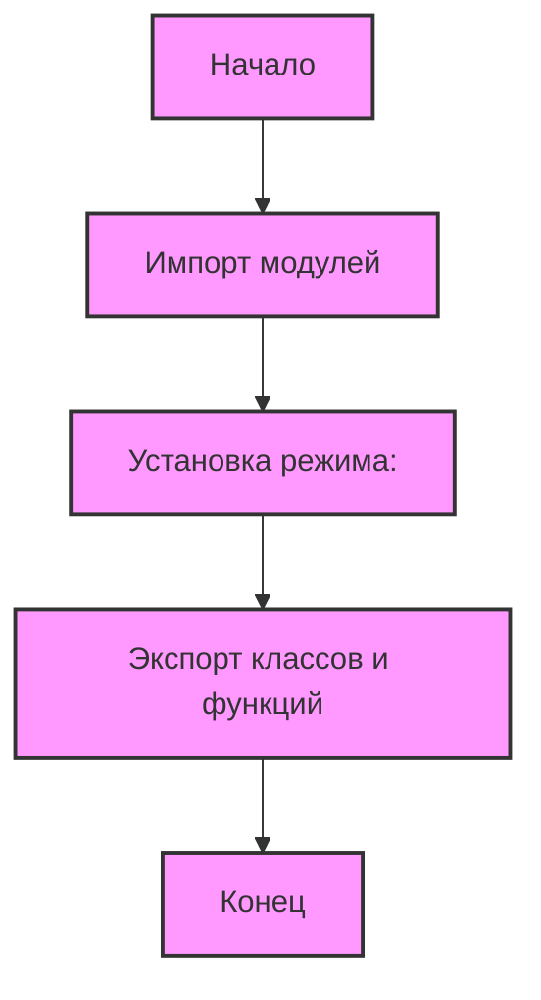

## АНАЛИЗ КОДА: `hypotez/src/product/__init__.py`

### 1. <алгоритм>

**Блок-схема:**



**Примеры:**

1.  **Импорт модулей:**
    *   Импортируются модули `Product` из `product.py`, `ProductFields` из `product_fields/product_fields.py` и функция `translate_presta_fields_dict` из `product_fields/product_fields_translator.py`.
2.  **Установка режима:**
    *   Устанавливается глобальная переменная `MODE` в значение `'dev'`. Этот режим может использоваться для переключения между режимами разработки и продакшена.
3.  **Экспорт классов и функций:**
    *   Импортированные классы и функции становятся доступными для использования в других частях проекта при импорте пакета `src.product`.

### 2. <mermaid>

```mermaid
flowchart TD
    subgraph src.product
        __init__[<code>__init__.py</code><br>Exports classes and functions]
        product[<code>product.py</code><br>Defines Product class]
        product_fields_module[<code>product_fields</code><br>Submodule]
    end
    
    subgraph product_fields_module
        product_fields[<code>product_fields.py</code><br>Defines ProductFields class]
        product_fields_translator[<code>product_fields_translator.py</code><br>Defines translate_presta_fields_dict function]
    end
    
    __init__ --> product: Import Product
    __init__ --> product_fields: Import ProductFields
    __init__ --> product_fields_translator: Import translate_presta_fields_dict
```

**Анализ зависимостей `mermaid`:**

*   `__init__.py` :  является точкой входа для пакета `src.product` и импортирует `Product` класс из `product.py`, `ProductFields` из `product_fields.py` и `translate_presta_fields_dict` функцию из `product_fields_translator.py`.  
*   `product.py` :  содержит определение класса `Product`, представляющего продукт.  
*   `product_fields.py` :  содержит определение класса `ProductFields`, который описывает поля продукта.  
*   `product_fields_translator.py` :  содержит функцию `translate_presta_fields_dict`, которая занимается переводом полей `ProductFields`.

### 3. <объяснение>

**Импорты:**

*   `from .product import Product`: Импортирует класс `Product` из модуля `product.py`, находящегося в той же директории (`src/product`). Этот класс, вероятно, содержит основную логику работы с продуктами.
*   `from .product_fields.product_fields import ProductFields`: Импортирует класс `ProductFields` из модуля `product_fields.py`, расположенного в поддиректории `product_fields`. Этот класс, скорее всего, определяет поля, которыми обладают продукты.
*   `from .product_fields.product_fields_translator import translate_presta_fields_dict`: Импортирует функцию `translate_presta_fields_dict` из модуля `product_fields_translator.py`, находящегося в поддиректории `product_fields`. Эта функция, вероятно, предназначена для перевода полей продукта на разные языки.

**Переменные:**

*   ``: Глобальная переменная, устанавливающая режим работы модуля в `'dev'` (разработка). Это может использоваться для переключения между разными настройками или поведением в зависимости от того, является ли это средой разработки или продакшен.

**Описание:**

Файл `__init__.py` делает модули и функции доступными при импорте пакета `src.product`. Это основной способ сделать `Product`, `ProductFields` и `translate_presta_fields_dict` доступными для использования в других частях проекта.
*   `Product` представляет собой абстракцию для работы с продуктами, включая атрибуты и методы.
*   `ProductFields` представляет собой описание полей продукта.
*   `translate_presta_fields_dict` переводит поля продукта, вероятно, для многоязычной поддержки.

**Потенциальные улучшения:**

*   **Использование Enum для режимов:** Вместо прямого задания строкой `'dev'` для `MODE`, можно использовать `Enum`, чтобы сделать код более читаемым и избежать ошибок при использовании.
*   **Управление режимом через переменные окружения:** Режим можно определить через переменную окружения, чтобы не менять код для разных окружений.

**Взаимосвязь с другими частями проекта:**

*   `src.product` является пакетом, который можно импортировать в другие части проекта для работы с продуктами.
*   Другие части проекта могут использовать классы `Product` и `ProductFields`, а также функцию `translate_presta_fields_dict` для создания, управления и отображения продуктов.
*   Зависимости от `product.py`, `product_fields.py` и `product_fields_translator.py` показывают, что `src.product` имеет модульную архитектуру.