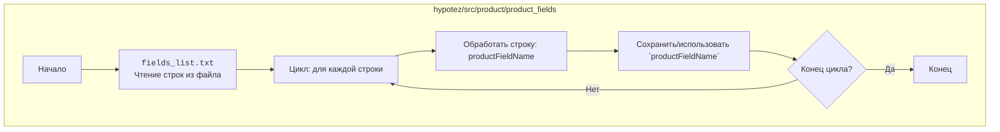

## АНАЛИЗ КОДА

### 1. <алгоритм>

**Описание:**

Данный код представляет собой простой список текстовых строк, каждая из которых, по-видимому, является названием поля продукта в некоторой системе (скорее всего, базе данных или CMS). Алгоритмически это можно представить как итерацию по списку, где каждая строка обрабатывается.

**Блок-схема:**

```mermaid
flowchart TD
    Start[Начало] --> ReadFile[Прочитать файл fields_list.txt]
    ReadFile --> LoopStart[Начать цикл по строкам]
    LoopStart --> ProcessLine[Обработать текущую строку]
    ProcessLine --> StoreLine[Сохранить/использовать строку (например, в список)]
    StoreLine --> LoopEnd{Конец цикла?}
    LoopEnd -- Нет --> LoopStart
    LoopEnd -- Да --> End[Конец]
```

**Примеры:**

1. **Чтение файла:**
   - Файл `fields_list.txt` открывается и построчно считывается.

2. **Обработка текущей строки:**
   - На первой итерации цикла строка `additional_delivery_times` считывается из файла.
   - На второй итерации строка `additional_shipping_cost` считывается.
   - И так далее для каждой строки до `local_video_path`.

3. **Сохранение/использование строки:**
   - Внутри цикла, считанная строка может быть добавлена в список, использована для создания объекта или отправлена в другую часть системы.

**Поток данных:**

- Данные читаются из файла `fields_list.txt`.
- Строки из файла передаются последовательно в цикл для обработки.
- Каждая строка используется для дальнейших операций (например, создания полей в структуре данных).

### 2. <mermaid>



**Анализ зависимостей:**

В данном случае нет явных импортов или зависимостей от других модулей. Диаграмма `mermaid` показывает только логику обработки данных внутри файла `fields_list.txt`.

### 3. <объяснение>

**Импорты:**

В данном коде нет импортов, так как это простой текстовый файл.

**Классы:**

В данном коде нет классов, так как это простой текстовый файл.

**Функции:**

В данном коде нет функций, так как это простой текстовый файл.

**Переменные:**

- Каждая строка в файле представляет собой переменную, хотя не определена как таковая в коде Python.
- Строки представляют собой названия полей (атрибутов) продукта, такие как:
   - `additional_delivery_times`: Дополнительное время доставки.
   - `additional_shipping_cost`: Дополнительная стоимость доставки.
   - `advanced_stock_management`: Расширенное управление складом.
   - ...
   - `local_image_path`: Локально сохраненное изображение.
   - `local_video_path`: Локально сохраненное видео.

**Объяснение и использование:**

1. **Список полей:** Файл `fields_list.txt` представляет собой список полей продукта. Эти поля могут быть использованы для:
    - Создания структуры данных продукта в программном коде (например, класса или словаря).
    - Генерации формы для редактирования продукта в пользовательском интерфейсе.
    - Создания таблиц базы данных для хранения данных продукта.
    - Генерации API для обработки данных продукта.

2. **Назначение полей:** Каждое поле имеет свое конкретное назначение, например:
    - `name`, `description`, `description_short` - текстовые описания продукта.
    - `price`, `wholesale_price` - ценовая информация.
    - `quantity_discount`, `minimal_quantity` - параметры для управления количеством.
    - `id_product`, `id_category_default` - идентификаторы, связывающие продукт с другими сущностями.
    - `weight`, `height`, `width`, `depth`, `volume` - габариты продукта.
    - `ean13`, `upc`, `isbn`, `mpn` - идентификационные коды.
    - `available_date`, `date_add`, `date_upd` - даты создания и изменения.

**Потенциальные ошибки и области для улучшения:**

1. **Формат файла:** Файл просто представляет собой список строк. Лучшим вариантом было бы использование формата JSON или CSV, что упростило бы программную обработку данных.
2. **Консистентность данных:**  Отсутствие контроля типов данных для полей (например, `price` должно быть числом, а `name` - строкой). Добавление схемы валидации данных.
3. **Дубликаты:** Необходимо проверять отсутствие дубликатов.

**Взаимосвязи с другими частями проекта:**

- Этот файл, скорее всего, используется в других частях проекта `hypotez` для:
  - Создания структуры данных продукта.
  - Валидации данных продукта.
  - Генерации интерфейсов для работы с продуктами.
  - Работы с базой данных.

**Пример цепочки взаимосвязей:**

1. `fields_list.txt` -> `product_class.py` (класс для представления продукта).
2. `product_class.py` -> `product_form.py` (генерация формы редактирования).
3. `product_form.py` -> `database_module.py` (сохранение в базу данных).