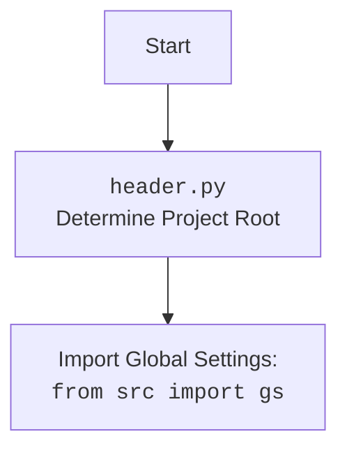

## ИНСТРУКЦИЯ:

Анализируй предоставленный код подробно и объясни его функциональность. Ответ должен включать три раздела:

1.  **<алгоритм>**: Опиши рабочий процесс в виде пошаговой блок-схемы, включая примеры для каждого логического блока, и проиллюстрируй поток данных между функциями, классами или методами.
2.  **<mermaid>**: Напиши код для диаграммы в формате `mermaid`, проанализируй и объясни все зависимости,
    которые импортируются при создании диаграммы.
    **ВАЖНО!** Убедитесь, что все имена переменных, используемые в диаграмме `mermaid`,
    имеют осмысленные и описательные имена. Имена переменных вроде `A`, `B`, `C`, и т.д., не допускаются!

    **Дополнительно**: Если в коде есть импорт `import header`, добавьте блок `mermaid` flowchart, объясняющий `header.py`:
    ```mermaid
    flowchart TD
        Start --> Header[<code>header.py</code><br> Determine Project Root]

        Header --> import[Import Global Settings: <br><code>from src import gs</code>]
    ```

3.  **<объяснение>**: Предоставьте подробные объяснения:
    - **Импорты**: Их назначение и взаимосвязь с другими пакетами `src.`.
    - **Классы**: Их роль, атрибуты, методы и взаимодействие с другими компонентами проекта.
    - **Функции**: Их аргументы, возвращаемые значения, назначение и примеры.
    - **Переменные**: Их типы и использование.
    - Выделите потенциальные ошибки или области для улучшения.

Дополнительно, постройте цепочку взаимосвязей с другими частями проекта (если применимо).

Это обеспечивает всесторонний и структурированный анализ кода.
## Формат ответа: `.md` (markdown)
**КОНЕЦ ИНСТРУКЦИИ**

## <алгоритм>

```mermaid
graph TD
    A[Start: Исполнение скрипта header.py] --> B{Определение корня проекта: set_project_root()};
    B -- Найдена корневая папка --> C{Установка корня проекта в sys.path};
    B -- Не найдена корневая папка --> D{Корень проекта: Текущая папка};
    C --> D;
    D --> E{Загрузка глобальных настроек: импорт gs};
    E --> F{Загрузка настроек из JSON-файла};
    F -- Успешно загружены --> G{Загрузка документации из README.MD};
    F -- Ошибка загрузки --> G;
    G -- Успешно загружены --> H{Установка переменных:  __project_name__, __version__, __doc__, __details__, __author__, __copyright__, __cofee__};
    G -- Ошибка загрузки --> H;
    H --> I[End: Завершение скрипта];
    
    subgraph "set_project_root()"
        style B fill:#f9f,stroke:#333,stroke-width:2px
        B --> B1{Начальный путь:  путь до текущего файла};
        B1 --> B2{Перебор папок-родителей};
        B2 -- Найдена маркер-папка --> B3{Установка корня проекта как текущей родительской папки};
        B2 -- Маркер-папка не найдена --> B4{Корнем проекта остается исходный путь};
         B3 --> B5{Корень проекта возвращается};
          B4 --> B5
    end
     subgraph "Загрузка настроек"
     style F fill:#ccf,stroke:#333,stroke-width:2px
     F --> F1{Открытие файла settings.json};
     F1 -- Файл найден --> F2{Чтение и парсинг JSON};
     F1 -- Файл не найден --> F3[Исключение: FileNotFoundError];
     F2 -- JSON прочитан --> F4{Сохранение настроек};
     F2 -- Ошибка парсинга --> F5[Исключение: JSONDecodeError];
     F3 --> F4
     F5 --> F4
   end
    
    subgraph "Загрузка документации"
     style G fill:#cca,stroke:#333,stroke-width:2px
     G --> G1{Открытие файла README.MD};
     G1 -- Файл найден --> G2{Чтение текста};
     G1 -- Файл не найден --> G3[Исключение: FileNotFoundError];
     G2 --> G4{Сохранение текста в переменную doc_str};
    
      G3 --> G4;
   end
    
```

## <mermaid>

```mermaid
flowchart TD
    Start --> ProjectRoot[<code>header.py</code><br> Determine Project Root];
   ProjectRoot --> ImportGlobalSettings[Import Global Settings: <br><code>from src import gs</code>];
   ImportGlobalSettings --> LoadSettings[Load Settings from <br> <code>settings.json</code>];
   LoadSettings --> LoadDocumentation[Load Documentation from <br> <code>README.MD</code>];
   LoadDocumentation --> SetVariables[Set Project Variables: <br><code>__project_name__, __version__</code>, etc.];
    SetVariables --> End;
   
   subgraph ProjectRoot
    style ProjectRoot fill:#f9f,stroke:#333,stroke-width:2px
    ProjectRoot --> FindRoot[Find project root folder];
    FindRoot --> UpdateSysPath[Update sys.path with project root];
    UpdateSysPath --> ReturnRoot[Return Project Root Path];
   end
     
   subgraph LoadSettings
    style LoadSettings fill:#ccf,stroke:#333,stroke-width:2px
    LoadSettings --> OpenSettingsFile[Open <code>settings.json</code>];
    OpenSettingsFile -- Success --> ParseJSON[Parse JSON Data];
    OpenSettingsFile -- Fail --> HandleSettingsError[Handle Error];
    ParseJSON --> StoreSettings[Store settings in <code>settings</code> variable];
    HandleSettingsError --> StoreSettings;
    end
  
 subgraph LoadDocumentation
    style LoadDocumentation fill:#cca,stroke:#333,stroke-width:2px
     LoadDocumentation --> OpenReadmeFile[Open <code>README.MD</code>];
    OpenReadmeFile -- Success --> ReadReadme[Read <code>README.MD</code> text];
     OpenReadmeFile -- Fail --> HandleReadmeError[Handle Error];
     ReadReadme --> StoreDocStr[Store text in <code>doc_str</code> variable];
     HandleReadmeError --> StoreDocStr;
    end
   
```



## <объяснение>

**Импорты:**

*   `sys`: Модуль `sys` используется для работы с системными параметрами и функциями. Здесь он применяется для добавления корневой директории проекта в список путей поиска модулей (`sys.path`). Это позволяет импортировать модули из проекта, как если бы они находились в стандартных путях поиска.
*   `json`: Модуль `json` используется для работы с данными в формате JSON. Он используется для загрузки настроек проекта из файла `settings.json`.
*   `packaging.version`: Модуль `packaging.version` предоставляет инструменты для работы с версиями пакетов. Хотя в коде он импортирован, но фактически не используется. Возможно, это запланированный функционал на будущее.
*   `pathlib.Path`: Класс `Path` из модуля `pathlib` предоставляет объектно-ориентированный способ работы с путями к файлам и директориям. Он используется для поиска корневой директории проекта и для формирования путей к файлам настроек и документации.
*   `from src import gs`:  Импорт глобальных настроек из `src.gs`. Предполагается, что `gs` содержит пути к различным ресурсам проекта, включая корневую директорию. Это позволяет обращаться к путям внутри проекта, как к свойствам объекта.

**Функции:**

*   `set_project_root(marker_files: tuple = ('__root__')) -> Path`:
    *   **Аргументы:** `marker_files` - кортеж с именами файлов или директорий, которые используются для определения корневой директории проекта. По умолчанию это `('__root__')`.
    *   **Возвращаемое значение:** Объект `Path`, представляющий путь к корневой директории проекта.
    *   **Назначение:** Функция определяет корневую директорию проекта, поднимаясь по иерархии каталогов от текущего файла, пока не будет найдена директория, содержащая один из указанных `marker_files`. Если такая директория не найдена, возвращается директория, в которой находится скрипт. После нахождения корневой директории, она добавляется в `sys.path` для корректной работы импортов.
    *   **Примеры:**
        *   Если в директории `/home/user/project/src/product/product_fields/` находится файл `header.py`, и в директории `/home/user/project/` есть файл `__root__`, то функция вернет `Path('/home/user/project/')`.
        *   Если маркерный файл не будет найден,  то функция вернет  `Path('/home/user/project/src/product/product_fields/')`.

**Переменные:**

*   `__root__`:  Тип `Path`. Путь к корневой директории проекта. Инициализируется результатом вызова функции `set_project_root()`.
*   `settings`: Тип `dict`. Словарь с настройками проекта, загруженными из файла `settings.json`. Если файл не найден или возникла ошибка парсинга, переменная остается `None`.
*   `doc_str`: Тип `str`. Содержит текст из файла README.MD. Если файл не найден или возникла ошибка чтения, то переменная остается `None`.
*   `__project_name__`: Тип `str`. Имя проекта. Получается из `settings['project_name']`, если settings загружены, иначе по умолчанию `hypotez`.
*   `__version__`: Тип `str`. Версия проекта. Получается из `settings['version']`, если settings загружены, иначе пустая строка.
*   `__doc__`: Тип `str`. Текст из документации проекта, загруженный из файла `README.MD`.
*   `__details__`: Тип `str`. Дополнительная информация о проекте. В коде установлена пустая строка.
*   `__author__`: Тип `str`. Имя автора проекта. Получается из `settings['author']`, если settings загружены, иначе пустая строка.
*   `__copyright__`: Тип `str`. Информация о копирайте проекта. Получается из `settings['copyrihgnt']`, если settings загружены, иначе пустая строка.
*   `__cofee__`: Тип `str`.  Строка с информацией о спонсорстве разработки. Получается из `settings['cofee']`, если settings загружены, иначе стандартная строка с адресом для пожертвования.

**Объяснение:**

1.  **Определение корня проекта:** Функция `set_project_root` динамически определяет корневую директорию проекта, позволяя запускать скрипты из разных мест в иерархии проекта. Это достигается поиском файлов-маркеров, таких как `__root__`.
2.  **Импорт глобальных настроек:** Строка `from src import gs` импортирует модуль глобальных настроек, который, предположительно, содержит пути и другую конфигурационную информацию, используемую в проекте.
3.  **Загрузка настроек из JSON:** Код пытается прочитать файл `settings.json` и загрузить его содержимое в словарь `settings`.  Если файл отсутствует или содержит некорректный JSON, переменная `settings` останется `None`. Обработка исключений позволяет продолжить выполнение, даже если файл настроек не найден.
4.  **Загрузка документации из README.MD:** Код пытается прочитать файл `README.MD` и загрузить его содержимое в строку `doc_str`. Если файл отсутствует, переменная `doc_str` остается `None`.  Обработка исключений позволяет продолжить выполнение, даже если файл документации не найден.
5.  **Установка переменных:** Переменные `__project_name__`, `__version__`, `__doc__`, `__details__`, `__author__`, `__copyright__`, `__cofee__`  инициализируются значениями из `settings`, если они доступны, в противном случае используются значения по умолчанию. Это позволяет централизованно управлять основной информацией проекта через файл настроек.

**Потенциальные ошибки и области для улучшения:**

*   **Обработка ошибок JSON:** Обработка `json.JSONDecodeError` может быть расширена, чтобы логировать или выводить сообщение об ошибке парсинга, что облегчит отладку.
*   **Отсутствие проверок:** Код предполагает наличие файла `settings.json` и `README.MD`. Можно добавить обработку ситуации, когда эти файлы отсутствуют или не содержат ожидаемых данных.
*   **Не используется:** `from packaging.version import Version` - импорт не используется, возможно запланирован на будущее.
*   **Имя переменной:** Опечатка в имени `copyrihgnt` переменной, которая должна называться `copyright`.

**Взаимосвязи с другими частями проекта:**

*   Этот файл, `header.py`, вероятно, используется как модуль, который импортируется другими частями проекта. Он предоставляет доступ к корневой директории проекта, настройкам и документации.
*   Файл `settings.json` и `README.MD` являются внешними ресурсами, которые используются для настройки проекта и предоставления информации о нем. Изменения в этих файлах повлияют на работу данного модуля.
*   Модуль `src.gs`, который импортируется, предоставляет глобальные настройки, которые, вероятно, используются и в других частях проекта, обеспечивая согласованность в структуре и путях.
*   Использование `sys.path` позволяет импортировать модули проекта из любой точки, что обеспечивает гибкость в организации кода.