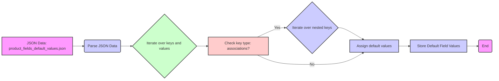

## ИНСТРУКЦИЯ:

Анализируй предоставленный код подробно и объясни его функциональность. Ответ должен включать три раздела:

1.  **<алгоритм>**: Опиши рабочий процесс в виде пошаговой блок-схемы, включая примеры для каждого логического блока, и проиллюстрируй поток данных между функциями, классами или методами.
2.  **<mermaid>**: Напиши код для диаграммы в формате `mermaid`, проанализируй и объясни все зависимости,
    которые импортируются при создании диаграммы.
    **ВАЖНО!** Убедитесь, что все имена переменных, используемые в диаграмме `mermaid`,
    имеют осмысленные и описательные имена. Имена переменных вроде `A`, `B`, `C`, и т.д., не допускаются!

    **Дополнительно**: Если в коде есть импорт `import header`, добавьте блок `mermaid` flowchart, объясняющий `header.py`:
    ```mermaid
    flowchart TD
        Start --> Header[<code>header.py</code><br> Determine Project Root]

        Header --> import[Import Global Settings: <br><code>from src import gs</code>]
    ```

3.  **<объяснение>**: Предоставьте подробные объяснения:
    *   **Импорты**: Их назначение и взаимосвязь с другими пакетами `src.`.
    *   **Классы**: Их роль, атрибуты, методы и взаимодействие с другими компонентами проекта.
    *   **Функции**: Их аргументы, возвращаемые значения, назначение и примеры.
    *   **Переменные**: Их типы и использование.
    *   Выделите потенциальные ошибки или области для улучшения.

Дополнительно, постройте цепочку взаимосвязей с другими частями проекта (если применимо).

Это обеспечивает всесторонний и структурированный анализ кода.
## Формат ответа: `.md` (markdown)
**КОНЕЦ ИНСТРУКЦИИ**

### <алгоритм>
Данный JSON-файл представляет собой структуру данных, содержащую значения по умолчанию для полей, связанных с продуктом. Этот файл можно рассматривать как шаблон или начальную конфигурацию для создания или обновления данных о продукте в базе данных или в системе управления контентом (CMS). 

1.  **Инициализация полей**: JSON-объект содержит набор пар ключ-значение, где ключи представляют собой названия полей продукта (например, `available_now`, `price`, `description`), а значения представляют собой их значения по умолчанию.

    *   Пример: `"price": ""` - поле `price` инициализируется пустой строкой, что указывает на отсутствие цены по умолчанию.
    *   Пример: `"active": 1` - поле `active` инициализируется как `1`, что обычно означает, что продукт активен по умолчанию.
2.  **Обработка ассоциаций**: Внутри JSON-структуры имеется раздел `"associations"`, который содержит вложенные объекты, описывающие связи продукта с другими сущностями.

    *   Пример: `"categories": { "category": [{"id": "2"}] }` - продукт по умолчанию связан с категорией с ID равным `2`.
    *   Пример: `"images": { "image": [{"id": ""}] }` - продукт связан с изображениями, но по умолчанию не имеет конкретного ID изображения.
3.  **Установка числовых параметров**: Некоторые поля, например `id_category_default`, `id_lang`, `id_shop`, `id_tax`, `minimal_quantity` и т.д. инициализированы числовыми значениями.

    *   Пример: `"id_category_default": 2` - ID категории по умолчанию для продукта равен `2`.
    *   Пример: `"minimal_quantity": 1` - минимальное количество единиц продукта для заказа равно `1`.
4.  **Флаги и настройки**: Некоторые поля устанавливают флаги и настройки для продукта.

    *   Пример: `"available_for_order": 1` - продукт доступен для заказа.
    *   Пример: `"on_sale": 1` - продукт продается со скидкой (или выставлен на продажу).
    *   Пример: `"online_only": 0` - продукт доступен не только онлайн.
5.  **Текстовые поля**: Многие поля представляют собой текстовые описания, которые изначально пусты.

    *   Пример: `"description": ""` - поле для полного описания продукта пусто по умолчанию.
    *   Пример: `"name": ""` - поле для имени продукта пусто по умолчанию.

### <mermaid>

**Объяснение зависимостей в диаграмме:**
1.  `A[JSON Data: product_fields_default_values.json]` - Начальная точка: файл `product_fields_default_values.json`, содержащий JSON-структуру с значениями по умолчанию для полей продукта.
2.  `B(Parse JSON Data)` - JSON данные из файла A парсятся для дальнейшей обработки.
3. `C{Iterate over keys and values}` - Итерация по ключам и значениям в JSON-объекте.
4.  `D[Check key type: associations?]` - Проверка, является ли текущий ключ частью ассоциаций (т.е. вложенным объектом).
5. `E{Iterate over nested keys}` - Если ключ относится к ассоциациям, то начинается итерация по вложенным ключам.
6.  `F[Assign default values]` - Присваивание значений по умолчанию для текущего поля или вложенных полей.
7. `G[Store Default Field Values]` -  Сохранение значений по умолчанию в структуру данных.
8. `H(End)` - Конец процесса обработки данных.

### <объяснение>
**Описание файла `product_fields_default_values.json`:**

Данный файл содержит JSON-объект, который определяет значения по умолчанию для различных полей, используемых для описания продукта в системе.  Это своего рода шаблон, который содержит стандартные значения для различных атрибутов товара, таких как цена, описание, категории, изображения и т.д.

*   **Импорты**:
    *   В данном коде нет импортов, так как это просто файл данных в формате JSON, и он не является исполняемым кодом.
*   **Классы**:
    *   В этом файле нет определений классов. JSON - это формат данных, а не язык программирования, поэтому в нем не определяются классы.
*   **Функции**:
    *   В этом файле нет определений функций. JSON-файл предназначен только для хранения данных, а не для выполнения каких-либо операций.
*   **Переменные**:
    *   Файл JSON по сути описывает переменные, которые представляют собой свойства продукта.  Каждый ключ в JSON-объекте можно рассматривать как переменную.
    *   Типы переменных: значения могут быть строками (например, `"name": ""` ), числами (например, `"active": 1`), объектами (например, `"associations": {...}`), массивами (например, `"categories": { "category": [{...}] }`).
    *   Использование: Эти переменные используются для инициализации полей продукта при создании нового продукта, либо как значения по умолчанию при редактировании существующего продукта.

**Подробное объяснение полей:**

*   **`available_now`, `available_later`**: Строки, представляющие собой сообщения о доступности товара в данный момент или позже. По умолчанию - пустые строки.
*   **`affiliate_*`**: Поля, связанные с партнерскими программами. Содержат ссылки, текст, краткое и длинное описание и изображения.
*   **`active`**: Целое число (1 или 0), указывающее, является ли продукт активным. По умолчанию - 1 (активен).
*   **`additional_delivery_times`, `additional_shipping_cost`**:  Строки,  описывающие дополнительные сроки доставки и стоимость доставки.
*   **`advanced_stock_management`**: Строка, определяющая уровень управления запасами. По умолчанию - "0".
*   **`associations`**: Объект, описывающий связи продукта с другими сущностями.
    *   **`categories`**: Категории, к которым принадлежит продукт.
    *   **`images`**: Изображения, связанные с продуктом.
    *   **`combinations`**: Различные комбинации характеристик продукта (например, цвет и размер).
    *   **`product_option_values`**: Значения опций продукта (например, конкретное значение цвета).
    *   **`product_features`**: Характеристики продукта (например, материал, размер).
    *   **`tags`**: Теги, связанные с продуктом.
    *   **`stock_availables`**: Информация о наличии товара на складе.
    *   **`attachments`**: Вложения, связанные с продуктом.
    *   **`accessories`**: Аксессуары для данного продукта.
    *  **`product_bundle`**: Информация о наборе продуктов.
*   **`available_date`**: Строка, представляющая дату доступности товара.
*   **`available_for_order`**: Целое число (1 или 0), указывающее, доступен ли продукт для заказа. По умолчанию - 1.
*   **`cache_*`**: Поля для кеширования информации о продукте.
*   **`condition`**: Строка, определяющая состояние товара (например, "new", "used"). По умолчанию - "new".
*   **`customizable`**: Строка, определяющая возможность настройки товара.
*   **`date_add`, `date_upd`**: Строки, содержащие дату добавления и обновления продукта.
*    **`default_image_url`, `images_urls`**:  Строка, содержащая URL основного изображения и всех изображений.
*   **`delivery_additional_message`**:  Строка, содержащая дополнительное сообщение для доставки.
*   **`delivery_in_stock`, `delivery_out_stock`**: Сообщения, связанные с доставкой, при наличии товара или при его отсутствии.
*   **`depth`, `height`, `width`, `volume`, `weight`**:  Размеры и вес товара.
*   **`description`, `description_short`**: Строки, содержащие полное и краткое описание продукта.
*   **`ean13`, `isbn`, `mpn`, `reference`, `supplier_reference`, `upc`**: Различные идентификаторы продукта (штрихкоды, артикул, идентификатор поставщика).
*    **`ecotax`**: Строка, содержащая налог на экологию.
*   **`id_*`**: Различные идентификаторы (категории, языка, магазина, производителя, поставщика, налога, продукта).
*   **`indexed`**: Строка, определяющая индексируется ли продукт.
*   **`is_virtual`**: Целое число (1 или 0), указывающее, является ли продукт виртуальным. По умолчанию - 0.
*   **`locale`**: Строка, определяющая локаль продукта.
*    **`location`**: Строка, содержащая местоположение продукта.
*   **`low_stock_alert`, `low_stock_threshold`**: Поля, связанные с уведомлениями о низком уровне запасов.
*   **`meta_*`**: Метаданные продукта (описание, ключевые слова, заголовок).
*   **`link_rewrite`**:  Строка, содержащая URL адрес продукта.
*   **`name`, `ingredients`, `how_to_use`, `specification`**: Текстовые поля с описательной информацией о продукте.
*   **`minimal_quantity`**: Минимальное количество товара для заказа. По умолчанию - 1.
*   **`on_sale`**: Целое число (1 или 0), указывающее, продается ли товар со скидкой. По умолчанию - 1.
*   **`online_only`**: Целое число (1 или 0), указывающее, доступен ли товар только онлайн. По умолчанию - 0.
*   **`out_of_stock`**: Строка, определяющая поведение при отсутствии товара на складе.
*   **`pack_stock_type`**: Строка, определяющая тип управления запасами для наборов товаров.
*   **`position_in_category`**: Строка, представляющая позицию товара в категории.
*   **`price`**: Строка, содержащая цену товара.
*   **`product_type`**: Строка, содержащая тип продукта (например, "standard", "pack"). По умолчанию - "standard".
*   **`quantity_discount`**: Строка, определяющая скидки при покупке определенного количества товара.
*    **`redirect_type`**: Строка, содержащая тип перенаправления.
*   **`show_condition`, `show_price`**: Целое число (1 или 0), указывающее, нужно ли отображать состояние и цену продукта. По умолчанию - 1.
*   **`state`**: Целое число (1 или 0), представляющее состояние товара. По умолчанию - 1.
*   **`text_fields`**: Строка, содержащая текстовые поля.
*   **`unit_price_ratio`, `unity`**: Поля, связанные с ценой за единицу товара.
*   **`uploadable_files`**: Строка, определяющая наличие загружаемых файлов.
*   **`visibility`**: Целое число (1 или 0), указывающее видимость товара. По умолчанию - 1.
*   **`wholesale_price`**: Строка, содержащая оптовую цену товара.

**Потенциальные ошибки и области для улучшения:**

*   **Жестко заданные значения ID:** Некоторые ID (например, `id_category_default`, `id_lang`, `id_shop`) имеют жестко заданные значения. Было бы лучше, если бы эти значения можно было настраивать через конфигурационный файл или базу данных.
*   **Отсутствие валидации:**  Файл JSON не проводит валидацию данных. Нужно проверять корректность значений полей при их использовании.
*   **Пустые строки как значения по умолчанию:** Многие поля используют пустые строки (`""`) как значения по умолчанию.  В зависимости от контекста использования, возможно, понадобится использовать `null` или другие значения.
*  **Разрозненность полей:**  Набор полей выглядит несколько разрозненным и может потребовать рефакторинга для лучшей организации. Возможно, стоит разбить на более мелкие категории.
*  **Отсутствие комментариев:** JSON-файл не содержит комментариев, что может затруднить понимание назначения отдельных полей.

**Взаимосвязи с другими частями проекта:**

Этот JSON-файл является частью системы, управляющей каталогом товаров. Он взаимодействует со следующими частями системы:

*   **Модуль управления товарами:**  Использует этот файл как шаблон для создания новых продуктов.
*   **База данных:**  Значения из файла используются для заполнения полей в таблицах базы данных, связанных с продуктами.
*   **API**: При создании или редактировании продукта данные из этого файла используются для сериализации и отправки запросов.
*   **Интерфейс пользователя:**  Значения по умолчанию отображаются в форме редактирования товара.

Этот файл является отправной точкой для создания или обновления информации о продукте и помогает стандартизировать процесс ввода данных.