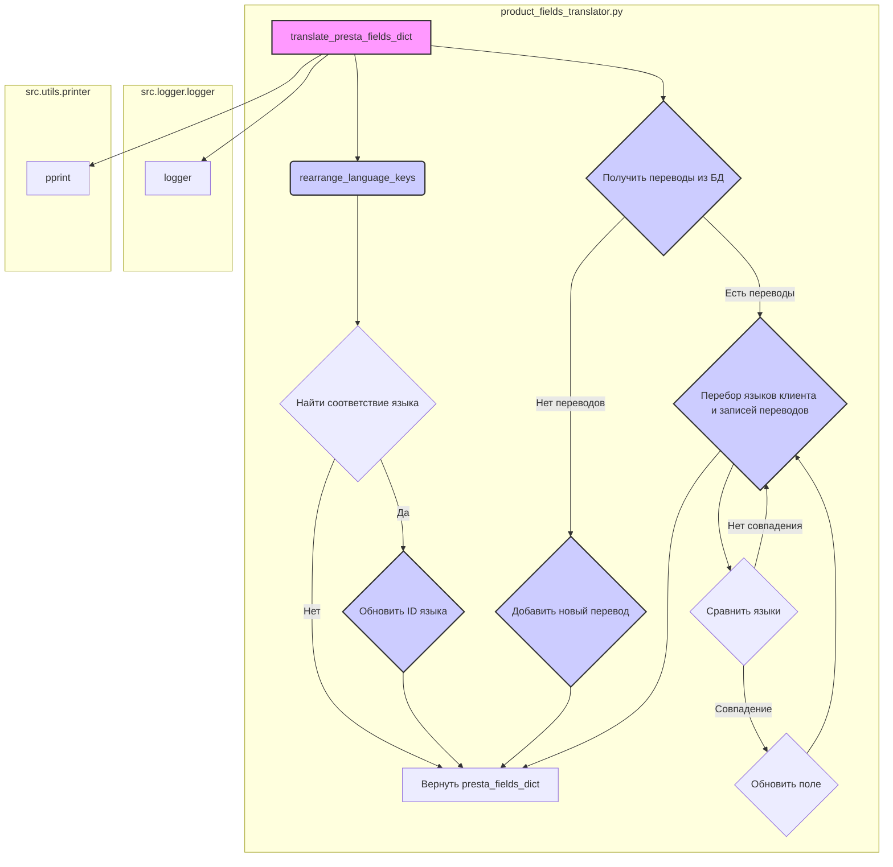

## <алгоритм>

1.  **`rearrange_language_keys`**:
    *   **Вход**: Принимает словарь `presta_fields_dict` с данными о полях товара, список или словарь `client_langs_schema` с информацией о языках клиента и строку `page_lang`, представляющую язык страницы.
    *   **Поиск ID языка**: Перебирает `client_langs_schema`, пытаясь найти соответствие `page_lang` среди полей `locale`, `iso_code` или `language_code`. 
        *   Пример: Если `page_lang` равно "en-US" и в `client_langs_schema` есть запись `{'locale': 'en-US', 'id': 2}`, то `client_lang_id` станет `2`.
    *   **Обновление ID**: Если соответствие найдено (`client_lang_id` не `None`), проходит по всем полям в `presta_fields_dict`. Если поле является словарем и содержит ключ `language`, то для каждого элемента в списке `language` обновляет значение ключа `id` в `attrs` на строку, представляющую `client_lang_id`.
        *   Пример: Если `presta_fields_dict` содержит `{'name': {'language': [{'attrs': {'id': '1'}, 'value': 'Product Name'}]}}` и `client_lang_id` равно 2, то после обновления поле станет `{'name': {'language': [{'attrs': {'id': '2'}, 'value': 'Product Name'}]}}`.
    *   **Выход**: Возвращает обновленный словарь `presta_fields_dict`.

2.  **`translate_presta_fields_dict`**:
    *   **Вход**: Принимает словарь `presta_fields_dict` с данными о полях товара, список или словарь `client_langs_schema` с информацией о языках клиента и строку `page_lang`, представляющую язык страницы.
    *   **Переупорядочивание ключей**: Вызывает `rearrange_language_keys` для обновления языковых идентификаторов в `presta_fields_dict`.
    *   **Получение переводов**:  Вызывает `get_translations_from_presta_translations_table`, чтобы попытаться получить существующие переводы из базы данных (закомментировано в предоставленном коде).
    *   **Обработка отсутствия переводов**: Проверяет, получены ли переводы из базы данных. Если переводов нет или список пуст, добавляется запись в таблицу переводов, и возвращается `presta_fields_dict` без изменений.
    *   **Перебор языков и записей**: Итерируется по языкам в `client_langs_schema` и по записям переводов `enabled_product_translations`.
        *   **Сравнение языков**: Проверяет, содержится ли `iso_code` из `client_lang` в поле `locale` записи перевода.
        *   **Обновление полей**: Если соответствие найдено, для каждого ключа в `presta_fields_dict` проверяет, есть ли такой атрибут в записи перевода. Если есть, то обновляет соответствующий ключ в `presta_fields_dict` значением из записи перевода, оборачивая значение в структуру `{'language': [{'attrs': {'id': client_lang['id']}, 'value': value}]}`.
    *   **Выход**: Возвращает обновленный словарь `presta_fields_dict` с переведенными значениями.

## <mermaid>

**Импортированные зависимости:**

*   `pathlib.Path`: Используется для работы с путями к файлам и директориям в операционной системе.
*  `typing.List`: Используется для аннотации типов, указывая что переменная является списком.
*   `src`: Используется для импорта модулей из пакета `src`, в частности `gs`, `printer` и `logger`.
*   `src.utils.printer.pprint`: Функция для "красивой" печати структур данных.
*   `src.logger.logger.logger`: Объект для логирования событий.
*   `src.logger.exceptions.ProductFieldException`: Пользовательское исключение для обработки ошибок, связанных с полями товара.

## <объяснение>

**Импорты:**

*   `from pathlib import Path`: Импортирует класс `Path` из модуля `pathlib`. Этот класс позволяет работать с путями к файлам и директориям в более объектно-ориентированном стиле, чем стандартные строковые пути. Он используется для манипулирования путями к файлам, но в данном коде не задействован напрямую.
*   `from typing import List`: Импортирует тип `List` для использования в аннотациях типов. В данном случае, он используется для указания, что `client_langs_schema` может быть списком.
*   `from src import gs`: Импортирует глобальные настройки проекта.
*   `from src.utils.printer import pprint`: Импортирует функцию `pprint` из модуля `printer` для "красивой" печати словарей.
*   `from src.logger.logger import logger`: Импортирует объект `logger` из модуля `logger` для логирования ошибок.
*   `from src.logger.exceptions import ProductFieldException`: Импортирует пользовательское исключение `ProductFieldException` из модуля `exceptions` для обработки ошибок, связанных с полями продукта.

**Функции:**

1.  **`rearrange_language_keys(presta_fields_dict: dict, client_langs_schema: dict | List[dict], page_lang: str) -> dict`**:
    *   **Назначение**: Эта функция отвечает за изменение идентификаторов языков в словаре полей товара `presta_fields_dict` на соответствующие идентификаторы из схемы языков клиента `client_langs_schema`. Это необходимо для того, чтобы соответствовать языковым настройкам конкретного клиента.
    *   **Аргументы**:
        *   `presta_fields_dict` (`dict`): Словарь с полями товара, где каждое поле может содержать языковые значения.
        *   `client_langs_schema` (`dict | List[dict]`): Схема языков клиента, содержащая информацию о соответствии языков и их идентификаторах.
        *   `page_lang` (`str`): Язык страницы, с которой были получены данные о товаре.
    *   **Возвращаемое значение**:  `dict` Обновленный словарь `presta_fields_dict` с корректными идентификаторами языков.
    *   **Пример**:
        *   Вход: `presta_fields_dict = {'name': {'language': [{'attrs': {'id': '1'}, 'value': 'Product Name'}]}}`, `client_langs_schema = [{'locale': 'en-US', 'id': 2}]`, `page_lang = 'en-US'`.
        *   Выход: `{'name': {'language': [{'attrs': {'id': '2'}, 'value': 'Product Name'}]}}`.
    *   **Логика**: Функция перебирает `client_langs_schema`, пытаясь найти соответствующий `id` для текущего языка страницы `page_lang`. Если находит, то обновляет все `id` в `presta_fields_dict`.
        *   **Критическое замечание**: В коде есть комментарий "оч плохо А если he или IL?". Это значит, что логика определения языка не является надежной и требует уточнения.

2.  **`translate_presta_fields_dict(presta_fields_dict: dict, client_langs_schema: list | dict, page_lang: str = None) -> dict`**:
    *   **Назначение**: Эта функция выполняет перевод мультиязычных полей товара. Она использует схему языков клиента `client_langs_schema` и данные, полученные от поставщика, чтобы привести языковые идентификаторы к корректным значениям.
    *   **Аргументы**:
        *   `presta_fields_dict` (`dict`): Словарь с полями товара.
        *   `client_langs_schema` (`list | dict`): Схема языков клиента.
        *   `page_lang` (`str`, optional): Язык страницы. Если не задан, функция пытается определить его из текста.
    *   **Возвращаемое значение**:  `dict`  Словарь `presta_fields_dict` с переведенными значениями.
    *   **Пример**:
        *   Вход: `presta_fields_dict = {'name': {'language': [{'attrs': {'id': '1'}, 'value': 'Product Name'}]}}`, `client_langs_schema = [{'iso_code': 'en', 'id': 2}]`, `page_lang = 'en-US'`.
        *   Выход: `{'name': {'language': [{'attrs': {'id': '2'}, 'value': 'Product Name'}]}}`.
    *   **Логика**: Функция сначала переупорядочивает ключи с помощью `rearrange_language_keys`. Затем пытается получить переводы из БД. Если их нет, добавляет текущий перевод как новый. Если переводы есть, то для каждого языка клиента она ищет соответствие в переводах и обновляет значения полей.
        *   **Критическое замечание**: В коде есть закомментированные строки, связанные с работой с базой данных `ProductTranslationsManager`, `get_translations_from_presta_translations_table` и  `insert_new_translation_to_presta_translations_table`. Это говорит о том, что функциональность работы с БД может быть неполной или временно отключенной, что является потенциальной проблемой.

**Переменные:**

*   `presta_fields_dict` (`dict`): Словарь, содержащий поля товара, полученные от поставщика.
*   `client_langs_schema` (`list | dict`): Схема языков клиента, содержащая информацию о соответствии языков и их идентификаторах.
*   `page_lang` (`str`): Язык страницы, с которой получены данные о товаре.
*   `client_lang_id` (`int | None`): Идентификатор языка клиента, полученный из `client_langs_schema`.
*   `enabled_product_translations` (`List`): Список переводов продукта, полученный из базы данных.
*   `client_lang` (`dict`): Текущий язык клиента из `client_langs_schema` в процессе перебора.
*   `translated_record` (`object`): Запись перевода продукта из `enabled_product_translations`.

**Потенциальные ошибки и области для улучшения:**

*   **Ненадежное определение языка**: Функция `rearrange_language_keys` ищет соответствие языка по трем полям `locale`, `iso_code` и `language_code`, что является недостаточно гибким и может привести к ошибкам.
*   **Неполная реализация работы с БД**: Код содержит закомментированные строки, связанные с базой данных, что может указывать на неполную реализацию функциональности.
*   **Жесткая привязка к строковым ID**: Код предполагает, что идентификаторы языков всегда должны быть строками, что связано с XML-парсером. Это может быть не гибко и стоит пересмотреть, если в будущем появятся другие форматы данных.
*   **Отсутствие обработки ошибок**: В функции `translate_presta_fields_dict` есть блок `try...except`, который ловит исключения, но не обрабатывает их должным образом, только логирует. Необходимо более корректно обрабатывать ошибки.
*   **Недостаточная документация**: Код содержит краткие комментарии, но отсутствует более подробное описание алгоритмов и структур данных.

**Взаимосвязи с другими частями проекта:**

*   Зависит от `src.gs` для получения глобальных настроек.
*   Использует `src.utils.printer.pprint` для "красивой" печати, что может использоваться для отладки.
*   Использует `src.logger.logger.logger` для логирования ошибок.
*   Использует `src.logger.exceptions.ProductFieldException` для обработки ошибок, связанных с полями продукта.
*   Связан с  модулями для работы с базой данных (`ProductTranslationsManager`), которые в текущем коде не используются, но, как видно из кода, это ожидается.

В целом, код выполняет важную функцию по переводу полей товара, но требует доработки и рефакторинга для повышения надежности и гибкости.