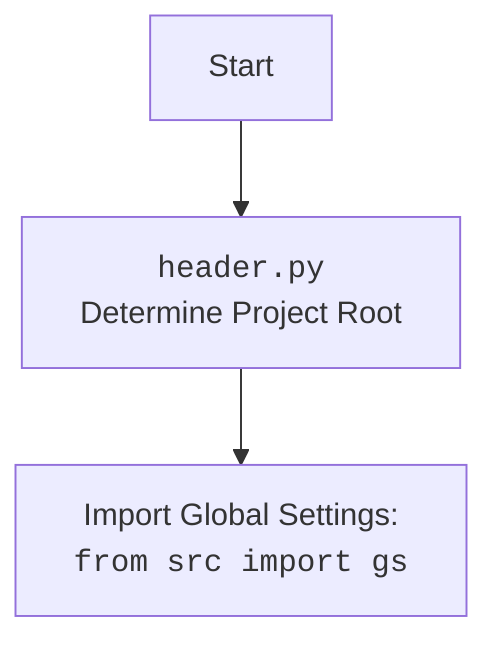

## АНАЛИЗ КОДА: `src/product/readme.ru.md`

### 1. <алгоритм>

**Общая схема работы:**

1. **Инициализация `Product`:**
   - При создании объекта `Product` вызывается метод `__init__`, который, как предполагается, инициализирует его базовыми свойствами, возможно, беря информацию о продукте из веб-страницы.
   - `Product` наследует методы и свойства от `ProductFields` и `PrestaShop`.

2. **Загрузка данных продукта:**
   -  Класс `ProductFields`  загружает списки полей (`product_fields_list`) из `fields_list.txt`.
   - Загружает языковые соответствия (например, `'en': 1`, `'ru': 2`) и дефолтные значения полей продукта из `product_fields_default_values.json`.
    -  `Product`  предоставляет доступ к  этим полям через свойства.

3. **Взаимодействие с PrestaShop API:**
    - `Product` использует класс `PrestaShop` для взаимодействия с API PrestaShop. Например, для создания, обновления или получения данных о продукте.

4. **Получение родительских категорий:**
   - Метод `get_parent_categories` в классе `Product` и статический метод `get_parent_categories` служат для получения иерархии родительских категорий продукта.
   - Статический метод `get_parent_categories`  дублирует функциональность метода  `get_parents` из класса `Category` (не описано в коде), предполагается обращение к базе данных.

**Блок-схема `Product`:**

```mermaid
graph LR
    A[Start: Product Instance Created] --> B{__init__}
    B --> C[Inherits from ProductFields & PrestaShop]
    C --> D{Load Product Data from Fields & Default Values (ProductFields)}
    D --> E[Product object ready]
    E --> F[Call Product.get_parent_categories(id_category)]
    F --> G{Static get_parent_categories(id_category, dept)}
    G --> H[Retrieve parent categories via Category.get_parents()]
    H --> I[Return List of parent categories]
    I --> J[End]
```

**Пример использования `Product`:**

```python
# Предполагая, что классы Product, ProductFields и PrestaShop уже импортированы и определены

# Инициализируем объект Product
product = Product(product_id=123, name="Test Product")

# Установим значение для id_product
product.id_product = 456

# Получаем родительские категории
parent_categories = product.get_parent_categories(id_category=5)

# Используем API PrestaShop (предполагаем наличие метода create_product)
# product.create_product()

print(f"Product ID: {product.id_product}")
print(f"Parent categories: {parent_categories}")
```

### 2. <mermaid>

```mermaid
flowchart TD
    subgraph src.product
        A[Product]
        B[ProductFields]
    end
    subgraph src.endpoints.prestashop
       C[PrestaShop]
    end
    subgraph src.category
        D[Category]
    end

    A --> B : наследует
    A --> C : использует
    A --> D : статический метод get_parent_categories дублирует Category.get_parents
    B -->|loads fields| E[fields_list.txt]
    B -->|loads defaults| F[product_fields_default_values.json]
    
    classDef classFill fill:#f9f,stroke:#333,stroke-width:2px
    classDef classNoFill fill:#fff,stroke:#333,stroke-width:2px
    class A,B classNoFill
    class C,D classFill
```

**Объяснение зависимостей:**

*   **`Product`:**
    *   Наследует свойства и методы от `ProductFields`, что означает, что `Product` зависит от структуры полей, предоставляемой `ProductFields`, и использует их для доступа и изменения данных продукта.
    *   Использует `PrestaShop` для взаимодействия с API PrestaShop, что означает, что `Product` может отправлять запросы в API и получать ответы.
   *   Использует `Category` через статический метод `get_parent_categories`, который дублирует метод `get_parents` из `Category`.
*   **`ProductFields`:**
    *   Зависит от `fields_list.txt` и `product_fields_default_values.json` для загрузки списка полей продукта и их значений по умолчанию.
*   **`PrestaShop`:**
    *   Не имеет явных зависимостей в данной схеме, но подразумевается, что этот класс будет общаться с API PrestaShop (описание не предоставлено).
*  **`Category`:**
    *  Используется `Product` статически, но детальное описание класса в тексте отсутствует.
**Дополнительный `mermaid` для `header.py`**


### 3. <объяснение>

**Импорты:**

*   **`src.endpoints.prestashop.PrestaShop`:** Импортируется класс `PrestaShop`, который предназначен для взаимодействия с API PrestaShop. Это означает, что класс `Product` использует методы `PrestaShop` для отправки запросов и получения ответов от сервера PrestaShop.
*   **`src.category`**:  Используется для доступа к классу `Category`, который должен содержать логику работы с категориями.
*   **`src.product.product_fields.ProductFields`:**  Импортируется для определения и манипулирования полями продуктов.
   *   Предполагается, что `src.`  - это корневой пакет, и все импорты будут разрешаться относительно этого каталога.

**Классы:**

*   **`Product`:**
    *   **Роль:** Представляет продукт в системе. Интегрирует функциональность работы с полями товара (`ProductFields`) и взаимодействие с API PrestaShop (`PrestaShop`).
    *   **Атрибуты:**  Могут быть добавлены атрибуты для хранения специфических данных о продукте, хотя в представленной документации их нет.
    *   **Методы:**
        *   `__init__`: Инициализирует объект, возможно, принимая данные о продукте при создании экземпляра.
        *  `get_parent_categories`:  Получает список родительских категорий продукта.
        *   Также, вероятно, есть методы для создания, обновления и удаления продуктов в PrestaShop (не описаны).
    *   **Взаимодействие:**
        *   Наследует `ProductFields` для доступа и управления полями продукта.
        *   Использует `PrestaShop` для обмена данными с API PrestaShop.
*   **`ProductFields`:**
    *   **Роль:**  Управляет набором полей для товаров. Обеспечивает способ загрузки, хранения и манипулирования полями.
    *   **Атрибуты:**
        *   `product_fields_list` (List[str]): Список полей товара.
        *   `language` (dict): Словарь соответствия кодов языков и их ID в PrestaShop.
        *   `presta_fields` (`SimpleNamespace`): Объект с полями товара.
        *   `assist_fields_dict` (dict): Словарь дополнительных полей.
    *   **Методы:**
        *   `__init__`: Загружает данные полей при инициализации.
        *   `_load_product_fields_list`: Загружает список полей из файла.
        *   `_payload`: Загружает значения по умолчанию для полей.
        *   Свойства (`id_product`, `price`, etc):  Для доступа и управления  полями.
    *   **Взаимодействие:**
        *   Загружает данные из файлов `fields_list.txt` и `product_fields_default_values.json`.
        *   Используется классом `Product` для хранения и управления данными продукта.

*   **`PrestaShop`:**
    *   **Роль:**  Отвечает за взаимодействие с API PrestaShop.
    *   **Атрибуты**:  Не описаны в документации.
    *   **Методы**: Не описаны в документации (предполагается наличие методов для HTTP-запросов, например,  `create_product`, `get_product`).
    *   **Взаимодействие:**
        *   Используется классом `Product` для работы с API.

**Функции:**

*   **`get_parent_categories` (статический метод):**
    *   **Аргументы:** `id_category` (int), `dept` (int, optional).
    *   **Возвращает:** list (список родительских категорий).
    *   **Назначение:**  Получение списка родительских категорий для заданной категории. Дублирует функционал метода `get_parents` из класса `Category`, предполагается обращение к базе данных.
    *   **Пример:**
        ```python
         parent_categories = Product.get_parent_categories(id_category=10, dept=2)
        ```

**Переменные:**

*   `product_fields_list` (List[str]):  Список строк, содержащих названия полей продукта.
*    `language` (dict): Словарь, где ключи - это коды языков (`en`, `ru` и т.д.), а значения - ID языков в PrestaShop.
*   `presta_fields` (`SimpleNamespace`): Пространство имен, содержащее поля продукта, их значения по умолчанию.
*   `assist_fields_dict` (dict): Словарь, содержащий служебные поля, такие как URL изображений.

**Потенциальные ошибки и улучшения:**

*   **Отсутствует реализация `PrestaShop` и `Category`:** Документация не содержит описания классов `PrestaShop` и `Category`. Требуется  документация и анализ их функциональности для полноценного понимания системы.
*   **Дублирование функциональности `get_parent_categories`:**  Дублирование функциональности между статическим методом в `Product` и методом `get_parents` класса `Category` может привести к избыточности и усложнению поддержки.
*   **Обработка исключений:**  Документация упоминает о `TypeError` в `get_parent_categories`, но не ясно, какие исключения могут быть в других методах, особенно при взаимодействии с API PrestaShop.
*   **Сложная структура данных:**  Сложная структура данных, особенно для полей связанных с языками (`description`, `name`), требует  дополнительного внимания при использовании.
*   **Загрузка конфигурации:** Загрузка конфигураций, таких как список полей и значений по умолчанию, из файлов может быть сделана более гибкой с использованием инструментов конфигурации.
*  **`ProductFields` Инициализация:** `ProductFields.__init__` не содержит в документации  примеров использования и  может потребовать дополнительного анализа для  понимания процесса инициализации полей.

**Цепочка взаимосвязей:**

1.  Веб-сайт (не описан в коде, но подразумевается, что от него приходят данные) -> `Product`
2.  `Product` -> `ProductFields` (для управления полями)
3.  `Product` -> `PrestaShop` (для взаимодействия с API PrestaShop)
4. `Product` -> `Category` (через статический метод для получения родительских категорий)
5. `ProductFields`  -> `fields_list.txt` и `product_fields_default_values.json` (для загрузки данных).

Это обеспечивает структурированный анализ кода, который включает в себя алгоритм работы, визуализацию зависимостей и подробное описание каждого компонента.