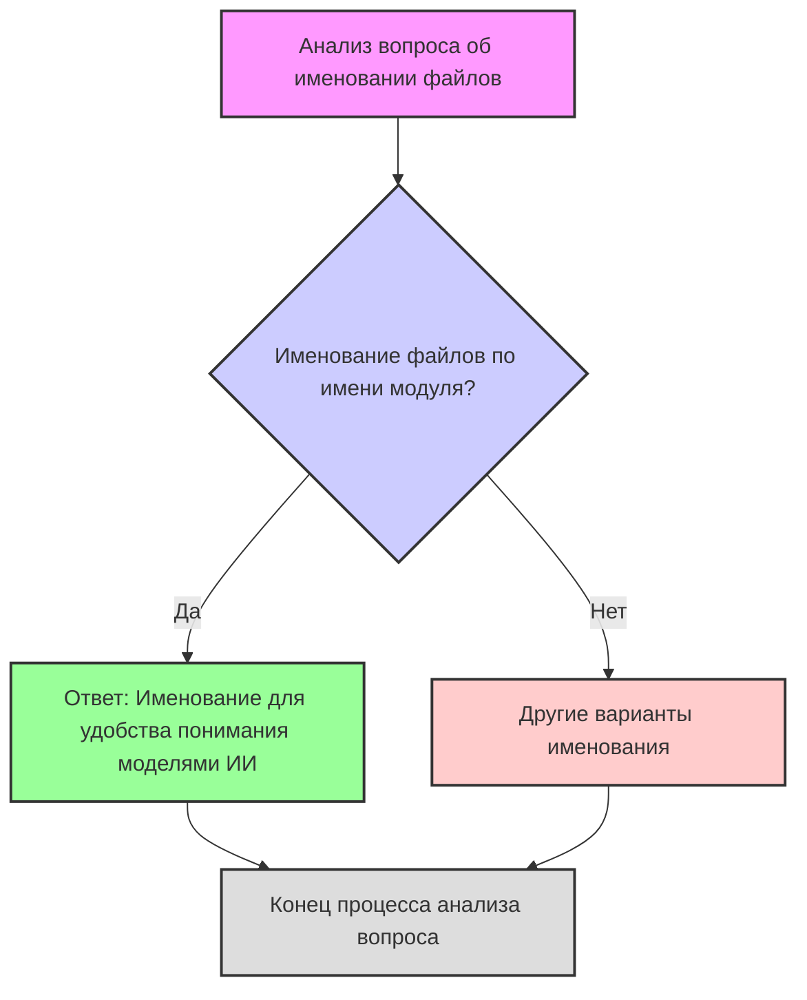

## <алгоритм>

1. **Анализ вопроса:**
   -  Вопрос касается именования конфигурационных файлов в проекте.
   -  Утверждается, что файлы названы по имени модуля (например, `suppliers.json`).
   -  Предлагается альтернатива именования `config.json`.
   -  Вопрос задается о причинах выбора текущего способа именования.

2. **Анализ ответа:**
   -  Ответ объясняет, что текущее именование (по имени модуля) сделано для удобства понимания моделями ИИ.
   -  Подчеркивается, что это решение связано с потребностями машинного обучения, а не с общей практикой.

3. **Блок-схема:**

   ```mermaid
   graph TD
    A[Начало: Анализ вопроса об именовании файлов] --> B{Именование файлов соответствует модулю?};
    B -- Да --> C[Ответ: Именование для удобства ИИ];
    B -- Нет --> D[Не рассматривается в данном ответе];
    C --> E[Конец];
    D --> E;
   ```

   **Примеры:**
   -  `B - Да`: Если файл называется `suppliers.json`, а модуль называется `suppliers`, то условие выполняется.
   -  `B - Нет`: Если файл называется `config.json` или `general.json`, то условие не выполняется.
   -  `C`: Ответ утверждает, что если условие `B` = "Да", то именование сделано для удобства ИИ.

## <mermaid>



**Анализ зависимостей:**

-   **Анализ вопроса об именовании файлов**:  Начальная точка, которая инициирует процесс анализа.
-   **Именование файлов по имени модуля?**:  Условный блок, проверяющий, соответствует ли имя файла имени модуля.
-   **Ответ: Именование для удобства понимания моделями ИИ**: Выход, когда условие соблюдено, объясняет причину именования.
-   **Другие варианты именования**:  Выход, когда условие не соблюдено,  отвечает на вопрос о других вариантах именования.
-   **Конец процесса анализа вопроса**: Конечная точка, завершающая процесс анализа вопроса.

## <объяснение>

**Импорты**:
    - В данном коде нет явных импортов.

**Классы**:
    - В данном коде нет классов.

**Функции**:
    - В данном коде нет функций.

**Переменные**:
    - В данном коде нет переменных.

**Объяснение:**

1.  **Вопрос**: Вопрос направлен на понимание причины выбора именования конфигурационных файлов в соответствии с именем модуля, а не общего имени, как `config.json`.  Это указывает на то, что разработчики ушли от стандартного соглашения именования.
2.  **Ответ**: Ответ раскрывает, что такое решение было принято для удобства моделей искусственного интеллекта (ИИ). Это предполагает, что  конфигурационные файлы могут использоваться для обучения или понимания моделей ИИ, где явная связь между файлом и модулем помогает ИИ корректно интерпретировать данные.
3.  **Потенциальные ошибки и области для улучшения:**
    -   **Неявное предположение**: Ответ подразумевает, что модели ИИ лучше понимают связь между именем файла и модулем. Это может быть не всегда так и зависит от конкретных алгоритмов, которые используются в проекте.
    -   **Отсутствие общей практики**:  Именование файлов по модулю может усложнить общую навигацию и понимание проекта для разработчиков, особенно если не все файлы являются конфигурационными.
    -   **Альтернативный подход**: Можно было бы использовать префиксы или постфиксы для разделения конфигурационных файлов (например, `suppliers_config.json`, `config_suppliers.json`).

4. **Цепочка взаимосвязей**:
  - Этот фрагмент относится к общим принципам именования файлов в проекте, которые могут влиять на другие модули, если они используют эти конфигурационные файлы. Решение может влиять на загрузку и обработку конфигурационных данных в рамках проекта.